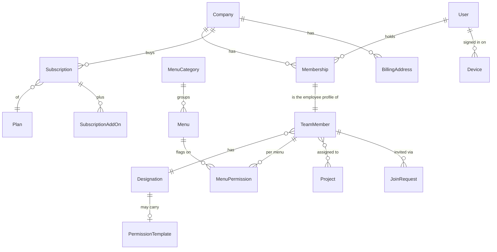
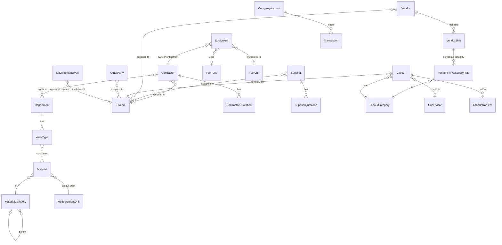
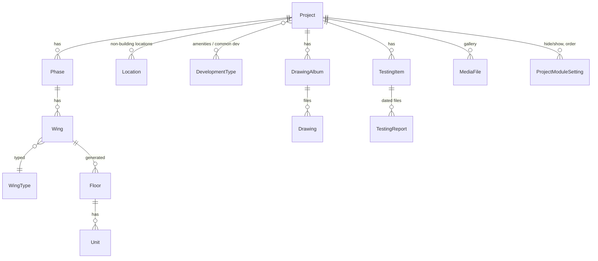
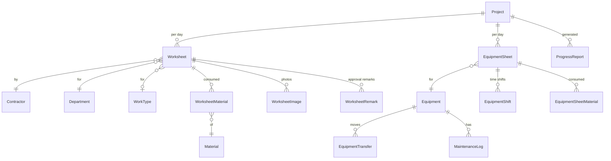
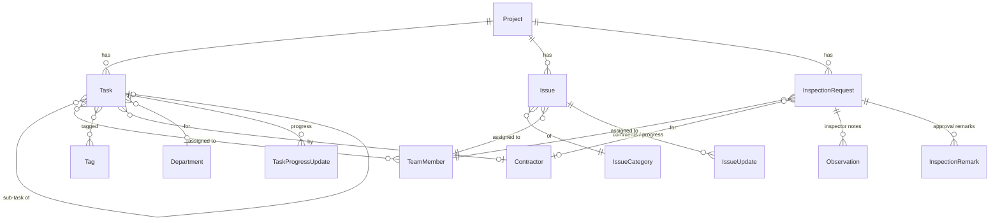
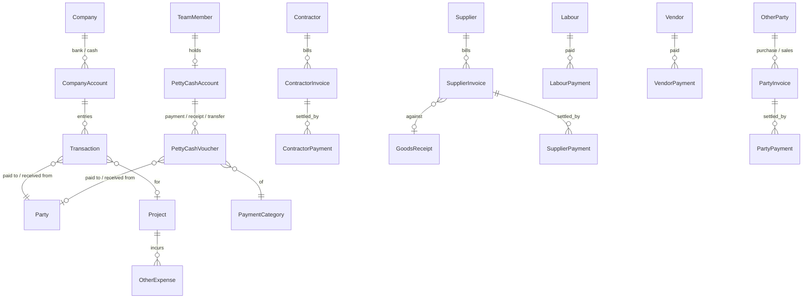
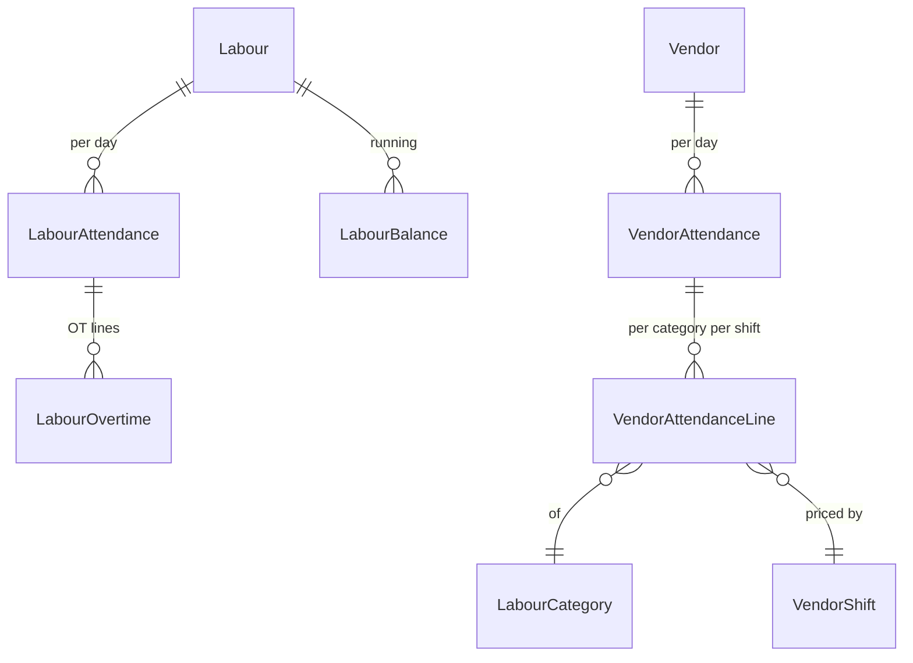
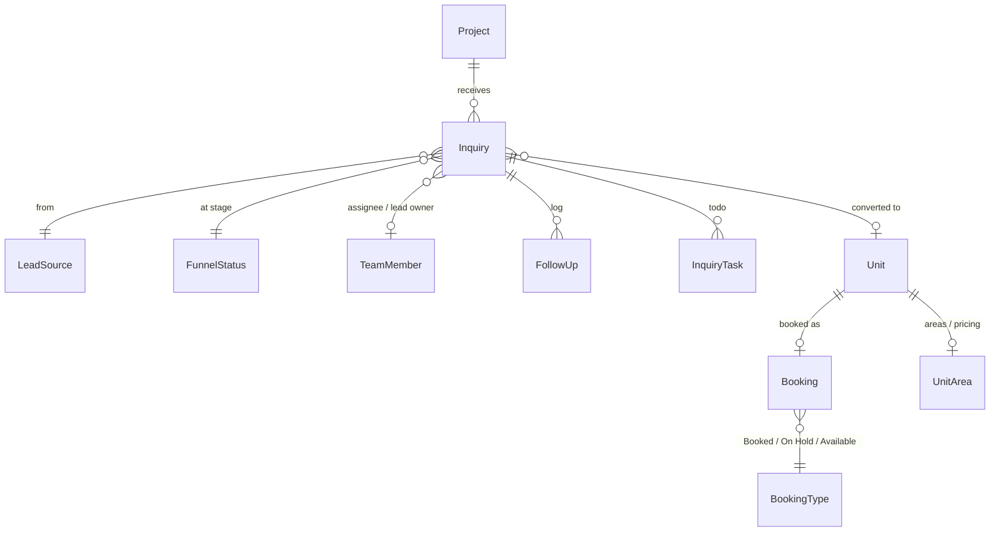
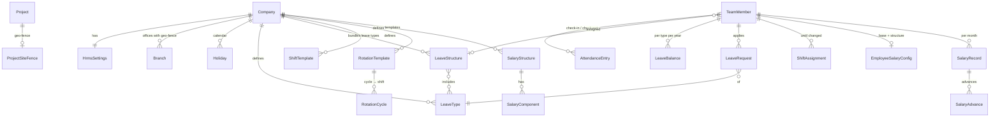

# Domain model

Entities as they exist in the legacy product, grouped into the bounded contexts we will build (see [`03-target-architecture.md`](./03-target-architecture.md)). Field-level detail lives in each module spec; this page is the map. Names are the words we will use in code and on screen — where the legacy name differs it is in brackets.

Conventions in the diagrams: `||--o{` one-to-many, `}o--o{` many-to-many, `|o--o|` optional one-to-one. Every entity also carries `companyId`, `createdBy`, `createdAt`, `updatedBy`, `updatedAt`, `deletedAt` (soft delete) — omitted for brevity.

## 1. Identity & access



| Entity                                   | Notes                                                                                                                                                                         |
| ---------------------------------------- | ----------------------------------------------------------------------------------------------------------------------------------------------------------------------------- |
| **Company** (Organization)               | Tenant. Name, logo, mobile, email, GSTIN, PAN, address, country, currency, `isNonIndianCompany`, timezone.                                                                    |
| **User**                                 | Phone (OTP login) + email; can belong to many companies (`companiesList`, switch).                                                                                            |
| **TeamMember** (Employee)                | Per-company employee profile: name, designation, mobile, email, address, Aadhaar, PAN, emergency contact; `memberType` Normal \| HRMS; `isCompanyOwner`; `joinRequest` state. |
| **Designation**                          | Global seed (37) + company-specific; `hasPermission` = has a default permission template; duplicate.                                                                          |
| **Menu / MenuCategory / MenuPermission** | The permission matrix: 60+ menus in 6 categories; 12 flags; plus per-user `backdatedCreateDays`, `backdatedEditDays`, `financialClosingDate`.                                 |
| **Subscription / Plan / AddOn**          | Plan includes (projects, team members, storage GB, HRMS seats); add-ons per unit per month; usage counters enforced.                                                          |
| **Device**                               | Logged-in devices; web login by QR.                                                                                                                                           |

## 2. Master records



| Entity                                                                                                                       | Notes                                                                                                                                                                                                                                                                                                                                                       |
| ---------------------------------------------------------------------------------------------------------------------------- | ----------------------------------------------------------------------------------------------------------------------------------------------------------------------------------------------------------------------------------------------------------------------------------------------------------------------------------------------------------- |
| **Department**                                                                                                               | Trade category; ~54 seeded (RCC, Plumbing, Painting, Excavation…).                                                                                                                                                                                                                                                                                          |
| **WorkType**                                                                                                                 | Activity under a department; `WorkerType/AssignItem` attaches materials.                                                                                                                                                                                                                                                                                    |
| **Contractor**                                                                                                               | Name, departments (multi), address, email, mobile, 2 contact persons, GST, PAN, quotation file, projects.                                                                                                                                                                                                                                                   |
| **Supplier**                                                                                                                 | Name, contact person, email, mobile, address, GST, PAN, quotation file, projects.                                                                                                                                                                                                                                                                           |
| **Vendor**                                                                                                                   | Labour-supply party: joining date, contact, address, shifts (start/end time) each with category rates (rate/day, OT/hr), photo, documents, projects.                                                                                                                                                                                                        |
| **Labour**                                                                                                                   | Name, labour id, wage type (Daily \| Monthly), weekly holidays, wage, OT wage/hr, opening balance, joining date, UAN, ESIC, Aadhaar, category, supervisor, contact, gender, photo, documents; current project.                                                                                                                                              |
| **LabourCategory**                                                                                                           | Carpenter, Electrician, Helper, Labour, Mason, Plumber, Skilled, Unskilled, Welder.                                                                                                                                                                                                                                                                         |
| **Supervisor**                                                                                                               | Simple named record used by labour and attendance (`Supervisor/Combo`).                                                                                                                                                                                                                                                                                     |
| **Equipment**                                                                                                                | Name, number, type (owned \| rented), contractor/owner, purchase year, fuel type/unit, utilisation basis (Hourly \| Km \| Trip), working-time method (Time Shifts \| Meter \| Both), targets (hrs/day, days/month, km/day, trips/day), min utilisation %, expected fuel efficiency, photo; status (Idle, In use, Maintenance, Unassigned); current project. |
| **Material** (Item)                                                                                                          | Name, specification, UoM, category, item type (Consumable…), unit rate, discount type/value, GST rate, HSN code, min stock.                                                                                                                                                                                                                                 |
| **MaterialCategory**                                                                                                         | Seeded ~20; parent combo → hierarchy.                                                                                                                                                                                                                                                                                                                       |
| **MeasurementUnit** (Uom)                                                                                                    | Seeded 41 (Bag, cum, sqft, Brass, Ton, Trip…).                                                                                                                                                                                                                                                                                                              |
| **CompanyAccount** (BankAccount)                                                                                             | Cash (type 1) or Bank (type 2); name, bank name, account number, primary, opening balance.                                                                                                                                                                                                                                                                  |
| **DevelopmentType**                                                                                                          | typeId 1 Common Development, 2 Amenity; assigned to projects.                                                                                                                                                                                                                                                                                               |
| **PaymentCategory** (PettyCashCategory), **IssueCategory**, **Tag**, **TermsAndCondition**, **LeadSource**, **FunnelStatus** | Simple named masters; the last two are per project.                                                                                                                                                                                                                                                                                                         |

## 3. Project & structure



| Entity                          | Notes                                                                                                                                                                                                                                                                                                                                |
| ------------------------------- | ------------------------------------------------------------------------------------------------------------------------------------------------------------------------------------------------------------------------------------------------------------------------------------------------------------------------------------ |
| **Project**                     | Name, start/expected end, address, status (Ongoing \| Completed \| Not started \| On hold), type, budget value, logo, `useProjectLogoInReport`, `noOfPhase`; resources: team members, contractors, suppliers, vendors, contacts.                                                                                                     |
| **Phase / Wing / Floor / Unit** | Wing types: Commercial, Residential, Bungalow scheme, Residential & Commercial, Plotting scheme, Institutional, Individual Unit, Industrial. Floor generation from counts (typed floors, start number, units per floor, basement parking floors) → Terrace, N typed floors, Ground, Basement n. Units are chips with editable names. |
| **LocationRef** (value object)  | `{ locationType: Wing \| Amenity \| CommonDevelopment, wingId?, floorIds[]?, unitId?, developmentTypeId? }` — used by worksheets, equipment sheets, issues, inspections, tasks, PR/PO, MR, bookings.                                                                                                                                 |
| **DrawingAlbum / Drawing**      | Seeded albums Architect, Electrical, Plumbing, Structural; `.dwg`/PDF/image files with names.                                                                                                                                                                                                                                        |
| **TestingItem / TestingReport** | Seeded items Rcc cube, Steel, Cement, Bricks; report name, date, file.                                                                                                                                                                                                                                                               |

## 4. Daily site work



| Entity                                    | Notes                                                                                                                                                                                                                                                                                       |
| ----------------------------------------- | ------------------------------------------------------------------------------------------------------------------------------------------------------------------------------------------------------------------------------------------------------------------------------------------- |
| **Worksheet** (WorkItem / DailyWorksheet) | Date, location ref, contractor, department, work type, skilled/unskilled counts, shift (1/2/3), approx work done (qty + unit), remark, photos; approval status Pending \| Partially Approved \| Approved (when approval setting on); `isCompleted`. Form sections configurable per project. |
| **EquipmentSheet** (EquipmentUsage)       | Date, equipment, operator, supervisor, location, approx work done, time shifts or meter readings, usage hrs/km/trips, idle, breakdown hrs, fuel consumed + borne by, hire details (vendor, basis, rate, hours → hire cost), materials, remarks, files; approval.                            |
| **EquipmentTransfer**                     | To project \| warehouse (off system); date, destination, location name, remark.                                                                                                                                                                                                             |
| **ProgressReport**                        | Generated document (Daily Progress Report, Task Progress Report) for a date range; async job.                                                                                                                                                                                               |

## 5. Tasks, issues, inspections



| Entity                | Notes                                                                                                                                                                                                                                                                                                                                |
| --------------------- | ------------------------------------------------------------------------------------------------------------------------------------------------------------------------------------------------------------------------------------------------------------------------------------------------------------------------------------ |
| **Task**              | Name, description, assignees, start/due, priority, location ref, department, contractor, tags, total quantity + UoM, total price, completed work/price (earned value), baseline start/end/duration/variance, actual start/end, progress %, status (Not Started \| In Progress \| Delayed \| Completed), task no, parent task. Gantt. |
| **Issue** (IssueSnag) | Date, department, assignee, due date, details, priority (High \| Medium \| Low), category, location ref, images, attachment; status Pending \| Delayed \| Solved; solved on.                                                                                                                                                         |
| **InspectionRequest** | Number (sequence), date, time, department, contractor, assignee, work description, location ref, drawings/photos; status Pending for approval \| Approved \| Rejected (+ reason); observations with images.                                                                                                                          |

## 6. Procurement & inventory

```mermaid
erDiagram
    Project ||--o{ PurchaseRequest : raises
    PurchaseRequest ||--o{ PurchaseRequestItem : lines
    PurchaseRequestItem }o--|| Material : of
    PurchaseRequest ||--o{ PurchaseOrder : "fulfilled by"
    PurchaseOrder }o--|| Supplier : on
    PurchaseOrder }o--|| BillingAddress : "billed to"
    PurchaseOrder }o--o| TermsAndCondition : under
    PurchaseOrder ||--o{ PurchaseOrderItem : lines
    PurchaseOrderItem }o--|| Material : of
    PurchaseOrder ||--o{ GoodsReceipt : "received as"
    GoodsReceipt }o--|| Supplier : from
    GoodsReceipt ||--o{ GoodsReceiptItem : lines
    GoodsReceipt ||--o| SupplierInvoice : "creates payable"
    Project ||--o{ InventoryItem : "stock per material"
    InventoryItem }o--|| Material : of
    InventoryItem ||--o{ StockLedgerEntry : "Received / Consumed / Missing / TransferIn / TransferOut / Issued"
    Project ||--o{ MaterialTransfer : "sends"
    MaterialTransfer ||--o{ MaterialTransferItem : lines
    MaterialTransfer ||--o{ TransferComment : thread
    Store ||--o{ StoreInventoryItem : stock
    Store }o--o{ Project : serves
    Store }o--o{ TeamMember : "assigned keepers"
    Store }o--o{ Supplier : "assigned suppliers"
    Project ||--o{ MaterialRequest : "asks a store"
    MaterialRequest }o--|| Store : to
    MaterialRequest ||--o{ MaterialRequestItem : lines
    MaterialRequest ||--o{ DeliveryNote : "delivered via"
    DeliveryNote ||--o{ DeliveryNoteItem : lines
```

| Entity                                     | Notes                                                                                                                                                                                                                                                                                                              |
| ------------------------------------------ | ------------------------------------------------------------------------------------------------------------------------------------------------------------------------------------------------------------------------------------------------------------------------------------------------------------------ |
| **PurchaseRequest**                        | Number (sequence), date, location ref, required date, remark (common or per item), attachment; mode: with material selection \| direct with image upload; status Pending \| Approved \| Rejected \| Ordered \| Partially Ordered \| Excess Ordered; approval remarks.                                              |
| **PurchaseOrder**                          | Number, date, PR link, supplier, expected delivery, location ref, items (qty, UoM, unit rate, discount ₹/%, GST %, totals, remark), additional charges, deduction, total, billing address, supplier/site POC, payment terms (days), T&C, delivery address override, remark, attachment; approval; mark as ordered. |
| **GoodsReceipt** (GRN / Material Received) | Number, GR date, inventory date, supplier, PO link, items (ordered vs received qty, rate, amount), delivery challan no, invoice no/date/amount, remark, store/project. Creates stock and supplier payable.                                                                                                         |
| **InventoryItem / StockLedgerEntry**       | Per project per material: estimated qty, stock qty, min-stock alert; ledger of movements with reasons.                                                                                                                                                                                                             |
| **MaterialTransfer**                       | Number, date, from project/store → to project/store, items, receiver name, documents, comments; Pending \| Delivered.                                                                                                                                                                                              |
| **Store / MaterialRequest / DeliveryNote** | Central stores; MR numbered, Requested \| Partially Delivered \| Delivered; DN numbered, delivered qty per item, Mark As Delivered.                                                                                                                                                                                |

## 7. Payments & accounting



| Entity                                | Notes                                                                                                                                                                                                                                                                                  |
| ------------------------------------- | -------------------------------------------------------------------------------------------------------------------------------------------------------------------------------------------------------------------------------------------------------------------------------------- |
| **Party** (polymorphic)               | `paidToType`: Other Party (1), Contractor (2), Supplier (3), Labour (5), Vendor (6); plus Team Member for petty cash.                                                                                                                                                                  |
| **Transaction**                       | Date, type Payment In \| Payment Out, account, category, payment mode (Cash \| Cheque \| Online \| UPI + reference/cheque no + mode date), payment module, party, project/store, amount, description, attachment; approval Pending \| Approved \| Rejected; transfer between accounts. |
| **PettyCashVoucher**                  | Number, date, type Payment \| Receipt \| Transfer, project, party, amount, mode Cash \| Bank \| Company, reference, category, description, photo/document; approval.                                                                                                                   |
| **ContractorInvoice / Payment**       | Invoice no/date/amount, department, TDS amount, paid, balance, opening balance; payment date, mode, reference, paid amount, category, paid by, remarks, documents.                                                                                                                     |
| **SupplierInvoice / Payment**         | Invoice no/date/amount, due date, GRN/DC link (total GRN value); payments as above.                                                                                                                                                                                                    |
| **LabourPayment / VendorPayment**     | Period (monthly \| weekly \| custom), to pay, advance, previous balance, final amount; vendor from attendance totals.                                                                                                                                                                  |
| **PartyInvoice** (OtherParty/Invoice) | Purchase (from party) \| Sales (to party, numbered); invoice date, due date, number, amount, remarks; "invoice settled" approval flow.                                                                                                                                                 |
| **OtherExpense**                      | Misc. project expense with approval.                                                                                                                                                                                                                                                   |

## 8. Labour & vendor attendance



| Entity               | Notes                                                                                                                                                           |
| -------------------- | --------------------------------------------------------------------------------------------------------------------------------------------------------------- |
| **LabourAttendance** | Date, labour, project, status Present \| Half Day \| Absent \| On Leave \| Holiday \| Paid Leave, shift, supervisor; OT lines (category, wages/hr, hours ≤ 24). |
| **VendorAttendance** | Date, vendor, project, per category/shift: full-day count, half-day count, OT hours → total pay from rate card; opening/advance/closing balance.                |

## 9. Sales CRM



| Entity      | Notes                                                                                                                                                                                                                                                                 |
| ----------- | --------------------------------------------------------------------------------------------------------------------------------------------------------------------------------------------------------------------------------------------------------------------- |
| **Inquiry** | Date, name, mobile, email, address, occupation, interest type (Hot \| Warm \| Cold), interested in, lead source, follow-up date/time, remarks, stage, status Open \| Converted \| Lost (+ lost reason / converted unit), assignee, lead owner, visiting card; reopen. |
| **Booking** | Unit, type, date, customer name, referred-by name/contact, remarks, booking form file, images.                                                                                                                                                                        |

## 10. HRMS



Field names for HRMS are already snake_case REST (`v2/hrms/*`) in the legacy API and are listed verbatim in [`modules/10-hrms.md`](./modules/10-hrms.md).

## 11. Cross-cutting

| Concern              | Legacy mechanism                                                                                                                                                  | Entities                                     |
| -------------------- | ----------------------------------------------------------------------------------------------------------------------------------------------------------------- | -------------------------------------------- |
| **Numbering**        | `ModulePrefix` rules per module: project scope (default/all or specific), prefix (`PR/26-27`), project id token (`P1`), start number, preview `PR/26-27/P1/00001` | `SequenceRule`, `SequenceCounter`            |
| **Back-dated entry** | Global create/edit day limits + override designations; per-module overrides with `entry_date_field`; financial closing date                                       | `BackdatedPolicy`, `BackdatedModuleOverride` |
| **Approval**         | Per document: status + `SetApprovalStatus` / `BulkSetApprovalStatus` / `Remark`; flags `approve`, `reject` on the menu                                            | `ApprovalRemark` (polymorphic)               |
| **Comments**         | Threads on MR, DN, Material Transfer, Issue (`Comment By / On / Files`)                                                                                           | `Comment` (polymorphic)                      |
| **Attachments**      | Images/files on nearly every document; 10 MB cap; storage quota per plan                                                                                          | `Attachment` (polymorphic)                   |
| **Notifications**    | FCM push; notification list; per-menu `notification` flag; async report/ZIP delivery                                                                              | `Notification`, `DeviceToken`                |
| **Audit**            | `createdBy/On`, `approvedBy/On`, `rejectedBy/For/On`, `Entry By` columns in reports — no general audit log                                                        | `AuditEvent` (new)                           |
| **Dirty-form guard** | "Discard changes?" dialog; `beforeunload` on web                                                                                                                  | UI only                                      |
