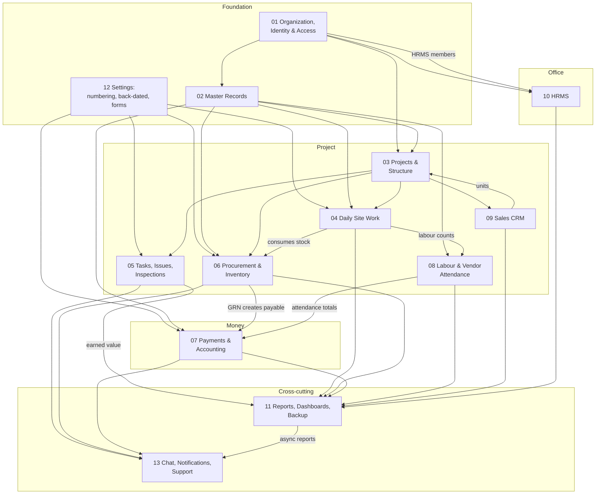
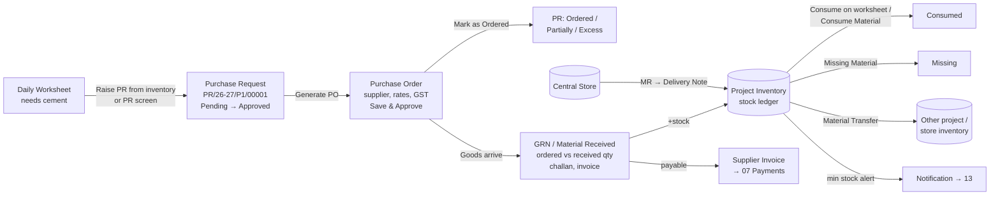
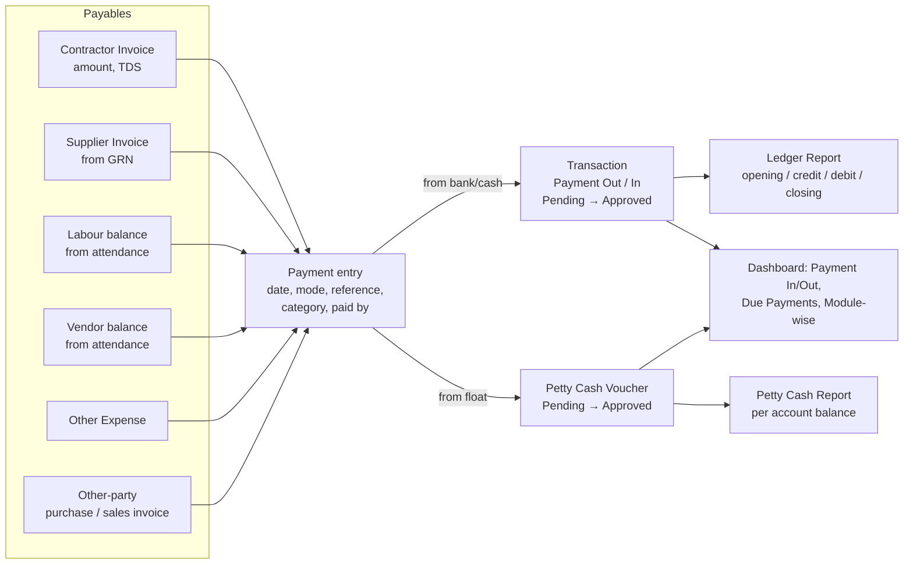
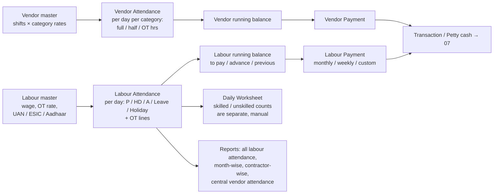
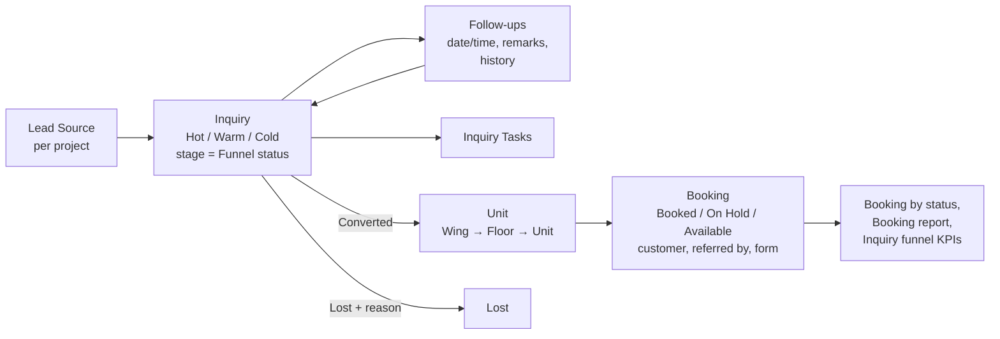

# Module relationships

How the thirteen modules depend on each other, and the four end-to-end flows that cross them. Use this to decide build order and to spot the interfaces between bounded contexts.

## Dependency map

Reading the arrows: **01, 02, 12 come first** (you cannot create a worksheet without a contractor, a department, a project location, and a numbering rule). **03 is the spine**: every project-level module takes a `LocationRef` from it. **07 is downstream of 06 and 08**: the only way a supplier payable or a vendor balance appears is through a GRN or an attendance day. **11 and 13 read everything.**

## Flow 1 — Material (procure → receive → stock → consume)

Interfaces: `06 → 07` publishes `GoodsReceiptPosted { supplierId, projectId, grnId, invoiceNo, amount, dueDate }`. `04 → 06` publishes `MaterialConsumed { projectId, materialId, qty, worksheetId, date }`. `06 → 13` publishes `StockBelowMinimum`.

## Flow 2 — Money (commit → bill → pay → ledger)

Every payment carries a `paymentModule` (which payable) and a `paidToType` (which party kind), which is how the legacy product keeps one `Transaction` table serving six payables. The `financial` permission flag hides amounts from users who may still create the underlying documents.

## Flow 3 — Labour (register → attend → pay)

Note the gap: worksheet labour counts and attendance are entered separately and never reconciled — see [`04-gaps-and-roadmap.md`](./04-gaps-and-roadmap.md).

## Flow 4 — Sales (lead → follow-up → booking)

Interfaces: `09 → 03` reads units and marks them booked; `03 → 09` provides `UnitArea` (via `Booking/AddArea`) for the price sheet.

## Flow 5 — Office staff (HRMS) vs site labour

Two parallel attendance systems coexist and must not be merged:

|            | Site labour / vendor gang (08)                     | Office employee (10 HRMS)                                        |
| ---------- | -------------------------------------------------- | ---------------------------------------------------------------- |
| Who        | Non-users; records                                 | Users (Normal or HRMS member)                                    |
| How marked | Supervisor marks for many, per project             | Self check-in/out with GPS, geo-fenced to branch or project site |
| Unit       | Day / half-day / OT hours; headcount for vendors   | Hours; grace period; shifts & rotations                          |
| Pay        | Wage × days + OT; running balance; cash/bank       | Salary structure (PF/ESI/PT), monthly run, payslip               |
| Leave      | "On Leave" status, Mark Paid Leave                 | Leave types, balances, accrual, approvals, cancellations         |
| Regulation | Minimum wages, BOCW, CLRA registers (research doc) | PF/ESI thresholds, Labour Codes                                  |

## Shared kernel (what every module uses)

- **LocationRef** (03) — wing/floor/unit or amenity/common development.
- **Party** (02) — contractor, supplier, vendor, labour, other party, team member; `paidToType`.
- **SequenceRule** (12) — document numbers.
- **BackdatedPolicy** (12) — date guards on create/edit.
- **Approval** (status + remarks + bulk) — PR, PO, GRN(?), MT, MR, DN, worksheet, equipment sheet, inspection, petty cash, transaction, other expense, party invoice settlement, leave, salary.
- **Attachment / Comment** — polymorphic.
- **Permission flags** (01) — `create read update delete approve reject print report viewAll notification transfer financial`.
- **Notification** (13) — push + in-app list; async job completion.

## Suggested build order (vertical slices)

1. **01 + 12 + 02 (subset)**: company, team members, permissions, numbering, departments, contractors, suppliers, materials, UoM.
2. **03**: project, phases/wings/floors/units, drawings. Dashboard shell.
3. **06 core**: PR → PO → GRN → inventory → consume/transfer. (This is the loop most customers judge first.)
4. **04**: daily worksheet (with material consumption) + equipment usage.
5. **07 core**: bank/cash accounts, transactions, supplier & contractor invoices/payments, petty cash.
6. **08**: labour & vendor masters, attendance, balances, payments.
7. **05**: tasks (Gantt), issues, inspections.
8. **11 + 13**: dashboards, reports, notifications, chat.
9. **09**: inquiry & booking.
10. **10**: HRMS.
11. **06 central store / central inventory**, **07 central payment**, **11 central reports**.
