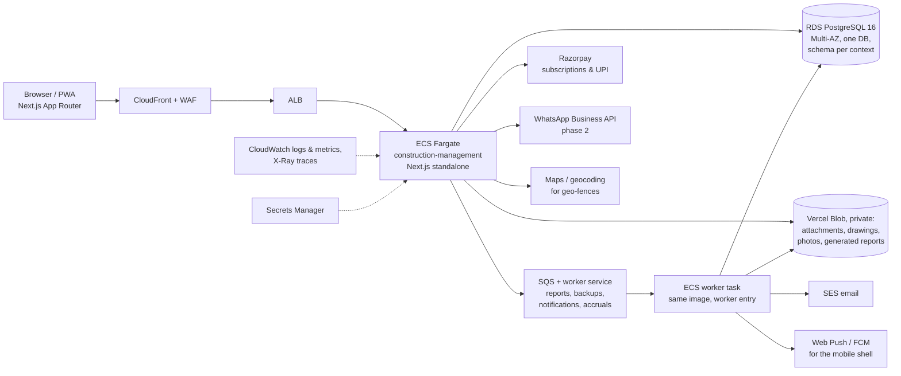

# Target architecture

What we will build instead of the legacy Flutter + Laravel + Firebase stack. This follows the conventions already proven in Whiteboard (see repo-root `docs/adr/`): a **context-first modular monolith** in a Next.js app, **one Postgres database with one schema per bounded context**, **identity in `@repo/auth`** (Better Auth), **Zod only at the HTTP edge**, **commands and queries without a bus**, **OpenAPI from the request models**. This document records the construction-specific decisions on top of that; anything that reverses a root ADR must get its own ADR under `apps/construction-management/docs/adr/`.

## 1. Deployment on AWS



- **Compute:** one container image, two entrypoints (web, worker). Fargate, autoscaled on CPU and ALB request count. No Lambda for the core app — the Prisma connection model and long-running report jobs fit a container better.
- **Database:** Amazon RDS PostgreSQL 16, Multi-AZ, RDS Proxy in front for connection pooling. Point-in-time recovery 35 days. One database `construction`; schemas per context (below). Migrations applied at deploy by a one-off ECS task (same pattern as Whiteboard ADR-0036).
- **Files (owner decision 2026-10-08: Vercel Blob, not S3):** Vercel Blob with `access: "private"` and per-company pathnames (`companies/<workspaceId>/…`); downloads go through our routes, which check the Session and Permission Matrix, so no file URL is ever public. Small images and PDFs upload through our routes, configured up to 10 MB but in practice at most 4.5 MB on Vercel (labour and vendor files, pending the move to direct uploads); Project Documents (any file but programs, ≤ 25 MB) go straight from the browser to Blob on a short-lived presigned `put` for one key, because Vercel Functions refuse bodies over 4.5 MB (ADR CM-0010). Storage quota per plan computed from our own file table, not by listing the store. Development and tests keep files on disk (no Blob emulator exists). See ADR CM-0001.
- **Background work:** SQS FIFO per job type; the worker consumes and writes a `jobs` row (queued → running → done/failed) that the UI polls or receives by push — replaces the legacy "please wait while another report is generating" with a proper job queue.
- **Push & realtime:** web push (VAPID) for the PWA; FCM via the same worker when a native shell exists. Chat is Postgres-backed with server-sent events (no Firebase RTDB).
- **Email/SMS/OTP:** SES for email; an SMS provider (MSG91 or AWS SNS India) for OTP. OTP login is built, and stays switched off until the business can send DLT-registered texts; until then sign-in is email and password (ADR CM-0009).
- **Edge:** CloudFront + WAF; app on `app.<domain>`; marketing site separate (same split as Whiteboard ADR-0035).
- **Observability:** CloudWatch + X-Ray; structured logs with `companyId`, `projectId`, `userId`.
- **Secrets:** Secrets Manager; no secrets in task definitions.

## 2. Application shape

```
apps/construction-management/
  app/                      Next.js App Router
    (app)/…                 authenticated shell: Projects / Workspace / Masters
    api/<context>/…         Route Handlers; Zod Request/Response models beside routes
  src/
    identity-bridge/        thin adapters over @repo/auth (session, membership)
    organization/           company, team members, designations, permission matrix, subscription
    masters/                parties, materials, categories, units, equipment, accounts
    projects/               project, phases, wings, floors, units, locations, drawings, gallery, testing
    site-work/              worksheets, equipment sheets, progress reports
    tracking/               tasks, issues, inspections
    procurement/            PR, PO, GRN, inventory, transfers, stores, MR, DN
    finance/                accounts, transactions, petty cash, invoices, payments, TDS, GST
    labour/                 labour & vendor registers, attendance, ledger, wage payments
    sales/                  inquiries, follow-ups, bookings
    hrms/                   attendance, leaves, shifts, holidays, salary
    reporting/              dashboards, reports, backups (read models + jobs)
    messaging/              chat, notifications, support tickets
    shared-kernel/          LocationRef, Money, Quantity, SequenceRule, BackdatedPolicy, Approval, Attachment, Comment
  docs/                     this folder
packages/db/construction/prisma/schema/   @repo/construction-db (root ADR-0040)
  construction-*.prisma     one file per context, @@schema("construction_<context>")
```

Each context folder keeps `domain / application / infrastructure` (root ADR-0009) and never imports another context's folder; cross-context references are by id, cross-context reactions are **in-process domain events** (root ADR-0008) — `GoodsReceiptPosted`, `MaterialConsumed`, `AttendanceMarked`, `DocumentApproved`, `StockBelowMinimum`.

### Bounded contexts → Postgres schemas → API prefixes

| Context (code) | Postgres schema             | API prefix                       | Prisma model prefix         | Legacy modules                     |
| -------------- | --------------------------- | -------------------------------- | --------------------------- | ---------------------------------- |
| `organization` | `construction_organization` | `/api/construction/organization` | `ConstructionOrganization…` | 01 (minus identity), 12 (settings) |
| `masters`      | `construction_masters`      | `/api/construction/masters`      | `ConstructionMasters…`      | 02                                 |
| `projects`     | `construction_projects`     | `/api/construction/projects`     | `ConstructionProjects…`     | 03                                 |
| `site-work`    | `construction_site_work`    | `/api/construction/site-work`    | `ConstructionSiteWork…`     | 04                                 |
| `tracking`     | `construction_tracking`     | `/api/construction/tracking`     | `ConstructionTracking…`     | 05                                 |
| `procurement`  | `construction_procurement`  | `/api/construction/procurement`  | `ConstructionProcurement…`  | 06                                 |
| `finance`      | `construction_finance`      | `/api/construction/finance`      | `ConstructionFinance…`      | 07                                 |
| `labour`       | `construction_labour`       | `/api/construction/labour`       | `ConstructionLabour…`       | 08                                 |
| `sales`        | `construction_sales`        | `/api/construction/sales`        | `ConstructionSales…`        | 09                                 |
| `hrms`         | `construction_hrms`         | `/api/construction/hrms`         | `ConstructionHrms…`         | 10                                 |
| `reporting`    | `construction_reporting`    | `/api/construction/reporting`    | `ConstructionReporting…`    | 11                                 |
| `messaging`    | `construction_messaging`    | `/api/construction/messaging`    | `ConstructionMessaging…`    | 13                                 |

Identity (users, sessions, workspaces=companies, memberships, invitations, devices) stays in the `identity` schema owned by `@repo/auth` (root ADR-0034). "Company" in product language maps to **Workspace** in `@repo/auth`; the construction app never joins to `identity` and stores `workspaceId`/`userId` as opaque strings. OTP-by-mobile login is a Better Auth plugin, not a custom scheme, behind the `CONSTRUCTION_SMS` switch (ADR CM-0009).

Inside a context folder names are unprefixed (`PurchaseOrder`, `PrismaPurchaseOrderRepository`); only Prisma models and OpenAPI components carry the `Construction<Context>` prefix because those namespaces are global (root ADR-0030).

### Tenancy

- Every row has `workspace_id` (the company). The Active Workspace comes from the session; it is never in the body (root ADR-0014). 401 no session, 403 no active workspace, 404 other tenant.
- Project scoping is a second axis: most procurement/site-work/tracking rows also carry `project_id`, and the permission check includes "is this member assigned to this project" plus the menu flag.
- Multi-company users switch Active Workspace; the legacy `companiesList` becomes `@repo/auth` memberships.

### Permissions

Keep the legacy **matrix** (it is a real selling point for owners) but model it properly:

- `menu` is a static enum per context (`procurement.purchase_request`, `finance.petty_cash`, …).
- `permission_flag` enum: `create read update delete approve reject print report view_all notification transfer financial`.
- `member_menu_permission (workspace_id, user_id, menu, flags bitmask)`; `designation_permission_template` seeds it.
- Enforcement is one function `can(member, menu, flag, { projectId })` used by every command/query; the UI reads the same matrix to hide actions.
- `view_all=false` means "only entries I created" — implemented as a query filter, not a separate endpoint.
- `financial=false` means amounts are redacted in responses (`null`) — implemented in Response models, not in the domain.
- Per-member `backdated_create_days`, `backdated_edit_days`, `financial_closing_date` move to the `organization` context's **BackdatedPolicy** (module 12) and are evaluated by a shared-kernel guard.

### Documents, numbering, approval (shared kernel)

Nearly every business document (PR, PO, GRN, MT, MR, DN, worksheet, equipment sheet, inspection request, petty cash voucher, transaction, party invoice, leave request, salary run) shares four behaviours. They live in `shared-kernel` as small value objects and interfaces, implemented per aggregate:

| Behaviour                  | Shape                                                                                                                                                                                                                                                                                                            |
| -------------------------- | ---------------------------------------------------------------------------------------------------------------------------------------------------------------------------------------------------------------------------------------------------------------------------------------------------------------- |
| **Numbering**              | `SequenceRule { module, scope: workspace \| project, prefix, projectToken, startNumber, fiscalYearToken }` → `next(module, projectId, date)` returns `PR/26-27/P1/00001`; counters are row-locked per rule per fiscal year. Fiscal year is April–March for Indian companies.                                     |
| **Back-dated guard**       | `BackdatedPolicy.assertCanCreate(module, entryDate, member)` / `assertCanEdit(...)`; global days, per-module override, designation override list, financial closing date (hard block).                                                                                                                           |
| **Approval**               | `ApprovalStatus = pending \| approved \| rejected` on the aggregate; `approve(by, remark)`, `reject(by, reason)`, bulk variants; `ApprovalRemark` rows; events `DocumentApproved`. Some documents have richer states (PR ordered/partially/excess; worksheet partially approved) — those are aggregate-specific. |
| **Attachments & comments** | `attachments (owner_type, owner_id, s3_key, name, size, mime, uploaded_by)`; `comments (owner_type, owner_id, body, files[], by, at)`.                                                                                                                                                                           |

### Money and quantities

- `Money` = integer paise + currency; never floats. `decimal(14,2)` in Postgres via Prisma `Decimal`.
- `Quantity` = `decimal(14,3)` + UoM id. UoM conversions are explicit (no silent sqft↔sqm).
- GST on a line: taxable value, rate, CGST/SGST or IGST split by place of supply, HSN/SAC. Effective-dated rate table (research §2). TDS on a payment: section, rate, threshold tracking per party per FY.
- Every ledger-affecting write (stock, payable, petty cash, bank, labour/vendor balance) appends an immutable **ledger entry**; balances are derived, never edited. The legacy "Opening Balance" fields become an opening ledger entry.

### Reads and reports

- Screens read through `queryOptions` + `useSuspenseQuery` (root ADR-0026). Lists are cursor-paginated with totals (root ADR-0020) — the legacy page/per_page lists become cursors.
- Dashboards and the ~40 legacy reports read from **SQL views / materialised views in `construction_reporting`** refreshed by events or on schedule; PDFs/Excels are rendered by the worker from the same queries and stored in Vercel Blob; the UI gets a job id and a notification on completion (legacy behaviour preserved).
- "Central" (cross-project) views are the same queries without `project_id`.

### Offline and mobile

The legacy product is a Flutter app first. We build a **PWA** with the App Router: installable, push-capable, and with an **offline outbox** for the three screens site staff use without signal — daily worksheet, labour attendance, GRN. Outbox entries are idempotent commands with client-generated ids (`idempotency_key`), replayed on reconnect; conflicts surface as a review list rather than silent overwrite. A native shell (Capacitor) can wrap the PWA later for camera/GPS reliability and FCM.

### Integrations (phase 2+)

- **Razorpay**: subscription checkout (replaces Razorpay + CCAvenue), and UPI collection links for allottee demands (research §4.6).
- **Tally / Zoho Books**: outbound vouchers (purchase, payment, receipt, journal for TDS), inbound party balances; XML/REST adapters in `finance/infrastructure`.
- **WhatsApp Business API**: inbound attendance/DPR/MR capture and outbound approvals/notifications (research §4.1).
- **GSTN IRP / e-way bill** via a GSP for sales invoices and material transfers above thresholds.

## 3. Data-model conventions (apply to every table)

- `id uuid` (v7), `workspace_id text not null`, `created_at/updated_at timestamptz`, `created_by/updated_by text` (user ids), `deleted_at` soft delete as an invisible tombstone (root ADR-0019).
- `project_id` on project-scoped rows; composite index `(workspace_id, project_id, <date>)`.
- Enums are Postgres enums inside the context schema; statuses are enums, not ints (legacy uses `status: 1..4` ints — we map on import).
- Seed data that the legacy ships as "global" rows (`companyId: null` departments, UoMs, designations, categories) becomes a **seed set copied into each workspace at creation** so a company can edit its own list; the seed sets are versioned JSON in the context's `infrastructure/seeds/`.
- Audit: an `audit_events` table in `construction_organization` appended by application services (who, what, before/after JSON) — the legacy has only `createdBy/approvedBy` columns.

## 4. Migration from legacy (if customers move)

> **Not planned (2026-10-08, owner decision).** Construction Management is greenfield: customers start fresh and nothing is imported from BuildControl or other tools. The steps below are kept only as a record; no code, column or seed exists for them. The BuildControl analysis in these docs is product research, not a compatibility target.

1. Export per company via the legacy API (`*/GetAll`, `*/Report`, backup ZIPs) into raw storage.
2. Transform with a one-off script per context: map int statuses to enums, split `paidToType` polymorphism into typed FKs, convert opening balances into ledger entries, map `companyId` → `workspace_id`.
3. Load through the application's own commands where invariants matter (numbering, ledgers), bulk-insert where they don't (masters, attachments metadata).
4. Attachments: copy from legacy storage to Vercel Blob by URL; keep legacy URL as `source_url` until verified.
5. Run both for one reporting period; reconcile ledger closing balances and stock positions per project before cut-over.

## 5. Decisions to record as ADRs (first batch)

| #       | Decision                                                                                                                                     | Why it needs an ADR                                                                                                     |
| ------- | -------------------------------------------------------------------------------------------------------------------------------------------- | ----------------------------------------------------------------------------------------------------------------------- |
| CM-0001 | Construction Management is its own app and its own set of `construction_*` schemas in the shared repo                                        | Reuses `@repo/auth`, `@repo/ui`; own `packages/db/construction` (root ADR-0040); must not leak into Whiteboard contexts |
| CM-0002 | Company = Workspace in `@repo/auth`; OTP-by-mobile login plugin                                                                              | Site staff log in by phone; multi-company users                                                                         |
| CM-0003 | Permission matrix (menu × flag bitmask) over role-only RBAC                                                                                  | Product differentiator; `view_all` and `financial` are query/response concerns                                          |
| CM-0004 | Ledger-first money and stock; balances derived                                                                                               | Legacy edits balances in place; India compliance needs auditability                                                     |
| CM-0005 | Shared-kernel document behaviours (numbering, back-dated guard, approval, attachments, comments)                                             | Eleven aggregates share them; avoid eleven implementations                                                              |
| CM-0006 | PWA + offline outbox before native                                                                                                           | Replaces Flutter; site connectivity                                                                                     |
| CM-0007 | Reports are worker jobs on SQS writing to Vercel Blob; dashboards read `construction_reporting` views                                        | Legacy async-report UX kept, but on a real queue                                                                        |
| CM-0008 | Effective-dated statutory tables (GST rates, TDS sections, minimum wages, PF/ESI ceilings) as data, never constants                          | Research §2: rates changed in Sep 2025 and Apr 2025                                                                     |
| CM-0009 | Email sign-in and email invitations while SMS is off (`CONSTRUCTION_SMS`)                                                                    | SMS needs DLT registration the business does not have yet                                                               |
| CM-0010 | Project Contract Details, per-Project Custom Fields, Project Documents with direct browser uploads to private Blob                           | Owner request (2026-10-09); Vercel 4.5 MB body limit                                                                    |
| CM-0011 | Check-in, check-out and working hours on labour attendance                                                                                   | Owner request (2026-10-09)                                                                                              |
| CM-0012 | HRMS product decisions (GPS modes, leave year, accrual, salary components, proration, overtime, advance, month lock)                         | Answers `modules/10` open questions for M3                                                                              |
| CM-0013 | Projects & structure product decisions (Project Type, Wing generation, Locations, parties, LocationRef, Drawings, Gallery, home preferences) | Answers `modules/03` open questions for M4                                                                              |
| CM-0014 | Attachments service in the kernel; browser thumbnails; Gallery as an index fed by events                                                     | Every module attaches files; Vercel 4.5 MB body limit                                                                   |
