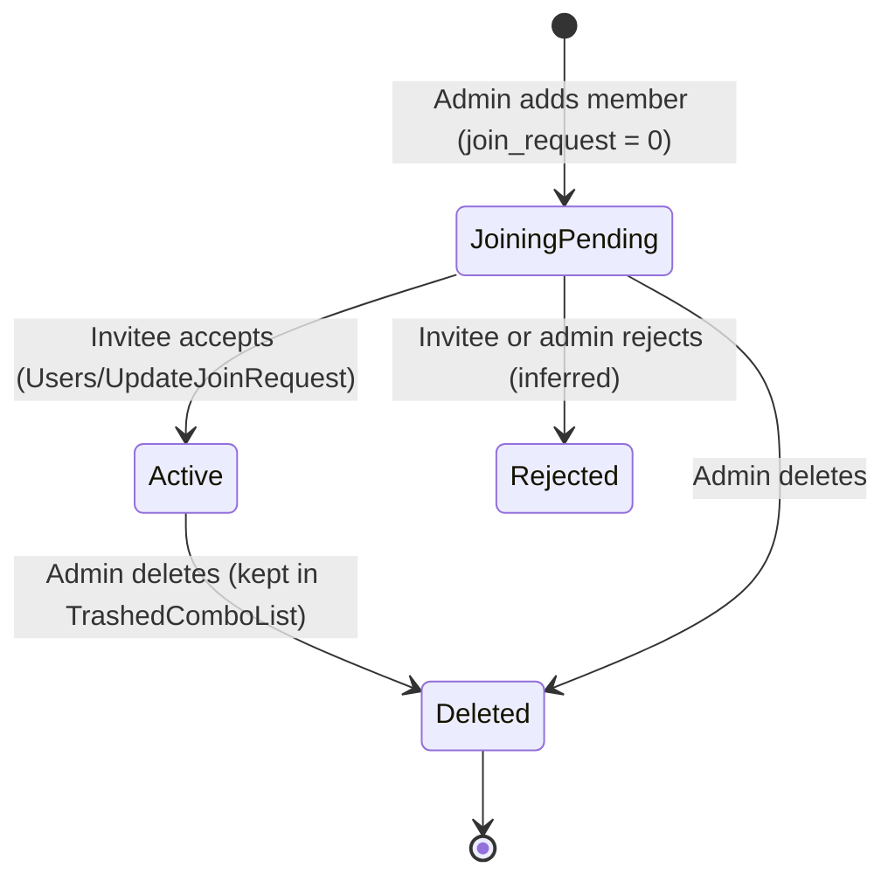
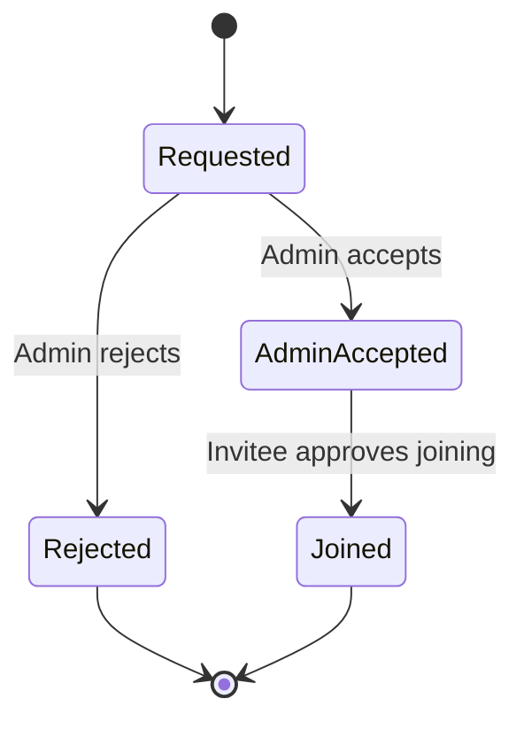
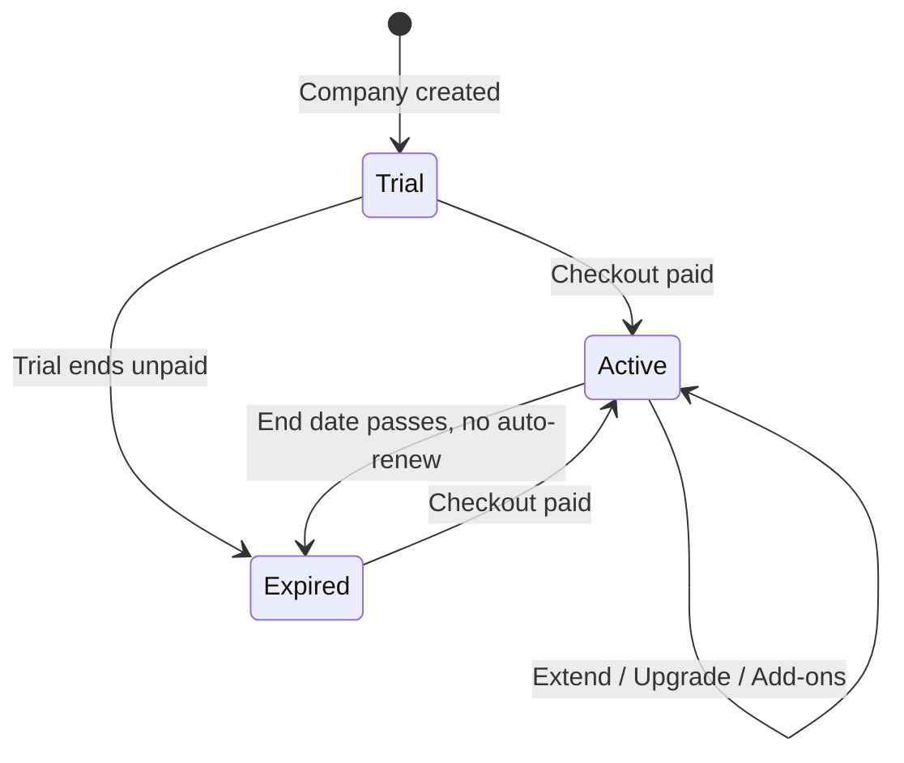
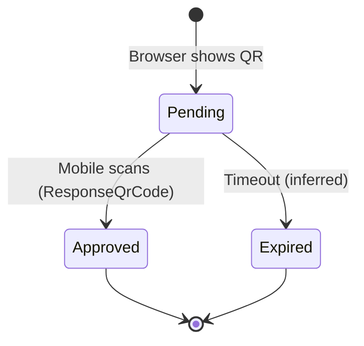
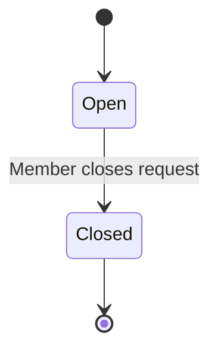

# 01 — Organization, Identity & Access

This module covers who can use BuildControl and in which organization. It defines the **Organization** (company, the tenant), the **User** (a person with a mobile number who signs in by OTP), and the **Team Member** (that user's employee record inside one organization). It also covers how members join, how designations and role permissions decide what each member can see and do, devices and web-login QR, personal and company profile, privacy and data rights, the paid **Subscription**, and the support channel to the BuildControl team.

Who uses it:

- **Company owner** (`isCompanyOwner`) creates the organization, buys and renews the subscription ("Company owner only"), deletes the organization, and invites the first members.
- **Admin / HR** add Team Members, assign projects, set permissions, approve join requests, and manage designations.
- **Every member** (site engineer, supervisor, store keeper, accountant, HRMS-only staff) signs in, switches organizations, manages their profile, devices and privacy settings, and opens support chats.

Legacy stack (for reference only): Flutter web (CanvasKit) at `web.buildcontrol.in`, Laravel API at `prodbuild.buildcontrol.in/api`, JWT issued by OTP login (`iss otp-login`), Firebase RTDB and FCM for chat and push.

---

## Legacy behaviour

### App shell (seen after sign-in)

- Three bottom tabs: **Projects** (home), **Workspace** (HRMS [beta], Central payment, Central store, Central Reports, Central Inventory), **Master**.
- Top bar: **organization switcher** (multi-company), **support chat**, **notifications**.
- **Free-trial banner** while the subscription is a trial.
- Projects home shows a "Not checked in / Check In" HRMS banner (see 10 HRMS) and pinned projects (see 03).
- Global states: "MAINTENANCE IN PROGRESS" screen; app version check (`CompanyLogo/GetAppVersion`) forcing an update.
- Browser storage keys the legacy web app keeps: `token`, `companyId`, `employeeId`, `companiesList`, `selectedCompanyModel`, `projectMenuOrderIds`, `isNonIndianCompany`.

### Registration and sign-in

| Step                             | Screen / endpoint                                                                           | Behaviour                                               |
| -------------------------------- | ------------------------------------------------------------------------------------------- | ------------------------------------------------------- |
| Register                         | `Users/Register`                                                                            | Mobile number + OTP.                                    |
| Sign in                          | `Users/VerifyLoginWithMobile`, `Users/Login`                                                | OTP on mobile; returns JWT (`iss otp-login`).           |
| Refresh                          | `Employees/RefreshTokens`                                                                   | Token refresh.                                          |
| Sign out                         | `Users/Logout`                                                                              | Ends the device session.                                |
| Password (legacy secondary path) | `Users/ChangePassword`, `Users/ResetPassword`, `Users/CheckResetPasswordRequestValid`       | A password also exists; Profile has "Change Password".  |
| Email verification               | `Users/UpdateVerifyEmail`, `Employees/SendEmailUpdateOtp`, `Employees/VerifyEmailUpdateOtp` | Changing email requires an OTP sent to the new address. |
| Timezone                         | `Employees/UpdateLoginTimezone`                                                             | Stored per member at login.                             |
| Push token                       | `Employees/UpdateDeviceToken`                                                               | FCM device token registration.                          |

### Organizations

- After registration: **Create company** or wait for an invitation.
- Organization picker lists **"Your Organizations"** (owned / joined) and **"Other Organizations"** (pending join requests).
- **Switch Organization** from the top bar; **Add Organization** creates another company under the same user.
- `home/organization` returns the current organization; `home/organization/delete-otp` sends the OTP needed to delete it.
- Seeded on company creation: roles **Administrator, Builder, Site Engineer**; accounts **"Company's Cash Account"** (type 1) and **"Company's Bank Account"** (type 2) with `isPrimary` and `openingBalance` (see 02 Company Bank/Cash accounts).
- Company currency: INR default, symbol, Indian grouping format `₹1,00,000.00`; world currency list; `isNonIndianCompany` flag (`Employees/UpdateCompanyCurrency`; see 12 Settings).

### Team Members (`#/employeeList` → `#/employeeAddUpdate` → Select Projects → `#/employeeRolePermission`)

- List with search; row status chip **"Joining Pending"** until the invitee installs the app and accepts.
- FAB options: **Add Team Member**, **Export Team Members** (Excel; the same file is the import template), **Import Team Members** (`employees/export`, `employees/import`).
- Row actions: **Share Invite Link**, **Edit**, **Delete**.
- Add/Edit is a three-step wizard:
  1. **Details** — member type, name (can be picked from phone contacts), designation (searchable, "Create New" inline), country code + mobile, email, address, Aadhaar, PAN, emergency contact.
  2. **Select Projects** — checkbox list with select-all and search. Skipped for HRMS Team Members.
  3. **Role Permissions** — the permission matrix (below), pre-filled from the designation's template if it has one.
- **Member type**:
  - **Normal Team Member** — works on projects; pick projects and permissions.
  - **HRMS Team Member** — HRMS only (attendance, leave, salary); no projects; permissions come from the HRMS default set (`v2/hrms/team-members/default-permissions`).
- Report export: `Employees/Report`.
- Lookups: `Employees/Combo`, `Employees/ComboList`, `employees/combo`, `Employees/TrashedComboList` (deleted members still selectable for historical records).

### Join requests and invite links

- Admin adds a member → system creates the record with `join_request = 0` (pending) and a `joinLinkMessage` containing Play Store / App Store links.
- **Share Invite Link** sends that message through the phone's share sheet.
- Invitee installs the app, signs in with the same mobile, sees the organization under "Other Organizations", and accepts (`Users/UpdateJoinRequest`).
- **New Join Request** (user-initiated): a user asks to join an organization; admin **Accepts** or **Rejects**; then the invitee approves joining.

### Designations (`#/designationList`, `#/designationRolePermission`)

- List of global seeded designations (`companyId = null`) plus company-created ones.
- A designation may carry a **default permission template** (`hasPermission = true`). Seeded templates exist for: **Accountant, Admin, Project Manager, Site Engineer, Site Supervisor, Store Keeper**.
- Actions: Add, Edit, **Duplicate** (`Designation/Duplicate`, copies name and template), Delete; edit the template on `#/designationRolePermission`.
- Lookups: `Designation/Combo`, `Designation/GetAll`.

Seed list (verbatim from notes): Accountant, Admin, Architect, Assistant Project Manager, Chief Engineer, Commercial Manager, Construction Assistant, Construction Coordinator, Construction Engineer, Construction Finance Manager, Construction Foreman, Construction Manager, Construction Project Manager, Construction Superintendent, Construction Supervisor, Crane Operator, Document Controller, Electric Engineer, Field Engineer, Heavy Equipment Operator, HVAC Engineer, HVAC Technician, Junior Engineer, Landscaping Consultant, Machine Operator, Marketing Executive, Marketing Manager, Owner, Partner, Project Manager, Quality Control, Security Manager, Senior Engineer, Site Engineer, Site Manager, Site Supervisor, Store Keeper, Structural Engineer.

(The notes compress "Construction Assistant/Coordinator/Engineer/Finance Manager/Foreman/Manager/Project Manager/Superintendent/Supervisor", "HVAC Engineer/Technician", "Marketing Executive/Manager"; they are expanded above.)

### Roles

- `Roles/Combo`; seed roles **Administrator, Builder, Site Engineer** created with the organization.
- The notes do not show a Roles screen; the matrix is attached to the Team Member and to the Designation. How roles relate to designations is an open question.

### Permission matrix (`#/employeeRolePermission`)

- Rows grouped by category, each with a cell count shown in the UI: Project Management **114**, Payment & Accounting **30**, Materials **46**, Master record **92**, Central store **20**, HRMS **57**, Others **1**.
- Columns: **ADD, VIEW, EDIT, DELETE, APPROVE, REJECT, DOWNLOAD, REPORT, VIEW ALL, NOTIFICATION, TRANSFER, FINANCIAL**. Each column has select-all; the grid is searchable.
- Only cells the menu supports are shown (for example Gallery shows VIEW only).
- Default sources: `RolePermissions/DefaultMenuPermission/GetAll`, `…/GetAllV2`, `…/GetAllV3`. Save: `EmployeeUserPermissions/EmployeeUserPermissionUpdate`. Menu assignment: `MenuPermission/AssignMenu`, `MenuPermission/GetAll`, `MenuPermission/MenuList`. Dashboard: `Dashboard/PermissionsList`.
- Per-user row also carries **backdatedCreateDays**, **backdatedEditDays**, **financialClosingDate** (overrides for 12 Settings → Back Dated Entry Control).

### Devices and web login

- **Linked Devices** (Profile): list of logged-in devices (`Users/LoggedInDevices`, `home/profile/devices`), remove one (`Employees/RemoveDevice`).
- Admin can bind a device to a member (`Employees/AssignDevice`).
- **Web login by QR** (`webLoginScan`): the web app shows a QR; a signed-in mobile scans it and the server answers (`Employees/ResponseQrCode`), signing the browser in.

### Profile (`v2/home/profile`)

- **Header**: display_name, role_label, company.
- **Account**: photo (≤ 10 MB), email (verified flag), mobile, address, Aadhaar (masked), personal PAN (masked), emergency contact.
- **Company**: name, mobile, email, GSTIN ("GST No"), company PAN, address, logo.
- **Reveal**: masked Aadhaar / PAN are revealed after an OTP (`home/profile/reveal`).
- Change Password, Timezone, Currency, Organisation switch, Logout (`Employees/UpdateProfile`).

### Privacy, consent and data rights

- **Privacy & Consent** toggles: App Improvement, Push Notifications, Data Preferences.
- **Legal** pages: Privacy Policy, Terms of Service, Data Retention Policy.
- **Download My Data** — export request; delivered asynchronously.
- **Delete My Account** — reason + type `DELETE` to confirm.
- **Delete Organization** — owner only, OTP (`home/organization/delete-otp`).

### Subscription and billing (`v2/subscription/*`, `Plan/*`, `Razorpay/*`, `PaymentIntegration/CCAvenue*`)

- **Choose Your Plan** (plans are listed by country; "Company owner only"), **Choose Duration**, **Add-Ons** (with minimums), **Order Summary** (Rate, Amount, Sub Total, Plan Charge, Last Plan Discount, Coupon Discount, Total), **Buyer Details** (billing address, GST), **Review & Pay**, **Proceed to Payment** (Razorpay or CCAvenue).
- **Your Subscription**: Auto renew, **Upgrade Plan** ("new plan should be same or higher"), **Extend current plan**, **Only Add-Ons**; **Plan Expired** state; subscription history / transactions.
- Known plan (from notes): **BASIC** — ₹14,000 for 6 months, ₹21,000 for 12 months; includes 5 employees, 10 projects, 20 GB storage. Add-ons ₹299/month each for an extra team member, 30 GB storage, or a project; HRMS Team Member add-on ₹30/month. Free trial available.
- Plan includes are counted per grant: Project, Team Member, Storage GB, HRMS Team Member. `currentUsage` is tracked and enforced.
- Add-on pricing rule (UI text): charged per unit per month — every month of a new plan, or the days left on a running one.
- Endpoints: `subscription/plans`, `subscription/checkout`, `subscription/confirm`, `subscription/transactions`, `Plan/GetAll`, `Plan/GetById`, `Charges/Month`, `Razorpay/CreateOrder`, `Razorpay/Verify`, `PaymentIntegration/CCAvenue*`, `Invoice/Receipt` (inferred: subscription receipt), `v2/company-billing-addresses`.

### Support

- Chat home has a **Support Chat / Support Tickets** tab: conversations with the BuildControl team; the member can **close** a request (`v2/support-chat/conversations`, `v2/support-chat/unread-count`).
- Member Chat, Group Chat and push notifications are in 13 Chat/Notifications/Support.

---

## Entities & fields

### Organization (Company)

| Field                         | Type            | Required      | Notes                                                     |
| ----------------------------- | --------------- | ------------- | --------------------------------------------------------- |
| id                            | int             | yes           | e.g. 21769 in the sampled tenant.                         |
| name                          | string          | yes           | Sampled value "NA".                                       |
| mobile                        | string          | no            | Company contact.                                          |
| email                         | string          | no            | Company contact.                                          |
| address                       | text            | no            |                                                           |
| gstin                         | string(15)      | no            | "GST No" on Company profile.                              |
| companyPan                    | string(10)      | no            | "Company PAN".                                            |
| logo                          | file            | no            | Used on reports (see 03 `useProjectLogoInReport`).        |
| currencyCode                  | string          | yes           | INR default (see 12).                                     |
| currencySymbol / numberFormat | string          | yes           | `₹1,00,000.00`.                                           |
| isNonIndianCompany            | bool            | yes           | Switches India-only behaviour (inferred: GST/PAN fields). |
| ownerEmployeeId               | FK → TeamMember | yes           | Inferred from `isCompanyOwner`.                           |
| countryId                     | FK → Country    | no (inferred) | `Countries/Combo`; plans are listed by country.           |

### User (login identity)

| Field                    | Type        | Required | Notes                                                      |
| ------------------------ | ----------- | -------- | ---------------------------------------------------------- |
| id                       | int         | yes      |                                                            |
| countryCode / countryIso | string      | yes      | Default +91 / IN.                                          |
| mobile                   | string      | yes      | Login key; OTP target. Unique per country code (inferred). |
| email                    | string      | no       | Verified flag via OTP.                                     |
| emailVerified            | bool        | yes      |                                                            |
| passwordHash             | string      | no       | Legacy secondary login path.                               |
| timezone                 | string      | no       | `UpdateLoginTimezone`.                                     |
| consents                 | see Consent | —        |                                                            |

### TeamMember (Employee)

| Field                                | Type                                | Required          | Notes                                                                          |
| ------------------------------------ | ----------------------------------- | ----------------- | ------------------------------------------------------------------------------ |
| id                                   | int                                 | yes               | `employeeId`, e.g. 23889.                                                      |
| companyId                            | FK → Organization                   | yes               |                                                                                |
| userId                               | FK → User                           | yes (once joined) | Link set when the invitee accepts (inferred).                                  |
| name                                 | string                              | yes               | Pick from contacts.                                                            |
| designationId                        | FK → Designation                    | yes               |                                                                                |
| countryId / countryCode / countryIso | FK / string                         | yes               |                                                                                |
| mobile                               | string                              | yes               |                                                                                |
| email                                | string                              | yes               | Required on the add form.                                                      |
| address                              | text                                | no                |                                                                                |
| stateId                              | FK → State                          | no                | `stateID` on the record.                                                       |
| gstNo                                | string                              | no                | Present on the record (purpose unclear; see Open questions).                   |
| aadhaar                              | string(12)                          | no                | Shown masked; reveal by OTP.                                                   |
| pan                                  | string(10)                          | no                | Shown masked; reveal by OTP.                                                   |
| emergencyContact                     | string                              | no                |                                                                                |
| photo                                | file                                | no                | ≤ 10 MB.                                                                       |
| isCompanyOwner                       | bool                                | yes               |                                                                                |
| memberType                           | enum{Normal, HRMS}                  | yes               |                                                                                |
| isHrmsMember                         | bool                                | yes               | Mirrors memberType.                                                            |
| joinRequest                          | enum{Pending=0, Accepted, Rejected} | yes               | Only 0 = pending is confirmed; other values inferred.                          |
| joinLinkMessage                      | text                                | system            | Invite text with store links.                                                  |
| projectIds                           | FK[] → Project                      | no                | Normal members only (see 03).                                                  |
| backdatedCreateDays                  | int                                 | no                | Per-user override.                                                             |
| backdatedEditDays                    | int                                 | no                | Per-user override.                                                             |
| financialClosingDate                 | date                                | no                | Per-user override.                                                             |
| deletedAt                            | datetime                            | no                | Trashed members stay selectable via `TrashedComboList` (inferred soft delete). |

### Designation

| Field              | Type              | Required | Notes                                  |
| ------------------ | ----------------- | -------- | -------------------------------------- |
| id                 | int               | yes      |                                        |
| companyId          | FK → Organization | no       | `null` = global seed.                  |
| name               | string            | yes      |                                        |
| hasPermission      | bool              | yes      | Carries a default permission template. |
| permissionTemplate | PermissionGrant[] | no       | Same shape as a member's grants.       |

### Role

| Field     | Type              | Required       | Notes                                  |
| --------- | ----------------- | -------------- | -------------------------------------- |
| id        | int               | yes            |                                        |
| companyId | FK → Organization | yes (inferred) | Seeded per company.                    |
| name      | string            | yes            | Administrator, Builder, Site Engineer. |

### Menu (permission target)

| Field          | Type                                                                                                   | Required | Notes                                                               |
| -------------- | ------------------------------------------------------------------------------------------------------ | -------- | ------------------------------------------------------------------- |
| id             | int                                                                                                    | yes      | Stable ids, see matrix below.                                       |
| category       | enum{Project Management, Payment & Accounting, Materials, Master records, Central store, HRMS, Others} | yes      |                                                                     |
| parentId       | FK → Menu                                                                                              | no       | Project-level menus have parent Project#4.                          |
| name           | string                                                                                                 | yes      |                                                                     |
| supportedFlags | flag[]                                                                                                 | yes      | Which matrix cells exist for the menu.                              |
| sortOrder      | int                                                                                                    | no       | Project tiles reorderable per user (`projectMenuOrderIds`, see 03). |

### PermissionGrant

| Field        | Type            | Required | Notes                                                                              |
| ------------ | --------------- | -------- | ---------------------------------------------------------------------------------- |
| employeeId   | FK → TeamMember | yes      | Or designationId for a template.                                                   |
| menuId       | FK → Menu       | yes      |                                                                                    |
| create       | bool            | yes      | Column ADD.                                                                        |
| read         | bool            | yes      | Column VIEW.                                                                       |
| update       | bool            | yes      | Column EDIT.                                                                       |
| delete       | bool            | yes      | Column DELETE.                                                                     |
| approve      | bool            | yes      |                                                                                    |
| reject       | bool            | yes      |                                                                                    |
| print        | bool            | yes      | Column DOWNLOAD (PDF / Excel).                                                     |
| report       | bool            | yes      |                                                                                    |
| viewAll      | bool            | yes      | See records created by others.                                                     |
| notification | bool            | yes      | Receive push for the menu.                                                         |
| transfer     | bool            | yes      | Move records between projects.                                                     |
| financial    | bool            | yes      | See amounts / rates.                                                               |
| export       | bool            | yes      | API flag E; not a matrix column (Parties, Attendance / Salary / Shift Management). |
| import       | bool            | yes      | API flag I; not a matrix column (Shift Management only).                           |

### Device / Session

| Field                 | Type     | Required      | Notes                    |
| --------------------- | -------- | ------------- | ------------------------ |
| id                    | int      | yes           |                          |
| userId / employeeId   | FK       | yes           |                          |
| deviceName / platform | string   | no (inferred) | Shown in Linked Devices. |
| fcmToken              | string   | no            | `UpdateDeviceToken`.     |
| assignedByAdmin       | bool     | no (inferred) | `AssignDevice`.          |
| lastSeenAt            | datetime | no (inferred) |                          |
| revokedAt             | datetime | no            | `RemoveDevice` / Logout. |

### WebLoginQr

| Field              | Type                             | Required | Notes                                          |
| ------------------ | -------------------------------- | -------- | ---------------------------------------------- |
| code               | string                           | yes      | Shown as QR in browser (inferred short-lived). |
| approvedByDeviceId | FK → Device                      | no       | Set by `ResponseQrCode`.                       |
| status             | enum{Pending, Approved, Expired} | yes      | Inferred.                                      |

### Consent

| Field             | Type      | Required | Notes                         |
| ----------------- | --------- | -------- | ----------------------------- |
| userId            | FK → User | yes      |                               |
| appImprovement    | bool      | yes      |                               |
| pushNotifications | bool      | yes      |                               |
| dataPreferences   | bool      | yes      | Meaning not defined in notes. |
| updatedAt         | datetime  | yes      | Inferred.                     |

### DataRequest

| Field         | Type                                            | Required                | Notes                |
| ------------- | ----------------------------------------------- | ----------------------- | -------------------- |
| id            | int                                             | yes                     |                      |
| userId        | FK → User                                       | yes                     |                      |
| type          | enum{Export, DeleteAccount, DeleteOrganization} | yes                     |                      |
| reason        | text                                            | DeleteAccount: yes      |                      |
| confirmation  | string                                          | DeleteAccount: yes      | User types `DELETE`. |
| otpVerifiedAt | datetime                                        | DeleteOrganization: yes |                      |
| status        | enum{Requested, Processing, Ready, Completed}   | yes                     | Inferred.            |

### Plan

| Field     | Type                                                                     | Required | Notes                                   |
| --------- | ------------------------------------------------------------------------ | -------- | --------------------------------------- |
| id        | int                                                                      | yes      |                                         |
| name      | string                                                                   | yes      | e.g. BASIC.                             |
| country   | FK → Country                                                             | yes      | Plans listed by country.                |
| durations | {months:int, price:decimal(14,2)}[]                                      | yes      | BASIC: 6 → ₹14,000; 12 → ₹21,000.       |
| includes  | {grant: enum{Project, TeamMember, StorageGB, HrmsTeamMember}, qty:int}[] | yes      | BASIC: 10 projects, 5 employees, 20 GB. |
| terms     | text                                                                     | no       |                                         |

### AddOn

| Field                | Type                                                 | Required | Notes                                                  |
| -------------------- | ---------------------------------------------------- | -------- | ------------------------------------------------------ |
| grant                | enum{Project, TeamMember, StorageGB, HrmsTeamMember} | yes      |                                                        |
| unitSize             | int                                                  | yes      | Storage add-on = 30 GB.                                |
| pricePerUnitPerMonth | decimal(14,2)                                        | yes      | ₹299 (project, team member, 30 GB); ₹30 (HRMS member). |
| minimumQty           | int                                                  | no       | "Add-Ons (minimums)".                                  |

### Subscription

| Field             | Type                           | Required | Notes                    |
| ----------------- | ------------------------------ | -------- | ------------------------ |
| companyId         | FK → Organization              | yes      |                          |
| planId            | FK → Plan                      | yes      |                          |
| startsAt / endsAt | date                           | yes      |                          |
| isTrial           | bool                           | yes      | Free-trial banner.       |
| autoRenew         | bool                           | yes      |                          |
| addOns            | {addOnId, qty}[]               | no       |                          |
| currentUsage      | {grant, used:int, limit:int}[] | system   | Enforced.                |
| status            | enum{Trial, Active, Expired}   | yes      | Inferred from UI states. |

### SubscriptionOrder (checkout / transaction)

| Field                                 | Type                                   | Required | Notes                       |
| ------------------------------------- | -------------------------------------- | -------- | --------------------------- |
| id                                    | int                                    | yes      |                             |
| companyId                             | FK → Organization                      | yes      |                             |
| kind                                  | enum{New, Upgrade, Extend, AddOnsOnly} | yes      |                             |
| rate / amount / subTotal / planCharge | decimal(14,2)                          | yes      | Order Summary lines.        |
| lastPlanDiscount                      | decimal(14,2)                          | no       | Credit for unused old plan. |
| couponCode / couponDiscount           | string / decimal(14,2)                 | no       |                             |
| total                                 | decimal(14,2)                          | yes      |                             |
| billingAddressId                      | FK → CompanyBillingAddress             | yes      |                             |
| gateway                               | enum{Razorpay, CCAvenue}               | yes      |                             |
| gatewayOrderId / gatewayPaymentId     | string                                 | system   | `CreateOrder` / `Verify`.   |
| status                                | enum{Created, Paid, Failed}            | yes      | Inferred.                   |

### CompanyBillingAddress

| Field          | Type              | Required       | Notes                                       |
| -------------- | ----------------- | -------------- | ------------------------------------------- |
| id             | int               | yes            |                                             |
| companyId      | FK → Organization | yes            |                                             |
| name / address | string / text     | yes (inferred) | Shown as "Billing Address*" on PO (see 06). |
| gstin          | string(15)        | no             | Needed for a GST invoice.                   |
| state          | FK → State        | no (inferred)  |                                             |

### SupportConversation

| Field                  | Type               | Required | Notes                         |
| ---------------------- | ------------------ | -------- | ----------------------------- |
| id                     | int                | yes      |                               |
| companyId / employeeId | FK                 | yes      |                               |
| messages               | message[]          | yes      |                               |
| status                 | enum{Open, Closed} | yes      | Member can close the request. |
| unreadCount            | int                | system   | `unread-count`.               |

---

## Workflows & states

1. **Register and create organization** — enter mobile → receive OTP → verify (`VerifyLoginWithMobile`) → JWT issued → "Create company" (name, then company profile) → system seeds roles, Cash and Bank accounts, global masters become visible → trial subscription starts → owner lands on Projects home with the trial banner.
2. **Sign in** — mobile → OTP → if the user belongs to several organizations, pick one (or default to the last `selectedCompanyModel`) → register FCM token and timezone.
3. **Invite a Normal Team Member** — admin opens `#/employeeAddUpdate` → fills details, picks designation (template pre-fills matrix) → Select Projects → adjust matrix → Save → member appears with "Joining Pending" → admin taps **Share Invite Link** → invitee installs, signs in with that mobile → accepts under "Other Organizations" → status becomes active.
4. **Invite an HRMS Team Member** — same, but type = HRMS; the project step is skipped; permissions come from the HRMS default set: HRMS read; Holiday read; Attendance create/read/notification; Leave create/read/notification; Salary read.
5. **Join request from a user** — user requests to join an organization → admin Accepts / Rejects → user approves joining → membership active.
6. **Switch organization** — top-bar switcher → reloads permissions, projects and settings for the chosen company.
7. **Bulk import members** — Export Team Members (template) → fill in Excel → Import → validation errors returned per row (inferred).
8. **Edit permissions** — open member → Role Permissions → toggle cells / column select-all → Save (`EmployeeUserPermissionUpdate`). Back-dated days and financial closing date overrides are part of the same row.
9. **Designation template** — create or Duplicate a designation → edit its matrix on `#/designationRolePermission` → used as default for new members with that designation.
10. **Web login by QR** — open the web app → QR shown → scan from the mobile app (`webLoginScan`) → mobile posts `ResponseQrCode` → browser receives a session.
11. **Remove a device** — Profile → Linked Devices → remove → that device's token is revoked.
12. **Reveal masked identifiers** — tap reveal on Aadhaar/PAN → OTP → value shown.
13. **Change email** — enter new email → OTP to new email → verify.
14. **Buy / renew subscription** (owner only) — Choose plan → duration → add-ons → order summary (discounts, coupon) → buyer details (billing address, GST) → Review & Pay → Razorpay or CCAvenue → verify → subscription active; transaction appears in history.
15. **Upgrade / extend / add-ons only** — upgrade must be to the same or higher plan; add-ons on a running plan are charged for the days left.
16. **Usage enforcement** — creating a project, team member, HRMS member or uploading files checks `currentUsage` against plan + add-ons; over the limit the action is blocked and the user is sent to buy an add-on (inferred UI).
17. **Download my data / delete account / delete organization** — request → (OTP for organization) → asynchronous processing.
18. **Support** — open Support Chat → new conversation → messages with the BuildControl team → member closes.

### Team Member status

### Join request (user-initiated)

### Subscription

### Web-login QR

### Support conversation

---

## Business rules & validations

- Sign-in is by OTP to the registered mobile; one user (mobile) may be a member of many organizations.
- Team Member required fields: Name, Designation, Mobile (with country code), Email. Address, Aadhaar, PAN, emergency contact optional.
- Mobile should be unique per organization (inferred: one member record per user per company).
- A Normal Team Member must have at least one project to do project work (inferred; the notes do not say whether the Select Projects step can be left empty). HRMS members have no projects.
- HRMS members get only the HRMS default permission set; they do not count against the Team Member grant but against the **HRMS Team Member** grant (inferred from separate plan include and add-on).
- Designation with `hasPermission = true` pre-fills the matrix; editing a member's matrix does not change the designation template (inferred).
- Global designations (`companyId = null`) cannot be edited by a company; Duplicate creates a company copy (inferred from the Duplicate action).
- Only cells a menu supports can be granted (Gallery: VIEW only; Reports: VIEW, DOWNLOAD).
- Without **VIEW ALL**, a member sees only records they created (inferred from flag name; applies to Task, Issues, Inquiry, Petty Cash, Material Received, Leave/Attendance/Salary management, Shift).
- Without **FINANCIAL**, amounts and rates are hidden (inferred from flag name; menus carrying it: Project, Task, Labour, Vendor, Progress Report, Equipment Usage, Material Received, Vendors, Equipments, Materials, Labours, Salary Management, Employee Management).
- **Notification** flag decides whether the member receives push notifications for that menu (see 13).
- Back-dated entry: a member cannot create entries older than `backdatedCreateDays` or edit entries older than `backdatedEditDays`, and nothing dated on or before `financialClosingDate`, unless the module or designation override allows it (see 12).
- Subscription purchase and plan changes: **company owner only**. Upgrade target must be the same or a higher plan.
- Add-ons are charged per unit per month: full months on a new plan; pro-rated days left on a running plan. Add-ons have minimum quantities.
- Usage limits (projects, team members, HRMS team members, storage GB) are enforced against plan includes plus add-ons.
- Organization deletion requires an OTP; account deletion requires a reason and typing `DELETE`.
- Masked identity numbers (Aadhaar, PAN) are revealed only after an OTP.
- Email change requires OTP verification of the new address.
- Profile photo ≤ 10 MB.
- App version below the minimum forces an update; maintenance mode blocks the app.

---

## Permissions

### Flag legend (from `RolePermissions/DefaultMenuPermission/GetAllV3`)

Letters are taken from the API field names; each letter has one meaning.

| Letter | Flag         | Matrix column                        |
| ------ | ------------ | ------------------------------------ |
| C      | create       | ADD                                  |
| R      | read         | VIEW                                 |
| U      | update       | EDIT                                 |
| D      | delete       | DELETE                               |
| A      | approve      | APPROVE                              |
| J      | reject       | REJECT                               |
| P      | print        | DOWNLOAD                             |
| O      | report       | REPORT                               |
| V      | viewAll      | VIEW ALL                             |
| N      | notification | NOTIFICATION                         |
| T      | transfer     | TRANSFER                             |
| F      | financial    | FINANCIAL                            |
| E      | export       | — (not one of the 12 matrix columns) |
| I      | import       | — (not one of the 12 matrix columns) |

Check against the UI cell counts: counting the letters that map to the 12 matrix columns (everything except E and I) gives Project Management 114, Payment & Accounting 30, Materials 46, Master record 92, Central store 20, HRMS 57, Others 1, matching the UI exactly. The raw strings hold 31 letters for Payment & Accounting (one E on Parties) and 61 for HRMS (E on Attendance, Salary and Shift Management, I on Shift Management); those export/import flags are not shown as matrix cells.

### Full menu matrix

| Category             | Menu                  | Id  | Flags       | Decoded                                                                 |
| -------------------- | --------------------- | --- | ----------- | ----------------------------------------------------------------------- |
| Project Management   | Project               | 4   | CRUDF       | create, read, update, delete, financial                                 |
| Project Management   | Create Wing           | 6   | CRUD        | create, read, update, delete                                            |
| Project Management   | Daily Worksheet       | 19  | CRUDAPNO    | CRUD, approve, print, notification, report                              |
| Project Management   | Project Drawings      | 21  | CRUDN       | CRUD, notification                                                      |
| Project Management   | Testing Reports       | 44  | CRUD        | CRUD                                                                    |
| Project Management   | Task                  | 53  | CRUDAJPNVOF | CRUD, approve, reject, print, notification, viewAll, report, financial  |
| Project Management   | Issues and snags      | 51  | CRUDAJPNVO  | CRUD, approve, reject, print, notification, viewAll, report             |
| Project Management   | Inspection Request    | 54  | CRUDAJPNO   | CRUD, approve, reject, print, notification, report                      |
| Project Management   | Reports               | 20  | RP          | read, print                                                             |
| Project Management   | Attendance            | 57  | CRUDPO      | CRUD, print, report                                                     |
| Project Management   | Labour                | 58  | CRUDPTOF    | CRUD, print, transfer, report, financial                                |
| Project Management   | Vendor                | 59  | CRUDPOF     | CRUD, print, report, financial                                          |
| Project Management   | Booking Details       | 41  | CRUDPNO     | CRUD, print, notification, report                                       |
| Project Management   | Inquiry               | 8   | CRUDPNVO    | CRUD, print, notification, viewAll, report                              |
| Project Management   | Gallery               | 55  | R           | read                                                                    |
| Project Management   | Dashboard             | 65  | R           | read                                                                    |
| Project Management   | Progress Report       | 73  | CRDNF       | create, read, delete, notification, financial                           |
| Project Management   | Create Location       | 74  | CRUD        | CRUD                                                                    |
| Project Management   | Equipment Usage       | 56  | CRUDAPNOF   | CRUD, approve, print, notification, report, financial                   |
| Payment & Accounting | Central payment       | 75  | R           | read                                                                    |
| Payment & Accounting | Payments              | 47  | R           | read                                                                    |
| Payment & Accounting | Transactions          | 63  | CRUDAJPNO   | CRUD, approve, reject, print, notification, report                      |
| Payment & Accounting | Parties               | 76  | CRUDAJEPNO  | CRUD, approve, reject, export, print, notification, report              |
| Payment & Accounting | Petty Cash            | 52  | CRUDAJPNVO  | CRUD, approve, reject, print, notification, viewAll, report             |
| Materials            | Manage Materials      | 49  | R           | read                                                                    |
| Materials            | Current Inventory     | 16  | CRUDPNO     | CRUD, print, notification, report                                       |
| Materials            | Purchase Request      | 17  | CRUDAJPNO   | CRUD, approve, reject, print, notification, report                      |
| Materials            | Purchase Order        | 18  | CRUDAJPNO   | CRUD, approve, reject, print, notification, report                      |
| Materials            | Material Received     | 30  | CRUDPNVOF   | CRUD, print, notification, viewAll, report, financial                   |
| Materials            | Material Transfer     | 50  | CRUDAJPNO   | CRUD, approve, reject, print, notification, report                      |
| Materials            | Central Inventory     | 96  | RP          | read, print                                                             |
| Master records       | Master Records        | 14  | R           | read                                                                    |
| Master records       | Team Members          | 12  | CRUD        | CRUD                                                                    |
| Master records       | Departments           | 43  | CRUD        | CRUD                                                                    |
| Master records       | Contractors           | 31  | CRUD        | CRUD                                                                    |
| Master records       | Supplier              | 9   | CRUD        | CRUD                                                                    |
| Master records       | Vendors               | 60  | CRUDF       | CRUD, financial                                                         |
| Master records       | Equipments            | 22  | CRUDPNTOF   | CRUD, print, notification, transfer, report, financial                  |
| Master records       | Setting               | 86  | CRUD        | CRUD                                                                    |
| Master records       | Material Categories   | 27  | CRUD        | CRUD                                                                    |
| Master records       | Materials             | 28  | CRUDF       | CRUD, financial                                                         |
| Master records       | Company's Bank A/C    | 61  | CRUDPO      | CRUD, print, report                                                     |
| Master records       | Add Measurement Unit  | 25  | CRUD        | CRUD                                                                    |
| Master records       | Designations          | 26  | CRUD        | CRUD                                                                    |
| Master records       | View Quotations       | 29  | R           | read                                                                    |
| Master records       | Amenities             | 42  | CRUD        | CRUD                                                                    |
| Master records       | Common Development    | 45  | CRUD        | CRUD                                                                    |
| Master records       | Work Type             | 46  | CRUD        | CRUD                                                                    |
| Master records       | Labours               | 69  | CRUDF       | CRUD, financial                                                         |
| Master records       | Labour Categories     | 70  | CRUD        | CRUD                                                                    |
| Master records       | Payment Categories    | 71  | CRUD        | CRUD                                                                    |
| Master records       | Issue Categories      | 72  | CRUD        | CRUD                                                                    |
| Master records       | Other Party           | 64  | CRUD        | CRUD                                                                    |
| Central store        | Central store         | 66  | CRUD        | CRUD                                                                    |
| Central store        | Central Store (MR)    | 67  | CRUDAPNO    | CRUD, approve, print, notification, report                              |
| Central store        | Delivery Note         | 68  | CRUDAPNO    | CRUD, approve, print, notification, report                              |
| HRMS                 | HRMS                  | 78  | R           | read                                                                    |
| HRMS                 | Holiday Management    | 79  | CRUDN       | CRUD, notification                                                      |
| HRMS                 | Attendance Management | 80  | CRUDAJENVO  | CRUD, approve, reject, export, notification, viewAll, report            |
| HRMS                 | Leave Structure       | 87  | CRUD        | CRUD                                                                    |
| HRMS                 | Leave Management      | 81  | CRUDAJNVO   | CRUD, approve, reject, notification, viewAll, report                    |
| HRMS                 | Salary Management     | 82  | CRUDAJENVOF | CRUD, approve, reject, export, notification, viewAll, report, financial |
| HRMS                 | Salary Structure      | 83  | CRUD        | CRUD                                                                    |
| HRMS                 | Employee Management   | 84  | CRUF        | create, read, update, financial                                         |
| HRMS                 | HRMS Settings         | 85  | CRUD        | CRUD                                                                    |
| HRMS                 | Shift Management      | 95  | CRUDAEINV   | CRUD, approve, export, import, notification, viewAll                    |
| Others               | Central Reports       | 77  | R           | read                                                                    |

### Project-level menu tree (`MenuPermission/MenuList`, parent = Project#4)

Dashboard, Wings, Create Location, Project Drawings, Testing Report, Equipment Usage, Worksheet, Issues and snags, Manage Materials {Central Store (MR), Current Inventory, Goods Received, Material Transfer, Purchase Order, Purchase Request}, Reports, Payments {Petty Cash, Transactions}, Inquiry, Booking, Progress Report, Task, Inspection Request, Gallery, Attendance {Labour, Vendor}.

### Flags this module itself honours

- **Team Members #12**: create (add / import), read (list / export), update (edit, permissions, projects), delete.
- **Designations #26**: create, read, update (including template), delete.
- **Setting #86**: governs currency and back-dated controls that live on the member row (see 12).
- Subscription: owner only (not a matrix cell).
- Profile, devices, privacy, support: every signed-in member for their own data.

---

## Relationships

- → depends on: nothing upstream; this is the root module (tenant, identity).
- → depends on 02 Master Records for State/Country lookups (inferred) and for seeded Cash/Bank accounts created with the organization.
- ← used by 02 Master Records: Team Members are Supervisors for Labours; store/team assignments.
- ← used by 03 Projects: project resources assign Team Members; project list filtered by membership (`projects/by-employee`); pin/hide preferences per member.
- ← used by 04 Daily Site Work: "Filled By", operator/supervisor pickers.
- ← used by 05 Tasks/Issues/Inspections: Assign To, Inspector, Created By.
- ← used by 06 Procurement & Inventory: Billing Address on PO; Created By filters; store assignment to team members.
- ← used by 07 Payments & Accounting: petty-cash accounts per user; financial flag hides amounts.
- ← used by 08 Labour & Vendor Attendance: supervisor = team member.
- ← used by 09 Sales CRM: Assignee, Lead Owner.
- ← used by 10 HRMS: HRMS Team Members, HRMS default permissions, check-in banner.
- ← used by 11 Reports: report/print flags; Team Member report.
- ← used by 12 Settings: per-user back-dated days, financial closing date, designation overrides.
- ← used by 13 Chat/Notifications/Support: member list for chat (`Chat/EmployeeList`), notification flag, support conversations.

---

## Reports & exports

- **Team Member export** (Excel, `employees/export`) — doubles as the import template.
- **Team Member report** (`Employees/Report`).
- **Subscription transactions / history** list; payment receipt (inferred `Invoice/Receipt`).
- **Download My Data** — personal data export (async).
- Organization-wide project backup is in 03 / 11.

---

## Rebuild recommendations

1. **One identity, many memberships.** Keep `User` (mobile + OTP) separate from `Membership` (user × organization) and from domain records. Make the active organization part of every request (header or path), never inferred from storage keys like `companyId`.
2. **Explicit permission keys instead of letter strings.** Replace `CRUDAJPNO` with named actions per menu (`purchase_order.approve`); drop flags no menu uses, and decide whether export/import (API-only today) become visible matrix columns. Derive the list of supported cells from code, not data, so the UI cannot grant a cell the API ignores.
3. **Designation template vs member grants.** Store grants as "template + overrides" so changing a designation template can be pushed to members who have not been customised, and show which cells differ from the template.
4. **Enforce VIEW ALL and FINANCIAL on the server.** Row scoping (own vs all) and amount redaction must happen in queries and response models, not by hiding widgets.
5. **Audit trail.** Record who changed permissions, back-dated limits, financial closing dates, plan, devices and member status, with before/after values. Approval and money modules depend on these grants being traceable.
6. **Soft delete members.** Legacy keeps deleted members for historical pickers (`TrashedComboList`); formalise `deletedAt`, block sign-in, keep names on old records.
7. **Identity numbers.** Validate PAN format (10 chars, 4th char = entity type) and GSTIN format (15 chars with state code and embedded PAN) on entry. Store Aadhaar encrypted, show masked, log each OTP reveal. Party PAN and entity type are needed for TDS (research doc §2 TDS: 194C rate is 1% for individuals/HUF, 2% for others; 194Q is 5% without PAN), so the company PAN/GSTIN captured here should feed tax logic in 07.
8. **Company GST registrations.** A builder can hold several GSTINs (one per state). Model billing addresses as GST registrations (GSTIN + state) and reuse them on POs, sales invoices and subscription invoices. E-invoicing applies once AATO > ₹5 crore (research doc §2 GST), so the company profile should record AATO band.
9. **Transparent pricing, no data hostage.** Research doc §1 and §4.9 report complaints about forced upgrades and "pay or we delete your data" at competitors. On expiry go **read-only** with full export available; never block export. Publish plan prices.
10. **Usage enforcement at the command level.** Check grants (projects, members, HRMS members, storage) in the create commands, return a typed "limit reached" error the UI can turn into an add-on offer.
11. **Subscription billing ledger.** Keep orders, payments, pro-rata add-on calculations and GST invoices as immutable records; verify gateway signatures server-side (Razorpay `Verify`, CCAvenue response) and make webhook handling idempotent.
12. **Sessions and devices.** Short-lived access tokens + refresh tokens per device; device list shows platform and last seen; revoke on remove; QR web login codes single-use and short-lived.
13. **Consent and data-rights records.** Store each consent change with timestamp; process export and delete requests as tracked jobs with status, and keep a record of completion.
14. **Offline-friendly auth.** Research doc §4.2 lists offline-first mobile as a must for basements and remote sites; keep a valid refresh path so a site engineer is not signed out offline.
15. **Separate HRMS-only seats** in the plan model, as legacy does, and allow converting a member between Normal and HRMS without recreating them.

---

## Open questions

1. What do **Roles** (Administrator, Builder, Site Engineer) control, given permissions sit on Team Member and Designation? Is a role the coarse "admin" switch?
2. Daily Worksheet, Equipment Usage, Central Store (MR), Delivery Note and Shift Management have **approve** but no reject flag; who can reject them?
3. Is a password login still offered, or is OTP the only path? (Change/Reset Password endpoints exist.)
4. Why does a Team Member record carry `gstNo`?
5. Join request values other than 0 (pending): is there a "rejected" state, and can a rejected invite be resent?
6. Device binding (`AssignDevice`): does it restrict a member to one approved device?
7. Other plans besides BASIC: names, prices and includes. _Partly decided (CM-116): plans are versioned JSON (`plans.json`), so more can be added without code; a new Company has no plan and no limits until its Owner buys one. Trial removed on 2026-10-09 at the owner's request; it will be designed later. Still open: other plans, and Basic's HRMS seats (we ship 10)._
8. Coupon rules and "Last Plan Discount" calculation on upgrade. _Decided (CM-117): Last Plan Discount = pre-GST value paid for the running period × days left ÷ days in the period, capped at the Sub Total. Coupons are not built; still open._
9. What happens to data and access when the plan expires (read-only, blocked, or deleted)? _Decided (CM-118): read-only. Every command returns `PLAN_EXPIRED` (402); reads, export, sign-out, Company switching and buying a plan stay open; nothing is deleted._
10. Does deleting an organization delete data immediately or after a retention window (Data Retention Policy page)?
11. Is Support a ticket system with numbers and statuses, or only a chat thread that can be closed?
12. Are `financialClosingDate` and back-dated days on the member row overrides of the global settings or the only source for that member?
