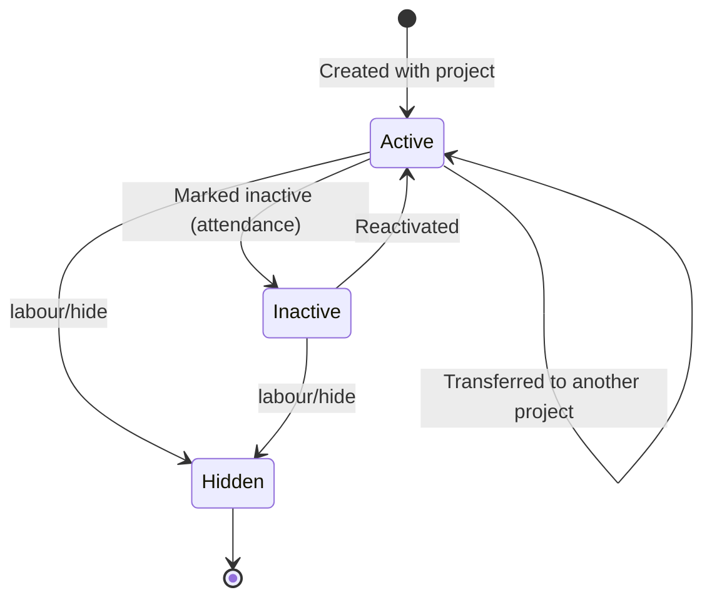
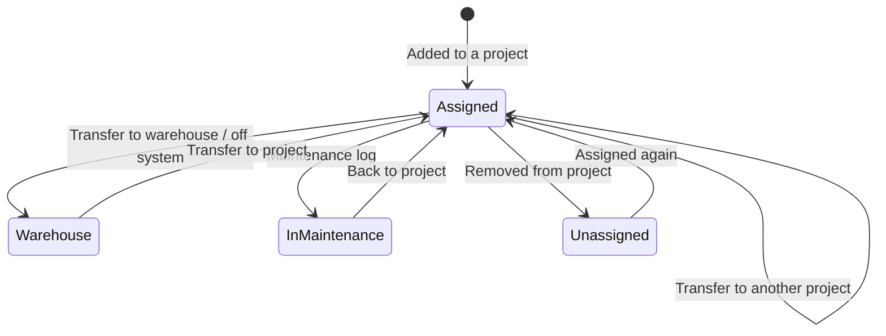
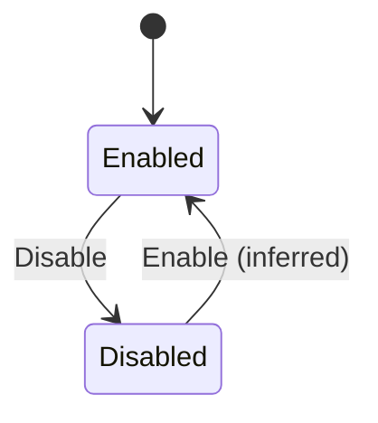

# 02 — Master Records

Master Records are the reference lists every other module picks from: the trades (Departments) and Work Types work is booked against; the parties the company pays or bills (Contractors, Suppliers, labour-supply Vendors, Labours, Other Parties); Equipment; the company's own Bank and Cash accounts; Materials with their category, unit, rate, GST and HSN; and small lookup lists (Measurement Units, Labour Categories, Payment Categories, Issue Categories, Amenities and Common Developments, Tags, Terms & Conditions, Lead Sources, Funnel statuses).

Many lists ship with **global seed records** (`companyId = null`) that every company sees; a company adds its own records beside them (`companyId = <company>`). Parties (Contractors, Suppliers, Vendors, Labours, Other Parties) are **assigned to projects** so that project screens only offer the relevant ones.

Who uses it:

- **Owner / Admin** set up departments, work types, accounts, categories and parties when onboarding.
- **Purchase / store keeper** maintains Materials, Material Categories, Units, Suppliers.
- **Site engineer / supervisor** adds Labours, Vendors, Contractors and Equipment for their project.
- **Accountant** maintains Bank/Cash accounts, Payment Categories, Other Parties, party GST/PAN.
- **Sales** maintains Lead Sources and Funnel statuses (per project / company).

Team Members and Designations are listed under the Master tab but are specified in **01 Organization/Identity/Access**. Numbering, back-dated entry and currency (the **Setting** tile) are in **12 Settings**.

---

## Legacy behaviour

### Master tab

The **Master** bottom tab shows one tile per master, each gated by its menu permission (01): Team Members, Departments, Contractors, Supplier, Vendors, Equipments, Setting, Material Categories, Materials, Company's Bank A/C, Add Measurement Unit, Designations, View Quotations, Amenities, Common Development, Work Type, Labours, Labour Categories, Payment Categories, Issue Categories, Other Party. The tile set itself is gated by **Master Records #14 [read]**.

Common list behaviour (observed across masters):

- Search by name; FAB to add; row Edit / Delete.
- Some lists use **Disable** instead of delete (`IssueCategory/Disable`, `ItemCategory/Disable`, `PettyCashCategory/Disable`, `Uom/Disable`) — this is how a company hides a global seed record (inferred).
- `*/Combo` endpoints feed pickers in other modules.
- Import/export via Excel where noted: a **SampleExport** endpoint returns a template, **Import** ingests it, **Report** / **export** produces a listing.

### Screen / route reference

| Master                         | Add/edit route                                                          | Key endpoints                                                                                                 |
| ------------------------------ | ----------------------------------------------------------------------- | ------------------------------------------------------------------------------------------------------------- |
| Departments                    | `#/agencyAddUpdate` ("Add Department")                                  | `Department/Combo`, `Department/GetAll`, `DepartmentWork/Combo`                                               |
| Work Type                      | `#/workTypeAddUpdateRoute`                                              | `WorkerType/{GetAll,Combo,AssignItem,UnassignItem,GetNotSelected}`                                            |
| Contractors                    | `#/contractorAddUpdate` → `#/contractorProjectList`                     | `Contractor/{Combo,GetAll,GetAllContractorQuotation(s),Import,Report,SampleExport}`                           |
| Supplier                       | `#/venderaddUpdate` ("Add Supplier")                                    | `Supplier/{GetAll,Import,Report,SampleExport}`, `Quotation/{GetAllSupplierQuotation(s),GetById}`              |
| Vendors                        | `#/addVendor`                                                           | (vendor attendance in 08)                                                                                     |
| Labours                        | `#/addLabour`, `#/labourTransferHistory`, `multipleLabourTransfer`      | `labour/{combo,hide,import,sample-export}`, `LabourCategory/Combo`                                            |
| Equipments                     | `#/equipmentAddUpdate`, `#/ownedEquipmentForm`, `#/rentedEquipmentForm` | `Equipments/Combo`, `equipments/combo`, `FuelType/Combo`, `FuelUnit/Combo`                                    |
| Company's Bank A/C             | `#/addBankAccount`                                                      | `BankAccount/{GetAll,SetAsPrimary}`                                                                           |
| Materials                      | `#/itemAddUpdate` ("Add Material")                                      | `Item/{Combo,GetAll}`, `items/{exports,imports,multi-delete,not-selected,single-batch}`, `MaterialType/Combo` |
| Material Categories            | `#/itemCategoryAddUpdate`                                               | `ItemCategory/{GetAll,Disable,Import,ItemCombo,ParentCombo,SampleExport}`                                     |
| Measurement Units              | `#/uomAddUpdate`                                                        | `Uom/{Combo,GetAll,Disable}`                                                                                  |
| Amenities / Common Development | `#/developmentTypeAddUpdate` ("Add Development")                        | `DevelopmentType/{GetAll,AssignItem,UnassignItem}`                                                            |
| Labour Categories              | `#/labourCategoryAdd`                                                   | `LabourCategory/Combo`                                                                                        |
| Payment Categories             | `#/addPaymentCategory`                                                  | `PettyCashCategory/{Combo,GetAll,Disable}`                                                                    |
| Issue Categories               | `#/addIssueSnagCat`                                                     | `IssueCategory/{Combo,GetAll,Disable}`                                                                        |
| Other Party                    | `#/addOtherParty`                                                       | `OtherParty/Invoice`, `Party/*` (see 07)                                                                      |
| View Quotations                | (tile)                                                                  | Contractor + Supplier quotation files                                                                         |
| Terms & Conditions             | `#/termsAndConditionAdd`                                                | `TermsnCondition/Combo`                                                                                       |
| Tags                           | (no screen seen)                                                        | `Tag/Combo`                                                                                                   |
| Supervisors                    | "Add/Edit Supervisor" in labour attendance                              | `Supervisor/Combo`                                                                                            |
| Lead Sources                   | per-project "Add/Edit/Delete Lead Source"                               | (Inquiry, see 09)                                                                                             |
| Funnel statuses                | `#/funnelStatusSettings`                                                | `FunnelStatus/Reorder`                                                                                        |

### Departments (`#/agencyAddUpdate`)

- "Add Department" — name only.
- A Department is a **trade / work category** (not an org unit). Used by Contractors (multi-select), Work Types, Daily Worksheets, Issues, Inspections, Tasks, Central Store MR.
- ~54 seeded (see Seed data).

### Work Type (`#/workTypeAddUpdateRoute`)

- Fields: Work Type Name*, Department*.
- **Assign / Unassign items**: attach Materials to a Work Type (`WorkerType/AssignItem`, `UnassignItem`; `GetNotSelected` lists materials not yet attached). Ties materials to a work type for worksheet material consumption (04).
- Seed: "RCC".

### Contractors (`#/contractorAddUpdate` → `#/contractorProjectList`)

- Step 1: Contractor Name*, Departments (multi-select, Create New inline), Address, Email, Mobile; Contact Person 1 name + number, Contact Person 2 name + number; Tax: GST No, PAN No; Contractor Quotation file upload.
- Step 2: **Select Projects** (multi) → Save.
- FAB: Import (Excel), Sample Export, Report.
- Contractor quotations listed via `Contractor/GetAllContractorQuotations` and on the **View Quotations** tile.

### Supplier (`#/venderaddUpdate`)

- Supplier Name*, Contact Person Name, Email, Mobile, Address; GST, PAN; Supplier Quotation upload; Select Projects.
- Import / Export / Report.
- Quotations via `Quotation/GetAllSupplierQuotations`, `Quotation/GetById`; shown on **View Quotations**.

### Vendors (`#/addVendor`) — labour-supply vendor

A gang / piece-rate contractor who supplies workers counted by head per category per shift.

- Vendor Name*, Joining Date*, Contact Number, Address.
- **Shifts**: Shift 1 with Start Time, End Time, and one or more category lines (Labour Category*, Rate/day, Overtime/hr); "+ Add Category" adds more categories to the shift; "+ Add New Shift" adds Shift 2, 3….
- Upload Vendor Photo, Other Documents; Add Projects.
- Vendor attendance (08) records headcount per category per shift and prices it from these rates.

### Labours (`#/addLabour`)

- Labour Name*, Labour Id, Wage Type* (Daily wages | Monthly Wages), Weekly Holidays (Sun … Sat toggles), Wage per month* (monthly) or Wage per day* (daily), Overtime Wage per Hour*, Opening Balance (editable), Joining Date*.
- **Statutory**: UAN Number, ESIC Number, Aadhaar Number.
- **Category & Contact**: Labour Category, Supervisor (a team member), Contact Number, Gender.
- Upload Labour Photo, Other Documents.
- **Select Project** — the labour's _current_ project. Moving between projects is a transfer with history (`#/labourTransferHistory`), single or multiple (`multipleLabourTransfer`).
- Import (Excel) / sample-export; **hide** (`labour/hide`); Active / Inactive toggle in attendance (08).

### Supervisors

- `Supervisor/Combo`. In labour attendance (08) a supervisor filter and "Add/Edit Supervisor" exist; the Labour form picks a Supervisor from team members. A Supervisor is a team member responsible for a group of labours (inferred).

### Equipments (`#/equipmentAddUpdate`)

- Master form: Equipment Name*, Contractor Name* (owner / renter), Equipment Number*, Fuel Type (CNG / Diesel / Petrol), Fuel Measurement Unit (Barrel / Gallon / Kg / Litre / Unit), Contact Person Name, Contact Person Number, Company Name.
- Separate **Company Owned** and **Rented** forms (`#/ownedEquipmentForm`, `#/rentedEquipmentForm`), also reachable from Equipment Usage (04):
  - Owned: Equipment Name*, Equipment Number*, Purchase Year, Fuel Type, Unit; **Utilization Basis** Hourly | Km | Trip; **Working Time Method*** (Time Shifts — engineer logs start/end per shift, hours auto-calculated | other); **Target & Performance**: Target (hrs/day; also days/month, Km/day, trips/day), Min Utilization %, Expected Fuel Efficiency (L/hr) — alerts when burn rate exceeds; Equipment Photo.
  - Rented: adds **Hire Details** — Vendor (contractor/owner), Hire basis Daily | Monthly | Trip | Hourly, Rate, Chargeable, Hire amount, rented hours.
- Lifecycle: transfer between projects or to warehouse ("Warehouse / Off system", "Another Project"), statuses Unassigned / In maintenance, maintenance log, time shifts, equipment dashboard and reports — detailed in 04.

### Company's Bank A/C (`#/addBankAccount`)

- Account Type*: **Cash Account** | **Bank Account** (bank fields then appear).
- **Set As Primary** (`BankAccount/SetAsPrimary`).
- Seeded per company: "Company's Cash Account" (type 1), "Company's Bank Account" (type 2), each with `isPrimary`, `openingBalance`.
- Used as "paid from / received into" in Transactions and petty-cash transfers (07).

### Materials (`#/itemAddUpdate` — "Add Material")

- Material Name*, Specification, Measurement Unit*, Material Category, Item Type* (Consumable | … from `MaterialType/Combo`).
- **Rate Details** (checkbox) → Unit Rate, Discount Type (₹ | %), Discount Value, GST Rate %, HSN Code.
- **Minimum Stock** (checkbox) → minimum quantity to maintain (drives low-stock alerts in 06).
- Bulk: import / export (Excel), multi-delete, single-batch create (`items/single-batch`), `items/not-selected`.
- Seed: "Cement OPC 53" in Civil Work Materials, unit Bag.

### Material Categories (`#/itemCategoryAddUpdate`)

- Name only; `ParentCombo` indicates a **parent category** (hierarchy). Disable, Import, SampleExport, `ItemCombo` (materials in a category).

### Measurement Units (`#/uomAddUpdate`)

- Name only; Disable. Seed list below.

### Amenities & Common Developments (`#/developmentTypeAddUpdate` — "Add Development")

- Name only; `typeId` 1 = **Common Development** (seed "Compound Wall"), 2 = **Amenity** (seed "Swimming Pool").
- `DevelopmentType/AssignItem` / `UnassignItem` attach them to projects / wings (notes say "for booking brochure"). They are also **Location Types** for site entries (03).

### Labour Categories (`#/labourCategoryAdd`)

- Name only. Used on Labour, Vendor shift lines, labour/vendor attendance and overtime.

### Payment Categories (`#/addPaymentCategory`)

- Name only; backed by `PettyCashCategory`; Disable. Used by petty-cash vouchers, transactions and party payments (07).

### Issue Categories (`#/addIssueSnagCat`)

- Name only; Disable. Used by Issues & Snags (05).

### Other Party (`#/addOtherParty`)

- Party Name* + Select Project. Customer / miscellaneous counter-party for purchase and sales invoices and receipts (07 Parties). Sales invoices to an Other Party are numbered (`OtherPartySalesInvoice`, 12).

### Tags, Terms & Conditions

- **Tags** (`Tag/Combo`): free labels on Tasks (05). No management screen in the notes.
- **Terms & Conditions** (`#/termsAndConditionAdd`, `TermsnCondition/Combo`): reusable T&C text picked on Purchase Orders (06) alongside Payment Terms (Days).

### Lead Sources, Funnel statuses (sales masters)

- **Lead Source** — per-project master edited inline on Inquiry (Add / Edit / Delete Lead Source).
- **Funnel status / Inquiry Stage** — configurable and reorderable (`#/funnelStatusSettings`, `FunnelStatus/Reorder`). Behaviour in 09.

### View Quotations

- Read-only tile listing contractor and supplier quotation files uploaded on the party forms.

### Fixed lookups (not editable in UI)

| Lookup                                 | Values                                                                                                                                              |
| -------------------------------------- | --------------------------------------------------------------------------------------------------------------------------------------------------- |
| Payment mode (`PaymentModeType/Combo`) | Cash (account_type 1), Cheque (needs "Cheque No"), Online (Reference Number), UPI (Reference Number); account_type 2 = bank                         |
| Paid-to type (`PaidToType/Combo`)      | Other Party (1), Contractor (2), Supplier (3), Labour (5), Vendor (6)                                                                               |
| Payment module (`Module/Combo`)        | Contractor's Payments (2), Suppliers Payments (3), Labour Payment (5), Vendor Payment (6), Other Party (1), Transaction (1, 4, 8), Petty Cash (1–7) |
| Fuel type (`FuelType/Combo`)           | CNG, Diesel, Petrol                                                                                                                                 |
| Fuel unit (`FuelUnit/Combo`)           | Barrel, Gallon, Kg, Litre, Unit                                                                                                                     |
| Material type (`MaterialType/Combo`)   | Consumable, … (sample data shows a "test" value)                                                                                                    |
| Wage type                              | Daily wages, Monthly Wages                                                                                                                          |
| Development type                       | 1 Common Development, 2 Amenity                                                                                                                     |
| Bank account type                      | 1 Cash Account, 2 Bank Account                                                                                                                      |
| Country (`Countries/Combo`)            | Country code list (+91 default)                                                                                                                     |

---

## Seed data (verbatim from notes)

### Departments (~54; the list below has 53, and those 53 are the seed set)

Surveying, Departmental Work, Equipment, Tancha Work, Steel Reinforcement Work, Flooring Work, False Ceiling, Pollution Control, Landscaping, Planning, Marketing, Purchase, Account, HVAC, Solar Electric, Solar Water Heater, Corporation Water, Water, Drainage, Soil Backfilling, Excavation, Labour, Miscellaneous Labour, Elevation, Concrete Hacking, Glazing, Silicone, Stone Fixing, Soil Nail & Gunting, Anti Termite, Soil Filling, Diaphragm Wall, Piling Work, Safety, Shuttering, Glass Fixing, Aluminum Section, POP, Trimix Work, Exposed Work, Fire Safety, Fabrication, Carpentry, Cleaning, Acid Wash, Painting, Tiling Work, Plumbing, Electric, Chicken mesh, Water Proofing, Masonry & Plaster, RCC.

(53 names captured; the notes say "~54".)

### Work Types

RCC.

### Measurement Units

%, Bag, Box, Brass, Bundle, cft, cm, CMT, cucm, cum, Dozen, Drum, Gallon, gram, Hour, inch, kg, KGL, kL, km, Litre, meter, mg, mL, mm, MTS, No, Pack, Pieces, PRS, Quintal, Rft, ROLL, SET, sqft, sqm, sqyd, Ton, Trip, Unit, Yard.

### Labour Categories

Carpenter, Electrician, Helper, Labour, Mason, Plumber, Skilled, Unskilled, Welder.

### Issue Categories

Client, Communication, Compliance, Design, Environmental, Financial, Management, Operational, Other, Quality, RFI, Safety, Supply, Technical.

### Payment Categories (list truncated in notes)

Bonus, Canteen, Computer and software, Conveyance, Entertainment, Fuel, Hardware, Housekeeping, Internet, Labour, Labour Payment, Maintenance, Marketing and Advertising, Medical, …

### Material Categories (list truncated in notes)

Aluminium Section, C P Fittings, Children Play Equipment, Civil Work Materials, Colour & Paints, Construction Chemicals, Construction Tools, Covers Drainage Chamber & Tank, Decorative Landscape Items, Electric Material, Fabrication Material, Fire & Safety, …

### Materials

Cement OPC 53 — category Civil Work Materials, unit Bag.

### Amenities / Common Developments

Amenity: Swimming Pool. Common Development: Compound Wall.

### Designations

See 01 (38 seeded designations; six carry permission templates).

### Company Bank / Cash accounts (per company on creation)

Company's Cash Account (type 1), Company's Bank Account (type 2).

### Drawing albums and testing items (project-level seeds)

See 03 (albums: Architect, Electrical, Plumbing, Structural Drawing; testing items: Rcc cube, Steel, Cement, Bricks).

---

## Entities & fields

All master tables carry `id`, `companyId` (nullable where global seeds exist), `createdBy`, `createdAt`, `updatedAt` (inferred standard columns).

### Department

| Field      | Type              | Required | Notes                              |
| ---------- | ----------------- | -------- | ---------------------------------- |
| id         | int               | yes      |                                    |
| companyId  | FK → Organization | no       | `null` = global seed.              |
| name       | string            | yes      |                                    |
| isDisabled | bool              | no       | Inferred (pattern of other seeds). |

### WorkType

| Field        | Type              | Required | Notes                            |
| ------------ | ----------------- | -------- | -------------------------------- |
| id           | int               | yes      | API name `WorkerType`.           |
| companyId    | FK → Organization | no       | Seed "RCC" is global (inferred). |
| name         | string            | yes      | "Work Type Name".                |
| departmentId | FK → Department   | yes      |                                  |
| itemIds      | FK[] → Material   | no       | Via Assign/Unassign.             |

### Contractor

| Field                                                | Type              | Required | Notes                                          |
| ---------------------------------------------------- | ----------------- | -------- | ---------------------------------------------- |
| id                                                   | int               | yes      |                                                |
| companyId                                            | FK → Organization | yes      |                                                |
| name                                                 | string            | yes      |                                                |
| departmentIds                                        | FK[] → Department | no       | Stored as CSV in `workTypeId`.                 |
| address                                              | text              | no       |                                                |
| email                                                | string            | no       |                                                |
| mobile / countryCode                                 | string            | no       |                                                |
| contactPerson1Name / contactPerson1Number (+country) | string            | no       |                                                |
| contactPerson2Name / contactPerson2Number (+country) | string            | no       |                                                |
| gstNumber                                            | string(15)        | no       |                                                |
| panNumber                                            | string(10)        | no       |                                                |
| invoiceNumber                                        | string            | no       | On the record; purpose unclear.                |
| quotationFiles                                       | file[]            | no       | "Contractor Quotation".                        |
| projectIds                                           | FK[] → Project    | no       | Step 2.                                        |
| openingBalance                                       | decimal(14,2)     | no       | "Opening Balance" on contractor payments (07). |

### Supplier

| Field             | Type              | Required | Notes |
| ----------------- | ----------------- | -------- | ----- |
| id                | int               | yes      |       |
| companyId         | FK → Organization | yes      |       |
| name              | string            | yes      |       |
| contactPersonName | string            | no       |       |
| email             | string            | no       |       |
| mobile            | string            | no       |       |
| address           | text              | no       |       |
| gstNumber         | string(15)        | no       |       |
| panNumber         | string(10)        | no       |       |
| quotationFiles    | file[]            | no       |       |
| projectIds        | FK[] → Project    | no       |       |

### Vendor (labour supply)

| Field          | Type              | Required                        | Notes                        |
| -------------- | ----------------- | ------------------------------- | ---------------------------- |
| id             | int               | yes                             | `vendorDetailId` on Project. |
| companyId      | FK → Organization | yes                             |                              |
| name           | string            | yes                             |                              |
| joiningDate    | date              | yes                             |                              |
| contactNumber  | string            | no                              |                              |
| address        | text              | no                              |                              |
| photo          | file              | no                              |                              |
| otherDocuments | file[]            | no                              |                              |
| projectIds     | FK[] → Project    | no                              | "Add Projects".              |
| shifts         | VendorShift[]     | no (inferred ≥1 for attendance) |                              |

### VendorShift

| Field      | Type                  | Required      | Notes                 |
| ---------- | --------------------- | ------------- | --------------------- |
| id         | int                   | yes           |                       |
| vendorId   | FK → Vendor           | yes           |                       |
| name       | string                | yes           | "Shift 1", "Shift 2"… |
| startTime  | time                  | no (inferred) |                       |
| endTime    | time                  | no (inferred) |                       |
| categories | VendorShiftCategory[] | yes           |                       |

### VendorShiftCategory

| Field            | Type                | Required                  | Notes |
| ---------------- | ------------------- | ------------------------- | ----- |
| vendorShiftId    | FK → VendorShift    | yes                       |       |
| labourCategoryId | FK → LabourCategory | yes                       |       |
| ratePerDay       | decimal(14,2)       | no (inferred yes for pay) |       |
| overtimePerHour  | decimal(14,2)       | no                        |       |

### Labour

| Field               | Type                                | Required       | Notes                        |
| ------------------- | ----------------------------------- | -------------- | ---------------------------- |
| id                  | int                                 | yes            |                              |
| companyId           | FK → Organization                   | yes            |                              |
| name                | string                              | yes            |                              |
| labourCode          | string                              | no             | "Labour Id".                 |
| wageType            | enum{Daily, Monthly}                | yes            |                              |
| weeklyHolidays      | enum{Sun,Mon,Tue,Wed,Thu,Fri,Sat}[] | no             |                              |
| wagePerMonth        | decimal(14,2)                       | yes if Monthly |                              |
| wagePerDay          | decimal(14,2)                       | yes if Daily   |                              |
| overtimeWagePerHour | decimal(14,2)                       | yes            |                              |
| openingBalance      | decimal(14,2)                       | no             | Editable.                    |
| joiningDate         | date                                | yes            |                              |
| uan                 | string(12)                          | no             | PF Universal Account Number. |
| esicNumber          | string                              | no             |                              |
| aadhaar             | string(12)                          | no             |                              |
| labourCategoryId    | FK → LabourCategory                 | no             |                              |
| supervisorId        | FK → TeamMember                     | no             |                              |
| contactNumber       | string                              | no             |                              |
| gender              | enum{Male, Female, Other}           | no             | Values inferred.             |
| photo               | file                                | no             |                              |
| otherDocuments      | file[]                              | no             |                              |
| currentProjectId    | FK → Project                        | no             | Changes only by transfer.    |
| isActive            | bool                                | yes            | Active/Inactive (08).        |
| isHidden            | bool                                | no             | `labour/hide`.               |

### LabourTransfer

| Field         | Type            | Required       | Notes                                             |
| ------------- | --------------- | -------------- | ------------------------------------------------- |
| id            | int             | yes            |                                                   |
| labourId      | FK → Labour     | yes            | Multiple per action via `multipleLabourTransfer`. |
| fromProjectId | FK → Project    | yes (inferred) |                                                   |
| toProjectId   | FK → Project    | yes            |                                                   |
| transferDate  | date            | yes (inferred) |                                                   |
| transferredBy | FK → TeamMember | yes (inferred) |                                                   |

### Supervisor

| Field      | Type            | Required      | Notes                                         |
| ---------- | --------------- | ------------- | --------------------------------------------- |
| employeeId | FK → TeamMember | yes           | Inferred: supervisor is a team member.        |
| projectId  | FK → Project    | no (inferred) | Add/Edit Supervisor is in project attendance. |

### Equipment

| Field                                   | Type                                                   | Required               | Notes                                                          |
| --------------------------------------- | ------------------------------------------------------ | ---------------------- | -------------------------------------------------------------- |
| id                                      | int                                                    | yes                    |                                                                |
| companyId                               | FK → Organization                                      | yes                    |                                                                |
| name                                    | string                                                 | yes                    |                                                                |
| ownership                               | enum{CompanyOwned, Rented}                             | yes                    | Separate forms.                                                |
| contractorId                            | FK → Contractor                                        | yes on master form     | "Contractor Name*" (owner / renter).                           |
| equipmentNumber                         | string                                                 | yes                    | Registration / asset number.                                   |
| purchaseYear                            | int                                                    | no                     | Owned.                                                         |
| fuelType                                | enum{CNG, Diesel, Petrol}                              | no                     |                                                                |
| fuelUnit                                | enum{Barrel, Gallon, Kg, Litre, Unit}                  | no                     |                                                                |
| contactPersonName / contactPersonNumber | string                                                 | no                     |                                                                |
| companyName                             | string                                                 | no                     |                                                                |
| utilizationBasis                        | enum{Hourly, Km, Trip}                                 | no (owned form)        |                                                                |
| workingTimeMethod                       | enum{TimeShifts, Other}                                | yes on owned form      | "Other" not named in notes.                                    |
| targetValue / targetUnit                | decimal / enum{hrs/day, days/month, Km/day, trips/day} | no                     |                                                                |
| minUtilizationPct                       | decimal(5,2)                                           | no                     |                                                                |
| expectedFuelEfficiency                  | decimal(10,2)                                          | no                     | L/hr; alert threshold.                                         |
| photo                                   | file                                                   | no                     |                                                                |
| hireVendorId                            | FK → Contractor                                        | Rented: yes (inferred) | "Vendor" on Hire Details.                                      |
| hireBasis                               | enum{Daily, Monthly, Trip, Hourly}                     | Rented: yes            |                                                                |
| hireRate                                | decimal(14,2)                                          | Rented: yes            |                                                                |
| chargeable                              | bool                                                   | no                     |                                                                |
| hireAmount                              | decimal(14,2)                                          | no                     |                                                                |
| rentedHours                             | decimal(10,2)                                          | no                     |                                                                |
| currentProjectId                        | FK → Project                                           | no                     | Changes by transfer.                                           |
| locationStatus                          | enum{Assigned, Unassigned, InMaintenance, Warehouse}   | yes (inferred)         | Notes name Unassigned, In maintenance, Warehouse / Off system. |

### CompanyAccount (Bank / Cash)

| Field                                    | Type                 | Required             | Notes                                           |
| ---------------------------------------- | -------------------- | -------------------- | ----------------------------------------------- |
| id                                       | int                  | yes                  |                                                 |
| companyId                                | FK → Organization    | yes                  |                                                 |
| accountType                              | enum{Cash=1, Bank=2} | yes                  |                                                 |
| name                                     | string               | yes                  | e.g. "Company's Cash Account".                  |
| bankName / accountNumber / ifsc / branch | string               | Bank: yes (inferred) | Notes say only "bank fields".                   |
| openingBalance                           | decimal(14,2)        | no                   |                                                 |
| isPrimary                                | bool                 | yes                  | One primary (inferred per type or per company). |

### Material (Item)

| Field          | Type                  | Required       | Notes                      |
| -------------- | --------------------- | -------------- | -------------------------- |
| id             | int                   | yes            |                            |
| companyId      | FK → Organization     | no             | Seed is global (inferred). |
| name           | string                | yes            |                            |
| specification  | text                  | no             |                            |
| defaultUomId   | FK → MeasurementUnit  | yes            |                            |
| itemCategoryId | FK → MaterialCategory | no             |                            |
| itemTypeId     | FK → MaterialType     | yes            | Consumable …               |
| hasRate        | bool                  | no             | "Rate Details" checkbox.   |
| unitRate       | decimal(14,2)         | if hasRate     |                            |
| discountType   | enum{Amount, Percent} | no             | ₹ / %.                     |
| discountValue  | decimal(14,2)         | no             |                            |
| gstRate        | decimal(5,2)          | no             | %.                         |
| hsnCode        | string(8)             | no             |                            |
| hasMinStock    | bool                  | no             |                            |
| minStockQty    | decimal(14,3)         | if hasMinStock | `qty` on the record.       |
| workTypeIds    | FK[] → WorkType       | no             | Via Work Type assignment.  |

### MaterialCategory

| Field      | Type                  | Required | Notes          |
| ---------- | --------------------- | -------- | -------------- |
| id         | int                   | yes      |                |
| companyId  | FK → Organization     | no       | `null` = seed. |
| name       | string                | yes      |                |
| parentId   | FK → MaterialCategory | no       | `ParentCombo`. |
| isDisabled | bool                  | no       |                |

### MeasurementUnit (UoM)

| Field      | Type              | Required | Notes |
| ---------- | ----------------- | -------- | ----- |
| id         | int               | yes      |       |
| companyId  | FK → Organization | no       |       |
| name       | string            | yes      |       |
| isDisabled | bool              | no       |       |

### DevelopmentType (Amenity / Common Development)

| Field       | Type                                 | Required | Notes                                            |
| ----------- | ------------------------------------ | -------- | ------------------------------------------------ |
| id          | int                                  | yes      |                                                  |
| companyId   | FK → Organization                    | no       |                                                  |
| typeId      | enum{CommonDevelopment=1, Amenity=2} | yes      |                                                  |
| name        | string                               | yes      |                                                  |
| assignments | {projectId, wingId?}[]               | no       | `AssignItem` / `UnassignItem` (target inferred). |

### LabourCategory

| Field     | Type              | Required | Notes |
| --------- | ----------------- | -------- | ----- |
| id        | int               | yes      |       |
| companyId | FK → Organization | no       |       |
| name      | string            | yes      |       |

### PaymentCategory (PettyCashCategory)

| Field      | Type              | Required | Notes |
| ---------- | ----------------- | -------- | ----- |
| id         | int               | yes      |       |
| companyId  | FK → Organization | no       |       |
| name       | string            | yes      |       |
| isDisabled | bool              | no       |       |

### IssueCategory

| Field      | Type              | Required | Notes |
| ---------- | ----------------- | -------- | ----- |
| id         | int               | yes      |       |
| companyId  | FK → Organization | no       |       |
| name       | string            | yes      |       |
| isDisabled | bool              | no       |       |

### OtherParty

| Field      | Type              | Required | Notes             |
| ---------- | ----------------- | -------- | ----------------- |
| id         | int               | yes      |                   |
| companyId  | FK → Organization | yes      |                   |
| name       | string            | yes      | "Party Name".     |
| projectIds | FK[] → Project    | no       | "Select Project". |

### Quotation (contractor / supplier)

| Field      | Type                       | Required       | Notes |
| ---------- | -------------------------- | -------------- | ----- |
| id         | int                        | yes            |       |
| partyType  | enum{Contractor, Supplier} | yes            |       |
| partyId    | FK → Contractor / Supplier | yes            |       |
| file       | file                       | yes            |       |
| uploadedAt | datetime                   | yes (inferred) |       |

### Tag

| Field     | Type              | Required       | Notes |
| --------- | ----------------- | -------------- | ----- |
| id        | int               | yes            |       |
| companyId | FK → Organization | yes (inferred) |       |
| name      | string            | yes            |       |

### TermsAndCondition

| Field     | Type              | Required       | Notes |
| --------- | ----------------- | -------------- | ----- |
| id        | int               | yes            |       |
| companyId | FK → Organization | yes            |       |
| title     | string            | yes (inferred) |       |
| body      | text              | yes (inferred) |       |

### LeadSource

| Field     | Type         | Required | Notes               |
| --------- | ------------ | -------- | ------------------- |
| id        | int          | yes      |                     |
| projectId | FK → Project | yes      | Per-project master. |
| name      | string       | yes      |                     |

### FunnelStatus (Inquiry Stage)

| Field     | Type              | Required       | Notes                 |
| --------- | ----------------- | -------------- | --------------------- |
| id        | int               | yes            |                       |
| companyId | FK → Organization | yes (inferred) | Possibly per project. |
| name      | string            | yes            |                       |
| sortOrder | int               | yes            | `Reorder`.            |

---

## Workflows & states

1. **Onboarding masters** — on company creation the global seeds (departments, units, labour/issue/payment/material categories, designations, amenities) become visible and the Cash/Bank accounts are created. The admin disables seeds they do not need and adds their own.
2. **Add contractor** — `#/contractorAddUpdate` → name, departments (create inline if missing), contacts, GST/PAN, quotation → Select Projects → Save. The contractor now appears in that project's worksheet, payment and issue pickers.
3. **Add supplier** — same pattern; supplier then appears in PO/GRN and supplier payments for its projects.
4. **Add vendor** — name, joining date → define Shift 1 with one or more category rates → optionally more shifts → photo/docs → projects. Vendor attendance becomes available for those projects.
5. **Add labour** — details, wage type and rate, OT rate, opening balance, joining date, statutory IDs, category, supervisor → Select Project (current). The labour now appears in that project's attendance.
6. **Transfer labour** — single or multiple → destination project and date → history in `#/labourTransferHistory`. Attendance and payments thereafter belong to the new project (inferred).
7. **Add equipment** — owned or rented form → assign to project → used in Equipment Usage (04); later transfer to project / warehouse or mark in maintenance.
8. **Add material** — name, unit, category, type, optional rate/GST/HSN, optional min stock → available to PR/PO/GRN/inventory. Optionally attach to Work Types.
9. **Bulk import** — download SampleExport (Excel) → fill → Import → rows created; applies to Contractors, Suppliers, Labours, Materials, Material Categories, Team Members, Inventory, Inquiries, Tasks, Transactions, Units, Holidays (latter ones in their modules).
10. **Disable a seed** — Disable on Uom / Item Category / Payment Category / Issue Category hides it from pickers without deleting history (inferred).
11. **Set primary account** — choose a Bank/Cash account → Set As Primary → default "paid from" (inferred).
12. **Funnel statuses** — add, rename, drag to reorder → inquiry stage list follows the order.

### Labour

### Equipment location

### Seeded lookup record

---

## Business rules & validations

- Required fields:
  - Department: Name. Work Type: Name, Department.
  - Contractor: Name. Supplier: Name. Other Party: Name.
  - Vendor: Name, Joining Date; each shift category line needs a Labour Category.
  - Labour: Name, Wage Type, Wage per month or per day (by wage type), Overtime Wage per Hour, Joining Date.
  - Equipment (master form): Name, Contractor, Equipment Number. Owned form: Name, Number, Working Time Method.
  - Bank A/C: Account Type.
  - Material: Name, Measurement Unit, Item Type.
  - Material Category, Unit, Labour Category, Payment Category, Issue Category, Development: Name.
- Names should be unique per company within each master, including against visible global seeds (inferred; e.g. "Bag" should not be re-created).
- Global seeds (`companyId = null`) are read-only for companies; they can be disabled, not edited or deleted (inferred from Disable endpoints and Designation Duplicate).
- A master record referenced by transactions should be disabled or hidden rather than deleted (inferred; legacy offers `hide` for labour and `Disable` for lookups).
- Parties are offered in a project only if assigned to that project (Contractors, Suppliers, Vendors, Labours, Other Parties; also via Project → Resources, 03).
- A Labour has exactly one current project; changing it is a transfer with history, not an edit.
- A Contractor may cover many Departments; the Department picker on worksheets is filtered by the chosen contractor (inferred).
- Material **Rate Details** and **Minimum Stock** sections are only stored when their checkbox is on.
- Discount type is ₹ (amount) or %; GST Rate is a percentage; HSN Code is free text in legacy.
- Only one primary account (inferred).
- Cheque payment mode needs "Cheque No"; Online and UPI need a Reference Number (used in 07).
- Overtime hours ≤ 24 per labour per day (enforced in attendance, 08).
- Import files must follow the SampleExport template.
- Permission gates: each master honours its own menu's create/read/update/delete; financial fields hidden without FINANCIAL (Vendors, Equipments, Materials, Labours).
- "Discard changes?" guard on leaving a dirty form (inferred; common app pattern, not named in these notes).

---

## Permissions

| Master                     | Menu # | Flags                                                                    |
| -------------------------- | ------ | ------------------------------------------------------------------------ |
| Master Records tab         | 14     | read                                                                     |
| Departments                | 43     | create, read, update, delete                                             |
| Work Type                  | 46     | create, read, update, delete                                             |
| Contractors                | 31     | create, read, update, delete                                             |
| Supplier                   | 9      | create, read, update, delete                                             |
| Vendors                    | 60     | CRUD, financial (shift rates)                                            |
| Labours                    | 69     | CRUD, financial (wages, opening balance)                                 |
| Labour Categories          | 70     | CRUD                                                                     |
| Equipments                 | 22     | CRUD, print, notification, transfer, report, financial (hire rate, cost) |
| Company's Bank A/C         | 61     | CRUD, print, report                                                      |
| Materials                  | 28     | CRUD, financial (rate, discount)                                         |
| Material Categories        | 27     | CRUD                                                                     |
| Add Measurement Unit       | 25     | CRUD                                                                     |
| Amenities                  | 42     | CRUD                                                                     |
| Common Development         | 45     | CRUD                                                                     |
| Payment Categories         | 71     | CRUD                                                                     |
| Issue Categories           | 72     | CRUD                                                                     |
| Other Party                | 64     | CRUD                                                                     |
| View Quotations            | 29     | read                                                                     |
| Setting                    | 86     | CRUD (see 12)                                                            |
| Team Members, Designations | 12, 26 | see 01                                                                   |

Project-side flags that touch masters: **Labour #58** (transfer = move labour between projects), **Vendor #59**, **Inquiry #8** (Lead Sources, Funnel statuses edited from Inquiry). Tags and Terms & Conditions have no menu of their own; their edit rights are open questions.

---

## Relationships

- → depends on 01 Organization/Identity/Access: company scope, Team Members (Supervisor), permissions.
- → depends on 03 Projects: project assignment of parties, lead sources per project.
- ← used by 03 Projects: Resources step assigns Contractors, Suppliers, Vendors, Team Members, Contacts; Amenities/Common Developments as location types.
- ← used by 04 Daily Site Work: Department, Work Type, Contractor, Labour counts, Materials for consumption, Equipment, Fuel Type/Unit, UoM for Approx Work Done.
- ← used by 05 Tasks/Issues/Inspections: Department, Contractor, Issue Category, Tags.
- ← used by 06 Procurement & Inventory: Material, Material Category, UoM, Supplier, Terms & Conditions, rates/GST/HSN, minimum stock.
- ← used by 07 Payments & Accounting: Bank/Cash accounts, Payment Categories, paid-to parties (Contractor, Supplier, Labour, Vendor, Other Party), opening balances, payment modes.
- ← used by 08 Labour & Vendor Attendance: Labours, Labour Categories, Vendors and shift rates, Supervisors.
- ← used by 09 Sales CRM: Lead Sources, Funnel statuses, Amenities (brochure).
- ← used by 11 Reports: party reports (Contractor/Supplier Report), stock register by material.
- ← used by 12 Settings: numbering per module, back-dated entry per module.

---

## Reports & exports

| Master              | Export / report                                                                                                                                                                                |
| ------------------- | ---------------------------------------------------------------------------------------------------------------------------------------------------------------------------------------------- |
| Contractors         | Import, SampleExport, Report (`Contractor/Report`)                                                                                                                                             |
| Suppliers           | Import, Export, Report (`Supplier/Report`)                                                                                                                                                     |
| Labours             | Import, sample-export; labour transfer history; (labour reports in 08)                                                                                                                         |
| Materials           | Excel export / import (`items/exports`, `items/imports`)                                                                                                                                       |
| Material Categories | Import, SampleExport                                                                                                                                                                           |
| Team Members        | Export/Import (see 01)                                                                                                                                                                         |
| Company's Bank A/C  | print + report flags (ledger in 07)                                                                                                                                                            |
| Equipments          | Equipment transfer report (Equipment Name, Number, Purchase Year, Transfer Date, Location Before, Transfer To Project, Latest Location, Remarks, Entry By); usage and maintenance reports (04) |
| View Quotations     | Contractor and supplier quotation file list                                                                                                                                                    |

---

## Rebuild recommendations

1. **Unified Party model.** Contractors, Suppliers, Vendors, Other Parties (and Labours as individuals) share name, contacts, GSTIN, PAN, documents, project assignment and opening balance. Use one `Party` table with role flags (a firm can be both supplier and contractor) and role-specific child tables (vendor shifts, labour wages). Payments (07) already treat them as "paid-to types".
2. **Tax identity on every party** (research doc §2 TDS): PAN, entity type (individual/HUF vs company/firm), default TDS section (194C contractor / labour supply; 194J architect or consultant; 194Q goods purchase; 194I equipment hire at 2%), per-FY cumulative tracking for thresholds (194C ₹30,000 single / ₹1,00,000 aggregate). Validate PAN and GSTIN formats; derive state from GSTIN.
3. **GST registration status on suppliers.** Store GSTIN presence as "registered / unregistered". Research doc §2 (80/20 rule) requires the promoter to compute registered-supplier purchases per project per FY; cement from unregistered suppliers is always under RCM.
4. **Effective-dated GST and HSN on materials.** Replace a single `gstRate` with an HSN/SAC rate table with effective dates (research doc §2: cement 28% → 18% from 22 Sep 2025; sand-lime bricks, granite/marble blocks 12% → 5%). Add an "ITC eligible" flag driven by project type (§17(5) blocks ITC for own-account construction).
5. **Contractor compliance fields** (research doc §2 Labour): BOCW registration, CLRA licence number, PF establishment code, ESI code; SAC classification per work order (9954 vs 9987).
6. **Labour statutory data.** Keep UAN, ESIC, Aadhaar (encrypted, masked, reveal audited), add skill level (unskilled / semi-skilled / skilled / highly skilled) to Labour Category so state minimum-wage rate cards can be applied (research doc §2: minimum wages are state-notified per skill category and revised twice a year via VDA — store as dated rate cards per state). Warn when a labour's wage is below the applicable minimum.
7. **Item library with DSR codes** (research doc §3 BOQ): optional CPWD DSR code and resource coefficients on Materials / Work Types so the Work Type → Material link (legacy AssignItem) becomes the coefficient table for material reconciliation.
8. **Hierarchy limits on Material Categories.** Make `parentId` explicit with a depth limit and show the path in pickers.
9. **Global seed vs company copy.** Keep seeds global and immutable; per-company "hidden" state in a join table, so seeds can be updated centrally without overwriting company edits. Company-created names must not collide with visible seeds.
10. **Soft delete everywhere + audit trail.** Masters are referenced by money and stock records; replace delete with archive (`archivedAt`), keep who/when, and block archiving a party with an open balance.
11. **Equipment as an asset with hire contract.** Separate the asset (owned/rented, number, fuel) from the **hire agreement** (vendor, basis, rate, period) so a rented machine's rate change is dated; TDS 194I applies to hire (research doc §2).
12. **Bank accounts.** Capture IFSC, account number (masked), branch; tag a project's RERA designated account (research doc §2 RERA 70% rule) so collections in 09 can be routed and reported.
13. **Imports with validation preview.** Show row-level errors and duplicates before commit; keep the template versioned.
14. **Lookups as code where fixed.** Payment modes, paid-to types, fuel types/units and development types are enumerations; keep them as code enums with labels, not editable tables, except where the business must add values.

---

## Decisions for the build

### CM-406

Minimal Contractor and Supplier masters ([ADR CM-0013 §6](../adr/CM-0013-projects-structure-product-decisions.md)); Project Resources rules are in [`modules/03`](./03-projects-structure-drawings-gallery.md) → "Decisions for the build".

- Menus `masters.contractors` and `masters.suppliers` (CRUD), under Masters → **Parties**. Routes `/api/construction/masters/{contractors|suppliers}`: list, add, `{id}`, `{id}/update`, `{id}/activate`, `{id}/deactivate` (Update flag), `{id}/delete`. Lists are newest first with cursor pages and a total, searched by name, contact person, GSTIN or mobile digits, filtered by active and Project.
- Fields: name (required, at most 120, spaces collapsed, unique among the Company's live rows of that list ignoring case — 409 `CONTRACTOR_NAME_IN_USE` / `SUPPLIER_NAME_IN_USE`; a Contractor and a Supplier may share a name), contact person (at most 120), mobile (an Indian mobile, stored E.164, `MOBILE_INVALID`), email (`EMAIL_INVALID`), address (at most 500), GSTIN (`GSTIN_INVALID`) and PAN (`PAN_INVALID`) checked by `shared-kernel/tax-ids`, and a GSTIN must hold the PAN when both are given (`GSTIN_PAN_MISMATCH`). Edit replaces the whole form with the `updatedAt` it loaded (409 `<KIND>_CHANGED`).
- A Contractor works in Departments: ids new to it must be live Departments of the Company and enabled (400 `DEPARTMENT_NOT_FOUND` / `DEPARTMENT_DISABLED`); one it already has stays when Masters disables it. A Department deleted in Masters simply drops off its Contractors. Suppliers have no Departments.
- Projects are chosen on the form too; ids new to the party must be live Projects of the Company (400 `PROJECT_NOT_FOUND`). The form is not limited to the Projects the editor is on (as for Vendors: the Masters menus are not project-level).
- **Inactive** parties leave every picker, Resources' Edit dialog included, but stay on the Projects they are on; they are never added to another Project from Resources (400 `CONTRACTOR_INACTIVE` / `SUPPLIER_INACTIVE`).
- **Delete** is a tombstone and is refused while the party is on a live Project (409 `CONTRACTOR_ON_PROJECTS` / `SUPPLIER_ON_PROJECTS`, naming them): take it off its Projects first, or deactivate it. CM-501 adds invoices, POs and GRNs to that check.
- Every write is audited (`contractor.created|updated|activated|deactivated|deleted|projects_changed`, the same for `supplier`).

### CM-501 — Procurement masters

- Menus: `masters.units`, `masters.material_categories`, `masters.materials` (Financial covers unit rate, discount, GST % and HSN; minimum stock is not financial), `masters.terms_conditions`, `masters.quotations` (Read). Each list: newest first, cursor pages, search, All / Enabled / Disabled; add, edit (`expectedUpdatedAt`, 409 `<KIND>_CHANGED`), disable, enable, delete.
- Names unique among live rows ignoring case (409 `<KIND>_NAME_IN_USE`; Terms & Conditions by title). Seed Units and Categories can be disabled, never edited or deleted (409 `SEED_IS_READ_ONLY`); the seed Material "Cement OPC 53" is an ordinary row.
- Seeds: the 41 units, 22 top-level Material Categories (the notes' list completed for Indian construction) and Cement OPC 53, for every new Company and backfilled for existing ones.
- Categories have one level of parent (`MATERIAL_CATEGORY_PARENT_INVALID`, `MATERIAL_CATEGORY_HAS_CHILDREN`). A disabled unit, category or parent cannot be newly picked (`*_DISABLED`); one already on a row stays.
- In use, so not deletable: a Unit on a Material, a Category on a Material or child, a Material with any stock entry or a line on a live PR, PO, GRN, transfer, MR or DN, a Supplier on a live PO or GRN, a Contractor on a live MR. Terms & Conditions are never in use (POs copy the text).
- Parties: GST state from the GSTIN's first two digits (a different pick is 400 `GSTIN_STATE_MISMATCH`), else picked; Contractors have a second contact. Quotations: PDF or image, ≤ 10 MB, ≤ 50 per party, uploaded with Update on the party menu, listed on the party and on View Quotations.
- Material picker (`GET materials/options`): Materials Read or Read on any procurement menu; a parent category also returns its sub-categories' Materials; loading by ids returns disabled Materials so a form can reopen its lines.
- Billing addresses (Masters → Settings, `organization.settings`): the first becomes the default; deleting the default promotes the oldest remaining one. GRN fields: which optional GRN fields are hidden; an unknown key is 400.
- Project GST state: optional on the Project form; left out keeps what is stored, `null` clears it.
- Retired GST state codes (25, 28) are refused on billing addresses and Projects; a party with a GSTIN keeps the GSTIN's state even if retired. A member with only View Quotations may open quotation files; quotations are not in a Project Gallery.

## Open questions

1. Are Departments, Units and Categories per company or global with company additions only? Can a company rename a seed?
2. What does **Disable** do for existing records that reference the item?
3. What does "Contractor Name*" on Equipment mean for company-owned equipment — owner, operator agency, or the contractor using it?
4. What are the "other" Working Time Method and the full Item Type list besides Consumable?
5. What bank fields does the Bank Account form capture?
6. Is "Primary" one per company or one per account type?
7. Is a Supervisor a separate entity or a flag on Team Member? Is it per project?
8. Are Lead Sources and Funnel statuses per project or per company (notes say Lead Source is per project)?
9. Do `DevelopmentType/AssignItem` attach amenities to projects/wings or materials to amenities?
10. Contractor record has `invoiceNumber` — what is it for?
11. Full Payment Category and Material Category seed lists (truncated in notes).
12. Can a Labour belong to a Vendor (gang member) or are vendor labours only counted, never named?
13. Who may edit Tags and Terms & Conditions (no menu permission seen)?
14. Does a material's Work Type assignment carry a quantity/coefficient or is it only a filter?
