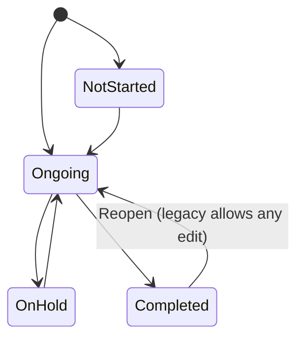
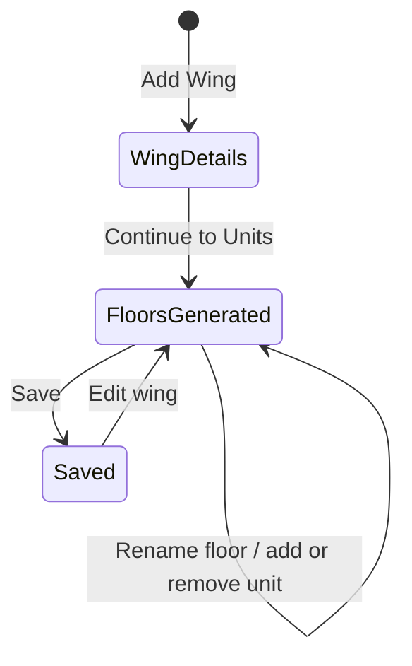
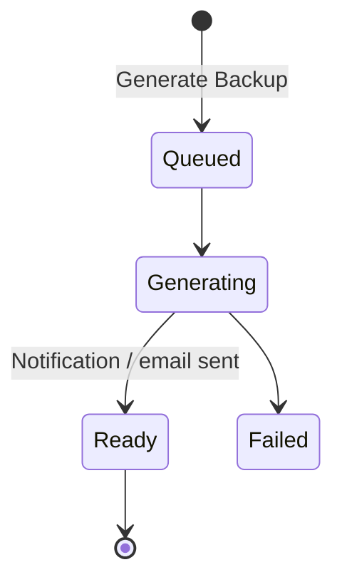
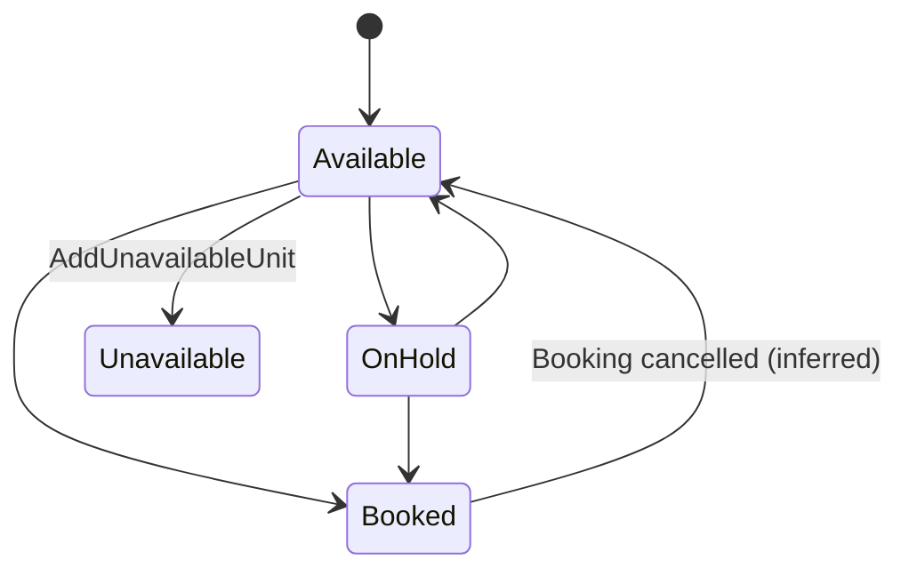

# 03 — Projects, Structure, Drawings & Gallery

A **Project** is the construction site or development every site entry, purchase, payment, attendance and sale belongs to. This module covers creating and managing projects (two-step wizard, status, type, budget, logo, resource assignment), the project home (tiles, pinning, hiding modules, tile order, backup, project chat), the **physical structure** of a building project — **Phases → Wings → Floors → Units** — and **Locations** for non-building projects, the **Location Type** taxonomy every site entry uses, **Project Drawings** (albums of files), the **Gallery** of project media, **Testing Reports**, and the **Project Dashboard**.

Who uses it:

- **Owner / project manager** creates projects, sets budget and status, assigns team and parties, configures wings and floors, reads the dashboard.
- **Site engineer / supervisor** picks locations on daily entries, uploads drawings, photos and test reports.
- **Sales** uses Units as the sellable inventory for Booking (09).
- **Quality / testing** staff upload lab reports per testing item.
- **Every project member** sees the tiles they have permission for, pins projects, and uses project chat.

---

## Legacy behaviour

### Projects home (bottom tab **Projects**)

- Project cards with status filter **All / Ongoing / Completed / Not started / On hold**, search, **pinned projects** first (`home/projects/pinned`).
- HRMS banner "Not checked in / Check In" (attendance state from `home/projects`, with `geo_fence_required`; see 10).
- `home/projects` (v2) returns: organization block, permissions summary, attendance state, `status_counts` (counts per status for the filter chips).
- **Project card**: initials avatar (or logo), name, address, start and end dates, **progress %**, kebab menu (**Pin**, **Edit**, **Hide modules**).
- Lists: `Project/GetAll`, `Project/Combo`, `projects/combo`, `projects/by-employee` (projects a member is assigned to), `v2/projects`.

### Create / edit project (`#/projectadd`, two steps)

| Step                               | Fields                                                                                                                                                                                                                          |
| ---------------------------------- | ------------------------------------------------------------------------------------------------------------------------------------------------------------------------------------------------------------------------------- |
| 1. Details                         | Project Name*, Start Date, Expected Completion, Project Address, Project Status* (Ongoing / Completed / Not started / On hold), Project Type* (from master, `Project/Combo`), **Financials**: Budget Value, Project Logo upload |
| 2. Resources (Resource Assignment) | Assign Team Members, Contractors, Suppliers, Vendors, Contacts                                                                                                                                                                  |

- Save: `Project/Store` (legacy), `v2/projects/{id}` (read/update).
- The record also carries `useProjectLogoInReport` and `noOfPhase`.

**Contract Details, Custom Fields and Documents (CM-413, CM-414, [ADR CM-0010](../adr/CM-0010-project-contract-details-and-documents.md)).** These are not in the legacy app. The owner asked for them on 2026-10-09. The rebuilt form groups the Project into four cards:

- **Project:** the existing fields, the only required card.
- **Client:** name and mobile.
- **Contract:** Order Value (₹, excluding GST), then one row per paper with its number, date and attached files. The rows are Tender / RFQ ref., Quotation, LOA, PO / WO and Agreement. Quotation and PO / WO always show; the others appear on demand.
- **Additional details:** Custom Fields as name and value pairs, with names suggested from other Projects.

The optional cards start collapsed and show a one-line summary. Every field in the Client, Contract and Additional details cards is optional; the Project card keeps its required name and status. A **Documents** tab in the project shell lists every file grouped by paper, with view (PDFs and images only), download and delete. Files picked on Add Project upload once the Project is saved.

### Project options menu

- **View project details**.
- **Backup** — project data export (see Backup below).
- **Hide / Show Modules** — per-project module visibility.
- **Tile ordering** — drag order stored as `projectMenuOrderIds` (browser storage in legacy).

### Project home tiles (17)

Dashboard, Create Wing, Project Drawings, Testing Reports, Equipment Usage, Daily Worksheet, Manage Materials, Issues and snags, Reports, Payments, Inquiry, Booking Details, Progress Report, Task, Inspection Request, Gallery, Attendance. **Create Location** appears for non-building projects. A **project chat** icon sits top-right (one group chat per project, Firebase RTDB; see 13).

Project-level menu tree (`MenuPermission/MenuList`, parent Project#4): Dashboard, Wings, Create Location, Project Drawings, Testing Report, Equipment Usage, Worksheet, Issues and snags, Manage Materials {Central Store (MR), Current Inventory, Goods Received, Material Transfer, Purchase Order, Purchase Request}, Reports, Payments {Petty Cash, Transactions}, Inquiry, Booking, Progress Report, Task, Inspection Request, Gallery, Attendance {Labour, Vendor}.

| Tile                                                                                 | Owning module |
| ------------------------------------------------------------------------------------ | ------------- |
| Dashboard, Create Wing / Create Location, Project Drawings, Testing Reports, Gallery | 03 (this doc) |
| Daily Worksheet, Equipment Usage, Progress Report                                    | 04            |
| Task, Issues and snags, Inspection Request                                           | 05            |
| Manage Materials                                                                     | 06            |
| Payments                                                                             | 07            |
| Attendance                                                                           | 08            |
| Inquiry, Booking Details                                                             | 09            |
| Reports                                                                              | 11            |

### Project Dashboard (`#/chartsDashboard`) — "Charts & Performance Overview"

- **Filter duration**, default last 1 year.
- **KPI tiles**: Material Approvals, Payment Approvals, Pending Issues & Snags, Pending Inspections.
- **Manage Dashboard**: toggle and reorder sections — Task, Payments, Daily Work, Equipment Usage, Materials, Issue And Snag, Attendance, Inspection Request, Booking, Inquiry.

| Section            | Widgets                                                                                                                                                                                                                  |
| ------------------ | ------------------------------------------------------------------------------------------------------------------------------------------------------------------------------------------------------------------------ |
| Task               | Project Progress % gauge (with start/end date); Value Earned By Task (task value vs earned value); Filtered By Status (Not Started / In Progress / Delayed / Completed counts)                                           |
| Payments           | Payment In & Out & Balance + trend chart; Due Payments table (party, total invoice, paid, due; export); Module Wise Payment pie (Contractor / Vendor / Supplier / Labour / Other Expenses)                               |
| Daily Work         | Total Labours Availability trend; Contractor-wise Labour (contractor, department, skilled, unskilled)                                                                                                                    |
| Equipment Usage    | Top Equipment by Work Hours; Category-wise (Owned vs Rented)                                                                                                                                                             |
| Materials          | Material Summary (total materials, in stock, low stock, out of stock, total PO, total PO value); Month-wise PO Value; Stock Register Report (movement and balance per material)                                          |
| Issues & Snags     | Status charts                                                                                                                                                                                                            |
| Attendance         | Labour Attendance present / absent; Labours Present At Site day-wise; Labour Payment Status (balance per labour); Vendor's Labour Attendance (present / half / OT); Vendor-wise Labour Allocation; Vendor Payment Status |
| Inspection Request | Total / approved / pending / rejected + Success Rate gauge                                                                                                                                                               |
| Booking            | Booking by Status (units booked vs available); Booking Report                                                                                                                                                            |
| Inquiry            | Funnel                                                                                                                                                                                                                   |

### Create Wing (`#/winglist`) — building structure

- **Phases**: Phase 1 … n (`noOfPhase` on project; `Phase/Combo`; wings are created under a phase with `Phase/CreateWingByPhase`).
- **Add Wing** form:
  - Wing Type* — one of 8: **Commercial, Residential, Bungalow scheme, Residential & Commercial, Plotting scheme, Institutional, Individual Unit, Industrial**.
  - Wing Name*.
  - Type-specific floor configuration, e.g. for Commercial: **Commercial Floors*** (count), **Start Number***, **Number Of Units Per Floor***, **Basement Parking Floors**.
  - **Continue to Units** → generated floor list, top to bottom: **Terrace Floor**, typed floors (e.g. Commercial Floor 5 … 1), **Ground Floor**, **Basement Floor 2 … 1**. Each floor shows unit chips: unit names editable, remove a unit, **+ Add** a unit; a floor can be renamed. Totals shown (example: Floors 9, Units 24).
- **Wing chart view** (`#/wingChartRoute`) — visual grid of floors × units.
- `Wings/GetAll` lists wings.
- Units are the **sales inventory** for Booking (09: `Booking/AddArea` unit areas, `Booking/AddUnavailableUnit`, `Booking/UnitImport` Excel) and the **location target** for worksheets, issues, inspections, tasks.

### Create Location (non-building projects)

- Menu **Create Location #74** for projects that are not wing/floor/unit buildings (roads, infrastructure, etc. — inferred). Locations are a flat named list used where wings would be (inferred: the notes give the menu, not the form).

### Location Type taxonomy (used by every site entry)

Every site entry (Daily Worksheet, Equipment Usage, Issues & Snags, Inspection Request, Task, Purchase Order, Purchase Request, Central Store MR) has a **Location Type** selector:

| Location Type                    | Then pick                                           |
| -------------------------------- | --------------------------------------------------- |
| **Wing**                         | Wing → Floor (multi-select) → Unit                  |
| **Amenities**                    | Amenity (from 02 Amenities assigned to the project) |
| **Common Developments**          | Common Development (from 02)                        |
| Location (non-building projects) | Location (from Create Location) — inferred          |

Task uses "Location Type / Wing / Locations"; MR uses "Location Type / Wing / Location".

### Project Drawings (`#/projectplanalbum`)

- **Albums** — seeded per project: **Architect, Electrical, Plumbing, Structural Drawing**; add album (Album Name*); delete album.
- Inside an album: upload drawing files; built-in image / PDF viewer.
- `Drawing/Combo` feeds pickers; Inspection Requests link drawings ("Upload Drawings and site photographs"; `TestingItemDrawing/Combo`).
- **Notification** permission: members are notified of new drawings.
- Reports: "Drawings Data" in the project report set; drawings are part of the Media Backup.

### Testing Reports (`#/testingReport`)

- **Testing Items** per project — seeded **Rcc cube, Steel, Cement, Bricks**; add item (Testing Material Name*).
- Inside an item: **reports** — Name*, Report Date*, Upload Test Report (file).
- Search by report name. `MaterialTestingReport/GetAll`.
- "Testing Report Data" in the project report set; "Material Testing Report" is a back-dated-entry module (12).

### Gallery

- Tile **Gallery #55** (read only). Shows project media gathered from entries (worksheet work photos, issue images, inspection images, equipment usage files, drawings) — inferred from the "Project All Media" report and Media Backup.
- Endpoints that serve media: `File/Images`, `Photo/Document`, `WorkSheetImages/Upload`.
- The brief describes search across images / PDF and an "uploaded by" attribute; the notes only confirm the tile, its read-only permission, and the "Project All Media" report. Treat search and uploaded-by as required behaviour to confirm (see Open questions).

### Backup (project options and Reports tile)

- **Data Backup** and **Media Backup**, each with a **date range**.
- **Generate Backup** runs asynchronously; result is emailed / OTP-protected.
- Option **"Only Current Project Report"**.
- Daily worksheet has its own backup route (`#/dailyWorkBackupRoute`, see 04).
- Reports render as PDF or Excel with header Organisation, Project, Address, Duration and "Page x of y".

### Project chat

- One group chat per project (`GroupChat/GroupList`), opened from the project top bar; Firebase RTDB (see 13).

---

## Entities & fields

### Project

| Field                  | Type                                                 | Required | Notes                                                                                    |
| ---------------------- | ---------------------------------------------------- | -------- | ---------------------------------------------------------------------------------------- |
| id                     | int                                                  | yes      |                                                                                          |
| companyId              | FK → Organization                                    | yes      |                                                                                          |
| name                   | string                                               | yes      | "Project Name".                                                                          |
| startDate              | date                                                 | no       |                                                                                          |
| endDate                | date                                                 | no       | "Expected Completion".                                                                   |
| address                | text                                                 | no       | "Project Address".                                                                       |
| projectTypeId          | FK → ProjectType                                     | yes      |                                                                                          |
| status                 | enum{Ongoing=1, Completed=2, NotStarted=3, OnHold=4} | yes      | Numeric mapping follows the listed order "Ongoing/Completed/Not started/On hold → 1..4". |
| budgetValue            | decimal(14,2)                                        | no       | Financials.                                                                              |
| logoImage              | file                                                 | no       |                                                                                          |
| useProjectLogoInReport | bool                                                 | no       | Report header uses project logo instead of company logo (inferred).                      |
| noOfPhase              | int                                                  | no       | Phases on the structure screen.                                                          |
| employeeIds            | FK[] → TeamMember                                    | no       | Resources.                                                                               |
| contractorIds          | FK[] → Contractor                                    | no       | Resources.                                                                               |
| supplierIds            | FK[] → Supplier                                      | no       | Resources.                                                                               |
| vendorDetailIds        | FK[] → Vendor                                        | no       | Resources.                                                                               |
| contactIds             | FK[] → Contact                                       | no       | Resources (`Contact/GetAll`).                                                            |
| progressPct            | decimal(5,2)                                         | system   | Shown on card; source likely Task progress (inferred).                                   |
| clientName             | string ≤ 120                                         | no       | Client. Who gave the work (CM-413, ADR CM-0010).                                         |
| clientPhone            | E.164 Indian mobile                                  | no       | Client's mobile.                                                                         |
| tenderRef              | string ≤ 60                                          | no       | "Tender / RFQ ref." — the client's tender or RFQ number.                                 |
| quotationNo / Date     | string ≤ 60 / date                                   | no       | The Company's Quotation to the client.                                                   |
| loaNo / Date           | string ≤ 60 / date                                   | no       | Letter of Award (government and EPC work).                                               |
| clientOrderNo / Date   | string ≤ 60 / date                                   | no       | "PO / WO" — the Client Order. Not the procurement Purchase Order (06).                   |
| agreementNo / Date     | string ≤ 60 / date                                   | no       | The signed contract agreement.                                                           |
| orderValue             | paise (bigint)                                       | no       | Client Order value excluding GST; Financial flag only.                                   |
| customFields           | {label, value}[] ≤ 20                                | no       | Per-Project fields the Company names; labels unique ignoring case.                       |
| documents              | ProjectDocument[] ≤ 50                               | no       | Files filed under tender / quotation / loa / client_order / agreement / other (CM-414).  |

### ProjectType

| Field | Type   | Required | Notes                            |
| ----- | ------ | -------- | -------------------------------- |
| id    | int    | yes      | From master via `Project/Combo`. |
| name  | string | yes      | Values not captured in notes.    |

### ProjectMemberPreference

| Field      | Type            | Required | Notes                                            |
| ---------- | --------------- | -------- | ------------------------------------------------ |
| employeeId | FK → TeamMember | yes      |                                                  |
| projectId  | FK → Project    | yes      |                                                  |
| isPinned   | bool            | no       | `projects/pinned`.                               |
| tileOrder  | FK[] → Menu     | no       | `projectMenuOrderIds` (legacy: browser storage). |

### ProjectModuleVisibility

| Field     | Type         | Required | Notes                                                           |
| --------- | ------------ | -------- | --------------------------------------------------------------- |
| projectId | FK → Project | yes      |                                                                 |
| menuId    | FK → Menu    | yes      |                                                                 |
| isHidden  | bool         | yes      | "Hide/Show Modules"; per project (whether per user is unclear). |

### Contact

| Field         | Type   | Required | Notes                |
| ------------- | ------ | -------- | -------------------- |
| id            | int    | yes      | `Contact/GetAll`.    |
| name / mobile | string | inferred | Fields not in notes. |

### Phase

| Field     | Type         | Required       | Notes                 |
| --------- | ------------ | -------------- | --------------------- |
| id        | int          | yes            |                       |
| projectId | FK → Project | yes            |                       |
| name      | string       | yes            | "Phase 1", "Phase 2"… |
| sequence  | int          | yes (inferred) |                       |

### Wing

| Field                 | Type                                                                                                                               | Required                  | Notes                                                               |
| --------------------- | ---------------------------------------------------------------------------------------------------------------------------------- | ------------------------- | ------------------------------------------------------------------- |
| id                    | int                                                                                                                                | yes                       |                                                                     |
| projectId             | FK → Project                                                                                                                       | yes                       |                                                                     |
| phaseId               | FK → Phase                                                                                                                         | yes                       | `CreateWingByPhase`.                                                |
| wingType              | enum{Commercial, Residential, BungalowScheme, ResidentialAndCommercial, PlottingScheme, Institutional, IndividualUnit, Industrial} | yes                       |                                                                     |
| name                  | string                                                                                                                             | yes                       |                                                                     |
| typedFloorCount       | int                                                                                                                                | yes for floor-based types | e.g. "Commercial Floors*".                                          |
| startNumber           | int                                                                                                                                | yes for floor-based types | First floor / unit number.                                          |
| unitsPerFloor         | int                                                                                                                                | yes for floor-based types |                                                                     |
| basementParkingFloors | int                                                                                                                                | no                        |                                                                     |
| hasTerrace            | bool                                                                                                                               | system                    | Terrace generated in the example (inferred always for floor types). |

### Floor

| Field  | Type                                   | Required | Notes                                        |
| ------ | -------------------------------------- | -------- | -------------------------------------------- |
| id     | int                                    | yes      |                                              |
| wingId | FK → Wing                              | yes      |                                              |
| kind   | enum{Terrace, Typed, Ground, Basement} | yes      | Typed = Commercial / Residential … floor.    |
| name   | string                                 | yes      | Generated ("Commercial Floor 5"), renamable. |
| level  | int                                    | yes      | Order; basements negative (inferred).        |

### Unit

| Field         | Type                            | Required | Notes                         |
| ------------- | ------------------------------- | -------- | ----------------------------- |
| id            | int                             | yes      |                               |
| floorId       | FK → Floor                      | yes      |                               |
| name          | string                          | yes      | Generated, editable chip.     |
| areas         | {label, value, uom}[]           | no       | `Booking/AddArea` (see 09).   |
| isUnavailable | bool                            | no       | `Booking/AddUnavailableUnit`. |
| bookingStatus | enum{Available, Booked, OnHold} | system   | Owned by 09.                  |

### Location (non-building)

| Field     | Type         | Required | Notes     |
| --------- | ------------ | -------- | --------- |
| id        | int          | yes      | Inferred. |
| projectId | FK → Project | yes      |           |
| name      | string       | yes      |           |

### LocationRef (embedded in every site entry)

| Field             | Type                                             | Required                       | Notes                                                |
| ----------------- | ------------------------------------------------ | ------------------------------ | ---------------------------------------------------- |
| locationType      | enum{Wing, Amenity, CommonDevelopment, Location} | depends on entry               | `Location` value inferred for non-building projects. |
| wingId            | FK → Wing                                        | if Wing                        |                                                      |
| floorIds          | FK[] → Floor                                     | no                             | Multi-select.                                        |
| unitId            | FK → Unit                                        | no                             | Some forms allow multiple (inferred).                |
| developmentTypeId | FK → DevelopmentType                             | if Amenity / CommonDevelopment | 02.                                                  |
| locationId        | FK → Location                                    | if Location                    | Inferred.                                            |

### DrawingAlbum

| Field     | Type         | Required | Notes                                                                     |
| --------- | ------------ | -------- | ------------------------------------------------------------------------- |
| id        | int          | yes      |                                                                           |
| projectId | FK → Project | yes      |                                                                           |
| name      | string       | yes      | "Album Name". Seeds: Architect, Electrical, Plumbing, Structural Drawing. |

### Drawing

| Field      | Type              | Required          | Notes                                                                         |
| ---------- | ----------------- | ----------------- | ----------------------------------------------------------------------------- |
| id         | int               | yes               |                                                                               |
| albumId    | FK → DrawingAlbum | yes               |                                                                               |
| file       | file              | yes               | Image or PDF viewable; .dwg storable (per brief; viewer support unconfirmed). |
| name       | string            | no (inferred)     |                                                                               |
| uploadedBy | FK → TeamMember   | system (inferred) |                                                                               |
| uploadedAt | datetime          | system (inferred) |                                                                               |

### TestingItem

| Field     | Type         | Required | Notes                                                            |
| --------- | ------------ | -------- | ---------------------------------------------------------------- |
| id        | int          | yes      |                                                                  |
| projectId | FK → Project | yes      |                                                                  |
| name      | string       | yes      | "Testing Material Name". Seeds: Rcc cube, Steel, Cement, Bricks. |

### TestingReport

| Field         | Type             | Required       | Notes                            |
| ------------- | ---------------- | -------------- | -------------------------------- |
| id            | int              | yes            |                                  |
| testingItemId | FK → TestingItem | yes            |                                  |
| name          | string           | yes            | Searchable.                      |
| reportDate    | date             | yes            | Back-dated control applies (12). |
| file          | file             | yes (inferred) | "Upload Test Report".            |
| createdBy     | FK → TeamMember  | system         |                                  |

### MediaItem (Gallery)

| Field        | Type                                                                                               | Required | Notes                                            |
| ------------ | -------------------------------------------------------------------------------------------------- | -------- | ------------------------------------------------ |
| id           | int                                                                                                | yes      | Inferred aggregate view over module attachments. |
| projectId    | FK → Project                                                                                       | yes      |                                                  |
| sourceModule | enum{Worksheet, EquipmentUsage, Issue, Inspection, Task, Drawing, TestingReport, PettyCash, Other} | yes      | Inferred.                                        |
| sourceId     | int                                                                                                | yes      |                                                  |
| file         | file                                                                                               | yes      | Image or PDF.                                    |
| uploadedBy   | FK → TeamMember                                                                                    | yes      | Per brief.                                       |
| uploadedAt   | datetime                                                                                           | yes      |                                                  |

### DashboardLayout

| Field          | Type                                                                                                                                                          | Required       | Notes                |
| -------------- | ------------------------------------------------------------------------------------------------------------------------------------------------------------- | -------------- | -------------------- |
| employeeId     | FK → TeamMember                                                                                                                                               | yes (inferred) |                      |
| projectId      | FK → Project                                                                                                                                                  | no             |                      |
| sections       | {key: enum{Task, Payments, DailyWork, EquipmentUsage, Materials, IssueAndSnag, Attendance, InspectionRequest, Booking, Inquiry}, visible: bool, order: int}[] | yes            | "Manage Dashboard".  |
| durationFilter | date range                                                                                                                                                    | no             | Default last 1 year. |

### BackupJob

| Field              | Type                                    | Required | Notes                          |
| ------------------ | --------------------------------------- | -------- | ------------------------------ |
| id                 | int                                     | yes      |                                |
| projectId          | FK → Project                            | yes      | Unless all projects.           |
| kind               | enum{Data, Media}                       | yes      |                                |
| fromDate / toDate  | date                                    | yes      |                                |
| onlyCurrentProject | bool                                    | no       | "Only Current Project Report". |
| status             | enum{Queued, Generating, Ready, Failed} | system   | Inferred.                      |
| deliveredTo        | string                                  | system   | Email; OTP to open (inferred). |

---

## Workflows & states

1. **Create project** — Projects home FAB → Step 1 Details (name, status, type required; dates, address, budget, logo optional) → Step 2 Resources (team members, contractors, suppliers, vendors, contacts) → Save. Plan limit on projects checked (01). Project appears on home under its status chip.
2. **Edit project** — card kebab → Edit → same two steps.
3. **Change status** — edit Project Status (Ongoing / Completed / Not started / On hold); home status counts update.
4. **Pin / unpin** — card kebab → Pin; pinned projects listed first.
5. **Hide / show modules** — project options → toggle tiles; hidden tiles disappear from the project home.
6. **Reorder tiles** — drag tiles; order saved (`projectMenuOrderIds`).
7. **Build structure** — Create Wing → choose Phase (add phases) → Add Wing (type, name, floor counts, start number, units per floor, basements) → Continue to Units → review generated floors (Terrace, typed floors, Ground, Basements) → rename floors, edit/remove/add unit chips → Save → view as wing chart.
8. **Non-building project** — Create Location → add named locations → entries pick Location Type = Location (inferred).
9. **Assign amenities / common developments** — from 02 (`DevelopmentType/AssignItem`) so they are selectable as location types in this project.
10. **Drawings** — open album (or create one) → upload files → members with notification permission are notified → open in viewer; delete album removes its files (inferred cascade).
11. **Testing report** — open Testing Reports → choose testing item (or add one) → add report (name, date, file) → searchable list.
12. **Gallery** — open Gallery → browse project media (read only).
13. **Dashboard** — open Dashboard → pick duration → view KPI tiles and sections → Manage Dashboard to show/hide/reorder sections.
14. **Backup** — project options → Backup → choose Data or Media, date range, current project only → Generate → notification when ready → download via emailed link with OTP.
15. **Project chat** — tap chat icon → project group conversation (13).

### Project status

Legacy allows any status to be chosen on edit; the transitions above are the expected business path.

### Wing configuration

### Backup job

### Unit availability (owned by 09, shown here for structure)

---

## Business rules & validations

- Project required: Project Name, Project Status, Project Type. Start Date, Expected Completion, Address, Budget, Logo optional.
- Expected Completion should not be before Start Date (inferred).
- Project count is limited by the subscription (plan includes + project add-ons, 01).
- A member sees only projects they are assigned to (`projects/by-employee`), unless their role grants otherwise (inferred).
- Parties assigned in Resources (and from party forms in 02) are the only ones offered in that project's pickers.
- Hidden modules are hidden for the project; permission still governs access (hiding does not grant).
- Wing required: Wing Type, Wing Name; for floor-based types, typed-floor count, Start Number, Units Per Floor are required; Basement Parking Floors optional.
- Floor generation order: Terrace → typed floors from highest number down to Start Number → Ground → Basement floors from deepest number to 1 shown as "Basement Floor 2 … 1".
- Generated units per floor = Units Per Floor; individual floors can then deviate (add/remove units).
- Unit names are editable and should be unique within a wing (inferred; Booking identifies units by Wing + Unit No).
- A unit with bookings, worksheet entries, issues or inspections should not be removable (inferred guard).
- Floor selection on site entries is multi-select; unit selection depends on the chosen floor(s).
- Album name required; Testing Material Name required; Testing report Name and Report Date required.
- Testing report date and other site-entry dates are subject to back-dated entry limits and the financial closing date (12).
- Gallery is read only; media is added from the source module.
- Backups are asynchronous and protected (email / OTP); user is told "You will receive a popup once the report is ready" (same pattern as progress reports).
- Storage used by drawings, reports and photos counts against the plan's Storage GB (01).
- Permission gates: Project #4 create/update/delete for project edit; Create Wing #6 for structure; Create Location #74; Project Drawings #21; Testing Reports #44; Gallery #55 read; Dashboard #65 read; financial flag on Project #4 for budget (inferred).
- "Discard changes?" confirmation when leaving the wizard with unsaved input (inferred).

---

## Permissions

| Feature                                    | Menu # | Flags honoured                                                     |
| ------------------------------------------ | ------ | ------------------------------------------------------------------ |
| Project (create, edit, delete, budget)     | 4      | create, read, update, delete, financial (Budget Value — inferred)  |
| Create Wing (phases, wings, floors, units) | 6      | create, read, update, delete                                       |
| Create Location                            | 74     | create, read, update, delete                                       |
| Project Drawings                           | 21     | create, read, update, delete, notification                         |
| Testing Reports                            | 44     | create, read, update, delete                                       |
| Gallery                                    | 55     | read                                                               |
| Dashboard                                  | 65     | read (each widget also needs read on its source menu — inferred)   |
| Reports / Backup                           | 20     | read, print                                                        |
| Project membership                         | —      | Resource assignment in step 2 decides which projects a member sees |

Dashboard widgets showing money (Payments, Value Earned, PO value, labour/vendor payment status) should honour the **financial** flag of the source menu (inferred).

---

## Relationships

- → depends on 01 Organization/Identity/Access: company scope, team members, permissions, subscription project/storage limits.
- → depends on 02 Master Records: Project Type, Contractors, Suppliers, Vendors, Amenities, Common Developments, Contacts.
- ← used by 04 Daily Site Work: project scope, Location Type / Wing / Floor / Unit on worksheets and equipment usage; progress report header (organisation, project, address, logo).
- ← used by 05 Tasks/Issues/Inspections: locations; drawings linked to inspections; task progress drives the project progress % and dashboard.
- ← used by 06 Procurement & Inventory: project as store / stock owner, delivery address default = project address, location on PR/PO/MR.
- ← used by 07 Payments & Accounting: project on every payment, budget vs spend (inferred), dashboard payment widgets.
- ← used by 08 Labour & Vendor Attendance: labour/vendor assignment to projects; attendance widgets.
- ← used by 09 Sales CRM: Units as booking inventory; Wing for Interested In; lead sources per project; booking/inquiry widgets.
- ← used by 10 HRMS: project site geo-fences (`hrms/branches/project-sites`).
- ← used by 11 Reports/Dashboards/Backup: project report set, backups, central reports across projects.
- ← used by 12 Settings: numbering rules per project ("Project Id" segment such as `PX`), back-dated limits for Material Testing Report.
- ← used by 13 Chat/Notifications/Support: project group chat; drawing notifications.

---

## Reports & exports

- **Project report set** (Reports tile, 11) includes, from this module: **Drawings Data**, **Testing Report Data**, **Project All Media**.
- **Backup**: Data Backup and Media Backup with date range, current project only, async, emailed and OTP-protected.
- **Dashboard**: Due Payments table export; Stock Register Report and Booking Report widgets link to full reports.
- **Wing chart** view (visual only).
- Report header: Organisation, Project, Address, Duration, project or company logo (`useProjectLogoInReport`), "Page x of y"; output PDF or Excel.

---

## Rebuild recommendations

1. **Persist preferences server-side.** Pin state, tile order (`projectMenuOrderIds`) and dashboard layout lived partly in browser storage; store them per member so they follow the user across devices.
2. **One location model.** Replace "Wing → Floor → Unit | Amenity | Common Development | Location" with a single location tree per project (site → phase → wing → floor → unit, plus amenity and common-development nodes, plus free locations for non-building projects). Every entry stores one location id (or a set), which makes progress, issues and cost roll up by any node.
3. **RERA fields on Project and Wing** (research doc §2 RERA): RERA registration number and state, whether registration is required (> 500 sq m or > 8 units), designated bank account (70% rule), quarterly progress-report schedule configurable per state, and physical % complete per wing/building as the input for architect/engineer/CA certificates (Forms 1–3). Inventory status sold/unsold per unit comes from 09.
4. **Unit handover and DLP.** Add handover date per unit and a defect-liability phase so snags after handover fall under the 5-year RERA structural warranty or contractual DLP (research doc §2 RERA, §3 DLP).
5. **Project tax profile** (research doc §2 GST): project category (affordable residential 1%, other residential 5% without ITC, commercial, works-contract for a client) drives the ITC-eligible flag on purchases and the 80/20 registered-supplier test per project per FY; BOCW cess = 1% of cost of construction excluding land, so record land cost separately from construction budget.
6. **Budget beyond a single number.** Keep Budget Value but plan for a BOQ / cost-code budget (research doc §3 BOQ) so the dashboard can show planned vs actual by trade.
7. **Testing registers per IS 456** (research doc §3 Concrete testing): turn "testing item → file" into pour register → cube sample (3 cubes, sample count by m³ poured) → 7/28-day results → acceptance flag (individual ≥ fck − 3; mean ≥ fck + 0.825σ or fck + 4), with lab report file attached; keep a free-form report for steel (IS 1786), bricks (IS 3495), aggregates (IS 2386), MTC per batch.
8. **Drawing-pinned work** (research doc §4.8, §4.5): let users pin photos, issues and progress to a point on a drawing sheet; keep drawing revisions (revision number, date, superseded flag) instead of overwriting files; support .dwg storage with PDF preview.
9. **Gallery as an index, not a copy.** Build Gallery from attachments of all modules with source, location, uploader, timestamp and geo-tag; filter by type (image / PDF), date, module, uploader, location. Geo-tagged photos feed DPR and RERA % complete (research doc §4.5).
10. **Backups as tracked jobs** with signed, expiring download links; record who requested and downloaded them (audit). Keep full export available regardless of plan status (research doc §4.9).
11. **Status transitions with history.** Record each project status change with date and user; completing a project should warn about open POs, unpaid invoices, open issues.
12. **Soft delete projects and structure.** Archive instead of delete; block removing floors/units that carry bookings or entries.
13. **Offline structure cache** (research doc §4.2): site entries need the location tree offline; keep it small and versioned for sync.
14. **Geo-fence per project site** is already in HRMS (`hrms/branches/project-sites`); store project coordinates on the Project so attendance, photos and the map can share them.

---

## Decisions for the build

M4 answered the open questions below with recommended defaults in [ADR CM-0013](../adr/CM-0013-projects-structure-product-decisions.md) (product) and [ADR CM-0014](../adr/CM-0014-attachments-and-gallery-index.md) (attachments and the Gallery index). Rules the build settles are added here by ticket.

### CM-407

- The kernel service is `src/shared-kernel/attachments`: `UploadPolicy` (purpose = key folder, accept, largest file, multipart threshold 8 MB), `AttachmentUploads` (`start` → `answerDirectUpload` / `receive` → `receiveThumbnail` → `complete`), `CheckedUpload` and `storedFilesOf`. Owners keep their own rows and call `complete` with `recorded` (what they already have for the key) and `record` (their transaction); completion stays idempotent on the key, and a refused or failed completion deletes the object and any thumbnail sent for it.
- Accept kinds: `images` (PNG, JPEG, WebP), `pdf_or_image`, `any_but_programs`, `drawing` (PDF, images, DWG, DXF). Names are checked at start (programs always refused; restricted kinds need an accepted extension) and content at completion. DWG is known by `AC10nn`; DXF has no magic number, so text counts as DXF only under a `.dxf` name (a `0`/`SECTION` pair or a `999` comment first; binary DXF by its sentinel). DWG and DXF are served as `application/octet-stream` and always download.
- Keys: `companies/<workspaceId>/<purpose>/<ownerId>/<uuid>.<ext>`. In M4 every owner is the Project: purposes `project-documents` (unchanged keys), `drawings`, `testing-reports`.
- Thumbnails go up **between sending the file and completing**, not after: `POST <owner>/uploads/thumbnail?key=` with a WebP ≤ 300 KB (sniffed), stored at `<key>.thumb.webp` once the file itself is in storage; completion records it (its own `stored_files` row, kind `<kind>_thumbnail`) in the owner's transaction, only for an image. A browser that can't make one (no `createImageBitmap`, no canvas, no WebP encoder) silently sends none; a thumbnail failure never fails the upload. Each owner has a `…/thumbnail` read route.
- Every owner has the same four upload routes under its own path (`uploads`, `uploads/presign`, `uploads/app`, `uploads/thumbnail`), built by `projectUploadRoutes` in `app/api/construction/projects/project-upload-routes.ts`; `requireAnyAccess` lets either of two flags upload (Drawings and Testing Reports: create or update).
- File routes stream the file as Documents always have (`storedFileResponse`: inline for PDFs and images, attachment otherwise, `nosniff`, CSP, `no-store`); there is no signed redirect yet.
- The Gallery index is `media_items`, written by the projects context in the owner's transaction for every PDF or image (Documents: on add and delete, with the thumbnail key). `ProjectMediaAttached` / `ProjectMediaRemoved` (kernel types in `src/shared-kernel/project-media.ts`) feed the same index for later contexts through `ProjectMediaListener`, composed in `src/composition/project-media-listeners.ts`; a replayed event never adds a second row, and an event for another Company's Project writes nothing.
- Browser: `directUpload` (`src/queries/direct-upload.ts`) runs one file; `useDirectUpload` (`components/uploads/use-direct-upload.ts`) runs many with progress, cancel and retry. Documents run on both with no change on screen.

### CM-408

- Albums are listed by name; names are unique in the Project ignoring case (409 `ALBUM_NAME_IN_USE`), at most 80 characters. Renames send `updatedAt` (409 `ALBUM_CHANGED`). An album with drawings answers 409 `ALBUM_NOT_EMPTY`.
- A new drawing's name defaults to the file name without its extension (at most 120 characters). A drawing's album page lists drawings by most recent change, whole (an album holds tens of sheets, not thousands).
- Revisions are numbered in the transaction that adds them (the drawing row is locked); a new revision moves the drawing's `updatedAt`, so a rename or move loaded before it gets 409 `DRAWING_CHANGED`.
- Flags: read lists and opens files; create adds albums and new drawings; update renames albums, adds revisions, renames and moves drawings; delete removes albums and drawings. Uploading needs create or update.
- Deleting a drawing tombstones every revision, their `stored_files` rows and Gallery rows, then deletes the files. Each PDF or image revision is its own Gallery row (source `drawing`, source id = the drawing); DWG and DXF are not in the Gallery.
- A Project with live drawings or testing reports cannot be deleted (409 `PROJECT_IN_USE`, CM-0013 §13).

### CM-409

- Testing materials are listed by name, unique in the Project ignoring case (409 `TESTING_ITEM_NAME_IN_USE`), ≤ 80; rename with `updatedAt` (409 `TESTING_ITEM_CHANGED`); an item with reports answers 409 `TESTING_ITEM_NOT_EMPTY`.
- A report: name (required, ≤ 120), report date (required), remark (optional, ≤ 500, blank is none), exactly one PDF or image ≤ 25 MB. Reports are listed newest report date first, then newest id, 25 a page with cursors both ways and the total; search matches the name ignoring case. The cursor is the kernel's `ListCursor` with the report date in place of `createdAt`.
- Back-dated policy `material_testing_report`: `create` on the report date when adding; `edit` on the stored date and, when it changes, on the new one; `edit` on the stored date before deleting (as holidays do). A refused add drops the uploaded file.
- Replacing a report's file retires the old one in the same transaction (its `stored_files` rows deleted, its Gallery row tombstoned, a new Gallery row for the new file uploaded by the editor) and then deletes the old object. A key that was replaced cannot be completed again.

### CM-410

- `GET …/projects/{id}/gallery`: live `media_items`, newest upload first, 48 a page, cursors both ways, total. Filters: `type` (image | pdf), `source` (any string; `document`, `drawing`, `testing_report` in M4), `uploadedBy` (User id), `from` / `to` (upload day in the Company time zone, inclusive), `q` (file name contains, case-insensitive, `%` and `_` literal). `GET …/gallery/uploaders` lists who uploaded what the viewer can see.
- Visibility: the Gallery lists only sources whose menu the viewer may read (`MEDIA_SOURCE_MENUS`: documents → `projects.project`, drawings → `projects.drawings`, testing reports → `projects.testing_reports`); a source with no menu entry (a later module's, until it adds one) is never listed. Each item's `fileUrl` / `thumbUrl` are the source's own routes, which check that flag again — so a link opened by someone without it answers 403 (404 for a Project they are not on). The Gallery serves no file itself.
- A drawing's Gallery row links to its revision's file route (joined by file key); a drawing row without a live revision is left out.

## Open questions

1. What are the Project Type values (`Project/Combo`)?
2. How is the card's **progress %** computed — from tasks (dashboard gauge), worksheets, or entered manually?
3. Is **Hide Modules** per project for everyone or per user?
4. What are the "Contacts" assigned in Resources (phone contacts, a Contact master, customers)?
5. Floor configuration for non-Commercial wing types: Residential & Commercial (two typed-floor counts?), Bungalow scheme, Plotting scheme and Individual Unit (no floors?) — the notes only show the Commercial example.
6. Is the Terrace Floor always generated? Can there be podium / stilt / mezzanine floors?
7. What does a non-building **Location** record contain, and can a project use both wings and locations?
8. Can a site entry select multiple units, or only multiple floors?
9. Can a drawing be replaced by a newer revision, and is .dwg previewable or download-only?
10. Gallery: is it only an aggregate of module attachments, or can users upload directly? Which filters (image/PDF, uploaded by, date) exist?
11. Does deleting an album delete its drawings, and what happens to inspections linked to a deleted drawing?
12. Who receives the backup (requester only, owner)? How long is the link valid?
13. Is the dashboard layout saved per user, per project, or both?
14. Does Budget Value feed any comparison (dashboard, reports) or is it informational only?
15. Can a project be deleted when it has transactions? Is there an archive?
