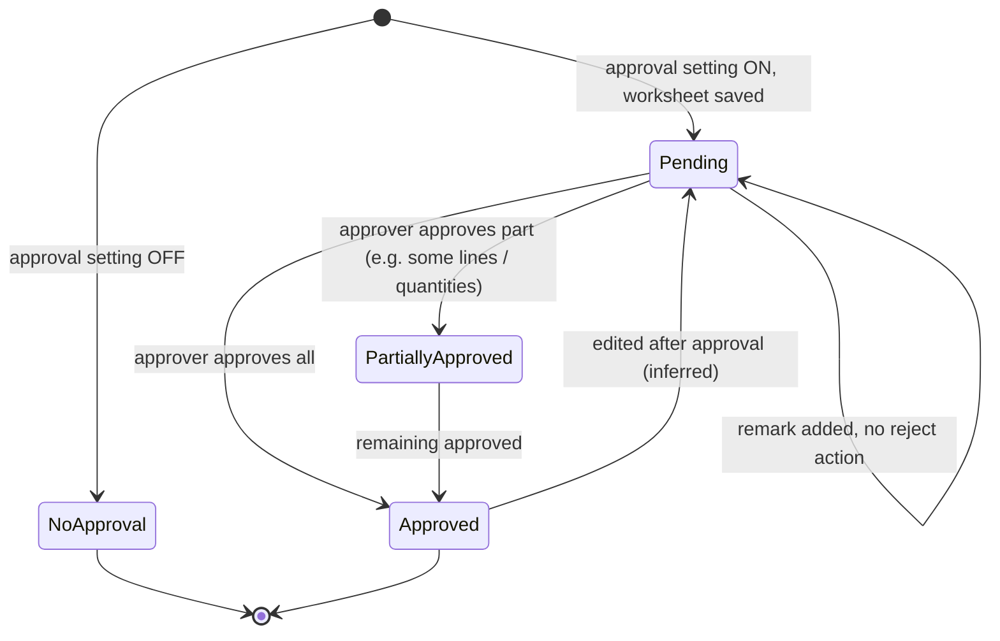
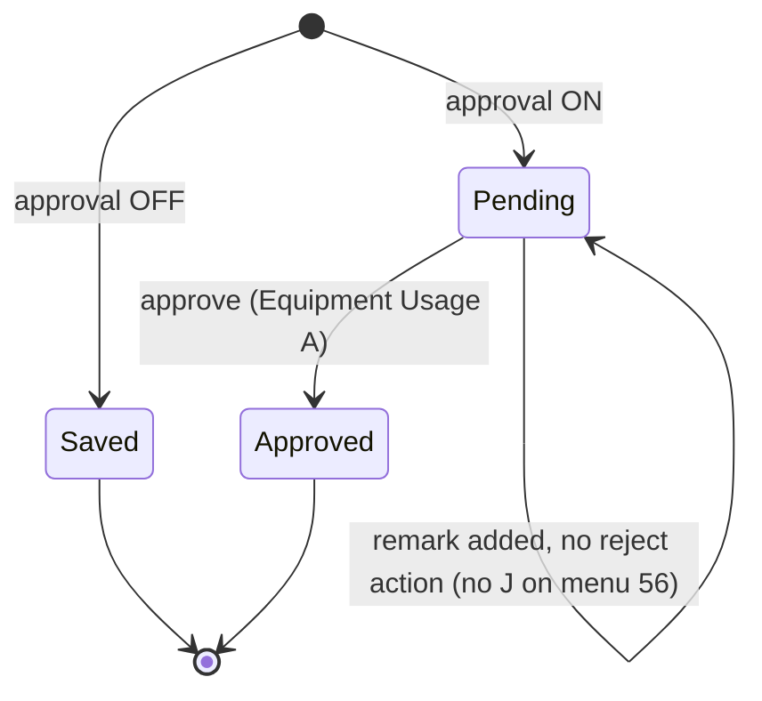
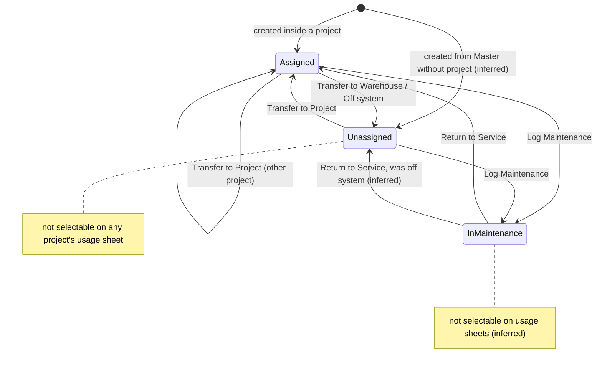
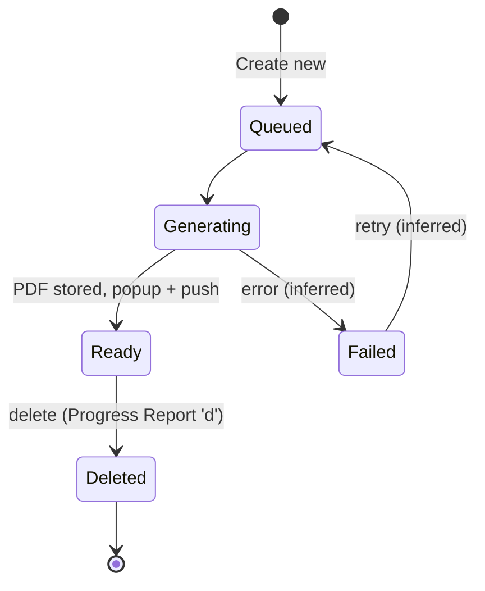

# 04 — Daily Site Work

Daily Site Work is the record of what happened on a project site on a given day. It covers four related things:

- **Daily Worksheet.** Each entry records work done at a location by a contractor's crew: the labour headcount, the approximate quantity of work done, the materials consumed and photos. Material consumption reduces project inventory.
- **Equipment Usage.** One usage sheet per equipment per day (or per shift). It applies to company-owned and rented plant, and records hours, distance or trips, idle and breakdown time, fuel, meter readings and hire cost.
- **Equipment lifecycle.** Equipment can move between projects and a warehouse, go into maintenance and come back. While it is unassigned or in maintenance it should not be selectable on a usage sheet.
- **Progress Reports.** The Daily Progress Report (DPR) and the Task Progress Report are generated in the background as PDFs from worksheets, equipment sheets and tasks.

Testing Reports (material tests such as RCC cube, steel, cement and bricks) belong to **03 Projects/Structure/Drawings/Gallery**. They show up in the back-dated-entry "Site" group next to this module, but they are documented in module 03.

**Who uses it**

| Role (seed designations)                                     | Use                                                                                                                                              |
| ------------------------------------------------------------ | ------------------------------------------------------------------------------------------------------------------------------------------------ |
| Site Engineer / Site Supervisor / Foreman                    | Fills worksheets and equipment usage sheets every day. Uploads photos. Records material used.                                                    |
| Project Manager / Construction Manager                       | Reviews and approves worksheets and equipment sheets. Generates the DPR. Checks contractor-wise labour on the dashboard.                         |
| Store Keeper                                                 | Watches how worksheet consumption reduces Current Inventory (module 06).                                                                         |
| Owner / Admin                                                | Configures the worksheet form (section visibility and order, approval on or off) and the equipment-sheet field toggles. Reads the dashboards.    |
| Accountant                                                   | Uses rented-equipment hire cost as the basis for payables (module 07). Uses the F (financial) permission on Equipment Usage and Progress Report. |
| Heavy Equipment Operator / Machine Operator / Crane Operator | Named as **Operator** on equipment usage sheets. They do not necessarily log in.                                                                 |

---

## Legacy behaviour

### Navigation

- Project Home tile **Daily Worksheet**. Project-level menu name: **Worksheet** (permission menu #19).
- Project Home tile **Equipment Usage** (menu #56). The Master tile **Equipments** (#22) holds the company equipment register (module 02).
- Project Home tile **Progress Report** (menu #73).
- Project Home tile **Reports** (#20). This report set includes Daily Work, Rented Equipment Usage and Company Owned Equipment Usage (module 11).
- Project Dashboard (`#/chartsDashboard`) has two sections fed by this module:
  - **Daily Work**: Total Labours Availability trend; Contractor-wise Labour (contractor, department, skilled, unskilled).
  - **Equipment Usage**: Top Equipment by Work Hours; Category-wise (Owned vs Rented).
- Project options menu **Backup** and the worksheet backup route `#/dailyWorkBackupRoute` (module 11).

### Daily Worksheet screens

| Route / screen                                                                                                                                     | Behaviour                                                                                                                                                                                                                                                                                                                                      |
| -------------------------------------------------------------------------------------------------------------------------------------------------- | ---------------------------------------------------------------------------------------------------------------------------------------------------------------------------------------------------------------------------------------------------------------------------------------------------------------------------------------------- |
| `#/worksheetList`                                                                                                                                  | List of worksheets for the project. **Search** by sheet number, name or date. **Filters**: Sheet Date, Filled By (team member), Department. A FAB opens Add Worksheet. A gear icon opens "Setting for the work item form".                                                                                                                     |
| Add / Edit Worksheet                                                                                                                               | A date stepper at the top moves the sheet date back and forward one day; back-dated rules apply (module 12). Sections are rendered in the configured order: **Location Details**, **Basic Details**, **Material Consumption**, **Other Details**. Buttons: **Save** and **Save & Add New** (save, then reopen a blank form).                   |
| Location Details                                                                                                                                   | Location Type is one of **Wing**, **Amenity** or **Common Development**. Wing → Floor(s) (multi-select) → Unit. Amenity → amenity picker. Common Development → picker. These come from module 03 (wings, floors, units) and module 02 (Amenities & Common Development). The Create Location menu (#74) covers projects that are not buildings. |
| Basic Details                                                                                                                                      | Contractor\*, Department\*, Work Type, Skilled Labours (count), Unskilled Labours (count), Work Shift\* (Shift 1 / Shift 2 / Shift 3), Approx Work Done (a value plus a unit select from Measurement Units).                                                                                                                                   |
| Material Consumption                                                                                                                               | **Bulk Select Materials** (multi-pick dialog), or add rows one at a time (Material, Used Qty, "+"). Saving creates material-consumed entries against project inventory (`MaterialConsumed/AddMultiple`).                                                                                                                                       |
| Other Details                                                                                                                                      | Remark (max 500 characters). Work Photos (multiple images, uploaded via `WorkSheetImages/Upload`).                                                                                                                                                                                                                                             |
| Worksheet detail / report row                                                                                                                      | Columns: Date, Department, Contractor, Skilled Workers, UnSkilled Workers, LocationType, Location, App. Work Done, TaskName, Shift, Work Images, Consumed Material, Labour Details.                                                                                                                                                            |
| Settings: "Setting for the work item form" (`WorkItem/GetSettings`, `WorkItem/SaveSettings`, `WorkItem/ColumnSettings`, `WorkItem/SaveFormConfig`) | Toggles to show or hide each section or field group: **Location Type**, **Work Type**, **Approx Work Done**, **Labour Details**, **Material consumption**, **Remark**, **Work Images**. A reorder list sets the section order (Location, Basic, Material Consumption, Other).                                                                  |
| Worksheet Approval Settings (`WorkItem/ApprovalSetting`, `approvalStatus: bool`)                                                                   | A switch for "approve worksheet" on or off. When it is on, worksheets carry the status **Pending**, **Partially Approved** or **Approved**.                                                                                                                                                                                                    |
| Approval actions (`WorkItem/SetStatus`, `WorkItem/Remark`, `WorkSheets/UpdateWorksheetCompletStatus`)                                              | Approve or reject with remarks. A separate completion-status update exists; see Open questions.                                                                                                                                                                                                                                                |
| Duplicate (`WorkItem/Duplicate`)                                                                                                                   | Copies an existing worksheet into a new one.                                                                                                                                                                                                                                                                                                   |
| Backup (`#/dailyWorkBackupRoute`)                                                                                                                  | Export of worksheet data and media for a date range (module 11).                                                                                                                                                                                                                                                                               |

### Equipment Usage screens

| Route / screen                                         | Behaviour                                                                                                                                                                                                                                                                                                                                                                                                                                                                            |
| ------------------------------------------------------ | ------------------------------------------------------------------------------------------------------------------------------------------------------------------------------------------------------------------------------------------------------------------------------------------------------------------------------------------------------------------------------------------------------------------------------------------------------------------------------------ |
| `#/EquipmentSheetList`                                 | List of usage sheets. **Search** by sheet number, name or date. **Filters**: Sheet Date, Filled By. FAB flow: **Select Equipment Type** (Company Owned or Rented) → **Select Equipment** (the project's equipment list, with "+" to add equipment inline).                                                                                                                                                                                                                           |
| `#/ownedEquipmentForm` (Add Equipment — Company Owned) | Equipment Name\*, Equipment Number\*, Purchase Year, Fuel Type, Unit (fuel unit). **Utilization Basis**: Hourly / Km / Trip. **Working Time Method**\*: Time Shifts (the engineer logs start and end per shift and hours are calculated), Meter Reading, or Both. **Target & Performance**: Target (hrs/day, days/month, Km/day or trips/day depending on basis), Min Utilization %, Expected Fuel Efficiency (L/hr; an alert fires when the burn rate exceeds it). Equipment Photo. |
| `#/rentedEquipmentForm` (Add Equipment — Rented)       | Same as the owned form, plus contractor/owner, rate and rented hours. **Hire Details**: Vendor, Hire basis (Daily / Monthly / Trip / Hourly), Rate, Chargeable, Hire amount.                                                                                                                                                                                                                                                                                                         |
| Usage sheet form                                       | Fields are shown according to the settings toggles listed below. The detail view shows: Equipment No, Operator, Supervisor, Utilisation (Usage hrs / Distance / Trips), Idle, Breakdown hours, Approx work done, Fuel Consume, Meter Reading (Both / Time Shifts), Target, Unit Rate, Hire Cost, Consumed Material, Images, Work Item, Department, Location, Contractor, Shift, Remark. The fuel section has **Fuel consumed** and **Borne by**.                                     |
| Usage-sheet settings (`v2/equipment-usage/settings`)   | Toggles: **Operator**, **Supervisor**, **Location Type**, **Approx Work Done**, **Rented hour**, **Add Fuel Consumption**, **Remarks**, **Upload File**, **Material consumption**, **Meter Readings**, **Breakdown Hours**, **Approval**.                                                                                                                                                                                                                                            |
| Duplicate (`v2/equipment-usage/duplicate`)             | Copies a sheet.                                                                                                                                                                                                                                                                                                                                                                                                                                                                      |
| Equipment Transfer                                     | Two options: **Transfer to Project** ("Another Project") or **Transfer to Warehouse** ("Warehouse / Off system"). Fields: Transfer Date\*, Destination Project\* (project transfers), Location Name\*, Remark. Shows "Effect on Tracking".                                                                                                                                                                                                                                           |
| Equipment statuses                                     | **Unassigned**, **In maintenance**. Being assigned to a project is implied (inferred).                                                                                                                                                                                                                                                                                                                                                                                               |
| Equipment detail actions                               | **Log Maintenance**, **Return to Service**, and a worksheet-availability toggle: **Mark unavailable for worksheet entry** / **Make it available for worksheet entry**. While unavailable, the detail shows the banner "Unavailable for worksheet entry — Since <date>".                                                                                                                                                                                                              |
| Maintenance log / report                               | A route exists ("maintenance log/report") and entries are created with **Log Maintenance**. The fields of a maintenance entry are not captured in the notes.                                                                                                                                                                                                                                                                                                                         |
| Equipment dashboard & reports                          | Usage, maintenance and transfer reports. The Transfer Report columns are: Equipment Name, Number, Purchase Year, Transfer Date, Location Before, Transfer To Project, Latest Location, Remarks, Entry By.                                                                                                                                                                                                                                                                            |

### Progress Report screens

| Route / screen               | Behaviour                                                                                                                                                                                                                                               |
| ---------------------------- | ------------------------------------------------------------------------------------------------------------------------------------------------------------------------------------------------------------------------------------------------------- |
| `#/progressReport`           | Two actions: **Create new** and **View Reports**. Report types: **Daily Progress Report** and **Task Progress Report**.                                                                                                                                 |
| Create Daily Progress Report | Pick a Date and Report Filled By. Option: "Include images in report". Generation runs in the background; the user sees "You will receive a popup once the report is ready" and a push notification arrives when it is done.                             |
| DPR PDF content              | Organisation, Project, Address, Report Filled By, Date, Total Skilled / Unskilled / Total Labour, Equipment Details, then the worksheets (per the worksheet report columns). The project logo appears when `useProjectLogoInReport` is set (module 03). |
| Task Progress Report         | Columns: duration, location, task, progress %. Tasks are owned by module 05.                                                                                                                                                                            |
| View Reports                 | A list of generated reports. They can be opened or downloaded and deleted (Progress Report has the D flag).                                                                                                                                             |

---

## Entities & fields

Types: `FK → X` is a reference. `enum{}` lists the observed values. Fields marked "(inferred)" do not appear verbatim in the notes.

### WorksheetFormSettings (per project — scope inferred)

| Field                   | Type                                                | Required | Notes                                                                 |
| ----------------------- | --------------------------------------------------- | -------- | --------------------------------------------------------------------- |
| id                      | uuid                                                | yes      |                                                                       |
| projectId               | FK → Project                                        | yes      | Company-wide vs per-project scope is not settled; see Open questions. |
| showLocationType        | bool                                                | yes      | Toggle "Location Type".                                               |
| showWorkType            | bool                                                | yes      | Toggle "Work Type".                                                   |
| showApproxWorkDone      | bool                                                | yes      | Toggle "Approx Work Done".                                            |
| showLabourDetails       | bool                                                | yes      | Toggle "Labour Details" (skilled and unskilled counts).               |
| showMaterialConsumption | bool                                                | yes      | Toggle "Material consumption".                                        |
| showRemark              | bool                                                | yes      | Toggle "Remark".                                                      |
| showWorkImages          | bool                                                | yes      | Toggle "Work Images".                                                 |
| sectionOrder            | enum[]{Location, Basic, MaterialConsumption, Other} | yes      | Reorderable (`WorkItem/SaveFormConfig`).                              |
| approvalEnabled         | bool                                                | yes      | `WorkItem/ApprovalSetting.approvalStatus`.                            |
| columnSettings          | json                                                | no       | `WorkItem/ColumnSettings`. List/report column visibility (inferred).  |

### Worksheet (Daily Worksheet; legacy "WorkItem")

| Field                 | Type                                       | Required    | Notes                                                                                                                                  |
| --------------------- | ------------------------------------------ | ----------- | -------------------------------------------------------------------------------------------------------------------------------------- |
| id                    | uuid                                       | yes         |                                                                                                                                        |
| projectId             | FK → Project                               | yes         |                                                                                                                                        |
| sheetNo               | string                                     | yes         | Searchable "sheet no". Not one of the configurable Sequence IDs (module 12), so it is probably a plain per-project counter (inferred). |
| sheetDate             | date                                       | yes         | Set from the date stepper. Subject to back-dated create and edit limits.                                                               |
| filledById            | FK → TeamMember                            | yes         | "Filled By" filter. The user who created the sheet.                                                                                    |
| locationType          | enum{Wing, Amenity, CommonDevelopment}     | conditional | Required when the Location section is shown (inferred).                                                                                |
| wingId                | FK → Wing                                  | conditional | When locationType = Wing.                                                                                                              |
| floorIds              | FK[] → Floor                               | conditional | Multi-select.                                                                                                                          |
| unitId                | FK → Unit                                  | no          | A single unit under the selected floor(s).                                                                                             |
| amenityId             | FK → DevelopmentType (type 2)              | conditional | When locationType = Amenity.                                                                                                           |
| commonDevelopmentId   | FK → DevelopmentType (type 1)              | conditional | When locationType = CommonDevelopment.                                                                                                 |
| locationId            | FK → Location                              | conditional | For non-building projects (Create Location menu #74) (inferred).                                                                       |
| contractorId          | FK → Contractor                            | yes         | `Contractor/Combo`. Should be filtered to contractors assigned to the project (inferred).                                              |
| departmentId          | FK → Department                            | yes         | `DepartmentWork/Combo`. Should be filtered to the contractor's departments (inferred from Contractor.departments).                     |
| workTypeId            | FK → WorkType                              | no          | Filtered by department (`WorkerType/Combo`). Optional and toggleable.                                                                  |
| skilledLabourCount    | int ≥ 0                                    | no          | "Skilled Labours".                                                                                                                     |
| unskilledLabourCount  | int ≥ 0                                    | no          | "Unskilled Labours".                                                                                                                   |
| workShift             | enum{Shift1, Shift2, Shift3}               | yes         | "Work Shift\*".                                                                                                                        |
| approxWorkDoneQty     | decimal(14,3)                              | no          | Value for "Approx Work Done".                                                                                                          |
| approxWorkDoneUomId   | FK → MeasurementUnit                       | conditional | Required if qty is given (inferred).                                                                                                   |
| taskId                | FK → Task                                  | no          | The report column "TaskName" suggests a link to a Task (module 05) (inferred).                                                         |
| remark                | text(500)                                  | no          |                                                                                                                                        |
| photos                | file[] (image)                             | no          | `WorkSheetImages/Upload`.                                                                                                              |
| approvalStatus        | enum{Pending, PartiallyApproved, Approved} | conditional | Only when approvalEnabled. Whether a Rejected state exists is open.                                                                    |
| completionStatus      | enum (values unknown)                      | no          | `WorkSheets/UpdateWorksheetCompletStatus` (sic).                                                                                       |
| duplicatedFromId      | FK → Worksheet                             | no          | Set by the Duplicate action (inferred).                                                                                                |
| createdAt / updatedAt | datetime                                   | yes         |                                                                                                                                        |

### WorksheetMaterialConsumption (line)

| Field                  | Type                      | Required | Notes                                                                                                                                      |
| ---------------------- | ------------------------- | -------- | ------------------------------------------------------------------------------------------------------------------------------------------ |
| id                     | uuid                      | yes      |                                                                                                                                            |
| worksheetId            | FK → Worksheet            | yes      |                                                                                                                                            |
| materialId             | FK → Material             | yes      | Picked one at a time or via Bulk Select Materials. Work Type ↔ material assignment (`WorkerType/AssignItem`) narrows the list (module 02). |
| usedQty                | decimal(14,3)             | yes      | > 0.                                                                                                                                       |
| uomId                  | FK → MeasurementUnit      | yes      | Defaults to the material's `defaultUoMId`.                                                                                                 |
| inventoryLedgerEntryId | FK → InventoryLedgerEntry | yes      | The Consumed entry created in module 06 (`MaterialConsumed`).                                                                              |

### WorksheetRemark / approval action

| Field       | Type                                          | Required    | Notes                                                               |
| ----------- | --------------------------------------------- | ----------- | ------------------------------------------------------------------- |
| id          | uuid                                          | yes         |                                                                     |
| worksheetId | FK → Worksheet                                | yes         |                                                                     |
| action      | enum{Remark, Approve, PartialApprove, Reject} | yes         | `WorkItem/SetStatus`, `WorkItem/Remark`. The value set is inferred. |
| remark      | text                                          | conditional |                                                                     |
| byId        | FK → TeamMember                               | yes         |                                                                     |
| at          | datetime                                      | yes         |                                                                     |

### Equipment (project-level view of the module 02 master)

The master record lives in module 02 with these fields: Equipment Name\*, Contractor Name\* (owner/renter), Equipment Number\*, Fuel Type, Fuel Measurement Unit, Contact Person Name/Number and Company Name. The project-level owned and rented forms add the fields below.

| Field                                   | Type                                                 | Required     | Notes                                                                                                                                                        |
| --------------------------------------- | ---------------------------------------------------- | ------------ | ------------------------------------------------------------------------------------------------------------------------------------------------------------ |
| id                                      | uuid                                                 | yes          |                                                                                                                                                              |
| ownership                               | enum{CompanyOwned, Rented}                           | yes          | Chosen in "Select Equipment Type".                                                                                                                           |
| name                                    | string                                               | yes          |                                                                                                                                                              |
| equipmentNumber                         | string                                               | yes          | Registration or asset number. Unique per company (inferred).                                                                                                 |
| purchaseYear                            | int (YYYY)                                           | no           | Owned only.                                                                                                                                                  |
| fuelTypeId                              | FK → FuelType {CNG, Diesel, Petrol}                  | no           |                                                                                                                                                              |
| fuelUnitId                              | FK → FuelUnit {Barrel, Gallon, Kg, Litre, Unit}      | no           |                                                                                                                                                              |
| utilizationBasis                        | enum{Hourly, Km, Trip}                               | yes          | Decides whether utilisation is captured as hours, distance or trips.                                                                                         |
| workingTimeMethod                       | enum{TimeShifts, MeterReading, Both}                 | yes          | "Meter Reading (Both / Time Shifts)".                                                                                                                        |
| targetValue                             | decimal(10,2)                                        | no           | Target hrs/day, days/month, Km/day or trips/day.                                                                                                             |
| targetUnit                              | enum{HrsPerDay, DaysPerMonth, KmPerDay, TripsPerDay} | conditional  |                                                                                                                                                              |
| minUtilizationPct                       | decimal(5,2)                                         | no           | 0–100.                                                                                                                                                       |
| expectedFuelEfficiency                  | decimal(10,3)                                        | no           | L/hr (or per km/trip, inferred). An alert fires when actual burn exceeds it.                                                                                 |
| photo                                   | file (image)                                         | no           |                                                                                                                                                              |
| contractorId                            | FK → Contractor                                      | yes (master) | Owner or renter per the master. For rented equipment, the "contractor/owner".                                                                                |
| contactPersonName / contactPersonNumber | string                                               | no           | Master.                                                                                                                                                      |
| companyName                             | string                                               | no           | Master.                                                                                                                                                      |
| currentProjectId                        | FK → Project                                         | no           | Null when at a warehouse or off system (inferred).                                                                                                           |
| status                                  | enum{Assigned, Unassigned, InMaintenance}            | yes          | "Unassigned" and "In maintenance" are observed. "Assigned" is inferred. **Log Maintenance** gives InMaintenance. **Return to Service** leaves InMaintenance. |
| availableForWorksheet                   | bool                                                 | yes          | Toggled by "Mark unavailable for worksheet entry" / "Make it available for worksheet entry". Independent of status.                                          |
| unavailableSince                        | date                                                 | conditional  | Set when marked unavailable. Shown as "Unavailable for worksheet entry — Since <date>".                                                                      |

### EquipmentHireDetails (rented only)

| Field       | Type                               | Required | Notes                                                        |
| ----------- | ---------------------------------- | -------- | ------------------------------------------------------------ |
| equipmentId | FK → Equipment                     | yes      |                                                              |
| vendorId    | FK → Vendor or Contractor          | yes      | Labelled "Vendor". Which master it points to is open.        |
| hireBasis   | enum{Daily, Monthly, Trip, Hourly} | yes      |                                                              |
| rate        | decimal(14,2)                      | yes      | Per hire-basis unit.                                         |
| chargeable  | bool                               | no       | Label "Chargeable". Meaning not settled; see Open questions. |
| hireAmount  | decimal(14,2)                      | no       | Computed or entered.                                         |
| rentedHours | decimal(10,2)                      | no       | "rented hours" on the rented form.                           |

### EquipmentUsageSettings (`v2/equipment-usage/settings`)

| Field                   | Type         | Required | Notes                   |
| ----------------------- | ------------ | -------- | ----------------------- |
| projectId               | FK → Project | yes      | Scope inferred.         |
| showOperator            | bool         | yes      |                         |
| showSupervisor          | bool         | yes      |                         |
| showLocationType        | bool         | yes      |                         |
| showApproxWorkDone      | bool         | yes      |                         |
| showRentedHour          | bool         | yes      |                         |
| showFuelConsumption     | bool         | yes      | "Add Fuel Consumption". |
| showRemarks             | bool         | yes      |                         |
| showUploadFile          | bool         | yes      |                         |
| showMaterialConsumption | bool         | yes      |                         |
| showMeterReadings       | bool         | yes      |                         |
| showBreakdownHours      | bool         | yes      |                         |
| approvalEnabled         | bool         | yes      | "Approval".             |

### EquipmentUsageSheet

| Field                        | Type                                 | Required    | Notes                                                                                                                                                                       |
| ---------------------------- | ------------------------------------ | ----------- | --------------------------------------------------------------------------------------------------------------------------------------------------------------------------- |
| id                           | uuid                                 | yes         |                                                                                                                                                                             |
| projectId                    | FK → Project                         | yes         |                                                                                                                                                                             |
| sheetNo                      | string                               | yes         | Searchable. Numbering scheme unknown.                                                                                                                                       |
| sheetDate                    | date                                 | yes         | Back-dated control: "Equipment Usage".                                                                                                                                      |
| equipmentId                  | FK → Equipment                       | yes         | Must be assigned to this project and not in maintenance (inferred).                                                                                                         |
| ownership                    | enum{CompanyOwned, Rented}           | yes         | Copied from the equipment (it drives two separate reports).                                                                                                                 |
| filledById                   | FK → TeamMember                      | yes         |                                                                                                                                                                             |
| operatorName / operatorId    | string or FK → Labour/TeamMember     | toggle      | Whether this is free text or a reference is open.                                                                                                                           |
| supervisorId                 | FK → TeamMember                      | toggle      | `Supervisor/Combo`.                                                                                                                                                         |
| contractorId                 | FK → Contractor                      | no          |                                                                                                                                                                             |
| departmentId                 | FK → Department                      | no          |                                                                                                                                                                             |
| workItem                     | string or FK → Worksheet             | no          | Label "Work Item". It may link to a worksheet (inferred).                                                                                                                   |
| locationType + location refs | as Worksheet                         | toggle      |                                                                                                                                                                             |
| shift                        | enum{Shift1, Shift2, Shift3}         | no          |                                                                                                                                                                             |
| usageHours                   | decimal(8,2)                         | conditional | When utilizationBasis = Hourly. Calculated from shift times or meter readings.                                                                                              |
| distanceKm                   | decimal(10,2)                        | conditional | Basis = Km.                                                                                                                                                                 |
| trips                        | int                                  | conditional | Basis = Trip.                                                                                                                                                               |
| idleHours                    | decimal(8,2)                         | no          | "Idle".                                                                                                                                                                     |
| breakdownHours               | decimal(8,2)                         | toggle      | "Breakdown Hours".                                                                                                                                                          |
| approxWorkDoneQty / Uom      | decimal(14,3) / FK → MeasurementUnit | toggle      |                                                                                                                                                                             |
| rentedHours                  | decimal(8,2)                         | toggle      | "Rented hour". Rented only.                                                                                                                                                 |
| unitRate                     | decimal(14,2)                        | conditional | Rented. Defaults from the hire rate.                                                                                                                                        |
| hireCost                     | decimal(14,2)                        | conditional | Rented. unitRate × billable quantity (inferred).                                                                                                                            |
| fuelConsumedQty              | decimal(10,3)                        | toggle      | "Fuel Consume". Unit = the equipment's fuel unit.                                                                                                                           |
| fuelBorneBy                  | enum                                 | no          | "Borne by" in the fuel section, next to "Fuel consumed". The option values were not captured; likely Company vs Owner/Vendor (inferred). Matters for rented equipment cost. |
| remark                       | text                                 | toggle      |                                                                                                                                                                             |
| files                        | file[]                               | toggle      | "Upload File" / Images.                                                                                                                                                     |
| approvalStatus               | enum{Pending, Approved}              | conditional | Only when approvalEnabled. Equipment Usage (#56) carries A (approve) but not J (reject), so there is no reject action. A Rejected state is not expected.                    |
| duplicatedFromId             | FK → EquipmentUsageSheet             | no          | `v2/equipment-usage/duplicate` (inferred).                                                                                                                                  |

### EquipmentTimeShift (child of a usage sheet; Working Time Method includes TimeShifts)

| Field        | Type                     | Required | Notes                                                      |
| ------------ | ------------------------ | -------- | ---------------------------------------------------------- |
| id           | uuid                     | yes      |                                                            |
| usageSheetId | FK → EquipmentUsageSheet | yes      |                                                            |
| startTime    | time                     | yes      |                                                            |
| endTime      | time                     | yes      | Later than start. Crossing midnight is allowed (inferred). |
| hours        | decimal(6,2)             | yes      | Auto-calculated.                                           |

### EquipmentMeterReading (Working Time Method includes MeterReading)

| Field          | Type                     | Required | Notes                                                                                |
| -------------- | ------------------------ | -------- | ------------------------------------------------------------------------------------ |
| usageSheetId   | FK → EquipmentUsageSheet | yes      |                                                                                      |
| openingReading | decimal(12,2)            | yes      | Hour meter or odometer. Defaults to the previous sheet's closing reading (inferred). |
| closingReading | decimal(12,2)            | yes      | Must be ≥ opening.                                                                   |
| reading delta  | decimal(12,2)            | derived  | Usage hours or km.                                                                   |

### EquipmentUsageMaterialConsumption (line)

Same shape as WorksheetMaterialConsumption, with usageSheetId instead of worksheetId. The "Material consumption" toggle and the "Consumed Material" column suggest it also posts to inventory (inferred).

### EquipmentTransfer

| Field                | Type                         | Required    | Notes                                                                                               |
| -------------------- | ---------------------------- | ----------- | --------------------------------------------------------------------------------------------------- |
| id                   | uuid                         | yes         |                                                                                                     |
| equipmentId          | FK → Equipment               | yes         |                                                                                                     |
| transferType         | enum{ToProject, ToWarehouse} | yes         | "Transfer to Project" / "Transfer to Warehouse" ("Warehouse / Off system").                         |
| transferDate         | date                         | yes         |                                                                                                     |
| fromProjectId        | FK → Project                 | no          | Reported as "Location Before".                                                                      |
| destinationProjectId | FK → Project                 | conditional | Required for ToProject.                                                                             |
| locationName         | string                       | yes         | "Location Name\*". Free text for the warehouse or site area.                                        |
| remark               | text                         | no          |                                                                                                     |
| entryById            | FK → TeamMember              | yes         | "Entry By".                                                                                         |
| effectOnTracking     | text/derived                 | —           | The UI explains that the equipment stops appearing on the source project's usage sheets (inferred). |

### EquipmentMaintenanceLog (the **Log Maintenance** and **Return to Service** actions are observed; the field list below is inferred)

| Field                         | Type           | Required | Notes                                                                                     |
| ----------------------------- | -------------- | -------- | ----------------------------------------------------------------------------------------- |
| id                            | uuid           | yes      |                                                                                           |
| equipmentId                   | FK → Equipment | yes      |                                                                                           |
| startDate                     | date           | yes      | Set by Log Maintenance. Equipment status → InMaintenance.                                 |
| endDate / returnedToServiceOn | date           | no       | Set by Return to Service. Status → Assigned or Unassigned (the target state is inferred). |
| description                   | text           | no       | (inferred)                                                                                |
| cost                          | decimal(14,2)  | no       | (inferred). Would feed module 07.                                                         |
| attachments                   | file[]         | no       | (inferred)                                                                                |

### ProgressReport

| Field                     | Type                                    | Required    | Notes                                                                        |
| ------------------------- | --------------------------------------- | ----------- | ---------------------------------------------------------------------------- |
| id                        | uuid                                    | yes         |                                                                              |
| projectId                 | FK → Project                            | yes         |                                                                              |
| type                      | enum{DailyProgress, TaskProgress}       | yes         |                                                                              |
| reportDate                | date                                    | conditional | DPR.                                                                         |
| fromDate / toDate         | date                                    | conditional | Task Progress Report "duration".                                             |
| filledById                | FK → TeamMember                         | conditional | DPR "Report Filled By". It filters which worksheets are included (inferred). |
| includeImages             | bool                                    | yes         | "Include images in report".                                                  |
| status                    | enum{Queued, Generating, Ready, Failed} | yes         | (inferred). Generation is asynchronous.                                      |
| file                      | file (PDF)                              | no          | Set when Ready.                                                              |
| requestedById             | FK → TeamMember                         | yes         |                                                                              |
| requestedAt / completedAt | datetime                                |             |                                                                              |

---

## Workflows & states

### W1 — Configure the worksheet form (Owner/Admin)

1. On `#/worksheetList`, tap the gear icon to open "Setting for the work item form".
2. Toggle sections or fields: Location Type, Work Type, Approx Work Done, Labour Details, Material consumption, Remark, Work Images.
3. Drag to reorder the sections Location / Basic / Material Consumption / Other.
4. Worksheet Approval Settings: turn "approve worksheet" on or off.
5. Save (`WorkItem/SaveSettings`, `WorkItem/SaveFormConfig`, `WorkItem/ApprovalSetting`). The settings apply to new and edited worksheets.

### W2 — Fill a Daily Worksheet (Site Engineer)

1. `#/worksheetList` → FAB.
2. Choose the sheet date with the date stepper. It defaults to today. Earlier dates are allowed only within the back-dated create window.
3. Location Details: pick a Location Type, then Wing → Floor(s) → Unit, or an Amenity, or a Common Development.
4. Basic Details: Contractor\* → Department\* → Work Type. Enter the skilled and unskilled counts, choose the Work Shift\*, and enter Approx Work Done with its unit.
5. Material Consumption: Bulk Select Materials, or add rows. For each, enter Used Qty. The current stock is shown (inferred from `Inventory/GetAvailableStock`).
6. Other Details: Remark and Work Photos.
7. **Save** returns to the list. **Save & Add New** saves and opens a blank form. Keeping the date and location is a candidate improvement.
8. On save, each consumption line posts a **Consumed** ledger entry to Current Inventory (module 06), and project stock goes down.
9. If approval is enabled, the worksheet starts in **Pending**.

### W3 — Approve a worksheet

1. An approver with the Daily Worksheet A flag opens the worksheet.
2. They approve or partially approve, optionally with a remark (`WorkItem/SetStatus`, `WorkItem/Remark`). There is no reject action: Daily Worksheet (#19) has A but not J.
3. The status becomes Approved or Partially Approved. An approver who disagrees leaves a remark and the sheet stays Pending (inferred).

### W4 — Duplicate a worksheet

1. Row action Duplicate (`WorkItem/Duplicate`) opens a new worksheet prefilled from the source.
2. Whether the date resets to today and whether material lines are copied is unknown. The rebuild should reset the date and copy lines as a draft.

### W5 — Add project equipment

1. `#/EquipmentSheetList` → FAB → Select Equipment Type: **Company Owned** or **Rented**.
2. Select Equipment from the project list, or "+" to add one (`#/ownedEquipmentForm` / `#/rentedEquipmentForm`).
3. Owned: identity, fuel, utilisation basis, working time method, target and performance, photo.
4. Rented: the same, plus owner/contractor, Hire Details (vendor, basis, rate, chargeable, hire amount) and rented hours.

### W6 — Fill an Equipment Usage sheet

1. Pick the equipment. Its utilisation basis and working time method decide which inputs appear.
2. Enter the date, operator, supervisor, location, contractor, department, work item and shift (depending on toggles).
3. Utilisation:
   - **Time Shifts**: add one or more start/end pairs. Hours are summed.
   - **Meter Reading**: opening and closing. The delta is hours or km.
   - **Both**: capture both. A mismatch is shown (inferred).
   - **Km** basis: distance. **Trip** basis: trip count.
4. Idle hours and breakdown hours.
5. **Fuel consumed** and **Borne by** (who bears the fuel cost). Compare it with Expected Fuel Efficiency and alert if exceeded.
6. Approx work done, material consumption, files and remark.
7. Rented: unit rate defaults from the hire rate, and Hire Cost is calculated.
8. Save. If approval is enabled, the status is Pending.

### W7 — Equipment lifecycle (transfer and maintenance)

1. **Transfer to Project**: Transfer Date\*, Destination Project\*, Location Name\*, Remark. The equipment leaves the source project's selectable list and appears in the destination's ("Effect on Tracking").
2. **Transfer to Warehouse**: Transfer Date\*, Location Name\*, Remark. The status becomes **Unassigned** ("Warehouse / Off system").
3. **Log Maintenance**: opens a maintenance-log entry. The status becomes **In maintenance**. Whether this alone blocks usage sheets is inferred.
4. **Return to Service**: closes the maintenance entry. The equipment goes back to its project, or to Unassigned if it was off system (the target state is inferred).
5. **Mark unavailable for worksheet entry**: the equipment is excluded from usage-sheet entry, and the detail shows "Unavailable for worksheet entry — Since <date>". **Make it available for worksheet entry** reverses this. The flag is independent of the transfer and maintenance status.
6. Every movement appears in the Transfer Report (Location Before → Latest Location).

### W8 — Generate a Daily Progress Report

1. `#/progressReport` → Create new → Daily Progress Report.
2. Choose the Date and Report Filled By, and optionally tick "Include images in report".
3. Submit. The job is queued. The UI shows "You will receive a popup once the report is ready."
4. The server assembles the header (Organisation, Project, Address, Filled By, Date), the labour totals (sum of skilled and unskilled across that day's worksheets), Equipment Details (that day's usage sheets) and the worksheet rows (with images if requested).
5. A push notification / popup fires (N flag). The report appears under View Reports.

### W9 — Generate a Task Progress Report

1. Create new → Task Progress Report. Choose the duration (from/to) and optionally a location.
2. Asynchronous generation as in W8. Output: task, location, progress %, duration (data from module 05).

---

## Business rules & validations

**Worksheet**

- Contractor, Department and Work Shift are required. When the Location section is shown, Location Type is required, along with the leaf it implies (inferred).
- Department options are limited to the selected contractor's departments. Work Type options are limited to the selected department (Work Type has Department\*) (inferred).
- Contractors offered are those assigned to the project in Project → Resources (inferred).
- Labour counts are whole numbers ≥ 0. If Labour Details is shown, at least one count should be > 0 (inferred; not enforced in legacy as far as is known).
- If Approx Work Done is entered, its unit is required.
- Remark is at most 500 characters.
- Material consumption lines need a material and a used quantity > 0. Each line creates a **Consumed** inventory ledger entry for the project. Editing or deleting the worksheet must reverse or adjust those entries (inferred; legacy allows editing and deleting inventory history entries).
- **Stock check**: whether consumption above available stock is blocked is unknown. `Inventory/GetAvailableStock` is called, which suggests a warning. See Open questions.
- Hidden sections are neither validated nor stored. Toggling a section off does not delete existing data (inferred).
- Section order is a display concern only.
- **Back-dated entry** (module 12, group "Site", module key Daily Worksheet): creating sheets older than N days is blocked unless the user's designation is in the override list. Editing sheets older than N days is restricted the same way. Nothing can be created or edited before the financial closing date. Per-user `backdatedCreateDays` and `backdatedEditDays` also apply.
- **Approval gate**: when approval is enabled, only users with Daily Worksheet A can change the status. Editing an approved sheet should require U and send it back to Pending (inferred).
- Dirty-form guard: leaving the form with unsaved changes asks "Discard changes?" (a standard legacy pattern; inferred for this screen).
- Daily Worksheet (#19) has no V (view all) flag, so everyone with R sees all of the project's sheets (inferred).

**Equipment / usage**

- Equipment Name\*, Equipment Number\*, Contractor Name\* (master), Utilization Basis and Working Time Method\* are required.
- Equipment Number should be unique per company (inferred).
- Time shifts: end > start for each shift, and shifts must not overlap within a sheet (inferred). Hours are auto-calculated.
- Meter reading: closing ≥ opening. Opening defaults to the last closing reading. A gap between sheets is flagged (inferred).
- Usage hours + idle + breakdown should not exceed 24 per day (inferred).
- Fuel efficiency alert: when fuelConsumed ÷ usageHours > Expected Fuel Efficiency, raise an alert (notification, N flag).
- Utilisation below Min Utilization % against Target is flagged on the dashboard (inferred).
- Rented: Hire Cost = Unit Rate × billable quantity for the hire basis (hours, trips, days; monthly is pro-rated) (inferred).
- Equipment marked "Unavailable for worksheet entry" cannot be selected for a usage sheet. Only equipment currently assigned to the project and not In maintenance should be selectable (inferred).
- Transfer: Transfer Date\*, Location Name\* and (for project transfers) Destination Project\* are required. The destination must differ from the source. The transfer date cannot be earlier than the last usage sheet date on the source project (inferred).
- Back-dated control applies (module key Equipment Usage).
- The fields shown are governed by `v2/equipment-usage/settings`. The approval gate applies when the Approval toggle is on.

**Progress reports**

- The DPR needs a date. Filled By is optional and narrows the report (inferred).
- Generation is asynchronous. The user is notified on completion and must not be blocked.
- Including images can make the PDF large. A size or page cap is open.
- Only users with Progress Report C can generate and only those with D can delete. F (financial) hides or shows cost values such as hire cost (inferred).

---

## Permissions

From `RolePermissions/DefaultMenuPermission/GetAllV3`, decoded with the legend in `_working-notes.md`:

| Letter | Meaning        | Letter | Meaning      |
| ------ | -------------- | ------ | ------------ |
| C      | create         | N      | notification |
| R      | read           | V      | view all     |
| U      | update         | T      | transfer     |
| D      | delete         | O      | report       |
| A      | approve        | F      | financial    |
| J      | reject         | E      | export       |
| P      | print/download | I      | import       |

The UI matrix columns are ADD, VIEW, EDIT, DELETE, APPROVE, REJECT, DOWNLOAD, REPORT, VIEW ALL, NOTIFICATION, TRANSFER, FINANCIAL.

| Menu (id)                               | Flags             | Effect in this module                                                                                                                                                                                                                                                                                                         |
| --------------------------------------- | ----------------- | ----------------------------------------------------------------------------------------------------------------------------------------------------------------------------------------------------------------------------------------------------------------------------------------------------------------------------- |
| Daily Worksheet (#19)                   | C R U D A P N O   | Create, view, edit and delete sheets. **A** = approve or partially approve. There is **no J (reject)** flag, which matches the status set Pending / Partially Approved / Approved having no Rejected state. **P** = download/print. **N** = notified of new sheets and approvals. **O** = Daily Work report. No V, F, E or I. |
| Equipment Usage (#56)                   | C R U D A P N O F | Same as Daily Worksheet (no J), plus **F** = see unit rate, hire cost and other financial values.                                                                                                                                                                                                                             |
| Equipments (#22, master)                | C R U D P N T O F | **T** = transfer equipment between projects or to a warehouse. **F** = hire rates. **O** = reports (usage, maintenance, transfer). **N** = equipment notifications (for example, fuel-efficiency alerts, inferred).                                                                                                           |
| Progress Report (#73)                   | C R D N F         | Generate (C), view (R), delete (D), get the ready popup/push (N), include financial data (F, inferred). There is no U, because reports are immutable.                                                                                                                                                                         |
| Reports (#20)                           | R P               | Project report set: Daily Work, Rented / Company Owned Equipment Usage.                                                                                                                                                                                                                                                       |
| Dashboard (#65)                         | R                 | Daily Work and Equipment Usage dashboard sections.                                                                                                                                                                                                                                                                            |
| Create Wing (#6), Create Location (#74) | C R U D           | Provide the location pickers (module 03).                                                                                                                                                                                                                                                                                     |
| Current Inventory (#16)                 | C R U D P N O     | Consumption posting relies on inventory create rights. Whether a worksheet author needs #16 C is open.                                                                                                                                                                                                                        |

Back-dated limits come from the user permission row (`backdatedCreateDays`, `backdatedEditDays`, `financialClosingDate`) and from module 12 settings.

---

## Relationships

- → depends on **01 Organization/Identity/Access**: team members (Filled By, Supervisor, approvers), permission flags, designation-based back-dated overrides.
- → depends on **02 Master Records**: Contractors, Departments, Work Types (and their assigned materials), Materials, Measurement Units, Equipments, Fuel Types and Units, Amenities & Common Development, Labour Categories (operators, inferred), Vendors (hire vendor, inferred).
- → depends on **03 Projects/Structure/Drawings/Gallery**: project, project resources (assigned contractors and equipment), Phases → Wings → Floors → Units, Locations, project logo for reports. Testing Reports live in 03. Worksheet and usage-sheet photos likely surface in the project **Gallery** (inferred).
- → depends on **12 Settings**: back-dated entry control (Site group: Daily Worksheet, Equipment Usage), worksheet form config, financial closing date.
- ← used by **05 Tasks/Issues/Inspections**: worksheets may reference a Task (TaskName column). The Task Progress Report reads task progress.
- ← used by / writes to **06 Procurement & Inventory**: worksheet and equipment-sheet material consumption creates Consumed entries in Current Inventory and the Stock Register.
- ← used by **07 Payments & Accounting**: rented-equipment hire cost and fuel are the basis for contractor/vendor payables (inferred). Maintenance cost goes to expenses (inferred).
- ← used by **08 Labour & Vendor Attendance**: contractor-wise skilled and unskilled counts complement the labour and vendor attendance figures. The two are not reconciled in legacy (inferred).
- ← used by **11 Reports/Dashboards/Backup**: Daily Work report, Rented / Company Owned Equipment Usage reports, Project Dashboard (Daily Work, Equipment Usage), worksheet backup, Project All Media.
- ← used by **13 Chat/Notifications/Support**: "report ready" popups, approval and new-sheet notifications, fuel-efficiency alerts.

---

## Reports & exports

| Report                                      | Source                        | Format                 | Notes                                                                                                                                                                                                                                              |
| ------------------------------------------- | ----------------------------- | ---------------------- | -------------------------------------------------------------------------------------------------------------------------------------------------------------------------------------------------------------------------------------------------- |
| Daily Work report                           | Worksheets                    | PDF / Excel            | Columns: Date, Department, Contractor, Skilled Workers, UnSkilled Workers, LocationType, Location, App. Work Done, TaskName, Shift, Work Images, Consumed Material, Labour Details. Header: Organisation, Project, Address, Duration, Page x of y. |
| Daily Progress Report (DPR)                 | Worksheets + equipment sheets | PDF (async)            | Organisation, Project, Address, Report Filled By, Date, skilled/unskilled/total labour, Equipment Details, worksheets, optional images.                                                                                                            |
| Task Progress Report                        | Tasks (module 05)             | PDF (async)            | Duration, location, task, progress %.                                                                                                                                                                                                              |
| Company Owned Equipment Usage report        | Usage sheets (owned)          | PDF / Excel            |                                                                                                                                                                                                                                                    |
| Rented Equipment Usage report               | Usage sheets (rented)         | PDF / Excel            | Includes hire cost (needs F).                                                                                                                                                                                                                      |
| Equipment maintenance report                | Maintenance log               | PDF / Excel (inferred) |                                                                                                                                                                                                                                                    |
| Equipment Transfer Report                   | Transfers                     | PDF / Excel            | Equipment Name, Number, Purchase Year, Transfer Date, Location Before, Transfer To Project, Latest Location, Remarks, Entry By.                                                                                                                    |
| Equipment dashboard                         | Usage sheets                  | Charts                 | Top Equipment by Work Hours; Owned vs Rented.                                                                                                                                                                                                      |
| Daily Work dashboard                        | Worksheets                    | Charts                 | Total Labours Availability trend; Contractor-wise Labour (contractor, department, skilled, unskilled).                                                                                                                                             |
| Worksheet backup (`#/dailyWorkBackupRoute`) | Worksheets + media            | Archive                | Data Backup / Media Backup by date range; async, emailed/OTP-protected (module 11).                                                                                                                                                                |

---

## Rebuild recommendations

1. **The DPR should be a real site diary.** The research describes the site diary as a serially numbered record of weather, manpower by trade, plant, materials received and consumed, work done by location, visitors and instructions (research §3 "DPR / site diary / hindrance register"). Legacy DPR only has labour totals, equipment and worksheets. Add weather, visitors/instructions and materials received that day (from GRNs, module 06), and give the DPR a per-project serial number.
2. **Add a Hindrance register.** Record date, cause, affected activity/location, duration and responsible party, with joint sign-off. It is the evidence base for extension-of-time and 10CC escalation claims (research §3, §5 "Hindrance register and site diary with joint sign-off"). Link equipment breakdown hours and idle reasons to hindrance entries.
3. **Structure "Approx Work Done" against BOQ / Task quantities.** Instead of a free value plus unit, let a worksheet line point at a Task or BOQ item (module 05) so measured quantity rolls up into task progress and earned value. This is also the input for Measurement Book / JMR and RA bills (research §3 "Measurement Book (MB) and RA bills"). Keep the free-form value for crews without a BOQ.
4. **Material reconciliation per contractor.** Worksheet consumption is already tagged with the contractor. Combine it with work done × rate-analysis coefficients to produce theoretical vs actual consumption and the variance against permissible wastage (often 2–5%), recovered at a penal rate (research §3 "Material reconciliation"). This needs consumption stored as immutable ledger entries, not editable history rows.
5. **Labour counts by category, reconciled with attendance.** Replace the two counts (skilled/unskilled) with counts per Labour Category, and show the difference against module 08 labour/vendor attendance for the same contractor and date. Statutory registers (Form XVI/XVII) come from attendance, not worksheets (research §2 "Labour and welfare"), but the DPR should not contradict them.
6. **Rented equipment cost should flow into payables with TDS.** Hire of plant and machinery is TDS u/s 194I at 2% above ₹6L/yr (research §2 TDS table). Approved usage sheets should accumulate a hire bill per vendor per period (module 07), with fuel-borne-by deciding who pays for fuel.
7. **Offline-first, fewer taps.** Site entry needs offline capture with auto-sync for basements and remote sites, and "prefilled from yesterday" one-tap repeat entries (research §4 items 2, §5 differentiator 2). Make Duplicate the default ("copy yesterday's sheet for this contractor") and keep the date and location on Save & Add New.
8. **Geo-tagged, drawing-pinned photos.** Store EXIF/GPS and the capture time on work photos, and allow pinning a photo to a location on a project drawing (module 03). Reviewers asked to "tap a drawing to update work done" (research §4 items 5 and 8). This later feeds RERA physical % complete per wing (research §2 RERA).
9. **WhatsApp submission.** Allow supervisors to submit DPR photos and labour counts through a WhatsApp Business bot (research §4 item 1, §5 differentiator 1). Model worksheets so a partial entry (photo + location + contractor) is valid as a draft.
10. **Approval model.** Replace the bool switch and three statuses with an explicit state machine (Draft → Submitted → Approved / Rejected / PartiallyApproved) with reasons, and a per-line approval for partial approval. Optional multi-level approval is something Onsite Business+ sells (research §1 table).
11. **Audit trail and soft delete.** Worksheets and usage sheets change inventory and cost, so keep an append-only audit log (who, what, before/after) and soft-delete with automatic reversal of inventory postings. Edits after approval or after the financial closing date must be blocked by the module 12 rules on the server, not only in the UI.
12. **Equipment as an asset register.** Add a maintenance schedule (hours/km-based service intervals from meter readings), maintenance cost and downtime on Log Maintenance / Return to Service, and server-side (not only UI) exclusion of equipment marked unavailable for worksheet entry. Use fuel issue from inventory (diesel as a material) so fuel consumed reconciles with fuel stock.
13. **Typed async report jobs.** Model reports as a job table (Queued/Generating/Ready/Failed) with retry, an expiry for stored PDFs, an image-size budget, and push plus in-app notification. Keep generated PDFs immutable and regenerate on demand.
14. **Configurable form settings with explicit scope.** Store worksheet and equipment-sheet field configuration at company level with optional project override. Version it so old sheets render with the configuration they were captured under.

---

## Open questions

1. Is the worksheet form configuration (section toggles, order, approval switch) per project or per company?
2. What do **Partially Approved** and `WorkSheets/UpdateWorksheetCompletStatus` mean? Is partial per line or per field, and is "complete status" separate from approval (for example, work at that location marked complete)?
3. Neither Daily Worksheet (#19) nor Equipment Usage (#56) has J (reject). Should the rebuild add a reject path with a reason, or keep approve and remark only?
4. What is the worksheet **sheet number** format? It is not a configurable Sequence ID in module 12.
5. Does worksheet **material consumption** block when stock is insufficient, warn, or allow negative stock?
6. How does a worksheet link to a **Task** (the "TaskName" column)? Is it one task per sheet, does it update task progress, and are approx-work-done quantities rolled up?
7. What exactly does the worksheet "Labour Details" report column hold, given the skilled/unskilled counts are separate columns? It may be a per-category breakdown.
8. Equipment usage "**Work Item**": is it a link to a Daily Worksheet (legacy calls worksheets "WorkItem")?
9. Is "**Operator**" free text, a Labour, or a Team Member?
10. Rented "**Chargeable**" and "Vendor" in Hire Details: does Vendor mean the labour-supply Vendor master or the Contractor (the equipment master uses "Contractor Name\*")? Does Chargeable mean billable to the client, or chargeable idle time?
11. What are the option values of fuel **"Borne by"**, and does it change hire-cost or payable calculations?
12. What are the maintenance log fields? Does "In maintenance" block usage sheets by itself, or only the "unavailable for worksheet entry" flag? Does Log Maintenance set that flag automatically?
13. Is the equipment sheet number configurable, and does Duplicate copy meter readings and time shifts?
14. Does the DPR's "Report Filled By" filter worksheets by author, or only print the name of the person generating the report?
15. Retention period and size limits for generated progress-report PDFs and included images.
16. Does equipment-usage material consumption post to inventory like worksheet consumption does?
