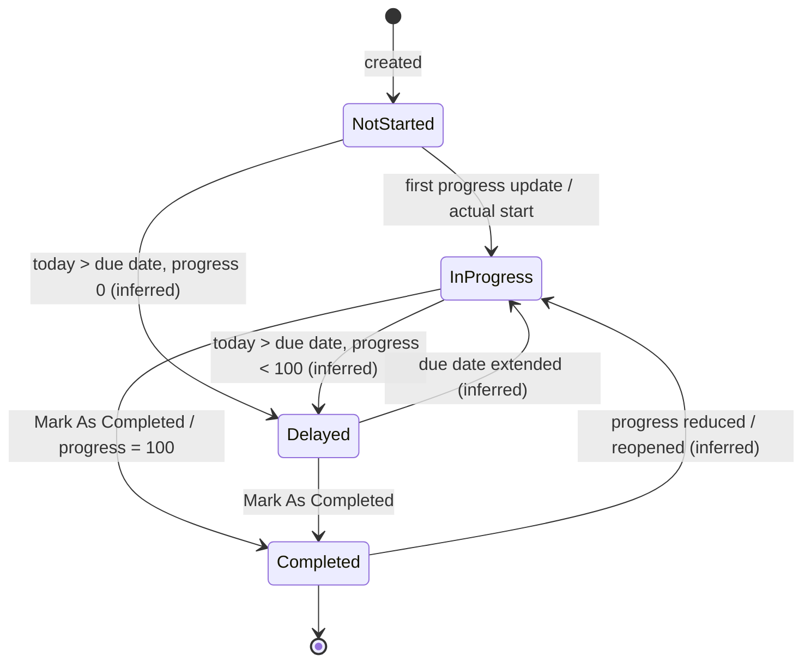
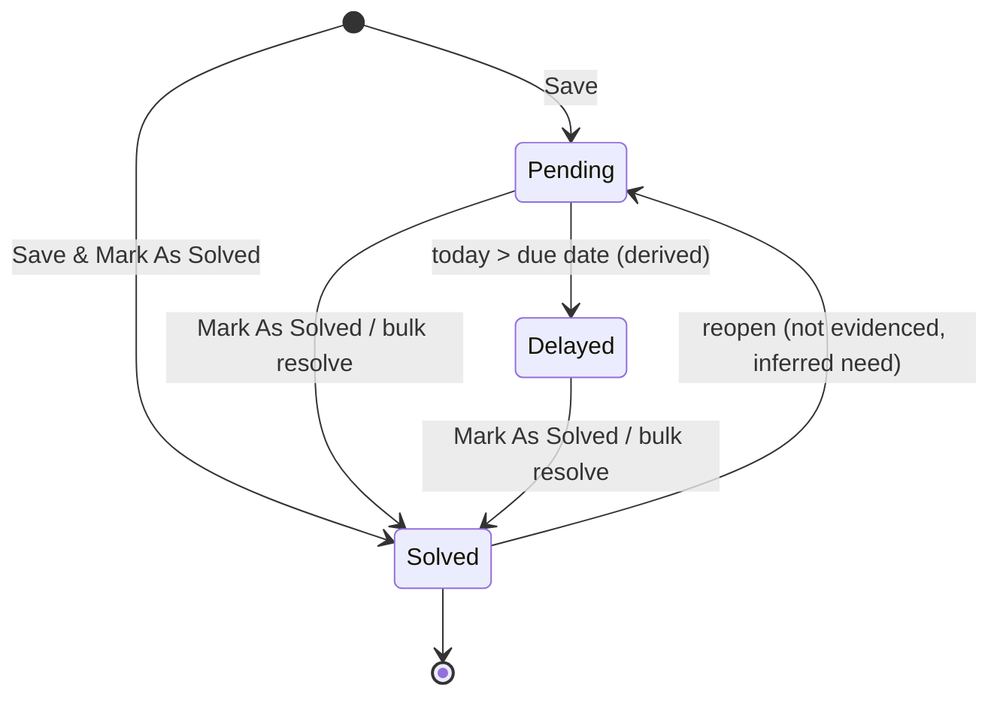
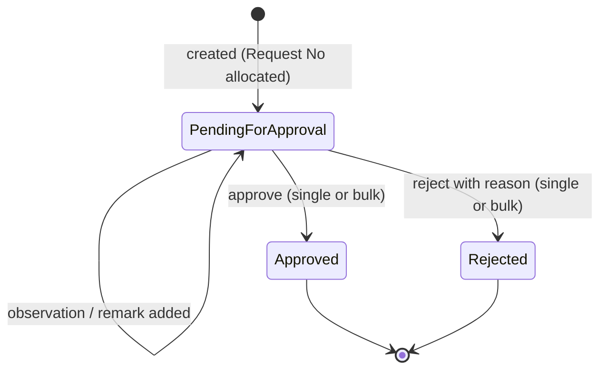

# 05 — Tasks, Issues & Snags, Inspection Requests

This module covers planning and quality control on a project, beyond the daily log:

- **Task.** The project schedule. Tasks and sub-tasks have assignees, location, department, contractor and tags. They carry baseline vs actual dates and a work quantity with price, which gives an **earned value**. Progress is updated over time, there is a Gantt view, and tasks can be imported from Excel. The Project Dashboard's progress gauge and "Value Earned By Task" come from here.
- **Issues & Snags.** The defect and problem register. Each issue has a priority, a category, an assignee, a due date and a location. People post progress updates with photos until it is marked **Solved**.
- **Inspection Request.** A numbered request from the site (usually for a contractor's work) asking an inspector to check work at a location. The inspector records observations with images, then **approves** or **rejects** it with a reason. The approval rate is a quality KPI.

**Who uses it**

| Role                                              | Use                                                                                                                           |
| ------------------------------------------------- | ----------------------------------------------------------------------------------------------------------------------------- |
| Project Manager / Planning (Planning department)  | Builds the task list and baseline, imports schedules, watches the Gantt, earned value and delays.                             |
| Site Engineer / Site Supervisor                   | Updates task progress, raises issues and snags, raises inspection requests, posts photo updates.                              |
| Contractor's representative                       | The party behind "Contractor" on tasks and inspections. They are not a User in legacy, but an inspection is about their work. |
| Quality Control / Structural Engineer / Architect | Assigned as the inspector. Records observations and approves or rejects. Assigned to design or quality issues.                |
| Owner / Admin                                     | Reads KPIs: Pending Issues & Snags, Pending Inspections, Success Rate, Project Progress %.                                    |
| Accountant                                        | Sees task prices and earned value only with the F permission (Task #53 carries F).                                            |

---

## Legacy behaviour

### Navigation

- Project Home tiles **Task** (menu #53), **Issues and snags** (#51) and **Inspection Request** (#54).
- Project Dashboard (`#/chartsDashboard`):
  - KPI tiles: **Pending Issues & Snags**, **Pending Inspections**.
  - **Task** section: Project Progress % gauge (start/end date), Value Earned By Task (task value vs earned value), Filtered By Status (counts for Not Started / In Progress / Delayed / Completed).
  - **Issue And Snag** section: status charts, Assignee-wise issue chart.
  - **Inspection Request** section: total / approved / pending / rejected, and a **Success Rate** gauge.
- Project Reports tile (#20) report set includes **Task Report**, **Issue & Snag**, **Inspection Request** (module 11).
- Master Records: **Issue Categories** (`#/addIssueSnagCat`, menu #72). Tags come from a Tag master (`Tag/Combo`); there is no Master tile for tags in the permission map, so tags are probably created inline (inferred).
- Settings: Sequence ID **InspectionRequest** (module 12). Back-dated control "Site" group: **Issues & Snags**, **Inspection Request**. Tasks are not listed in the back-dated groups.

### Task screens

| Route / screen                     | Behaviour                                                                                                                                                                                                                                                                                                                         |
| ---------------------------------- | --------------------------------------------------------------------------------------------------------------------------------------------------------------------------------------------------------------------------------------------------------------------------------------------------------------------------------- |
| Task list                          | The project's tasks with Task No., name, assignees, dates, progress % and status. Supports **bulk delete** (`tasks/bulk-delete`) and **Import** from Excel (`tasks/import`). Filtering by status is implied by the dashboard (inferred).                                                                                          |
| `#/taskAddEdit`                    | Task Name\*, Description, Assign To (multi-select team members), Start Date, Due Date, Priority (High / Medium / Low), Location Type → Wing → Locations, Department, Contractor, Tags (multi-select, Tag master), **Total work** (quantity + unit), **Total Price**. Sub-task section: **Add Sub-Task** and **Paste Task below**. |
| Task detail                        | Task No., Status, Progress %, Baseline Start / End / Duration / Variance, Actual Start / End, Duration, Completed Work / Completed Price, sub-tasks, **Task activity feed**. Actions: **Update Task Progress**, **Mark As Completed**, Edit, Delete.                                                                              |
| Update Task Progress               | Records progress (percent or completed work quantity) at a point in time and adds an entry to the activity feed. Whether it accepts a photo or comment is not captured in the notes.                                                                                                                                              |
| `#/taskGantt` (`tasks/gantt`)      | Gantt chart of tasks and sub-tasks with baseline vs actual bars (inferred from the baseline fields).                                                                                                                                                                                                                              |
| Task Report / Task Progress Report | Task Report is in the project report set. The Task Progress Report (by location, percent) can also be generated asynchronously from Progress Report (module 04).                                                                                                                                                                  |

### Issues & Snags screens

| Route / screen            | Behaviour                                                                                                                                                                                                                                                                                                                       |
| ------------------------- | ------------------------------------------------------------------------------------------------------------------------------------------------------------------------------------------------------------------------------------------------------------------------------------------------------------------------------- |
| Issues list               | Issues with priority colour chips, status (Pending / Delayed / Solved), assignee and due date. **Bulk mark resolved** (`IssueSnag/BulkMarkAsResolved`). Filters for status, priority, category, assignee and date are inferred from the report and chart dimensions.                                                            |
| `#/issuesSnagAddUpdate`   | Issue Date\*, Department, **Issue Assign To** (team member), Due Date, **Issue Details** (text), **Priority** (High = red `#F90B0B`, Medium = orange `#FF9900`, Low = yellow `#FCF200`), **Category** (Issue Categories master), Location Type / Location, Images, Attachment. Buttons: **Save** and **Save & Mark As Solved**. |
| Issue detail              | Created By, Assign to, **Progress / Add Update** (comment thread with images; `IssueSnag/Comment`), **Solved On**, status. Action **Mark As Solved** (`IssueSnag/MarkAsResolved`).                                                                                                                                              |
| Issue & Snag report       | Report set item (PDF/Excel).                                                                                                                                                                                                                                                                                                    |
| Assignee-wise issue chart | Dashboard chart: issues per assignee by status.                                                                                                                                                                                                                                                                                 |

### Inspection Request screens

| Route / screen            | Behaviour                                                                                                                                                                                                                                                                                                                                                                                                        |
| ------------------------- | ---------------------------------------------------------------------------------------------------------------------------------------------------------------------------------------------------------------------------------------------------------------------------------------------------------------------------------------------------------------------------------------------------------------- |
| Inspection list           | Requests with Request No, date, contractor, inspector and status. **Bulk approve / reject** (`InspectionRequest/BulkSetApprovalStatus`).                                                                                                                                                                                                                                                                         |
| `#/inspectionAddNew`      | Inspection Date\*, Inspection Time, Department, Contractor, **Request Assign To** (the inspector), **Description of work** (Work Details), Location Type / Location, **Upload Drawings and site photographs** (files; drawings may also be picked from project drawings through `Drawing/Combo` / `TestingItemDrawing/Combo`).                                                                                   |
| Inspection detail         | Request No (Sequence ID InspectionRequest), Status (**Pending for approval** / **Approved** / **Rejected**), Created On / By, Approved By / On, Rejected By / For / On, **Observations** (Observations By / On, Inspection Images, files), **Remarks list** (`InspectionRequest/Remark`), **Reject Reason**. Actions: Approve, Reject (`InspectionRequest/SetApprovalStatus`), add an observation, add a remark. |
| Inspection Request Report | Report set item.                                                                                                                                                                                                                                                                                                                                                                                                 |
| Dashboard                 | total / approved / pending / rejected, Success Rate gauge.                                                                                                                                                                                                                                                                                                                                                       |

### Cross-cutting list behaviour

Assembled from the other legacy lists in the app; the notes do not capture these screens directly.

| Concern             | Task                                                                              | Issues & Snags                                                                                                 | Inspection Request                                                 |
| ------------------- | --------------------------------------------------------------------------------- | -------------------------------------------------------------------------------------------------------------- | ------------------------------------------------------------------ |
| Search              | Task name / Task No. (inferred)                                                   | Issue details (inferred)                                                                                       | Request No / description (inferred)                                |
| Status filter       | Not Started / In Progress / Delayed / Completed (shown on the dashboard)          | Pending / Delayed / Solved                                                                                     | Pending for approval / Approved / Rejected                         |
| Other filters       | Assignee, Priority, Tags, Department, Contractor, Location, date range (inferred) | Priority, Category, Assignee, Department, Location, date range (inferred from the report and chart dimensions) | Department, Contractor, Inspector, Location, date range (inferred) |
| Multi-select action | Bulk delete                                                                       | Bulk mark resolved                                                                                             | Bulk approve / reject                                              |
| Import              | Excel (`tasks/import`)                                                            | —                                                                                                              | —                                                                  |
| Alternative view    | Gantt (`#/taskGantt`)                                                             | Assignee-wise chart                                                                                            | Success-rate gauge                                                 |
| Numbering           | Task No. (internal)                                                               | none evidenced                                                                                                 | Sequence ID `InspectionRequest`                                    |
| Back-dated control  | not listed                                                                        | Site → Issues & Snags                                                                                          | Site → Inspection Request                                          |
| Comment / feed      | Task activity feed                                                                | Progress / Add Update (comments with images)                                                                   | Observations + Remarks list                                        |
| Visibility scoping  | V flag present (view all)                                                         | V flag present                                                                                                 | no V flag                                                          |

### Dashboard KPI definitions (as displayed; formulas inferred)

| KPI / chart               | Section            | Definition                                                                                                |
| ------------------------- | ------------------ | --------------------------------------------------------------------------------------------------------- |
| Project Progress %        | Task               | A gauge between the project start and end dates. Value is the rollup of task progress % (weighting open). |
| Value Earned By Task      | Task               | Σ Total Price (task value) vs Σ Completed Price (earned value), per task.                                 |
| Filtered By Status        | Task               | Count of tasks per status.                                                                                |
| Pending Issues & Snags    | KPI tile           | Count of issues with status Pending or Delayed in the filter duration.                                    |
| Issue status charts       | Issue And Snag     | Count per status (and per priority / category, inferred).                                                 |
| Assignee-wise issue chart | Issue And Snag     | Per assignee: count by status.                                                                            |
| Pending Inspections       | KPI tile           | Count of requests with status Pending for approval.                                                       |
| Inspection totals         | Inspection Request | Total, Approved, Pending, Rejected.                                                                       |
| Success Rate              | Inspection Request | Approved ÷ (Approved + Rejected) × 100 (inferred, because pending requests have no outcome yet).          |

The dashboard filter duration defaults to the last 1 year and applies to every KPI above.

---

## Entities & fields

### Task

| Field                 | Type                                             | Required    | Notes                                                                                                        |
| --------------------- | ------------------------------------------------ | ----------- | ------------------------------------------------------------------------------------------------------------ |
| id                    | uuid                                             | yes         |                                                                                                              |
| projectId             | FK → Project                                     | yes         |                                                                                                              |
| taskNo                | string                                           | yes         | "Task No.". Not a configurable Sequence ID in module 12, so probably a plain per-project counter (inferred). |
| parentTaskId          | FK → Task                                        | no          | Set for sub-tasks. How deep nesting can go is open.                                                          |
| sortOrder             | int                                              | yes         | For "Paste Task below" and Gantt order (inferred).                                                           |
| name                  | string                                           | yes         | "Task Name\*".                                                                                               |
| description           | text                                             | no          |                                                                                                              |
| assigneeIds           | FK[] → TeamMember                                | no          | "Assign To" multi-select.                                                                                    |
| startDate             | date                                             | no          | Planned start. Doubles as the baseline start when the baseline is captured (inferred).                       |
| dueDate               | date                                             | no          | Planned end. Must be ≥ startDate.                                                                            |
| priority              | enum{High, Medium, Low}                          | no          |                                                                                                              |
| locationType          | enum{Wing, Amenity, CommonDevelopment}           | no          | As in module 04.                                                                                             |
| wingId                | FK → Wing                                        | no          |                                                                                                              |
| locationIds           | FK[] → Floor/Unit/Location                       | no          | "Locations" (plural).                                                                                        |
| departmentId          | FK → Department                                  | no          |                                                                                                              |
| contractorId          | FK → Contractor                                  | no          |                                                                                                              |
| tagIds                | FK[] → Tag                                       | no          | `Tag/Combo`.                                                                                                 |
| totalWorkQty          | decimal(14,3)                                    | no          | "Total work" quantity.                                                                                       |
| totalWorkUomId        | FK → MeasurementUnit                             | conditional | Required if qty is given (inferred).                                                                         |
| totalPrice            | decimal(14,2)                                    | no          | "Total Price". The planned value of the task. Visible only with F (inferred).                                |
| completedWorkQty      | decimal(14,3)                                    | derived     | Sum of progress updates (inferred).                                                                          |
| completedPrice        | decimal(14,2)                                    | derived     | Earned value = totalPrice × completedWorkQty ÷ totalWorkQty, or totalPrice × progress% (inferred).           |
| progressPct           | decimal(5,2)                                     | yes         | 0–100.                                                                                                       |
| baselineStart         | date                                             | no          |                                                                                                              |
| baselineEnd           | date                                             | no          |                                                                                                              |
| baselineDuration      | int (days)                                       | derived     | baselineEnd − baselineStart (+1, inferred).                                                                  |
| baselineVariance      | int (days)                                       | derived     | Actual or forecast end − baselineEnd (inferred).                                                             |
| actualStart           | date                                             | no          | Set at the first progress update (inferred).                                                                 |
| actualEnd             | date                                             | no          | Set by Mark As Completed (inferred).                                                                         |
| duration              | int (days)                                       | derived     |                                                                                                              |
| status                | enum{NotStarted, InProgress, Delayed, Completed} | yes         | Derived; see the rules.                                                                                      |
| createdById           | FK → TeamMember                                  | yes         | Shown in the activity feed (inferred).                                                                       |
| createdAt / updatedAt | datetime                                         | yes         |                                                                                                              |

### TaskProgressUpdate

| Field            | Type            | Required    | Notes                                  |
| ---------------- | --------------- | ----------- | -------------------------------------- |
| id               | uuid            | yes         |                                        |
| taskId           | FK → Task       | yes         |                                        |
| date             | date            | yes         | (inferred)                             |
| progressPct      | decimal(5,2)    | conditional |                                        |
| completedWorkQty | decimal(14,3)   | conditional | One of the two is required (inferred). |
| remark           | text            | no          | (inferred)                             |
| images           | file[]          | no          | (inferred)                             |
| byId             | FK → TeamMember | yes         |                                        |

### TaskActivity (activity feed)

| Field   | Type                                                                                 | Required | Notes                           |
| ------- | ------------------------------------------------------------------------------------ | -------- | ------------------------------- |
| id      | uuid                                                                                 | yes      |                                 |
| taskId  | FK → Task                                                                            | yes      |                                 |
| type    | enum{Created, Updated, ProgressUpdated, Completed, AssigneeChanged, SubTaskAdded, …} | yes      | Value set inferred.             |
| payload | json                                                                                 | no       | Before/after values (inferred). |
| byId    | FK → TeamMember                                                                      | yes      |                                 |
| at      | datetime                                                                             | yes      |                                 |

### Tag

| Field     | Type         | Required | Notes                          |
| --------- | ------------ | -------- | ------------------------------ |
| id        | uuid         | yes      |                                |
| companyId | FK → Company | yes      |                                |
| name      | string       | yes      | Unique per company (inferred). |

### TaskImportRow (Excel import template — columns inferred from the form)

| Field                                                                                                                        | Type       | Required | Notes                                  |
| ---------------------------------------------------------------------------------------------------------------------------- | ---------- | -------- | -------------------------------------- |
| taskName                                                                                                                     | string     | yes      |                                        |
| parentTaskNo / level                                                                                                         | string/int | no       | To rebuild the hierarchy (inferred).   |
| description, startDate, dueDate, priority, assignees, department, contractor, location, tags, totalWorkQty, unit, totalPrice | various    | no       | Matched to masters by name (inferred). |

### IssueSnag

| Field                        | Type                           | Required       | Notes                                                                                                                                                                                                 |
| ---------------------------- | ------------------------------ | -------------- | ----------------------------------------------------------------------------------------------------------------------------------------------------------------------------------------------------- |
| id                           | uuid                           | yes            |                                                                                                                                                                                                       |
| projectId                    | FK → Project                   | yes            |                                                                                                                                                                                                       |
| issueNo                      | string                         | no             | No Sequence ID exists for issues. An internal id is likely shown (inferred).                                                                                                                          |
| issueDate                    | date                           | yes            | "Issue Date\*". Back-dated control: Issues & Snags.                                                                                                                                                   |
| departmentId                 | FK → Department                | no             |                                                                                                                                                                                                       |
| assigneeId                   | FK → TeamMember                | no             | "Issue Assign To" (single).                                                                                                                                                                           |
| dueDate                      | date                           | no             | ≥ issueDate (inferred). Drives the Delayed status.                                                                                                                                                    |
| details                      | text                           | yes (inferred) | "Issue Details". An issue with no text is meaningless.                                                                                                                                                |
| priority                     | enum{High, Medium, Low}        | no             | Colours: #F90B0B / #FF9900 / #FCF200.                                                                                                                                                                 |
| categoryId                   | FK → IssueCategory             | no             | Seed list: Client, Communication, Compliance, Design, Environmental, Financial, Management, Operational, Other, Quality, RFI, Safety, Supply, Technical. Disabled categories are hidden from pickers. |
| locationType + location refs | as module 04                   | no             | Wing/Floor/Unit, Amenity, Common Development.                                                                                                                                                         |
| images                       | file[] (image)                 | no             |                                                                                                                                                                                                       |
| attachments                  | file[]                         | no             | "Attachment".                                                                                                                                                                                         |
| status                       | enum{Pending, Delayed, Solved} | yes            | Delayed is derived (Pending and today > dueDate) (inferred).                                                                                                                                          |
| solvedOn                     | datetime                       | conditional    | Set when marked solved.                                                                                                                                                                               |
| solvedById                   | FK → TeamMember                | conditional    | (inferred)                                                                                                                                                                                            |
| createdById                  | FK → TeamMember                | yes            | "Created By".                                                                                                                                                                                         |
| createdAt / updatedAt        | datetime                       | yes            |                                                                                                                                                                                                       |

### IssueSnagUpdate (Progress / Add Update)

| Field   | Type            | Required    | Notes                               |
| ------- | --------------- | ----------- | ----------------------------------- |
| id      | uuid            | yes         |                                     |
| issueId | FK → IssueSnag  | yes         | `IssueSnag/Comment`.                |
| comment | text            | conditional | Text or images required (inferred). |
| images  | file[]          | no          | "comments with images".             |
| byId    | FK → TeamMember | yes         |                                     |
| at      | datetime        | yes         |                                     |

### IssueCategory (master, module 02 — referenced here)

| Field    | Type   | Required | Notes                    |
| -------- | ------ | -------- | ------------------------ |
| id       | uuid   | yes      |                          |
| name     | string | yes      |                          |
| disabled | bool   | yes      | `IssueCategory/Disable`. |

### InspectionRequest

| Field                        | Type                                         | Required       | Notes                                                                                                  |
| ---------------------------- | -------------------------------------------- | -------------- | ------------------------------------------------------------------------------------------------------ |
| id                           | uuid                                         | yes            |                                                                                                        |
| projectId                    | FK → Project                                 | yes            |                                                                                                        |
| requestNo                    | string                                       | yes            | Sequence ID **InspectionRequest** (prefix / project id / start number, module 12). Unique per company. |
| inspectionDate               | date                                         | yes            | "Inspection Date\*". Back-dated control: Inspection Request.                                           |
| inspectionTime               | time                                         | no             |                                                                                                        |
| departmentId                 | FK → Department                              | no             |                                                                                                        |
| contractorId                 | FK → Contractor                              | no             | Whose work is inspected.                                                                               |
| inspectorId                  | FK → TeamMember                              | no             | "Request Assign To". Whether it is required is open.                                                   |
| workDescription              | text                                         | yes (inferred) | "Description of work (Work Details)".                                                                  |
| locationType + location refs | as module 04                                 | no             |                                                                                                        |
| drawingIds                   | FK[] → Drawing                               | no             | Linked project drawings (`Drawing/Combo`, `TestingItemDrawing/Combo`) (inferred).                      |
| files                        | file[]                                       | no             | "Upload Drawings and site photographs".                                                                |
| status                       | enum{PendingForApproval, Approved, Rejected} | yes            |                                                                                                        |
| createdById / createdAt      | FK → TeamMember / datetime                   | yes            | "Created On / By".                                                                                     |
| approvedById / approvedAt    | FK → TeamMember / datetime                   | conditional    | "Approved By / On".                                                                                    |
| rejectedById / rejectedAt    | FK → TeamMember / datetime                   | conditional    | "Rejected By / On".                                                                                    |
| rejectedFor / rejectReason   | text                                         | conditional    | "Rejected For", "Reject Reason". Required on reject (inferred).                                        |

### InspectionObservation

| Field               | Type                   | Required    | Notes                |
| ------------------- | ---------------------- | ----------- | -------------------- |
| id                  | uuid                   | yes         |                      |
| inspectionRequestId | FK → InspectionRequest | yes         |                      |
| observation         | text                   | conditional | (inferred)           |
| images              | file[]                 | no          | "Inspection Images". |
| files               | file[]                 | no          |                      |
| byId                | FK → TeamMember        | yes         | "Observations By".   |
| at                  | datetime               | yes         | "Observations On".   |

### InspectionRemark

| Field               | Type                   | Required | Notes                       |
| ------------------- | ---------------------- | -------- | --------------------------- |
| id                  | uuid                   | yes      |                             |
| inspectionRequestId | FK → InspectionRequest | yes      | `InspectionRequest/Remark`. |
| remark              | text                   | yes      |                             |
| byId                | FK → TeamMember        | yes      |                             |
| at                  | datetime               | yes      |                             |

---

## Workflows & states

### T1 — Plan tasks

1. Task tile → Add (`#/taskAddEdit`). Enter the name, assignees, dates, priority, location, department, contractor and tags, then the total work quantity and unit and the total price.
2. Add sub-tasks (**Add Sub-Task**), or use **Paste Task below** to insert a copied task after the current one.
3. Alternatively, **Import** an Excel schedule (`tasks/import`).
4. Capture the baseline: Baseline Start/End are recorded (from the planned dates, or entered separately; see Open questions).
5. View the plan on the **Gantt** (`#/taskGantt`).

### T2 — Execute and update

1. The assignee opens the task → **Update Task Progress**: percent and/or completed work quantity.
2. The first update sets Actual Start (inferred), and the status becomes In Progress.
3. Completed Work / Completed Price (earned value) recalculate. The dashboard's Value Earned By Task and Project Progress % update.
4. If today is past the Due Date and progress is below 100%, the status becomes **Delayed** (inferred).
5. **Mark As Completed** sets progress to 100%, sets Actual End, and the status becomes Completed. Baseline Variance is computed.
6. Every change is written to the Task activity feed.

### T3 — Bulk delete / report

1. Multi-select tasks → **Bulk delete** (`tasks/bulk-delete`) → confirmation. Behaviour for sub-tasks of a deleted parent is open.
2. Task Report (report set) or Task Progress Report (async, module 04).

### T4 — Import a schedule

1. Task list → Import. Download the sample, fill it in, and upload the `.xlsx` (`tasks/import`).
2. The server validates each row: name required, dates parse, masters (assignee, department, contractor, unit, tags) match by name (inferred).
3. Valid rows become tasks, with a hierarchy if the template carries parent references (inferred). Invalid rows are reported back.
4. Imported tasks start as Not Started. Baselines come from the imported dates (inferred).

### T5 — Work in the Gantt

1. Task → Gantt (`#/taskGantt`, data from `tasks/gantt`).
2. Bars show planned (or baseline) and actual spans for tasks and sub-tasks, coloured by status (inferred).
3. Whether you can drag to reschedule in the Gantt is not evidenced. Editing happens through `#/taskAddEdit`.

### I1 — Raise and resolve an issue or snag

1. Issues and snags → Add (`#/issuesSnagAddUpdate`). Enter Issue Date\*, details, priority, category, department, assignee, due date, location, images and attachments.
2. **Save** gives status Pending. **Save & Mark As Solved** records an issue that was fixed on the spot.
3. The assignee is notified (N flag) (inferred).
4. Participants **Add Update** (comment and images) on the Progress thread.
5. Past the due date, the status shows **Delayed**.
6. **Mark As Solved** sets Solved On and the status becomes Solved. Alternatively, multi-select → **bulk mark resolved**.

### I2 — Review issues

1. Dashboard → Issue And Snag: status charts and the Assignee-wise chart show the backlog per person.
2. Reports → Issue & Snag report (PDF/Excel) for the chosen duration, with Organisation, Project and Address in the header.
3. Bulk-resolve closed-out items after a site walk (multi-select → bulk mark resolved).

### R1 — Inspection request

1. Inspection Request → Add (`#/inspectionAddNew`). Enter the date, time, department, contractor, inspector (Request Assign To), work description, location, and drawings/photos.
2. On save, a **Request No** is allocated from the InspectionRequest sequence and the status is **Pending for approval**. The inspector is notified (inferred).
3. The inspector records **Observations** (text, images, files). Anyone with access can add **Remarks**.
4. The inspector or an approver either **Approves** (Approved By/On is recorded) or **Rejects** with a reason (Rejected By/For/On and Reject Reason are recorded). Bulk approve/reject is available from the list.
5. After a rejection, the contractor fixes the work and a **new** request is raised (inferred; there is no resubmit state).
6. The dashboard Success Rate = Approved ÷ (Approved + Rejected) (inferred formula).

---

## Business rules & validations

**Task**

- Task Name is required. Due Date ≥ Start Date. Baseline End ≥ Baseline Start (inferred).
- If Total work quantity is entered, its unit is required. Completed work ≤ total work, unless overrun is allowed (open).
- Progress % is 0–100.
- Status derivation (inferred from the observed values):
  - Completed if progress = 100 or Mark As Completed.
  - Delayed if not completed and today > Due Date.
  - In Progress if progress > 0 or Actual Start is set.
  - Otherwise Not Started.
- Earned value (Completed Price) is proportional to completed work or progress. Project Progress % is a rollup of task progress, weighted by Total Price or by duration (open).
- Parent task progress and dates roll up from sub-tasks (inferred; legacy behaviour unknown).
- Total Price, Completed Price and Value Earned are gated by the Task F (financial) permission (inferred).
- Bulk delete needs D, and should require confirmation. Deleting a parent with sub-tasks must either cascade or be blocked (open).
- Import validates required columns and master-name matches, and reports per-row errors (inferred).
- Users without V (view all) see only the tasks assigned to or created by them (inferred from the V flag on #53).
- Tasks are **not** in back-dated entry control.

**Issues & Snags**

- Issue Date is required. Due Date ≥ Issue Date (inferred).
- Priority must be High, Medium or Low. Category must be an enabled Issue Category.
- Delayed is derived from the due date and is not set manually (inferred).
- Mark As Solved needs U, and possibly A (Issues #51 carries A and J; see Open questions). Bulk mark resolved is the same action over many issues.
- Solved On is set by the server at the time of marking.
- Back-dated control applies (Site → Issues & Snags).
- Users without V see only issues they created or are assigned to (inferred).

**Inspection Request**

- Inspection Date is required. The Request No is allocated on create from the **InspectionRequest** sequence: a project-specific rule if one exists, otherwise the default (for example `IR/26-27/PX/00001`). It is unique and never reused (inferred).
- Only users with Inspection Request A can approve, and only users with J can reject. Bulk approve and bulk reject check the same flags. A reject reason is required.
- Approved or Rejected requests are read-only, except for remarks (inferred).
- Bulk approve/reject applies one decision (and one reason for rejects) to every selected Pending request. Non-pending ones are skipped (inferred).
- Back-dated control applies (Site → Inspection Request).
- An Inspection Request should not be deletable once decided (inferred, for audit).

**Notifications (N flag; triggers inferred)**

- Task: someone is assigned (added to Assign To), progress is updated, the task becomes Delayed, or it is completed. Recipients are the assignees and the creator.
- Issue: it is assigned, an update or comment is added, it becomes Delayed (past the due date), or it is marked solved. Recipients are the assignee and the creator.
- Inspection: it is created (to the inspector), an observation or remark is added, or it is approved or rejected (to the creator).
- Only users who hold the module's N flag receive the module's push notifications.

**Common**

- Location pickers follow the module 03 hierarchy, and Location Type options depend on the project type (building vs location-based).
- Images and attachments use the shared upload service. File size limits are not captured (the profile photo limit is ≤10MB).
- Dirty-form guard ("Discard changes?") on add/edit screens (inferred legacy pattern).

---

## Permissions

Flags from the "Menu / permission map" in `_working-notes.md`:

| Letter | Meaning        | Letter | Meaning      |
| ------ | -------------- | ------ | ------------ |
| C      | create         | N      | notification |
| R      | read           | V      | view all     |
| U      | update         | T      | transfer     |
| D      | delete         | O      | report       |
| A      | approve        | F      | financial    |
| J      | reject         | E      | export       |
| P      | print/download | I      | import       |

| Menu (id)                | Flags                 | Effect                                                                                                                                                                                                                                                                                                                                                                                                                    |
| ------------------------ | --------------------- | ------------------------------------------------------------------------------------------------------------------------------------------------------------------------------------------------------------------------------------------------------------------------------------------------------------------------------------------------------------------------------------------------------------------------- |
| Task (#53)               | C R U D A J P N V O F | Create, view, edit, delete (including bulk delete and import; there is no separate I flag). **A** = approve, **J** = reject. Task approval is not otherwise evidenced in the UI; it may gate Mark As Completed or progress updates. **P** = download. **N** = assignment and progress notifications. **V** = see all tasks, not only own. **O** = Task Report. **F** = see Total Price, Completed Price and earned value. |
| Issues and snags (#51)   | C R U D A J P N V O   | Create, view, edit, delete. **A** = approve (probably Mark As Solved, inferred). **J** = reject (what it rejects is not evidenced). **P** = download, **N** = notifications, **V** = view all, **O** = Issue & Snag report.                                                                                                                                                                                               |
| Inspection Request (#54) | C R U D A J P N O     | Create, view, edit, delete. **A** = approve and **J** = reject, as separate grants (single and bulk). **P** = download, **N** = notifications, **O** = Inspection Request Report. No V.                                                                                                                                                                                                                                   |
| Issue Categories (#72)   | C R U D               | Master (module 02).                                                                                                                                                                                                                                                                                                                                                                                                       |
| Project Drawings (#21)   | C R U D N             | Drawing picker for inspections (module 03).                                                                                                                                                                                                                                                                                                                                                                               |
| Dashboard (#65)          | R                     | Task, Issue and Inspection dashboard sections and KPI tiles.                                                                                                                                                                                                                                                                                                                                                              |
| Reports (#20)            | R P                   | Task Report, Issue & Snag, Inspection Request reports.                                                                                                                                                                                                                                                                                                                                                                    |
| Progress Report (#73)    | C R D N F             | Task Progress Report generation (module 04).                                                                                                                                                                                                                                                                                                                                                                              |

---

## Relationships

- → depends on **01 Organization/Identity/Access**: team members (assignees, inspectors, creators), permission flags, notifications routing.
- → depends on **02 Master Records**: Departments, Contractors, Measurement Units, Issue Categories, Tags (Tag master), Designations (for back-dated overrides).
- → depends on **03 Projects/Structure/Drawings/Gallery**: project, wings/floors/units, amenities, common developments and locations; project drawings for inspections. Testing Reports (03) are the material-test counterpart to inspections. Issue and inspection images may surface in the Gallery (inferred).
- → depends on **12 Settings**: InspectionRequest numbering sequence; back-dated entry (Issues & Snags, Inspection Request).
- ← used by **04 Daily Site Work**: worksheets reference a task (TaskName column). The Task Progress Report is generated from Progress Report.
- ← used by **11 Reports/Dashboards/Backup**: Task Report, Issue & Snag report, Inspection Request Report, Project Dashboard KPIs and charts, project backup.
- ← used by **13 Chat/Notifications/Support**: assignment, due and approval notifications.
- ↔ **07 Payments & Accounting** (future): approved inspections and completed task quantities are the natural gate for contractor RA bills (see recommendations). Not linked in legacy.

---

## Reports & exports

| Report                    | Format                     | Content                                                                                                                                                                                                    |
| ------------------------- | -------------------------- | ---------------------------------------------------------------------------------------------------------------------------------------------------------------------------------------------------------- |
| Task Report               | PDF / Excel                | Task list with Task No., name, assignees, dates (baseline / actual), progress %, status, location, department, contractor. Header with Organisation, Project, Address, Duration. Prices with F (inferred). |
| Task Progress Report      | PDF (async, via module 04) | Duration, location, task, progress %.                                                                                                                                                                      |
| Gantt                     | Screen                     | Baseline vs actual timeline (`tasks/gantt`). Export not evidenced.                                                                                                                                         |
| Task import sample        | Excel                      | Template for `tasks/import` (inferred from the import pattern used elsewhere, e.g. SampleExport).                                                                                                          |
| Dashboard — Task          | Charts                     | Project Progress % gauge, Value Earned By Task, Filtered By Status.                                                                                                                                        |
| Issue & Snag report       | PDF / Excel                | Issue list: date, details, priority, category, department, assignee, due date, location, status, solved on (inferred columns).                                                                             |
| Dashboard — Issue & Snag  | Charts                     | Status charts, Assignee-wise issue chart, KPI "Pending Issues & Snags".                                                                                                                                    |
| Inspection Request Report | PDF / Excel                | Request No, date/time, department, contractor, inspector, description, location, status, approved/rejected by and on, reason (inferred columns).                                                           |
| Dashboard — Inspection    | Charts                     | Total / approved / pending / rejected, Success Rate gauge, KPI "Pending Inspections".                                                                                                                      |

---

## Rebuild recommendations

1. **Tie tasks to BOQ and work orders.** The task fields "Total work (qty + unit) & Total Price" are a primitive BOQ line. In the rebuild, a task (or task line) should reference a BOQ item (DSR-coded, IS 1200 units) and, where relevant, the contractor work order at item rate. Completed work then becomes the Measurement Book quantity that drives RA bills: cumulative measured value − previous bills − deductions (research §3 "BOQ and rate analysis", "Measurement Book (MB) and RA bills", "Work orders with item rates"). Earned value then reconciles with billing.
2. **Joint measurement (JMR) sign-off on progress.** Let a progress update be co-signed by the contractor and the client engineer before it counts toward billing (research §3 "JMR").
3. **RERA physical progress.** Roll task progress up by Wing to produce the per-building % complete needed for the architect's Form 1 and the quarterly progress report, with state-configurable QPR deadlines (research §2 RERA, §5 "RERA: … quarterly physical/financial progress by wing"). Weight the rollup by price, not task count.
4. **Proper scheduling semantics.** Add predecessors/successors (FS/SS with lag) for the Gantt, a frozen **baseline snapshot** (and re-baselining with history) instead of editable baseline fields, and a working calendar (holidays from module 10). Make Delayed a forecast computed by the server (forecast end > baseline end), not only "today > due date".
5. **Inspection gates billing and the next activity.** An inspection request should link to the task or BOQ item and the location it covers, and an approved inspection should be the precondition for marking that task Completed or including it in an RA bill. A rejection should automatically create a linked Issue/Snag for the contractor, with a "re-inspection" request linked to the original.
6. **Checklists (ITPs) on inspections.** Add configurable inspection checklists per work type (e.g. pre-pour checklist) with pass/fail/NA items. For concrete pours, link to the pour → cube register in Testing Reports (module 03) (research §3 "Concrete testing (IS 456:2000 …)").
7. **DLP and handover for snags.** Add a phase (Construction / Pre-handover / DLP) and a per-unit handover date to Issues & Snags, so the 12-month contractual DLP and the RERA 5-year structural defect liability can be tracked separately. Optionally capture allottee-reported snags (research §2 RERA "5-year structural defect liability", §3 "Defect liability period"). Link snags to retention release (research §3 "Retention money").
8. **Explicit issue lifecycle.** Add **Reopen** and a **Verified/Closed** step (the raiser confirms the fix), plus SLA by priority. Keep "Delayed" as a derived flag rather than a stored status so that bulk-resolving does not lose history.
9. **Drawing-pinned issues and inspections.** Pin issues, snags and inspections to a point on a project drawing (research §4 item 8). Geo-tag and timestamp all photos.
10. **Offline and WhatsApp capture.** Raising a snag (photo + location + category) and approving an inspection are high-frequency field actions. Support offline queueing and WhatsApp-bot approval (research §4 items 1–2).
11. **Audit trail and soft delete.** Task, issue and inspection histories carry evidence for extension-of-time claims and disputes (the hindrance register, research §3). Store an append-only activity log for all three entities (the Task activity feed already exists in legacy). Soft-delete instead of hard-delete, and block deleting decided inspections.
12. **Define what approve and reject mean everywhere.** Legacy grants A (approve) and J (reject) on Task and Issues, but the UI shows no task or issue approval step. In the rebuild, either give these flags concrete actions (for example, approve task completion, verify a solved issue) or drop them.

---

## Open questions

1. Are Baseline Start/End entered separately or copied from Start/Due Date? Can a task be re-baselined?
2. Is **Delayed** a stored status or derived? For issues, is it set by a scheduled job or computed when read?
3. How is **Project Progress %** computed: a simple average of task progress, weighted by Total Price, or weighted by duration?
4. How is **Completed Price** (earned value) computed: from completed work qty ÷ total qty, or from progress %?
5. What do the **A** (approve) and **J** (reject) flags on Task (#53) and Issues (#51) control? Task completion approval? Verifying a solved issue?
6. Can a Rejected inspection request be resubmitted, or must a new one be raised?
7. How many levels of sub-tasks are allowed? What does "Paste Task below" copy (sub-tasks, assignees)?
8. What are the **task import** template columns and the matching rules (by name? by Task No.)?
9. Does Update Task Progress accept photos and comments? Is it the same as the activity feed?
10. Is the task-worksheet link (TaskName on worksheets) a real foreign key, and does worksheet work done update task progress?
11. What happens to sub-tasks when a parent is bulk-deleted?
12. Can a Solved issue be reopened in legacy?
13. Is the inspector (Request Assign To) required, and can someone other than the inspector approve?
14. Do issues have a user-visible number? There is no Sequence ID for them.
15. Exact column sets for the Task, Issue & Snag and Inspection Request reports.
16. Where are Tags managed? There is no Master tile in the permission map.
