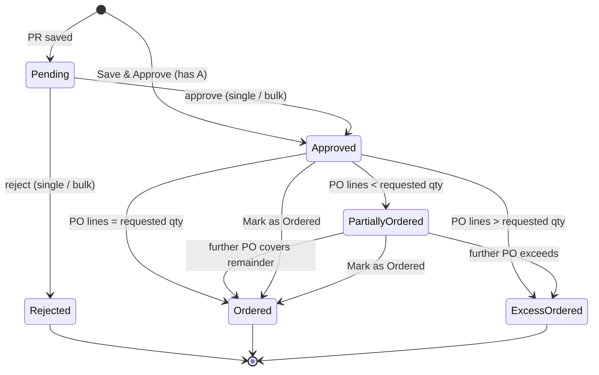
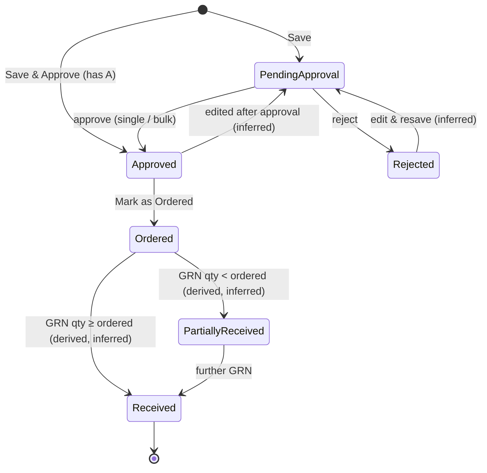
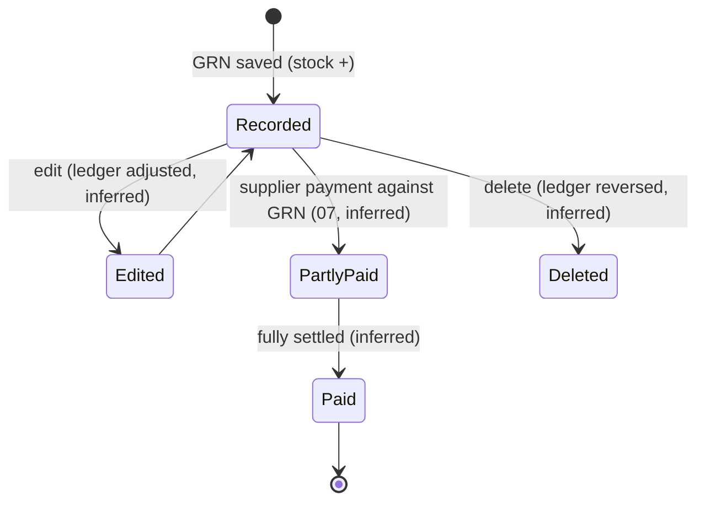
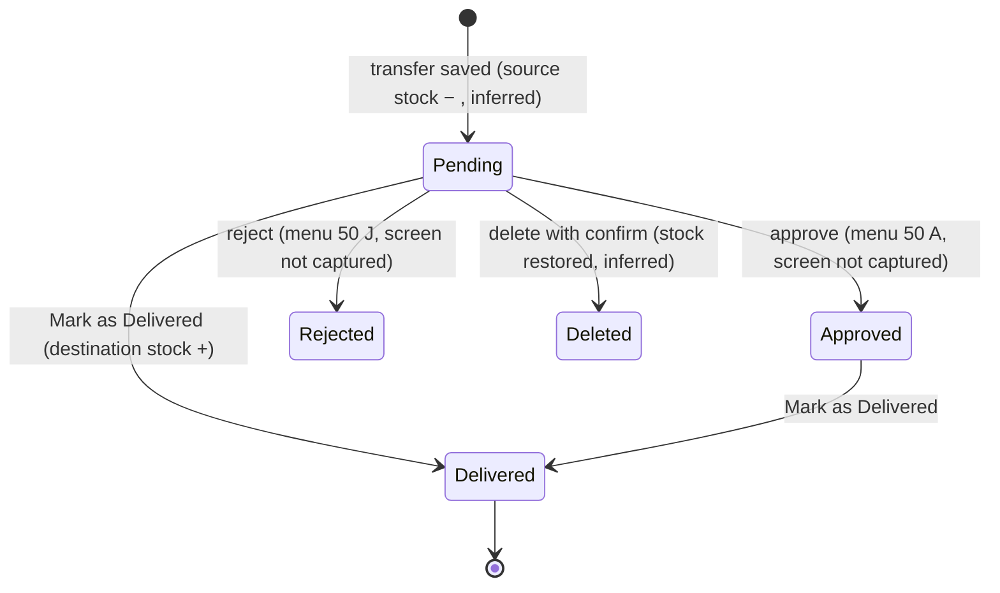
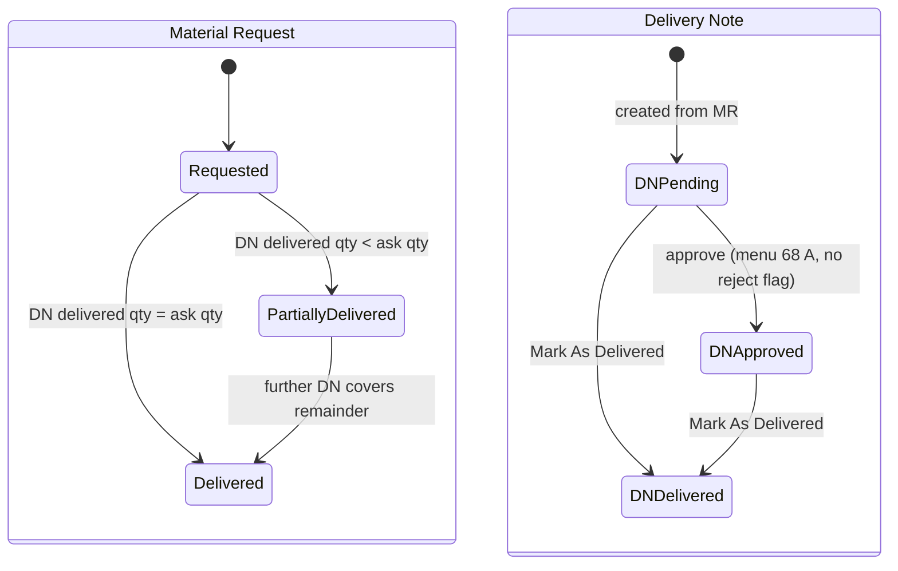

# 06 — Procurement & Inventory

This module tracks material from need to use, both within a project and through company-wide **Central Stores**:

- **Purchase Request (PR).** The site asks for materials. The PR is approved, then ordered.
- **Purchase Order (PO).** A priced order to a supplier, with GST and HSN, charges, terms and a PDF.
- **Goods Receipt Note (GRN) / Material Received.** What actually arrived against a PO, with the challan and invoice. A GRN increases stock and creates a supplier payable.
- **Current Inventory.** Per-project stock: estimated vs actual quantity, minimum-stock alerts, consumption, missing material, and a ledger with history.
- **Material Transfer (MT).** Moves stock project ↔ project and project ↔ store.
- **Central Store.** Warehouses that serve several projects. Sites raise a **Material Request (MR)** to a store. The store answers with **Delivery Notes (DN)** until the MR is delivered.
- **Central Inventory.** A cross-project and cross-store stock view with a stock-ledger report.

**Who uses it**

| Role                                   | Use                                                                                                                                                    |
| -------------------------------------- | ------------------------------------------------------------------------------------------------------------------------------------------------------ |
| Site Engineer / Site Supervisor        | Raises PRs and MRs, records consumption and missing material, receives transfers and deliveries.                                                       |
| Store Keeper                           | Records GRNs, maintains Current Inventory, issues Delivery Notes from the central store, does transfers, sets min-stock alerts, imports opening stock. |
| Purchase Manager / Purchase department | Approves PRs, converts them to POs, negotiates rates, approves and sends POs, marks them ordered, follows up deliveries.                               |
| Project Manager                        | Approves PRs, POs and transfers for the project. Watches the Material Summary dashboard.                                                               |
| Accountant                             | Uses GRN values and invoice details for supplier payments (module 07). Holds the F permission on Material Received.                                    |
| Owner / Admin                          | Configures numbering sequences, billing addresses, T&C, GRN field visibility. Views Central Inventory.                                                 |

---

## Legacy behaviour

### Navigation

- Project-level menu **Manage Materials** (#49, read-only container) with these children: **Central Store (MR)**, **Current Inventory**, **Goods Received**, **Material Transfer**, **Purchase Order**, **Purchase Request**.
- Workspace tab: **Central store** (stores, MR, Delivery Note) and **Central Inventory** (#96).
- Master: Materials, Material Categories, Measurement Units, Supplier, View Quotations, Terms & Conditions (`#/termsAndConditionAdd`) (module 02). Company billing addresses (`v2/company-billing-addresses`).
- Settings: Manage Sequence IDs (`#/numberingScreen`) for PurchaseRequest, PurchaseOrder, GoodsReceipt, MaterialTransfer, MaterialRequest, DeliveryNote. Back-dated control "Procurement" group (PR, PO, GRN, Material Transfer, Central Store MR, Delivery Note) and "Inventory" group (Current Inventory, Material Consumed, Missing Material) (module 12).
- Project Dashboard → **Materials**: Material Summary (total materials, in stock, low stock, out of stock, total PO, total PO value), Month-wise PO Value, Stock Register Report. KPI tile **Material Approvals**.

### Purchase Request screens

| Route / screen                                                        | Behaviour                                                                                                                                                                                                                                                                                                                                                                                                                                                                                                                                                                                                      |
| --------------------------------------------------------------------- | -------------------------------------------------------------------------------------------------------------------------------------------------------------------------------------------------------------------------------------------------------------------------------------------------------------------------------------------------------------------------------------------------------------------------------------------------------------------------------------------------------------------------------------------------------------------------------------------------------------- |
| `#/purchaseRequestList` (route name inferred from the naming pattern) | The project's PRs. **Filters**: Date (This Week / Last Week / Last 15 Days / This Month / Last Month / Custom), Status, Material Category, Material, Created By, Location Type. Status chips: Pending, Approved, Rejected, Ordered, Partially Ordered, Excess Ordered. **Bulk approval mode**: multi-select → Approve or Reject (`PurchaseRequest/BulkSetApprovalStatus`). Row actions: View, Edit, Delete, Approve/Reject (`PurchaseRequest/SetApprovalStatus`), Remark (`PurchaseRequest/Remark`), **Mark as Ordered** (`PurchaseRequest/MarkAsOrdered`), **Generate PO** (opens a PO with the PR selected). |
| Creation mode A — from the PR list                                    | FAB → Add Purchase Request. The wizard starts at step 1.                                                                                                                                                                                                                                                                                                                                                                                                                                                                                                                                                       |
| Creation mode B — from Current Inventory                              | Inventory → select materials → **Purchase Request** ("Raise a purchase request"). The PR opens with those materials preloaded.                                                                                                                                                                                                                                                                                                                                                                                                                                                                                 |
| Add PR wizard — step 1 **Materials**                                  | Pick materials (searchable list). **Create New** adds a material to the master inline. **View Selected** reviews the picked set.                                                                                                                                                                                                                                                                                                                                                                                                                                                                               |
| Add PR wizard — step 2 **Quantity**                                   | One row per selected material: quantity, with **Available Stock** and **Balanced estimated qty** shown. **Remark Setting**: a toggle "**Separate remark for each item**" gives a remark per material row. When it is off, a single **Common Remark** (max 500 characters) applies to the whole PR.                                                                                                                                                                                                                                                                                                             |
| Add PR wizard — step 3 **Details**                                    | **Purchase Request Date\***, Location Type (+ location), **Required Date**, Remark, Attachment ("**Upload Required Materials List**"). Buttons: **Save** and **Save & Approve**.                                                                                                                                                                                                                                                                                                                                                                                                                               |

### Purchase Order screens

| Route / screen                 | Behaviour                                                                                                                                                                                                                                                                                                                                                                                                                   |
| ------------------------------ | --------------------------------------------------------------------------------------------------------------------------------------------------------------------------------------------------------------------------------------------------------------------------------------------------------------------------------------------------------------------------------------------------------------------------- |
| PO list (`v2/purchase-orders`) | **Filters**: Date, Status, Supplier. **Bulk approval mode** (`v2/purchase-orders/bulk-approval`). Row actions: View, Edit, Delete, Approve/Reject (`PurchaseOrder/SetApprovalStatus`), **Mark as Ordered** (`v2/purchase-orders/mark-as-ordered`), Remarks (`v2/purchase-orders/remarks`), **PO PDF**.                                                                                                                      |
| PO form — header               | **Purchase Order Date\***, **Purchase Request Number** (optional; selecting it loads the PR items), **Supplier\***, **Expected Delivery Date\***, Location Type (+ wing/floor/unit).                                                                                                                                                                                                                                        |
| PO form — Materials            | **Add Materials** opens the Purchase Order Material sheet: Material Category, Material\*, an info line showing **Available Stock** and **Balanced estimated qty**, Quantity\*, Unit, **Unit Rate\***, **Discount** + Type (₹ or %), **GST Rate %**, then computed **Sub Total / Discount / GST / Total Amount**, and Remark (500). Defaults come from the material master (unitRate, discountType/Value, gstRate, hsnCode). |
| PO form — Charges              | **Additional Charges**, **Deduction Amount**, **Total**.                                                                                                                                                                                                                                                                                                                                                                    |
| PO form — Billing              | **Billing Address\*** (picked from company billing addresses).                                                                                                                                                                                                                                                                                                                                                              |
| PO form — Contact Details      | Supplier POC Name / Number, Site POC Name / Number.                                                                                                                                                                                                                                                                                                                                                                         |
| PO form — Terms & Conditions   | **Payment Terms (Days)**, **Select Terms & Conditions** (TermsnCondition master, `TermsnCondition/Combo`).                                                                                                                                                                                                                                                                                                                  |
| PO form — Additional           | Checkbox "**Delivery Address is other than Project Address**" → Enter Delivery Address. Remark (500). **Attachment**.                                                                                                                                                                                                                                                                                                       |
| PO form — buttons              | **Save** (status Pending approval) and **Save & Approve** (for users with A).                                                                                                                                                                                                                                                                                                                                               |
| PO detail                      | Header, lines, totals, approval info, remarks, linked PR, linked GRNs (inferred), PDF download.                                                                                                                                                                                                                                                                                                                             |

### GRN / Material Received screens

| Route / screen                              | Behaviour                                                                                                                                                                                                                                                                                                                          |
| ------------------------------------------- | ---------------------------------------------------------------------------------------------------------------------------------------------------------------------------------------------------------------------------------------------------------------------------------------------------------------------------------- |
| Goods Received list (`GoodsReceipt/GetAll`) | The project's GRNs, with filters and search (inferred). Row actions: View, Edit, Delete, GRN PDF.                                                                                                                                                                                                                                  |
| GRN form                                    | **GR Date\***, **Supplier\***, **Inventory Date\*** (the date stock is posted), **Linked PO** (PO Number) → lines with **Ordered Qty / Received Qty**, Unit rate, Amount. Plus Delivery Challan No, GRN/DC No, Invoice No, Invoice Date, Invoice Amount, Remark, Store/Project. Grouped as SUPPLIERS DETAILS and DELIVERY DETAILS. |
| GRN without PO                              | Allowed: the Linked PO is optional (inferred from "Record a goods receipt" on an inventory item and from the PO being a picker).                                                                                                                                                                                                   |
| `#/materialReceivedHideShowFieldScreen`     | Settings that show or hide optional GRN fields.                                                                                                                                                                                                                                                                                    |
| From inventory                              | Inventory item → **Received Materials** / "Record a goods receipt".                                                                                                                                                                                                                                                                |

### Current Inventory screens

| Route / screen        | Behaviour                                                                                                                                                                                                                                                                                                                                                                                                                                                                         |
| --------------------- | --------------------------------------------------------------------------------------------------------------------------------------------------------------------------------------------------------------------------------------------------------------------------------------------------------------------------------------------------------------------------------------------------------------------------------------------------------------------------------- |
| `#/inventoryList`     | Per-project stock list: material, **Estimated Qty**, **Stock Qty**, a low-stock marker. Toggle "**Start/Stop minimum stock to maintain Alert**". Options menu: **Consume Material** (multiple), **Missing Materials** (add multiple), **Purchase Request** (select materials → PR), **Purchase Order** (select materials → PO), **Received Materials**, **Transfer Materials** (project → project), **Import Inventory Stock** (Excel), **Export Sample Excel**, **Export Data**. |
| Per-material actions  | **Consume Material** (Consume Date, Quantity, Location, Remarks), **Missing Material** (Missing Date, Quantity, Remarks), Record a goods receipt, Raise a purchase request, Transfer Material, **Update / Add Estimation Quantity**.                                                                                                                                                                                                                                              |
| Material history      | Entries: Delivered to Project, TRN. To / TRN. From, From Central store, Consumed by, Received by. Types: Received / Transfer In / Transfer Out / Consumed / Missing / Delivered. Entries can be **edited and deleted**.                                                                                                                                                                                                                                                           |
| Stock Register report | Per material: Opening Balance, Received, Transfer In, Transfer Out, Consumed, Missing, Closing Balance. Ledger types: Consumed / TransferredOut / Missing / Received / TransferredIn / Issued.                                                                                                                                                                                                                                                                                    |
| Notifications         | `Inventory/Notification`: low-stock alerts (inferred).                                                                                                                                                                                                                                                                                                                                                                                                                            |

### Material Transfer screens

| Route / screen                | Behaviour                                                                                                                                                                                           |
| ----------------------------- | --------------------------------------------------------------------------------------------------------------------------------------------------------------------------------------------------- |
| Material Transfer list        | Columns: **Transfer Number, Transfer Date, Transfer Type, Store, Project, Status, Sent By, Received By, Remark**. Delete with confirmation.                                                         |
| `#/materialTransferAddUpdate` | **Transfer Date\***, Store or Project (source/destination), **Add Transferred Material** (Material, Quantity, MU, Remarks; Available Stock shown), **Receiver Name**, Upload Documents/Attachments. |
| Transfer detail               | Comment thread (`MaterialTransfer/Comment`: Comment By / On, Files). **Mark as Delivered** (`MaterialTransfer/MarkAsDelivered`).                                                                    |
| Store transfer list           | On the Central Store side: Transfer Date, Number, Type, Project, Status, Sent By, Received By.                                                                                                      |

### Central Store screens (Workspace)

| Route / screen                                | Behaviour                                                                                                                                                                                                                                                                                        |
| --------------------------------------------- | ------------------------------------------------------------------------------------------------------------------------------------------------------------------------------------------------------------------------------------------------------------------------------------------------ |
| Central Store listing (`Store/GetAllCombine`) | The company's stores. FAB **Create Store**.                                                                                                                                                                                                                                                      |
| Create Store                                  | **Store Name\***, Store Address. **Assignments**: **Select Projects\*** (the projects the store serves; "Please select minimum one project"), **Team Members** (store keepers; `Store/GetByEmployeeId`), **Suppliers**.                                                                          |
| Store detail                                  | Store inventory, Store Project List, store transfer list.                                                                                                                                                                                                                                        |
| Material Request list                         | MRs with Request ID, date, store, status (Requested / Partially Delivered / Delivered). Options per MR: Edit, **Export Material Request (PDF)**, Delete.                                                                                                                                         |
| `#/centralStoreMRRequestAdd`                  | **Request Date\***, **Request To (Store)\*** (`MaterialRequest/GetAvailableStore`, the stores assigned to this project), Contractor, Department, Location Type / Wing / Location, **Receiver Name**, Remark, materials (Material, **Ask Qty**), attachments. Request ID comes from MR numbering. |
| MR detail                                     | Comment thread (`MaterialRequest/Comment`). Linked Delivery Notes. **Create Delivery Note**.                                                                                                                                                                                                     |
| `#/deliveryFormAdd` (Delivery Note)           | Created from an MR. Numbering e.g. **MDN00001**. Per material: **Requested Qty / Pending Qty / Delivered Qty**. **Delivered To**, **Delivered On**, Linked Material Request, comments (`DeliveryNote/Comment`). **Mark As Delivered** (`DeliveryNote/MarkAsDelivered`).                          |
| Reports                                       | **Deliveries Report**, **Delivery note report**.                                                                                                                                                                                                                                                 |

### Central Inventory (Workspace, #96)

| Route / screen                        | Behaviour                                                                                                                                                                                                          |
| ------------------------------------- | ------------------------------------------------------------------------------------------------------------------------------------------------------------------------------------------------------------------ |
| Central Inventory                     | Stock across all projects and stores (read and print only).                                                                                                                                                        |
| Central Inventory Stock Ledger report | `reports/central_inventory_stock_ledger/generate`. Asynchronous generation (inferred from the `generate` verb). Per material/location ledger: opening, movements, closing (inferred to mirror the Stock Register). |

---

## Entities & fields

### NumberingRule (owned by module 12 — summary)

| Field       | Type                                                                                                   | Required | Notes                      |
| ----------- | ------------------------------------------------------------------------------------------------------ | -------- | -------------------------- |
| module      | enum{PurchaseRequest, PurchaseOrder, GoodsReceipt, MaterialTransfer, MaterialRequest, DeliveryNote, …} | yes      |                            |
| projectId   | FK → Project or null                                                                                   | no       | Null = All/Default.        |
| prefix      | string                                                                                                 | no       | e.g. `PR/26-27`.           |
| projectCode | string                                                                                                 | no       | e.g. `PX`.                 |
| startNumber | int                                                                                                    | yes      | Zero-padded, e.g. `00001`. |
| isDefault   | bool                                                                                                   | yes      | One default per module.    |

Preview format: `{prefix}/{projectCode}/{number}`, for example `PR/26-27/PX/00001`. The Delivery Note example `MDN00001` shows that a prefix with no separator also works.

### PurchaseRequest

| Field                                    | Type                                                                        | Required    | Notes                                                                                           |
| ---------------------------------------- | --------------------------------------------------------------------------- | ----------- | ----------------------------------------------------------------------------------------------- |
| id                                       | uuid                                                                        | yes         |                                                                                                 |
| projectId                                | FK → Project                                                                | yes         |                                                                                                 |
| prNumber                                 | string                                                                      | yes         | Sequence PurchaseRequest. Allocated on save.                                                    |
| prDate                                   | date                                                                        | yes         | Back-dated entry field `PurchaseRequestDate`.                                                   |
| locationType + location refs             | enum{Wing, Amenity, CommonDevelopment} + FKs                                | no          | Step 3 "Location Type". Also a PR filter.                                                       |
| requiredDate                             | date                                                                        | no          | Step 3 "Required Date". The date the material is needed on site. Should be ≥ prDate (inferred). |
| remark                                   | text                                                                        | no          | Step 3 "Remark" (the PR-level remark).                                                          |
| attachments                              | file[]                                                                      | no          | Step 3 "Upload Required Materials List".                                                        |
| separateRemarkPerItem                    | bool                                                                        | yes         | Step 2 "Remark Setting: Separate remark for each item".                                         |
| commonRemark                             | text(500)                                                                   | no          | Step 2 "Common Remark". Used when separateRemarkPerItem = false.                                |
| source                                   | enum{Manual, FromInventory}                                                 | no          | The two creation modes (inferred field).                                                        |
| status                                   | enum{Pending, Approved, Rejected, Ordered, PartiallyOrdered, ExcessOrdered} | yes         |                                                                                                 |
| approvedById / approvedAt                | FK → TeamMember / datetime                                                  | conditional | (inferred)                                                                                      |
| rejectedById / rejectedAt / rejectReason | FK / datetime / text                                                        | conditional | (inferred)                                                                                      |
| markedOrderedById / markedOrderedAt      | FK / datetime                                                               | conditional | `MarkAsOrdered` (inferred fields).                                                              |
| createdById                              | FK → TeamMember                                                             | yes         | "Created By" filter.                                                                            |
| createdAt / updatedAt                    | datetime                                                                    | yes         |                                                                                                 |

### PurchaseRequestItem

| Field                   | Type                  | Required | Notes                                                                                                              |
| ----------------------- | --------------------- | -------- | ------------------------------------------------------------------------------------------------------------------ |
| id                      | uuid                  | yes      |                                                                                                                    |
| purchaseRequestId       | FK → PurchaseRequest  | yes      |                                                                                                                    |
| materialCategoryId      | FK → MaterialCategory | no       | Filters the material picker. Also a PR filter.                                                                     |
| materialId              | FK → Material         | yes      | "Material" filter.                                                                                                 |
| quantity                | decimal(14,3)         | yes      | > 0.                                                                                                               |
| uomId                   | FK → MeasurementUnit  | yes      | The material's default unit.                                                                                       |
| availableStockAtRequest | decimal(14,3)         | info     | "Available Stock" shown in step 2. Not stored (inferred).                                                          |
| balanceEstimatedQty     | decimal(14,3)         | info     | "Balanced estimated qty" shown in step 2. Formula: estimated qty − (stock + already requested/ordered) (inferred). |
| remark                  | text(500)             | no       | Used when separateRemarkPerItem = true. The 500-character limit per item is inferred from the Common Remark limit. |
| orderedQty              | decimal(14,3)         | derived  | Sum of PO line qty linked to this item. Drives the Ordered / Partially / Excess status (inferred).                 |

### PurchaseRequestRemark

| Field             | Type                       | Required | Notes                     |
| ----------------- | -------------------------- | -------- | ------------------------- |
| id                | uuid                       | yes      | `PurchaseRequest/Remark`. |
| purchaseRequestId | FK → PurchaseRequest       | yes      |                           |
| remark            | text                       | yes      |                           |
| byId / at         | FK → TeamMember / datetime | yes      |                           |

### PurchaseOrder

| Field                                                               | Type                                               | Required    | Notes                                                                                                                            |
| ------------------------------------------------------------------- | -------------------------------------------------- | ----------- | -------------------------------------------------------------------------------------------------------------------------------- |
| id                                                                  | uuid                                               | yes         |                                                                                                                                  |
| projectId                                                           | FK → Project                                       | yes         | A PO for a Central Store is not evidenced; see Open questions.                                                                   |
| poNumber                                                            | string                                             | yes         | Sequence PurchaseOrder.                                                                                                          |
| poDate                                                              | date                                               | yes         | "Purchase Order Date\*". Back-dated field `PurchaseOrderDate`.                                                                   |
| purchaseRequestId                                                   | FK → PurchaseRequest                               | no          | "Purchase Request Number (optional; selecting loads PR items)".                                                                  |
| supplierId                                                          | FK → Supplier                                      | yes         | Should be a supplier assigned to the project (inferred).                                                                         |
| expectedDeliveryDate                                                | date                                               | yes         | ≥ poDate (inferred).                                                                                                             |
| locationType + location refs                                        | enum + FKs                                         | no          |                                                                                                                                  |
| subTotal                                                            | decimal(14,2)                                      | derived     | Σ line subTotal.                                                                                                                 |
| discountTotal                                                       | decimal(14,2)                                      | derived     | Σ line discount.                                                                                                                 |
| gstTotal                                                            | decimal(14,2)                                      | derived     | Σ line GST.                                                                                                                      |
| itemsTotal                                                          | decimal(14,2)                                      | derived     | Σ line totalAmount.                                                                                                              |
| additionalCharges                                                   | decimal(14,2)                                      | no          | "Additional Charges".                                                                                                            |
| deductionAmount                                                     | decimal(14,2)                                      | no          | "Deduction Amount".                                                                                                              |
| grandTotal                                                          | decimal(14,2)                                      | derived     | itemsTotal + additionalCharges − deductionAmount ("Total").                                                                      |
| billingAddressId                                                    | FK → CompanyBillingAddress                         | yes         | `v2/company-billing-addresses`.                                                                                                  |
| supplierPocName / supplierPocNumber                                 | string                                             | no          |                                                                                                                                  |
| sitePocName / sitePocNumber                                         | string                                             | no          |                                                                                                                                  |
| paymentTermsDays                                                    | int                                                | no          | "Payment Terms (Days)".                                                                                                          |
| termsAndConditionIds                                                | FK[] → TermsAndCondition                           | no          | "Select Terms & Conditions" (single vs multi is open).                                                                           |
| deliveryAddressDiffers                                              | bool                                               | yes         | "Delivery Address is other than Project Address".                                                                                |
| deliveryAddress                                                     | text                                               | conditional | Required when deliveryAddressDiffers.                                                                                            |
| remark                                                              | text(500)                                          | no          |                                                                                                                                  |
| attachments                                                         | file[]                                             | no          | "Attachment".                                                                                                                    |
| status                                                              | enum{PendingApproval, Approved, Rejected, Ordered} | yes         | The value set is inferred: approval and mark-as-ordered exist. Partial/complete receipt is a separate derived status (inferred). |
| receiptStatus                                                       | enum{NotReceived, PartiallyReceived, Received}     | derived     | From GRN received qty (inferred).                                                                                                |
| approvedById / approvedAt, rejectedById / rejectedAt / rejectReason | FK / datetime / text                               | conditional | (inferred)                                                                                                                       |
| orderedAt / orderedById                                             | datetime / FK                                      | conditional | Mark as ordered.                                                                                                                 |
| createdById / createdAt / updatedAt                                 |                                                    | yes         |                                                                                                                                  |

### PurchaseOrderItem

| Field                 | Type                     | Required | Notes                                                      |
| --------------------- | ------------------------ | -------- | ---------------------------------------------------------- |
| id                    | uuid                     | yes      |                                                            |
| purchaseOrderId       | FK → PurchaseOrder       | yes      |                                                            |
| purchaseRequestItemId | FK → PurchaseRequestItem | no       | Set when loaded from a PR.                                 |
| materialCategoryId    | FK → MaterialCategory    | no       |                                                            |
| materialId            | FK → Material            | yes      |                                                            |
| quantity              | decimal(14,3)            | yes      | > 0.                                                       |
| uomId                 | FK → MeasurementUnit     | yes      |                                                            |
| unitRate              | decimal(14,2)            | yes      | "Unit Rate\*". Defaults to Material.unitRate.              |
| discountType          | enum{Amount, Percent}    | no       | "₹ \| %".                                                  |
| discountValue         | decimal(14,2)            | no       | Percent ≤ 100.                                             |
| gstRatePct            | decimal(5,2)             | no       | Defaults to Material.gstRate.                              |
| hsnCode               | string                   | no       | Defaults to Material.hsnCode. Shown on the PDF (inferred). |
| subTotal              | decimal(14,2)            | derived  | quantity × unitRate.                                       |
| discountAmount        | decimal(14,2)            | derived  | Amount, or subTotal × % ÷ 100.                             |
| gstAmount             | decimal(14,2)            | derived  | (subTotal − discountAmount) × gstRate ÷ 100.               |
| totalAmount           | decimal(14,2)            | derived  | subTotal − discountAmount + gstAmount.                     |
| remark                | text(500)                | no       |                                                            |
| receivedQty           | decimal(14,3)            | derived  | Σ GRN line received qty.                                   |

### PurchaseOrderRemark

Same shape as PurchaseRequestRemark (`v2/purchase-orders/remarks`).

### CompanyBillingAddress (company-level, referenced)

| Field          | Type          | Required | Notes                                                                                      |
| -------------- | ------------- | -------- | ------------------------------------------------------------------------------------------ |
| id             | uuid          | yes      |                                                                                            |
| name / address | string / text | yes      | (inferred)                                                                                 |
| gstin          | string        | no       | Billing addresses also carry GST for the subscription invoice. Its use on POs is inferred. |

### TermsAndCondition (master, `#/termsAndConditionAdd`)

| Field | Type   | Required       | Notes |
| ----- | ------ | -------------- | ----- |
| id    | uuid   | yes            |       |
| title | string | yes (inferred) |       |
| body  | text   | yes (inferred) |       |

### GoodsReceipt (GRN / Material Received)

| Field                               | Type                      | Required     | Notes                                                                                   |
| ----------------------------------- | ------------------------- | ------------ | --------------------------------------------------------------------------------------- |
| id                                  | uuid                      | yes          |                                                                                         |
| projectId / storeId                 | FK → Project / FK → Store | yes (one of) | "Store/Project".                                                                        |
| grnNumber                           | string                    | yes          | Sequence GoodsReceipt.                                                                  |
| grDate                              | date                      | yes          | "GR Date\*". Back-dated field `GRNDate`.                                                |
| inventoryDate                       | date                      | yes          | "Inventory Date\*". The date the stock movement is posted.                              |
| supplierId                          | FK → Supplier             | yes          |                                                                                         |
| purchaseOrderId                     | FK → PurchaseOrder        | no           | "Linked PO". Must be Approved/Ordered and for the same supplier (inferred).             |
| deliveryChallanNo                   | string                    | no           | Can be hidden.                                                                          |
| grnDcNo                             | string                    | no           | "GRN/DC No". Selected later in supplier payment ("Select GRN/DC No").                   |
| invoiceNo                           | string                    | no           |                                                                                         |
| invoiceDate                         | date                      | no           |                                                                                         |
| invoiceAmount                       | decimal(14,2)             | no           |                                                                                         |
| totalValue                          | decimal(14,2)             | derived      | Σ line amount. "Total GRN Value" in supplier payment.                                   |
| remark                              | text                      | no           |                                                                                         |
| supplierDetails                     | —                         | —            | UI group "SUPPLIERS DETAILS" (contents not captured).                                   |
| deliveryDetails                     | —                         | —            | UI group "DELIVERY DETAILS" (contents not captured; possibly vehicle/driver, inferred). |
| attachments                         | file[]                    | no           | (inferred)                                                                              |
| createdById / createdAt / updatedAt |                           | yes          |                                                                                         |

### GoodsReceiptItem

| Field                  | Type                      | Required       | Notes                                                              |
| ---------------------- | ------------------------- | -------------- | ------------------------------------------------------------------ |
| id                     | uuid                      | yes            |                                                                    |
| goodsReceiptId         | FK → GoodsReceipt         | yes            |                                                                    |
| purchaseOrderItemId    | FK → PurchaseOrderItem    | no             |                                                                    |
| materialId             | FK → Material             | yes            |                                                                    |
| orderedQty             | decimal(14,3)             | info           | From the PO line.                                                  |
| receivedQty            | decimal(14,3)             | yes            | > 0.                                                               |
| uomId                  | FK → MeasurementUnit      | yes            |                                                                    |
| unitRate               | decimal(14,2)             | yes (inferred) | Defaults from the PO line.                                         |
| amount                 | decimal(14,2)             | derived        | receivedQty × unitRate (GST treatment on the GRN is not captured). |
| inventoryLedgerEntryId | FK → InventoryLedgerEntry | yes            | The Received entry.                                                |

### GrnFieldSettings (`#/materialReceivedHideShowFieldScreen`)

| Field                 | Type                | Required | Notes                                                                                                             |
| --------------------- | ------------------- | -------- | ----------------------------------------------------------------------------------------------------------------- |
| companyId / projectId | FK                  | yes      | Scope open.                                                                                                       |
| fields                | map<fieldKey, bool> | yes      | Show/hide per optional field (Delivery Challan No, GRN/DC No, Invoice No/Date/Amount, Remark, …) (inferred list). |

### InventoryItem (project or store stock position)

| Field                | Type                                | Required     | Notes                                                                 |
| -------------------- | ----------------------------------- | ------------ | --------------------------------------------------------------------- |
| id                   | uuid                                | yes          |                                                                       |
| projectId / storeId  | FK                                  | yes (one of) |                                                                       |
| materialId           | FK → Material                       | yes          | Unique per (location, material) (inferred).                           |
| estimatedQty         | decimal(14,3)                       | no           | "Update/Add Estimation Quantity". Planned total need for the project. |
| stockQty             | decimal(14,3)                       | derived      | Σ ledger in − out.                                                    |
| minStockQty          | decimal(14,3)                       | no           | From Material.minimumStock, or set per project (open).                |
| minStockAlertEnabled | bool                                | yes          | "Start/Stop minimum stock to maintain Alert".                         |
| stockState           | enum{InStock, LowStock, OutOfStock} | derived      | For the Material Summary dashboard.                                   |

### InventoryLedgerEntry (history / stock register)

| Field             | Type                                                                                                             | Required | Notes                                                                                                                                                                                        |
| ----------------- | ---------------------------------------------------------------------------------------------------------------- | -------- | -------------------------------------------------------------------------------------------------------------------------------------------------------------------------------------------- |
| id                | uuid                                                                                                             | yes      |                                                                                                                                                                                              |
| inventoryItemId   | FK → InventoryItem                                                                                               | yes      |                                                                                                                                                                                              |
| entryDate         | date                                                                                                             | yes      |                                                                                                                                                                                              |
| type              | enum{Opening, Received, TransferredIn, TransferredOut, Consumed, Missing, Issued, DeliveredToProject}            | yes      | Observed types: Consumed / TransferredOut / Missing / Received / TransferredIn / Issued. History labels: "Delivered to Project", "From Central store". Opening comes from import (inferred). |
| quantity          | decimal(14,3)                                                                                                    | yes      | Signed, or with a direction derived from type.                                                                                                                                               |
| sourceType        | enum{GRN, Worksheet, EquipmentUsage, ManualConsume, Missing, MaterialTransfer, DeliveryNote, Import, Adjustment} | yes      | (inferred)                                                                                                                                                                                   |
| sourceId          | uuid                                                                                                             | no       | The originating document.                                                                                                                                                                    |
| counterpartyLabel | string                                                                                                           | no       | "TRN. To / TRN. From", "Consumed by", "Received by".                                                                                                                                         |
| locationRefs      | FKs                                                                                                              | no       | Consume Material → Location.                                                                                                                                                                 |
| remarks           | text                                                                                                             | no       |                                                                                                                                                                                              |
| byId              | FK → TeamMember                                                                                                  | yes      |                                                                                                                                                                                              |
| createdAt         | datetime                                                                                                         | yes      |                                                                                                                                                                                              |

### MaterialConsumed (manual, `MaterialConsumed/AddMultiple`)

| Field         | Type          | Required | Notes                                  |
| ------------- | ------------- | -------- | -------------------------------------- |
| projectId     | FK → Project  | yes      |                                        |
| consumeDate   | date          | yes      | Back-dated module "Material Consumed". |
| materialId    | FK → Material | yes      |                                        |
| quantity      | decimal(14,3) | yes      | ≤ stock (open).                        |
| location refs | FKs           | no       | "Location".                            |
| remarks       | text          | no       |                                        |

Worksheet consumption (module 04) creates the same entry type.

### MissingMaterial (`MissingMaterial/AddMultiple`)

| Field       | Type          | Required | Notes                                 |
| ----------- | ------------- | -------- | ------------------------------------- |
| projectId   | FK → Project  | yes      |                                       |
| missingDate | date          | yes      | Back-dated module "Missing Material". |
| materialId  | FK → Material | yes      |                                       |
| quantity    | decimal(14,3) | yes      |                                       |
| remarks     | text          | no       |                                       |

### InventoryImportRow (Import Inventory Stock / Export Sample Excel)

| Field        | Type          | Required | Notes                                   |
| ------------ | ------------- | -------- | --------------------------------------- |
| material     | string (name) | yes      | Matched to Material (inferred).         |
| quantity     | decimal       | yes      | Opening stock or adjustment (inferred). |
| unit         | string        | no       |                                         |
| estimatedQty | decimal       | no       | (inferred)                              |

### MaterialTransfer

| Field                       | Type                                                                 | Required     | Notes                                                                                                                                                                          |
| --------------------------- | -------------------------------------------------------------------- | ------------ | ------------------------------------------------------------------------------------------------------------------------------------------------------------------------------ |
| id                          | uuid                                                                 | yes          |                                                                                                                                                                                |
| transferNumber              | string                                                               | yes          | Sequence MaterialTransfer.                                                                                                                                                     |
| transferDate                | date                                                                 | yes          |                                                                                                                                                                                |
| transferType                | enum{ProjectToProject, ProjectToStore, StoreToProject, StoreToStore} | yes          | "Transfer Type" column. The exact values are inferred from "Store \| Project".                                                                                                 |
| fromProjectId / fromStoreId | FK                                                                   | yes (one of) |                                                                                                                                                                                |
| toProjectId / toStoreId     | FK                                                                   | yes (one of) | Must differ from the source.                                                                                                                                                   |
| receiverName                | string                                                               | no           | "Receiver Name".                                                                                                                                                               |
| sentById                    | FK → TeamMember                                                      | yes          | "Sent By".                                                                                                                                                                     |
| receivedById                | FK → TeamMember                                                      | conditional  | "Received By". Set on Mark as Delivered.                                                                                                                                       |
| status                      | enum{Pending, Approved, Rejected, Delivered}                         | yes          | Pending → Delivered observed. Menu #50 carries A (approve) and J (reject), so Approved and Rejected states are expected. Their screens were not captured (see Open questions). |
| remark                      | text                                                                 | no           |                                                                                                                                                                                |
| attachments                 | file[]                                                               | no           |                                                                                                                                                                                |
| deliveredAt                 | datetime                                                             | conditional  |                                                                                                                                                                                |

### MaterialTransferItem

| Field              | Type                 | Required | Notes                                       |
| ------------------ | -------------------- | -------- | ------------------------------------------- |
| id                 | uuid                 | yes      |                                             |
| materialTransferId | FK                   | yes      |                                             |
| materialId         | FK → Material        | yes      |                                             |
| quantity           | decimal(14,3)        | yes      | ≤ available stock at the source (inferred). |
| uomId              | FK → MeasurementUnit | yes      | "MU".                                       |
| remarks            | text                 | no       |                                             |

### Comment (shared shape for MT, MR, DN)

| Field      | Type                                                  | Required    | Notes              |
| ---------- | ----------------------------------------------------- | ----------- | ------------------ |
| id         | uuid                                                  | yes         |                    |
| parentType | enum{MaterialTransfer, MaterialRequest, DeliveryNote} | yes         |                    |
| parentId   | uuid                                                  | yes         |                    |
| text       | text                                                  | conditional |                    |
| files      | file[]                                                | no          | "Files".           |
| byId / at  | FK → TeamMember / datetime                            | yes         | "Comment By / On". |

### Store (Central Store)

| Field         | Type              | Required | Notes                                |
| ------------- | ----------------- | -------- | ------------------------------------ |
| id            | uuid              | yes      |                                      |
| companyId     | FK → Company      | yes      |                                      |
| name          | string            | yes      | "Store Name\*".                      |
| address       | text              | no       |                                      |
| projectIds    | FK[] → Project    | yes (≥1) | "Please select minimum one project". |
| teamMemberIds | FK[] → TeamMember | no       | The store keepers.                   |
| supplierIds   | FK[] → Supplier   | no       |                                      |

### MaterialRequest (MR)

| Field                        | Type                                           | Required | Notes                                                            |
| ---------------------------- | ---------------------------------------------- | -------- | ---------------------------------------------------------------- |
| id                           | uuid                                           | yes      |                                                                  |
| projectId                    | FK → Project                                   | yes      | The requesting project.                                          |
| requestNo                    | string                                         | yes      | "Request ID". Sequence MaterialRequest.                          |
| requestDate                  | date                                           | yes      |                                                                  |
| storeId                      | FK → Store                                     | yes      | "Request To (Store)\*". Must be a store assigned to the project. |
| contractorId                 | FK → Contractor                                | no       |                                                                  |
| departmentId                 | FK → Department                                | no       |                                                                  |
| locationType + location refs |                                                | no       |                                                                  |
| receiverName                 | string                                         | no       |                                                                  |
| remark                       | text                                           | no       |                                                                  |
| attachments                  | file[]                                         | no       |                                                                  |
| status                       | enum{Requested, PartiallyDelivered, Delivered} | yes      | Derived from delivered vs asked qty (inferred).                  |
| createdById / createdAt      |                                                | yes      |                                                                  |

### MaterialRequestItem

| Field             | Type                 | Required | Notes                  |
| ----------------- | -------------------- | -------- | ---------------------- |
| id                | uuid                 | yes      |                        |
| materialRequestId | FK                   | yes      |                        |
| materialId        | FK → Material        | yes      |                        |
| askQty            | decimal(14,3)        | yes      | "Ask Qty".             |
| uomId             | FK → MeasurementUnit | yes      |                        |
| deliveredQty      | decimal(14,3)        | derived  | Σ DN delivered qty.    |
| pendingQty        | decimal(14,3)        | derived  | askQty − deliveredQty. |

### DeliveryNote (DN)

| Field                   | Type                               | Required    | Notes                                                                                                          |
| ----------------------- | ---------------------------------- | ----------- | -------------------------------------------------------------------------------------------------------------- |
| id                      | uuid                               | yes         |                                                                                                                |
| dnNumber                | string                             | yes         | Sequence DeliveryNote (e.g. `MDN00001`).                                                                       |
| materialRequestId       | FK → MaterialRequest               | yes         | "Linked Material Request". Always created from an MR.                                                          |
| storeId                 | FK → Store                         | yes         | Source store.                                                                                                  |
| projectId               | FK → Project                       | yes         | Destination.                                                                                                   |
| deliveredTo             | string / FK → TeamMember           | no          | "Delivered To".                                                                                                |
| deliveredOn             | date                               | conditional | "Delivered On". Set on Mark As Delivered (or entered).                                                         |
| status                  | enum{Pending, Approved, Delivered} | yes         | Mark As Delivered. Menu #68 carries A (approve) but not J, so there is no Rejected state (see Open questions). |
| attachments             | file[]                             | no          | (inferred)                                                                                                     |
| createdById / createdAt |                                    | yes         |                                                                                                                |

### DeliveryNoteItem

| Field                 | Type          | Required | Notes                                                 |
| --------------------- | ------------- | -------- | ----------------------------------------------------- |
| id                    | uuid          | yes      |                                                       |
| deliveryNoteId        | FK            | yes      |                                                       |
| materialRequestItemId | FK            | yes      |                                                       |
| materialId            | FK → Material | yes      |                                                       |
| requestedQty          | decimal(14,3) | info     |                                                       |
| pendingQty            | decimal(14,3) | info     | Before this DN.                                       |
| deliveredQty          | decimal(14,3) | yes      | ≤ pendingQty (inferred) and ≤ store stock (inferred). |

---

## Workflows & states

### The material chain

```mermaid
flowchart LR
    subgraph Site["Project site"]
        INV0[Current Inventory<br/>estimated qty, min-stock alert] -->|select materials| PR
        PR[Purchase Request<br/>PR/26-27/PX/00001]
        GRN[GRN / Material Received<br/>ordered vs received qty,<br/>DC no, invoice no]
        INV[Current Inventory<br/>stock ledger]
        CONS[Consumption<br/>Daily Worksheet / Equipment Usage /<br/>Consume Material]
        MISS[Missing Material]
        MR[Material Request MR]
    end
    subgraph Purchase["Purchase"]
        PO[Purchase Order<br/>rate, discount, GST, HSN,<br/>charges, T&C, PDF]
    end
    subgraph Store["Central Store"]
        SINV[Store inventory]
        DN[Delivery Note MDN00001]
    end
    PR -->|approve| PRA{Approved?}
    PRA -->|no| PRR[Rejected]
    PRA -->|yes: Generate PO /<br/>select PR on PO| PO
    PRA -->|ordered outside system| MO[Mark as Ordered]
    PO -->|approve + mark as ordered| SUP[(Supplier)]
    SUP -->|delivery + challan + invoice| GRN
    GRN -->|Received +| INV
    GRN -->|GRN value| PAY[[07 Supplier payable]]
    INV -->|Consumed −| CONS
    INV -->|Missing −| MISS
    INV <-->|Material Transfer<br/>TransferredIn / Out| INV2[Other project inventory]
    INV <-->|Material Transfer| SINV
    MR -->|request to store| SINV
    SINV -->|Create Delivery Note| DN
    DN -->|Mark As Delivered: Delivered to Project +| INV
    SINV -.->|store GRN (inferred)| GRN
    INV --> CI[[Central Inventory / Stock Ledger]]
    SINV --> CI
```

### P1 — Raise a Purchase Request

1. **Mode A**: PR list → FAB. **Mode B**: Current Inventory → select materials → Purchase Request (materials preloaded).
2. Wizard step 1 **Materials**: pick materials (Create New for one not in the master). Use View Selected to review.
3. Step 2 **Quantity**: enter a quantity per material against Available Stock and Balanced estimated qty. Choose the Remark Setting: a separate remark per item, or one Common Remark (500 characters).
4. Step 3 **Details**: Purchase Request Date\*, Location Type, Required Date, Remark, and the attachment "Upload Required Materials List". Then **Save** or **Save & Approve** (requires A).
5. A PR number is allocated from the PurchaseRequest sequence (project rule or default). Save gives status **Pending**, and approvers are notified (N). Save & Approve gives **Approved** directly. The dashboard KPI "Material Approvals" counts it (inferred).

### P2 — Approve or reject a PR

1. An approver opens the PR, or switches the list to **bulk approval mode** and multi-selects.
2. Approve gives **Approved**. Reject (with remark, inferred) gives **Rejected**. Remarks can be added at any time (`PurchaseRequest/Remark`).

### P3 — Order against a PR

1. **Generate PO from PR**: on the PO form, choose the Purchase Request Number. Its items load (qty, unit, material) and the rates default from the material master. One PR may be split across several POs/suppliers (inferred).
2. As PO lines are created against PR items, the PR status is derived (inferred rule):
   - Σ ordered = 0 → stays Approved.
   - 0 < Σ ordered < requested on any item → **Partially Ordered**.
   - Σ ordered = requested for all items → **Ordered**.
   - Σ ordered > requested on any item → **Excess Ordered**.
3. **Mark as Ordered**: for PRs fulfilled outside the system (cash purchase, phone order), set **Ordered** without a PO.



### P4 — Create and approve a Purchase Order

1. From the PO list FAB, from a PR, or from Current Inventory (select materials → Purchase Order).
2. Header: date, optional PR, Supplier, Expected Delivery Date, location.
3. Lines: Add Materials → for each, qty, unit rate, discount (₹ or %), GST % and remark. Totals calculate live.
4. Charges and deductions → grand total.
5. Billing address, POCs, payment terms (days), T&C selection, delivery address override, remark, attachment.
6. **Save** gives **Pending approval**. **Save & Approve** (requires A) gives **Approved** immediately.
7. Approver: approve or reject (single or **bulk approval mode**), and add remarks.
8. **Mark as Ordered** once it has been sent to the supplier. Download the **PO PDF** for sharing.



### P5 — Receive goods (GRN)

1. Goods Received → FAB, or Inventory → Received Materials.
2. Enter GR Date, Supplier, Inventory Date, Store/Project. Optionally choose the **Linked PO**. Its lines load with Ordered Qty, and the user enters Received Qty (rate and amount default from the PO).
3. Enter Delivery Challan No, GRN/DC No, Invoice No/Date/Amount and Remark (subject to hide/show settings).
4. On save: a GRN number is allocated, each line posts a **Received** ledger entry to the project (or store) inventory on the Inventory Date, and the PO's received qty updates.
5. The GRN appears as a selectable "GRN/DC No" in Supplier Payments (module 07), with "Total GRN Value".



### P6 — Inventory operations

1. **Consume Material** (single or multiple): Consume Date, Quantity, Location, Remarks → **Consumed** entry. Worksheets and equipment sheets also post Consumed.
2. **Missing Materials** (multiple): Missing Date, Quantity, Remarks → **Missing** entry.
3. **Update/Add Estimation Quantity** sets the planned total need. It drives "Balanced estimated qty" on PR and PO.
4. **Min-stock alert**: when the toggle is on and stock ≤ minimum, a notification is sent (`Inventory/Notification`) and the item counts as Low Stock. At zero it is Out of Stock.
5. **Import Inventory Stock** (Excel, from the sample): bulk opening or adjustment. **Export Data**: the current list.
6. **History**: per-material ledger. Entries can be edited or deleted (legacy).

### P7 — Material Transfer

1. Inventory → Transfer Materials, or Material Transfer → FAB.
2. Transfer Date, source and destination (Store or Project), lines (material, qty, MU, remarks; available stock shown), receiver name, attachments.
3. Save: a number is allocated, status **Pending**, and a **Transferred Out** entry posts at the source. Whether the outflow posts at save or at delivery is open.
4. Both sides comment in the thread.
5. The receiver chooses **Mark as Delivered**: status **Delivered**, Received By is set, and a **Transferred In** entry posts at the destination.



### P8 — Central Store: MR → Delivery Note

1. Admin creates a **Store** (name, address) and assigns ≥1 project, team members and suppliers.
2. Site raises an **MR**: Request Date, Request To (a store assigned to this project), contractor, department, location, receiver, remark, materials with **Ask Qty**, attachments. Request ID allocated, status **Requested**.
3. Store keeper opens the MR → **Create Delivery Note**: per line Requested / Pending / **Delivered Qty**, Delivered To, Delivered On. DN number allocated (e.g. MDN00001). Store stock decreases (**Issued**, inferred).
4. **Mark As Delivered** on the DN: the project inventory gets a **Delivered to Project** / "From Central store" entry.
5. MR status derives: some delivered gives **Partially Delivered**. All delivered gives **Delivered**.
6. Both MR and DN carry comment threads. The MR can be exported as PDF.



### P9 — Central Inventory

1. Workspace → Central Inventory: stock per material across all projects and stores.
2. Generate the **Central Inventory Stock Ledger** report (`reports/central_inventory_stock_ledger/generate`). Asynchronous, then download (inferred).

---

## Business rules & validations

**Numbering**

- PR, PO, GRN, MT, MR and DN numbers are allocated on save from the module's numbering rules (module 12). The project-specific rule wins over the default. The format is `{prefix}/{projectCode}/{zero-padded number}` starting at Start Number.
- Numbers must be unique per company and module, and never reused after delete (inferred). Allocation must be concurrency-safe.

**Purchase Request**

- Step 1 needs at least one material, and step 2 needs a qty > 0 for each (inferred). Purchase Request Date is required (step 3).
- PR Date is subject to back-dated control (module key PR, field `PurchaseRequestDate`) and the financial closing date.
- Only A holders approve (including Save & Approve), and only J holders reject. Bulk approval mode checks the same flags per action.
- Remark Setting: when "Separate remark for each item" is on, the Common Remark is hidden and each item takes its own remark. When it is off, one Common Remark applies (max 500 characters).
- Approved, Ordered, Partially Ordered and Excess Ordered PRs cannot be edited (inferred). Only Pending (and Rejected?) can be edited or deleted.
- Mark as Ordered is allowed only from Approved or Partially Ordered (inferred).
- Generate PO is allowed only for Approved / Partially Ordered PRs (inferred).
- Excess Ordered is a warning state, not a block. Ordering more than requested is allowed but visible.

**Purchase Order**

- Required: PO Date, Supplier, Expected Delivery Date, ≥1 line (Material, Quantity, Unit Rate), Billing Address.
- Expected Delivery Date ≥ PO Date (inferred).
- Discount % must be 0–100. Discount ₹ must not exceed the line subTotal (inferred).
- Line math: `subTotal = qty × rate`; `discount = type==% ? subTotal × v/100 : v`; `gst = (subTotal − discount) × gst%/100`; `total = subTotal − discount + gst`. Header: `grandTotal = Σ total + additionalCharges − deductionAmount`. Rounding to 2 decimals per line (inferred).
- Selecting a PR loads its pending (unordered) items. The PR must be Approved (inferred).
- If "Delivery Address is other than Project Address" is ticked, a delivery address is required.
- **Save & Approve** is visible only to users with PO A. Reject needs PO J.
- An approved PO cannot be edited without reverting to Pending approval (inferred). An Ordered PO with GRNs cannot be deleted (inferred).
- Back-dated control: module PO, field `PurchaseOrderDate`.
- Remarks are limited to 500 characters (line and header).

**GRN**

- Required: GR Date, Supplier, Inventory Date, ≥1 line with received qty > 0.
- A Linked PO must belong to the same supplier and project (inferred) and be Approved/Ordered (inferred).
- Received qty may exceed ordered qty (over-receipt). Whether this is blocked is open.
- Posting: each line creates a **Received** ledger entry dated the **Inventory Date** at the GRN's Project or Store.
- Editing or deleting a GRN must adjust or reverse its ledger entries, and must be blocked if the GRN is referenced by a supplier payment (inferred).
- Hidden fields (hide/show settings) are not required and not shown on the PDF (inferred).
- Back-dated control: module GRN, field `GRNDate`.
- Invoice amount vs GRN value mismatch is shown but not blocked (inferred).

**Inventory**

- Stock is derived from the ledger, never typed directly. The exception is Import, which creates entries.
- Consumption, missing and transfer-out cannot exceed available stock. Whether legacy allows negative stock is open (`Inventory/GetAvailableStock` is consulted).
- The min-stock alert fires only when the toggle is on and minimum qty > 0.
- History entries are editable and deletable in legacy (`Inventory/Update`). Each edit recalculates the balance.
- Back-dated control: Current Inventory, Material Consumed and Missing Material modules.
- Import validates material names against the master, rejects unknown units, and reports per-row errors (inferred).

**Material Transfer**

- Required: Transfer Date, source, destination (≠ source), ≥1 line with qty > 0, and qty ≤ available stock at the source (inferred).
- Only the destination side (or a user with U) can Mark as Delivered (inferred). Approve needs MT A and reject needs MT J.
- Delete requires confirmation, and only while Pending (inferred).
- Back-dated control: module Material Transfer.

**Central Store / MR / DN**

- A store must have at least one assigned project ("Please select minimum one project").
- An MR may only target stores assigned to its project (`MaterialRequest/GetAvailableStore`).
- MR required: Request Date, Request To (Store), ≥1 material with Ask Qty > 0.
- A DN must link to an MR. Delivered qty must be ≤ pending qty (inferred) and ≤ store stock (inferred).
- MR status is derived from the Σ delivered qty of its DNs that are marked Delivered (inferred: only Delivered DNs count).
- An MR with DNs cannot be deleted (inferred).
- Back-dated control: Central Store MR, Delivery Note.
- Users only see stores assigned to them (`Store/GetByEmployeeId`), unless they have view-all (inferred).

**Common**

- Dirty-form guard: "Discard changes?" when leaving the PR, PO, GRN, MT, MR or DN form with edits (inferred legacy pattern).
- Financial values (rates, amounts, GRN value) are gated by F where the menu has it (Material Received #30) (inferred).

---

## Permissions

Flags from the "Menu / permission map" in `_working-notes.md`:

| Letter | Meaning        | Letter | Meaning      |
| ------ | -------------- | ------ | ------------ |
| C      | create         | N      | notification |
| R      | read           | V      | view all     |
| U      | update         | T      | transfer     |
| D      | delete         | O      | report       |
| A      | approve        | F      | financial    |
| J      | reject         | E      | export       |
| P      | print/download | I      | import       |

| Menu (id)                                                                                                | Flags             | Effect                                                                                                                                                                                                                                 |
| -------------------------------------------------------------------------------------------------------- | ----------------- | -------------------------------------------------------------------------------------------------------------------------------------------------------------------------------------------------------------------------------------- |
| Manage Materials (#49)                                                                                   | R                 | Shows the Manage Materials group on the project.                                                                                                                                                                                       |
| Current Inventory (#16)                                                                                  | C R U D P N O     | Consume, missing, import, estimation, history edit/delete (C/U/D; there is no separate I or E flag, so import and export ride on C and P, inferred). **P** = download/export. **N** = min-stock notifications. **O** = Stock Register. |
| Purchase Request (#17)                                                                                   | C R U D A J P N O | Create, edit, delete. **A** = approve (single, bulk, and Save & Approve in the wizard). **J** = reject (single and bulk). **P** = PDF/download. **N** = notifications. **O** = report.                                                 |
| Purchase Order (#18)                                                                                     | C R U D A J P N O | Same as PR: **A** = approve, bulk approval, Save & Approve. **J** = reject. Mark as ordered needs U or A (inferred).                                                                                                                   |
| Material Received (#30)                                                                                  | C R U D P N V O F | No approval or reject. **V** = view all GRNs. **F** = rates, amounts, invoice values. **O** = Material received report.                                                                                                                |
| Material Transfer (#50)                                                                                  | C R U D A J P N O | **A** = approve and **J** = reject, as separate grants (the approval screen itself is not captured). Mark as delivered (U, inferred). **O** = Material Transfer report.                                                                |
| Central Inventory (#96)                                                                                  | R P               | View and download the stock ledger.                                                                                                                                                                                                    |
| Central store (#66)                                                                                      | C R U D           | Manage stores and assignments.                                                                                                                                                                                                         |
| Central Store (MR) (#67)                                                                                 | C R U D A P N O   | MR create, edit, delete. **A** = approve, with **no J (reject)**. **P** = PDF export. **N** = notifications. **O** = Deliveries report.                                                                                                |
| Delivery Note (#68)                                                                                      | C R U D A P N O   | DN create, edit, delete. **A** = approve, with **no J (reject)**. Mark delivered. **O** = Delivery note report.                                                                                                                        |
| Materials (#28), Material Categories (#27), Measurement Unit (#25), Supplier (#9), View Quotations (#29) | various           | Masters (module 02). Materials has F (rates).                                                                                                                                                                                          |
| Dashboard (#65)                                                                                          | R                 | Materials section, Material Approvals KPI.                                                                                                                                                                                             |
| Reports (#20)                                                                                            | R P               | Purchase Order, Material received, Material Transfer reports.                                                                                                                                                                          |

Back-dated limits: per-user `backdatedCreateDays`, `backdatedEditDays` and `financialClosingDate`, plus the module 12 Procurement and Inventory groups.

---

## Relationships

- → depends on **01 Organization/Identity/Access**: team members (creators, approvers, store keepers), permissions, notifications.
- → depends on **02 Master Records**: Materials (unit rate, discount, GST rate, HSN, minimum stock, default unit), Material Categories, Measurement Units, Suppliers (with GST/PAN, quotations), Contractors and Departments (on MR), Terms & Conditions, Work Type ↔ material assignment.
- → depends on **03 Projects/Structure/Drawings/Gallery**: projects, project resources (assigned suppliers), project address (default delivery address), wings/floors/units/amenities for location fields.
- → depends on **12 Settings**: numbering sequences (PurchaseRequest, PurchaseOrder, GoodsReceipt, MaterialTransfer, MaterialRequest, DeliveryNote), back-dated entry (Procurement and Inventory groups), currency, GRN hide/show fields, company billing addresses.
- ← used by **04 Daily Site Work**: worksheet and equipment-usage material consumption posts Consumed entries here.
- ← used by **07 Payments & Accounting**: supplier payments select GRN/DC No and use Total GRN Value and invoice details. Dashboard "Due Payments" (module 07) for suppliers.
- ← used by **11 Reports/Dashboards/Backup**: Purchase Order, Material received and Material Transfer reports; Stock Register; Material Summary; Month-wise PO Value; Central Inventory stock ledger; Deliveries report; backup.
- ← used by **13 Chat/Notifications/Support**: approval requests, min-stock alerts, delivery and comment notifications.

---

## Reports & exports

| Report / export                             | Format                 | Notes                                                                                                             |
| ------------------------------------------- | ---------------------- | ----------------------------------------------------------------------------------------------------------------- |
| PO PDF                                      | PDF                    | Supplier, billing and delivery address, lines with HSN/GST (inferred), totals, charges, payment terms, T&C, POCs. |
| Purchase Order report                       | PDF / Excel            | Project report set.                                                                                               |
| PR list / report                            | PDF / Excel (inferred) | Filters as in the list. PR has P and O.                                                                           |
| GRN PDF                                     | PDF                    | Per GRN.                                                                                                          |
| Material received report                    | PDF / Excel            | Project report set.                                                                                               |
| Stock Register                              | Screen / PDF / Excel   | Per material: Opening, Received, Transfer In, Transfer Out, Consumed, Missing, Closing.                           |
| Inventory Export Data / Export Sample Excel | Excel                  | The sample doubles as the import template.                                                                        |
| Material Transfer report                    | PDF / Excel            | Project report set. Columns as in the list.                                                                       |
| Export Material Request                     | PDF                    | Per MR.                                                                                                           |
| Deliveries Report / Delivery note report    | PDF / Excel            | Central store.                                                                                                    |
| Central Inventory Stock Ledger              | PDF / Excel (async)    | `reports/central_inventory_stock_ledger/generate`.                                                                |
| Dashboard — Materials                       | Charts                 | Material Summary (total, in stock, low, out, total PO, PO value), Month-wise PO Value, Stock Register.            |

---

## Rebuild recommendations

1. **GST done properly on PO and GRN.** Store HSN/SAC on every line with an **effective-dated HSN rate table**. Rates change: cement went from 28% to 18% from 22 Sep 2025 (research §2 GST "Cement"). Split GST into CGST+SGST vs IGST by comparing the supplier GSTIN state with the place of supply (billing/delivery state), and print both on the PO PDF. Carry tax on the GRN line too, not just the PO, so the purchase register is complete.
2. **ITC eligibility and the 80/20 test.** Flag each GRN line as ITC-eligible or not based on project type. Section 17(5) blocks ITC for owner/developer construction (research §2 "ITC"). For promoter projects at 1%/5% GST, maintain a per-project per-FY registered vs unregistered purchase ledger. Compute the 80% shortfall taxed under RCM at 18%, and always treat cement from unregistered suppliers as RCM (research §2 "Residential real estate (promoter)"). This needs supplier GST status (module 02) and GRN value.
3. **E-way bill and delivery challan on movements.** A material transfer between sites and a central-store delivery note whose consignment value is > ₹50,000 needs an e-way bill. Capture a delivery-challan number, vehicle number and e-way bill number on MT and DN (and on GRN for inbound), and generate them where possible (research §2 "E-way bill"). GRN "DELIVERY DETAILS" is the natural place for the vehicle and driver.
4. **TDS on purchases (194Q).** For buyers with turnover > ₹10 crore, deduct 0.1% on purchase value above ₹50L per supplier per FY (5% if there is no PAN). Track cumulative GRN/purchase value per supplier per FY to trigger it, and post it to the TDS ledger in module 07 (research §2 TDS table).
5. **Three-way match.** Make PO ↔ GRN ↔ supplier invoice an explicit match (qty and rate tolerance) before a supplier payment can be approved in module 07. Legacy only links GRN/DC to payments.
6. **Material reconciliation.** Consumption is already tagged by contractor (worksheets) and by location. Add an issue-to-contractor ledger (MR/DN carry Contractor) and reconcile theoretical consumption (BOQ qty × coefficient) against actual issues at each RA bill, recovering excess over permissible wastage at a penal rate (research §3 "Material reconciliation", §5 "Material reconciliation per contractor per RA bill").
7. **Immutable stock ledger.** Replace editable and deletable history rows with append-only ledger entries plus reversing or adjusting entries. Every entry references its source document, so the Stock Register reproduces exactly for any past date. Add stock valuation (weighted average from GRN rates) so consumption has a cost.
8. **Audit trail and soft delete.** All procurement documents carry money and stock. Keep an audit log (who, when, before/after), soft-delete with a reason, and block deletes once downstream documents exist (PR → PO → GRN → payment). Enforce back-dated and financial-closing rules on the server.
9. **Clear status machines.** Separate _approval status_ (Pending/Approved/Rejected) from _fulfilment status_ (Ordered/Partially/Excess for PR; Received/Partially for PO; Delivered/Partially for MR) so filters and dashboards are unambiguous. Add explicit Cancel/Close for POs with short supply.
10. **RFQ / supplier quotations before PO.** Suppliers already upload quotations (View Quotations, module 02). Add an RFQ → comparative statement → PO step; competitors' tiers include it (Onsite Business+ "RFQ → PO", research §1 table). Also add the **MR → PR** link listed in the parity chain "MR → PR → RFQ → PO → GRN → inventory" (research §5): when the central store lacks stock, an MR should convert to a PR.
11. **Multi-level approval by value.** Configure approval chains per document type and amount band, replacing the single A / J flags. Onsite sells multi-level approval (research §1).
12. **Tally / Zoho sync.** Push GRNs as purchase vouchers (with GST and TDS) and pull supplier balances. Every target customer already uses Tally, and competitors charge ₹20,000+ for this (research §1 "Tally-based workflows", §4 item 3).
13. **Vendor portal.** Let suppliers see their POs, upload invoices and challans against GRNs, and view payment and TDS status (research §4 item 7).
14. **Offline-first and WhatsApp for site actions.** Allow MR raising, GRN capture with challan photo, and consumption entry offline, and let MR or approval actions run from a WhatsApp bot (research §4 items 1–2).
15. **Units.** Support unit conversion per material (e.g. Bag ↔ kg for cement, Ton ↔ kg for steel), so POs in one unit and consumption in another reconcile.

---

## Open questions

1. Is the PR "Upload Required Materials List" attachment only stored, or is it parsed into items? Does **Required Date** drive overdue alerts or PO expected-delivery defaults?
2. What is the PR → PO quantity rule: are Ordered / Partially / Excess computed from PO line quantities, and does a Rejected or deleted PO roll the PR back?
3. MR (#67) and Delivery Note (#68) carry A but not J. How does a store refuse an MR or a DN: by editing, by deleting, or by delivering zero?
4. What are the PO status values (Pending approval / Approved / Rejected / Ordered)? Is receipt status shown on the PO list?
5. Can a PO be raised for a **Central Store**, not a project? Can a GRN be posted to a store? "Store/Project" on the GRN suggests yes.
6. GRN tax: does the GRN line carry GST like the PO, or only qty × rate? How is "Total GRN Value" computed for supplier payment?
7. Is over-receipt (received > ordered) allowed, warned or blocked? Can a GRN be posted without a PO?
8. What are the GRN "SUPPLIERS DETAILS" and "DELIVERY DETAILS" field groups, and the full list of hideable fields?
9. Can stock go negative on consume, missing or transfer?
10. Material Transfer: does the source stock decrease at creation or at delivery? Where in the UI do approve (A) and reject (J) on #50 appear, and does approval have to come before Mark as Delivered?
11. Delivery Note: what does approval (A on #68) gate? Does the store stock decrease at DN creation or at Mark As Delivered?
12. Is the Minimum Stock per material (master) or per project inventory? Who receives the min-stock alerts?
13. Does Import Inventory Stock set opening balances, add to stock, or overwrite?
14. Is Central Inventory stock-ledger generation asynchronous like the Progress Reports? What are its filters?
15. Can one T&C or several be selected on a PO? Is the T&C text frozen onto the PO at approval?
16. Billing address: does it carry the company GSTIN used on the PO PDF?
17. "Issued" ledger type vs "Delivered to Project": which side (store or project) records which?
