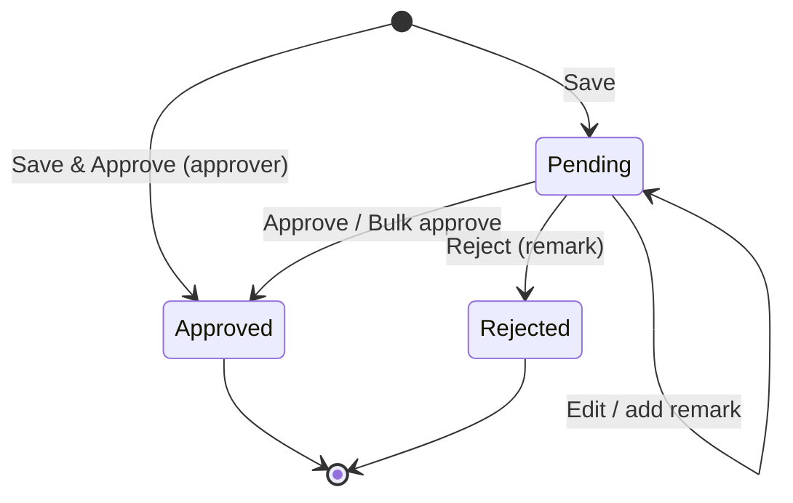
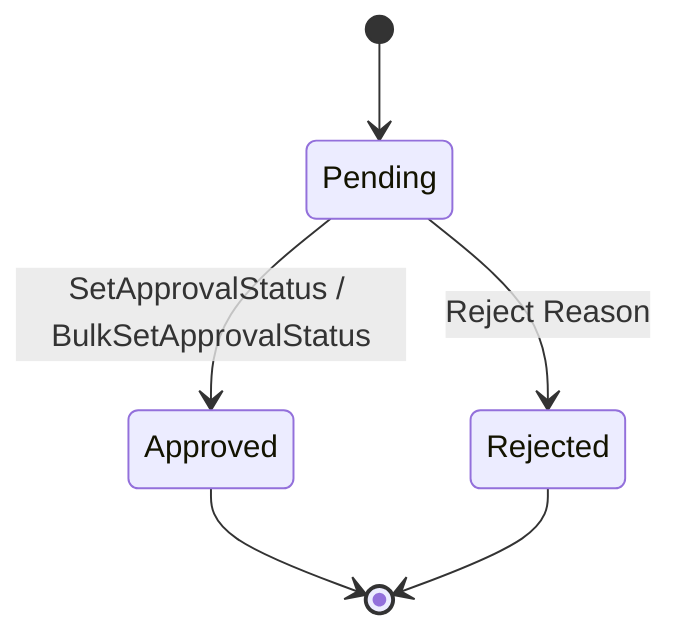
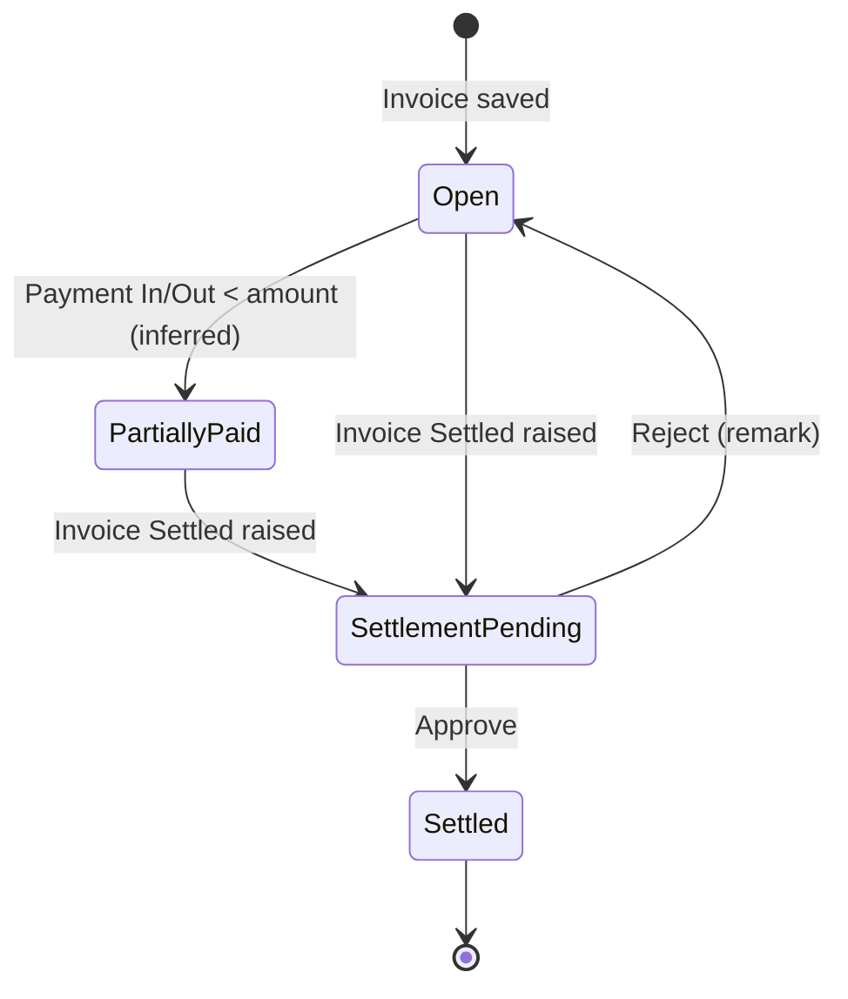
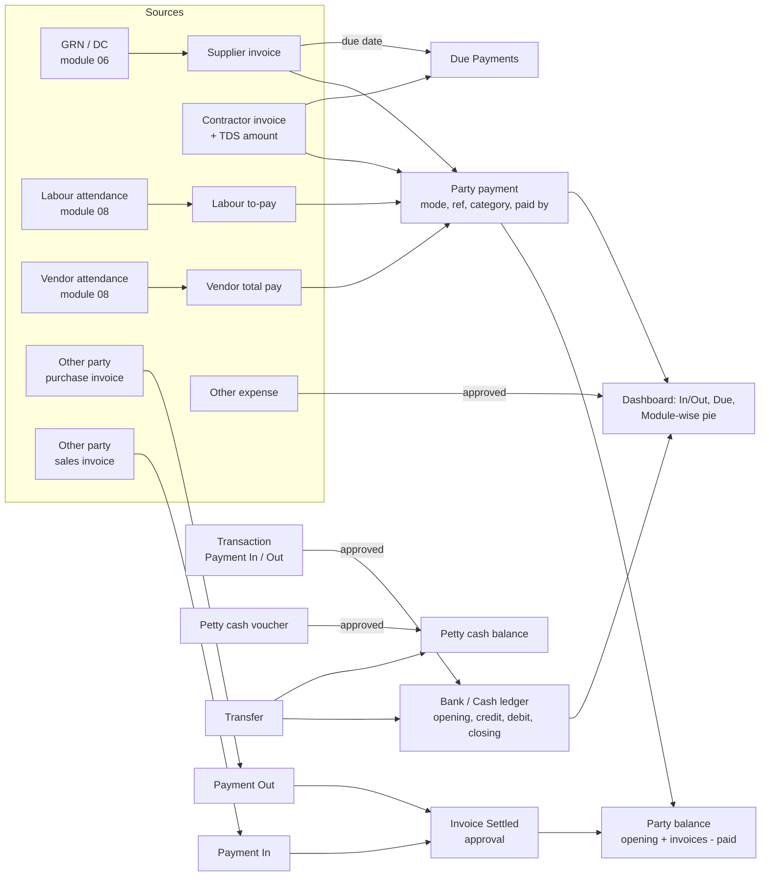

# 07 — Payments & Accounting

Payments & Accounting is where BuildControl records money: the company's own cash and bank accounts, per-user petty cash, general money-in/money-out transactions, and the money owed to and paid to every counter-party (contractors, suppliers, labour, labour-supply vendors, and "other parties"). It also holds the project-level "Payments" tile, the cross-project "Central payment" workspace, and the payment widgets on the project dashboard.

It is not a general ledger. Legacy BuildControl keeps party-wise invoice and payment registers and a cash/bank ledger report; there is no chart of accounts, journal, or GST/TDS ledger beyond a TDS amount field on contractor payments (see Rebuild recommendations).

Who uses it:

- **Company owner / admin** — sets up company bank and cash accounts, sees Central payment and payment dashboards across projects, approves vouchers and transactions.
- **Accountant** (seeded designation with a default permission template) — enters transactions, party invoices and payments, approves or rejects, runs ledger and payment reports.
- **Site engineer / site supervisor / store keeper** — holds a petty-cash account, raises Payment/Receipt vouchers with receipt photos, records labour payments and advances at site.
- **Project manager** — reviews due payments and module-wise spend on the project dashboard.

---

## Legacy behaviour

### Navigation

- **Master tab → Company's Bank A/C** (`#/addBankAccount`, menu #61) — company cash and bank accounts.
- **Master tab → Payment Categories** (`#/addPaymentCategory`, menu #71) — the category list used by petty cash, transactions, and party payments (API `PettyCashCategory/*`).
- **Master tab → Other Party** (`#/addOtherParty`, menu #64) — misc counter-party for purchase/sales invoices.
- **Project home → Payments tile** (menu #47 "Payments", read-only container). The project-level menu lists two children: **Petty Cash** and **Transactions**. Party payment registers (Contractor, Supplier, Labour, Vendor, Other Expenses, Other Party) are reached from the same Payments tile (notes: "Party payments (Payments tile)").
- **Workspace tab → Central payment** (menu #75, read-only) — cross-project payment views (Contractor Centralized Payment Report, Centralized Supplier Payment Report, and the petty-cash user list `officeModulePettyCashUserList` are the evidenced views; exact layout not captured).
- **Workspace → Parties** (`#/officePartiesScreen`, menu #76 "Parties") — other-party balances, purchase/sales invoices, settlements.
- **Project home → Dashboard** (`#/chartsDashboard`) — "Payments" section and the "Payment Approvals" KPI tile.
- **Project home → Reports** — Contractor payment, Supplier payment, Petty Cash, Other Expense, Transaction reports.

### Company bank / cash accounts (`#/addBankAccount`)

- Every new organisation is seeded with two accounts: **"Company's Cash Account"** (account type 1 = Cash) and **"Company's Bank Account"** (account type 2 = Bank). Each carries `isPrimary` and `openingBalance`.
- Add form: **Account Type\*** — `Cash Account` | `Bank Account`; choosing Bank reveals bank fields (field names not captured).
- List actions: **Set As Primary** (`BankAccount/SetAsPrimary`), edit, delete; **print** and **report** flags exist on the menu (#61 `crudpr`).
- These accounts appear as the "paid from / received into" account in Transactions and as the "Company" mode in petty-cash vouchers.

### Petty Cash (`#/pettyCashAccounts`, `#/pettyCashVoucherAddRoute`)

- **Accounts screen** — one petty-cash account per user (team member), each shown with its running balance (`officeModulePettyCashUserList`).
- **Voucher list** per account: Date, Voucher Number, Category, Account Name, Paid To / Received From, Paid For, Amount, Description, receipt image, Status.
- **Voucher types** (add form `#/pettyCashVoucherAddRoute`):
  - **Payment Voucher** — Cash Out; party label "Paid To".
  - **Receipt Voucher** — Cash In; party label "Received From".
  - **Petty Cash Transfer** — "Transfer To" another petty-cash account or a company account.
- **Form sections**: Voucher Date\*, Project, Party (Select Party Name; **Add New Party** → contractor / supplier / team member / vendor / other party), Amount Detail (Enter Amount; Payment / Receipt / Transfer Mode: `Cash` | `Bank` | `Company`; Reference Number; **Add New Account**), Payment Category\*, Description, Voucher Photo / Document attachment.
- **Buttons**: `Save` | `Save & Approve`.
- **Statuses**: Pending for approval | Approved | Rejected. Single approve/reject (`PettyCash/SetApprovalStatus`), bulk (`PettyCash/BulkSetApprovalStatus`), remarks (`PettyCash/Remark`).
- **Export Receipts** — builds a ZIP of voucher receipts asynchronously and delivers it through a notification; v2 endpoint `v2/petty-cash/vouchers/export`.
- **Internal Petty Cash Transfer** — move balance between petty-cash accounts.
- **Petty Cash Report** — voucher-wise: Date, Voucher No, Category, Account, Paid To / Received From, Credit, Debit, Status, Description, View Voucher, Total; Closing Balance shown.

### Transactions (`#/transactionsList`)

- **Entry fields**: Date, Transaction Type (`Payment In` | `Payment Out`), Bank/Cash Account, Category, Payment Mode (`Cash` | `Cheque` | `Online` | `UPI`, with Cheque No or Reference Number), Payment Module (Contractor / Supplier / Labour / Vendor / Other Party / Transaction), Paid To / Received From (party), Project / Store, Amount, Description, attachment.
- **Approval**: Pending / Approved / Rejected; single (`Transaction/SetApprovalStatus`), bulk (`Transaction/BulkSetApprovalStatus`), Reject Reason, remarks (`Transaction/Remark`).
- **Transaction Transfer** — move money between two company accounts (e.g. bank → cash).
- **Import / Sample Export** — Excel import with a downloadable sample (`Transaction/Import`, `Transaction/SampleExport`).
- **Ledger Report** — Opening Balance, Total Credit, Total Debit, Closing Balance; filters Paid To, Bank Account, Category, Type, Mode, Module, Status.
- **Transaction Report** (project report set).

### Contractor payments

- **Invoice list** columns: Created Date, Invoice Date, Contractor, Department, Invoice Number, Invoice Amount, TDS Amount, Paid Amount, Balance, Remarks.
- **Opening Balance** per contractor.
- **Add Payment** (`ContractorPayment/AddPayment`), list (`ContractorPayment/GetAll`), **View Payments**, **View Receipts** (`Invoice/Receipt` — inferred to back receipt view).
- **Contractor quotations** — uploaded on the contractor master; listed via `Contractor/GetAllContractorQuotation(s)` and the "View Quotations" master tile (#29).
- **Contractor Centralized Payment Report** (cross-project).

### Supplier payments

- Columns: Supplier Name, Invoice Date, Invoice Number, Invoice Amount, Paid Amount, Balance, Due Date, GR/DC No, Store/Project.
- Invoice is linked to goods receipts: **Select GRN/DC No** → shows **Total GRN Value** (GRN carries Invoice No, Invoice Date, Invoice Amount — module 06).
- **Add Payment** (`SupplierPayment/AddPayment`), receipts.
- **Centralized Supplier Payment Report**.
- Supplier quotations via `Quotation/GetAllSupplierQuotation(s)`.

### Labour payments

- Per labour: **To Pay**, **Advance**, **Previous Balance**, **Final Amount**.
- Period selector: `Monthly` | `Weekly` | `Custom`.
- Payment form shows "today's wage amount" and an **Advance** field.
- **Mark Paid Leave** (also on attendance — module 08).
- **All Labour Payment Report**; project-wise labour attendance feeds the amount.

### Vendor payments

- Per vendor: Full Day, Half Day, OT Hours, Total Pay, Opening Balance, Advance Paid, Closing Balance (derived from vendor attendance — module 08).

### Other Expenses

- Miscellaneous project expenses with approval (`OtherExpenses/SetApprovalStatus`, `OtherExpenses/BulkSetApprovalStatus`, `OtherExpenses/Remark`). Fields not captured. Appears as a slice in the Module Wise Payment pie and as "Other Expense" in the project report set.

### Other Party / Parties (`#/officePartiesScreen`)

- **Party Balance** list.
- **Add Purchase Invoice** (invoice from the party) | **Add Sales Invoice** (invoice to the party). Fields: Party Name\*, Project\*, Invoice Date\*, Due Date, Invoice Number\*, Invoice Amount\*, Remarks.
- **Payment In / Payment Out** entries against the party (`Party/AddPayment`).
- **Invoice Settled** flow with approval: `Party/InvoiceSettled`, `/SetApprovalStatus`, `/BulkSetApprovalStatus`, `/Reject`, `/Remark`.
- **Sales invoice numbering** — sequence `OtherPartySalesInvoice` (module 12).
- `OtherParty/Invoice` endpoint (list/print of invoices — inferred).

### Common party payment form (Contractor / Supplier / Labour / Vendor)

- **Invoice Details** — invoice no / date / amount; **Settle Invoice**.
- **Payment Detail** — Payment Date\*, Payment Mode (`Cash` | `Bank` → Reference Number / Cheque No, Payment Mode Date), Paid Amount\*, TDS Amount (contractor only), Payment Category, Paid By (name), Remarks, Upload Documents.

### Project dashboard — Payments section (`#/chartsDashboard`)

- **Payment Approvals** KPI tile (count pending).
- **Payment In & Out & Balance** with trend chart.
- **Due Payments** table — party, total invoice, paid, due; export.
- **Module Wise Payment** pie — Contractor / Vendor / Supplier / Labour / Other Expenses.
- Duration filter (default last 1 year). Section toggled/reordered via "Manage Dashboard".

---

## Entities & fields

### CompanyAccount (Company's Bank A/C)

| Field                 | Type                 | Required | Notes                                                                    |
| --------------------- | -------------------- | -------- | ------------------------------------------------------------------------ |
| id                    | uuid                 | yes      |                                                                          |
| companyId             | FK → Company         | yes      | Tenant scope                                                             |
| name                  | string               | yes      | Seed: "Company's Cash Account", "Company's Bank Account"                 |
| accountType           | enum{CASH=1, BANK=2} | yes      | "Account Type\*"                                                         |
| bankName              | string               | no       | Bank fields shown when type = Bank; exact fields not captured (inferred) |
| accountNumber         | string               | no       | (inferred)                                                               |
| ifsc                  | string               | no       | (inferred)                                                               |
| branch                | string               | no       | (inferred)                                                               |
| isPrimary             | bool                 | yes      | Exactly one primary (inferred: per company); `SetAsPrimary`              |
| openingBalance        | decimal(14,2)        | yes      | Default 0                                                                |
| createdAt / updatedAt | datetime             | yes      |                                                                          |

### PaymentCategory

| Field      | Type         | Required | Notes                                                                                                                                                                                      |
| ---------- | ------------ | -------- | ------------------------------------------------------------------------------------------------------------------------------------------------------------------------------------------ |
| id         | uuid         | yes      |                                                                                                                                                                                            |
| companyId  | FK → Company | no       | Null for seeded global rows (inferred, as with Designations)                                                                                                                               |
| name       | string       | yes      | Seed: Bonus, Canteen, Computer and software, Conveyance, Entertainment, Fuel, Hardware, Housekeeping, Internet, Labour, Labour Payment, Maintenance, Marketing and Advertising, Medical, … |
| isDisabled | bool         | yes      | `PettyCashCategory/Disable`                                                                                                                                                                |

### PettyCashAccount

| Field          | Type            | Required | Notes                                                                                                                                         |
| -------------- | --------------- | -------- | --------------------------------------------------------------------------------------------------------------------------------------------- |
| id             | uuid            | yes      |                                                                                                                                               |
| companyId      | FK → Company    | yes      |                                                                                                                                               |
| employeeId     | FK → TeamMember | yes      | One per user                                                                                                                                  |
| openingBalance | decimal(14,2)   | no       | (inferred)                                                                                                                                    |
| balance        | decimal(14,2)   | derived  | Opening + approved receipts + transfers in − approved payments − transfers out (inferred: whether pending vouchers count is an open question) |

### PettyCashVoucher

| Field                   | Type                                                                                        | Required       | Notes                                                    |
| ----------------------- | ------------------------------------------------------------------------------------------- | -------------- | -------------------------------------------------------- |
| id                      | uuid                                                                                        | yes            |                                                          |
| voucherNumber           | string                                                                                      | yes            | From `PettyCash` sequence (module 12)                    |
| voucherType             | enum{PAYMENT, RECEIPT, TRANSFER}                                                            | yes            | Payment = Cash Out, Receipt = Cash In                    |
| direction               | enum{CASH_IN, CASH_OUT}                                                                     | derived        | From type                                                |
| voucherDate             | date                                                                                        | yes            | "Voucher Date\*"; subject to back-dated entry control    |
| pettyCashAccountId      | FK → PettyCashAccount                                                                       | yes            | "Account Name"                                           |
| projectId               | FK → Project                                                                                | no             | "Project"                                                |
| partyType               | enum{OTHER_PARTY=1, CONTRACTOR=2, SUPPLIER=3, LABOUR=5, VENDOR=6, TEAM_MEMBER(inferred), …} | no             | Petty cash supports paid-to types 1..7                   |
| partyId                 | FK → party of partyType                                                                     | no             | "Paid To" / "Received From"                              |
| transferToAccountId     | FK → PettyCashAccount or CompanyAccount                                                     | when TRANSFER  | "Transfer To"                                            |
| amount                  | decimal(14,2)                                                                               | yes            | > 0                                                      |
| mode                    | enum{CASH, BANK, COMPANY}                                                                   | yes (inferred) | Payment / Receipt / Transfer Mode                        |
| referenceNumber         | string                                                                                      | no             | For Bank mode                                            |
| companyAccountId        | FK → CompanyAccount                                                                         | no             | When mode = Company / Bank (inferred); "Add New Account" |
| paymentCategoryId       | FK → PaymentCategory                                                                        | yes            | "Payment Category\*"                                     |
| paidFor                 | string                                                                                      | no             | Shown in list                                            |
| description             | text                                                                                        | no             |                                                          |
| attachments             | file[]                                                                                      | no             | Voucher photo / document                                 |
| status                  | enum{PENDING, APPROVED, REJECTED}                                                           | yes            |                                                          |
| approvedBy / approvedAt | FK → TeamMember / datetime                                                                  | no             | (inferred)                                               |
| rejectReason            | text                                                                                        | no             | (inferred from remarks)                                  |
| remarks                 | Remark[]                                                                                    | no             | `PettyCash/Remark`                                       |
| createdBy / createdAt   | FK / datetime                                                                               | yes            |                                                          |

### Transaction

| Field             | Type                                                                 | Required       | Notes                                              |
| ----------------- | -------------------------------------------------------------------- | -------------- | -------------------------------------------------- |
| id                | uuid                                                                 | yes            |                                                    |
| date              | date                                                                 | yes            | Back-dated entry control applies                   |
| transactionType   | enum{PAYMENT_IN, PAYMENT_OUT}                                        | yes            |                                                    |
| companyAccountId  | FK → CompanyAccount                                                  | yes            | "Bank/Cash Account"                                |
| paymentCategoryId | FK → PaymentCategory                                                 | no             |                                                    |
| paymentMode       | enum{CASH, CHEQUE, ONLINE, UPI}                                      | yes            | Cash → account type 1; others → bank (type 2)      |
| chequeNumber      | string                                                               | if CHEQUE      | "Cheque No"                                        |
| referenceNumber   | string                                                               | if ONLINE/UPI  | "Reference Number"                                 |
| paymentModule     | enum{CONTRACTOR, SUPPLIER, LABOUR, VENDOR, OTHER_PARTY, TRANSACTION} | yes (inferred) | Module/Combo                                       |
| paidToType        | enum (paid-to types 1,4,8 for "Transaction" module)                  | no             | Meaning of 4 and 8 not captured                    |
| partyId           | FK → party                                                           | no             | "Paid To / Received From"                          |
| projectId         | FK → Project                                                         | no             | "Project / Store"                                  |
| storeId           | FK → Store                                                           | no             | Alternative to project                             |
| amount            | decimal(14,2)                                                        | yes            |                                                    |
| description       | text                                                                 | no             |                                                    |
| attachments       | file[]                                                               | no             |                                                    |
| status            | enum{PENDING, APPROVED, REJECTED}                                    | yes            |                                                    |
| rejectReason      | text                                                                 | no             |                                                    |
| remarks           | Remark[]                                                             | no             |                                                    |
| transferId        | FK → AccountTransfer                                                 | no             | Set when part of a Transaction Transfer (inferred) |

### AccountTransfer (Transaction Transfer / Internal Petty Cash Transfer)

| Field           | Type                                      | Required       | Notes                                           |
| --------------- | ----------------------------------------- | -------------- | ----------------------------------------------- |
| id              | uuid                                      | yes            |                                                 |
| date            | date                                      | yes            |                                                 |
| fromAccount     | FK → CompanyAccount or PettyCashAccount   | yes            |                                                 |
| toAccount       | FK → CompanyAccount or PettyCashAccount   | yes            | ≠ fromAccount                                   |
| amount          | decimal(14,2)                             | yes            |                                                 |
| mode            | enum{CASH, BANK, COMPANY} or payment mode | no             |                                                 |
| referenceNumber | string                                    | no             |                                                 |
| description     | text                                      | no             |                                                 |
| status          | enum{PENDING, APPROVED, REJECTED}         | yes (inferred) | Petty cash transfers are vouchers with approval |

### PartyOpeningBalance

| Field     | Type                                                    | Required | Notes                                                                                             |
| --------- | ------------------------------------------------------- | -------- | ------------------------------------------------------------------------------------------------- |
| partyType | enum{CONTRACTOR, SUPPLIER, LABOUR, VENDOR, OTHER_PARTY} | yes      | Contractor and vendor "Opening Balance" evidenced; labour opening balance is on the labour master |
| partyId   | FK                                                      | yes      |                                                                                                   |
| projectId | FK → Project                                            | no       | Per project or company-wide is not settled                                                        |
| amount    | decimal(14,2)                                           | yes      | Sign convention not captured                                                                      |

### ContractorInvoice

| Field         | Type            | Required       | Notes                                             |
| ------------- | --------------- | -------------- | ------------------------------------------------- |
| id            | uuid            | yes            |                                                   |
| projectId     | FK → Project    | yes            |                                                   |
| contractorId  | FK → Contractor | yes            |                                                   |
| departmentId  | FK → Department | no             | Contractor's trade                                |
| invoiceNumber | string          | yes (inferred) | Supplied by contractor, not a system sequence     |
| invoiceDate   | date            | yes (inferred) |                                                   |
| invoiceAmount | decimal(14,2)   | yes            |                                                   |
| tdsAmount     | decimal(14,2)   | no             | Entered manually; no section/rate                 |
| paidAmount    | decimal(14,2)   | derived        | Sum of payments                                   |
| balance       | decimal(14,2)   | derived        | invoiceAmount − tdsAmount (inferred) − paidAmount |
| remarks       | text            | no             |                                                   |
| createdAt     | datetime        | yes            | "Created Date" column                             |
| isSettled     | bool            | no             | "Settle Invoice"                                  |

### ContractorQuotation

| Field        | Type            | Required | Notes                         |
| ------------ | --------------- | -------- | ----------------------------- |
| contractorId | FK → Contractor | yes      |                               |
| files        | file[]          | yes      | Uploaded on contractor master |
| projectId    | FK → Project    | no       | (inferred)                    |

### SupplierInvoice

| Field               | Type                 | Required | Notes                     |
| ------------------- | -------------------- | -------- | ------------------------- |
| id                  | uuid                 | yes      |                           |
| supplierId          | FK → Supplier        | yes      |                           |
| projectId / storeId | FK → Project / Store | yes      | "Store/Project"           |
| invoiceNumber       | string               | yes      |                           |
| invoiceDate         | date                 | yes      |                           |
| invoiceAmount       | decimal(14,2)        | yes      |                           |
| dueDate             | date                 | no       | Feeds Due Payments        |
| goodsReceiptIds     | FK → GoodsReceipt[]  | no       | "Select GRN/DC No"        |
| totalGrnValue       | decimal(14,2)        | derived  | Sum of linked GRN amounts |
| paidAmount          | decimal(14,2)        | derived  |                           |
| balance             | decimal(14,2)        | derived  |                           |

### PartyPayment (contractor / supplier / labour / vendor)

| Field             | Type                                       | Required       | Notes                                                                       |
| ----------------- | ------------------------------------------ | -------------- | --------------------------------------------------------------------------- |
| id                | uuid                                       | yes            |                                                                             |
| partyType         | enum{CONTRACTOR, SUPPLIER, LABOUR, VENDOR} | yes            |                                                                             |
| partyId           | FK                                         | yes            |                                                                             |
| projectId         | FK → Project                               | yes (inferred) |                                                                             |
| invoiceId         | FK → ContractorInvoice / SupplierInvoice   | no             | Contractor/supplier                                                         |
| paymentDate       | date                                       | yes            | "Payment Date\*"                                                            |
| paymentMode       | enum{CASH, BANK}                           | yes (inferred) | Bank sub-modes Cheque/Online/UPI per lookups                                |
| referenceNumber   | string                                     | no             |                                                                             |
| chequeNumber      | string                                     | no             |                                                                             |
| paymentModeDate   | date                                       | no             | e.g. cheque date                                                            |
| paidAmount        | decimal(14,2)                              | yes            | "Paid Amount\*"                                                             |
| tdsAmount         | decimal(14,2)                              | no             | Contractor only                                                             |
| paymentCategoryId | FK → PaymentCategory                       | no             |                                                                             |
| paidBy            | string                                     | no             | Free-text name                                                              |
| isAdvance         | bool                                       | no             | Labour "Advance"                                                            |
| remarks           | text                                       | no             |                                                                             |
| documents         | file[]                                     | no             |                                                                             |
| companyAccountId  | FK → CompanyAccount                        | no             | Whether party payments post to a company account is not captured (inferred) |

### LabourPaymentPeriod (computed view)

| Field             | Type                          | Required | Notes                                                |
| ----------------- | ----------------------------- | -------- | ---------------------------------------------------- |
| labourId          | FK → Labour                   | yes      |                                                      |
| projectId         | FK → Project                  | yes      |                                                      |
| periodType        | enum{MONTHLY, WEEKLY, CUSTOM} | yes      |                                                      |
| fromDate / toDate | date                          | yes      |                                                      |
| toPay             | decimal(14,2)                 | derived  | Wages earned from attendance + OT (module 08)        |
| advance           | decimal(14,2)                 | derived  | Advances paid in period                              |
| previousBalance   | decimal(14,2)                 | derived  | Carry-forward incl. opening balance                  |
| finalAmount       | decimal(14,2)                 | derived  | toPay + previousBalance − advance (inferred formula) |

### VendorPaymentSummary (computed view)

| Field               | Type          | Required | Notes                                    |
| ------------------- | ------------- | -------- | ---------------------------------------- |
| vendorId            | FK → Vendor   | yes      |                                          |
| projectId           | FK → Project  | yes      |                                          |
| fullDays / halfDays | int           | derived  | From vendor attendance                   |
| otHours             | decimal(6,2)  | derived  |                                          |
| totalPay            | decimal(14,2) | derived  |                                          |
| openingBalance      | decimal(14,2) | yes      |                                          |
| advancePaid         | decimal(14,2) | derived  |                                          |
| closingBalance      | decimal(14,2) | derived  | opening + totalPay − payments (inferred) |

### OtherExpense

| Field             | Type                              | Required       | Notes              |
| ----------------- | --------------------------------- | -------------- | ------------------ |
| id                | uuid                              | yes            |                    |
| projectId         | FK → Project                      | yes (inferred) |                    |
| date              | date                              | yes (inferred) |                    |
| amount            | decimal(14,2)                     | yes (inferred) |                    |
| paymentCategoryId | FK → PaymentCategory              | no (inferred)  |                    |
| description       | text                              | no (inferred)  |                    |
| status            | enum{PENDING, APPROVED, REJECTED} | yes            | Approval evidenced |
| remarks           | Remark[]                          | no             |                    |

### OtherParty

| Field      | Type           | Required | Notes            |
| ---------- | -------------- | -------- | ---------------- |
| id         | uuid           | yes      |                  |
| name       | string         | yes      | "Party Name\*"   |
| projectIds | FK → Project[] | no       | "Select Project" |

### OtherPartyInvoice

| Field         | Type                  | Required | Notes                                                            |
| ------------- | --------------------- | -------- | ---------------------------------------------------------------- |
| id            | uuid                  | yes      |                                                                  |
| invoiceKind   | enum{PURCHASE, SALES} | yes      | Purchase = from party; Sales = to party                          |
| otherPartyId  | FK → OtherParty       | yes      | "Party Name\*"                                                   |
| projectId     | FK → Project          | yes      | "Project\*"                                                      |
| invoiceDate   | date                  | yes      |                                                                  |
| dueDate       | date                  | no       |                                                                  |
| invoiceNumber | string                | yes      | Sales: from `OtherPartySalesInvoice` sequence; Purchase: entered |
| invoiceAmount | decimal(14,2)         | yes      |                                                                  |
| remarks       | text                  | no       |                                                                  |
| settledAmount | decimal(14,2)         | derived  |                                                                  |

### OtherPartyPayment

| Field            | Type                          | Required       | Notes      |
| ---------------- | ----------------------------- | -------------- | ---------- |
| id               | uuid                          | yes            |            |
| otherPartyId     | FK → OtherParty               | yes            |            |
| direction        | enum{PAYMENT_IN, PAYMENT_OUT} | yes            |            |
| date             | date                          | yes (inferred) |            |
| amount           | decimal(14,2)                 | yes            |            |
| mode / reference | as PartyPayment               | no             | (inferred) |

### InvoiceSettlement

| Field        | Type                              | Required       | Notes                                         |
| ------------ | --------------------------------- | -------------- | --------------------------------------------- |
| id           | uuid                              | yes            |                                               |
| invoiceId    | FK → OtherPartyInvoice            | yes            |                                               |
| paymentIds   | FK → OtherPartyPayment[]          | no             | (inferred)                                    |
| amount       | decimal(14,2)                     | yes (inferred) |                                               |
| status       | enum{PENDING, APPROVED, REJECTED} | yes            | `InvoiceSettled/SetApprovalStatus`, `/Reject` |
| rejectReason | text                              | no             |                                               |
| remarks      | Remark[]                          | no             |                                               |

### Remark (shared)

| Field                 | Type          | Required | Notes                                              |
| --------------------- | ------------- | -------- | -------------------------------------------------- |
| entityType / entityId | string / uuid | yes      | Petty cash, transaction, other expense, settlement |
| text                  | text          | yes      |                                                    |
| createdBy / createdAt | FK / datetime | yes      |                                                    |

---

## Workflows & states

### 1. Organisation onboarding seeds accounts

1. Company is created (module 01).
2. System creates "Company's Cash Account" (type 1, primary — inferred) and "Company's Bank Account" (type 2) with opening balance 0.
3. Admin edits opening balances and adds further bank accounts; sets one as primary.

### 2. Petty cash voucher

1. User opens their petty-cash account (`#/pettyCashAccounts`) and taps add (`#/pettyCashVoucherAddRoute`).
2. Picks voucher type: Payment, Receipt, or Petty Cash Transfer.
3. Enters Voucher Date (back-dated limits apply), Project, Party (or adds a new one inline), Amount, Mode (Cash/Bank/Company), Reference Number, Payment Category, Description, photo.
4. `Save` → status Pending for approval. `Save & Approve` → Approved immediately (only for users with approve permission — inferred).
5. Approver reviews singly or in bulk; Approve or Reject with remark.
6. Approved vouchers update the account balance and appear in the Petty Cash Report (Credit/Debit).

Whether a Rejected voucher can be edited and resubmitted, or an Approved one reverted, is not captured.

### 3. Petty cash funding and transfer

1. Owner funds a site engineer: a Petty Cash Transfer voucher from a company account (mode Company) — or a Transaction Transfer — into the engineer's petty-cash account.
2. Engineer can transfer to another petty-cash account (Internal Petty Cash Transfer).
3. Both sides' balances move once approved (inferred).

### 4. Transaction (Payment In / Out)

1. Accountant adds a transaction: Date, Type, Bank/Cash Account, Category, Payment Mode (+ Cheque No / Reference Number), Payment Module, party, Project or Store, Amount, Description, attachment.
2. Status Pending → Approved / Rejected (Reject Reason), single or bulk.
3. Approved transactions roll into the Ledger Report balance of the selected account.
4. Bulk entry via Excel: download sample (`Transaction/SampleExport`), fill, import (`Transaction/Import`).

### 5. Transaction Transfer between accounts

1. Choose from-account and to-account (company accounts), amount, date.
2. System records an outflow from the source and an inflow to the destination (inferred: as a pair of transactions).

### 6. Contractor invoice and payment

1. Accountant records the contractor's invoice: Contractor, Department, Invoice No, Invoice Date, Invoice Amount, TDS Amount, Remarks.
2. Add Payment: Payment Date, Mode (Cash/Bank + reference/cheque no + mode date), Paid Amount, TDS Amount, Category, Paid By, Remarks, Documents.
3. Paid Amount and Balance on the invoice update; when balance reaches zero (or via Settle Invoice) the invoice is settled.
4. View Payments / View Receipts; Contractor payment report; Contractor Centralized Payment Report across projects.

### 7. Supplier invoice and payment

1. PO → GRN (module 06) records goods with Invoice No / Date / Amount and DC No.
2. Accountant creates a supplier invoice and selects GRN/DC No(s); Total GRN Value is shown for cross-check.
3. Due Date drives the Due Payments widget.
4. Add Payment as above (no TDS field evidenced); balance updates.

### 8. Labour payment

1. Attendance is marked daily (module 08).
2. On Labour payments, pick period Monthly / Weekly / Custom.
3. System shows per labour To Pay, Advance, Previous Balance, Final Amount.
4. Record a payment or an Advance (form shows "today's wage amount").
5. Mark Paid Leave adjusts wage for leave days.

### 9. Vendor payment

1. Vendor attendance (module 08) gives full/half days and OT per category per shift.
2. Total Pay = days × rate/day + OT hours × OT rate (rates from vendor shift definitions).
3. Opening Balance + Total Pay − Advance Paid − payments = Closing Balance (inferred formula).
4. Record payment / advance.

### 10. Other expenses

1. Add expense; status Pending → Approved/Rejected (single or bulk), with remarks.

### 11. Other party purchase / sales invoice and settlement

1. On Parties (`#/officePartiesScreen`), choose Add Purchase Invoice or Add Sales Invoice.
2. Sales invoice number comes from the `OtherPartySalesInvoice` sequence; purchase invoice number is typed.
3. Record Payment In (customer pays) or Payment Out (we pay).
4. Raise an Invoice Settled entry; it goes to approval; approver approves (single/bulk) or rejects with remark.
5. Party Balance reflects invoices minus settled payments.

### 12. Money flow (invoice → payment → ledger)

Whether a party payment automatically creates a Transaction (and therefore hits the cash/bank ledger) is not captured; the Payment Module field on Transactions suggests transactions can be tagged to a party module, which may be how legacy links them.

---

## Business rules & validations

**Required fields**

- Company account: Account Type.
- Payment Category master: name.
- Other Party: Party Name.
- Petty cash voucher: Voucher Date, Payment Category, Amount (inferred), voucher type; Transfer To when type is Transfer.
- Transaction: Date, Transaction Type, Bank/Cash Account, Amount (inferred), Payment Mode.
- Party payment: Payment Date, Paid Amount.
- Other party invoice: Party Name, Project, Invoice Date, Invoice Number, Invoice Amount.

**Payment mode rules**

- Cash maps to a cash account (account_type 1); Cheque, Online, UPI map to a bank account (account_type 2).
- Cheque requires Cheque No; Online and UPI require Reference Number (inferred "required"; notes show the field only).
- Party payment form mode is `Cash` | `Bank`; Bank requires Reference Number or Cheque No and a Payment Mode Date.
- Petty-cash voucher mode is `Cash` | `Bank` | `Company`.

**Numbering**

- Petty cash voucher numbers come from the `PettyCash` sequence; Other Party sales invoices from `OtherPartySalesInvoice`. Rule rows: Project (All/Default or specific), Prefix (e.g. `PR/26-27`), Project Id (e.g. `PX`), Start Number → `PREFIX/PROJECTID/00001` (module 12).
- Transactions, contractor invoices, supplier invoices, and purchase invoices have no system sequence; invoice numbers are typed.

**Balances**

- Company account balance = opening balance + approved Payment In − approved Payment Out ± transfers (inferred).
- Petty cash balance shown per user; Closing Balance on the Petty Cash Report.
- Ledger Report computes Opening Balance (before filter start), Total Credit, Total Debit, Closing Balance.
- Contractor invoice Balance = Invoice Amount − TDS − Paid (TDS treatment inferred).
- Supplier invoice Balance = Invoice Amount − Paid.
- Labour Final Amount = To Pay + Previous Balance − Advance (inferred).
- Vendor Closing Balance = Opening + Total Pay − Advance Paid − payments (inferred).
- Only one company account can be primary (inferred from SetAsPrimary).

**Approval gates**

- Approval exists on petty-cash vouchers, transactions, other expenses, and other-party invoice settlements. Single, bulk, remark, reject reason.
- `Save & Approve` is offered on petty-cash vouchers; presumably only when the user holds Approve on Petty Cash (inferred).
- Dashboard KPI "Payment Approvals" counts pending payment items.

**Back-dated entry and financial closing (module 12)**

- Accounts group overrides cover **Petty Cash** and **Transactions**: restrict creating entries older than N days and editing entries older than N days, with designation overrides.
- A **financial closing date** (company-level, also per user row `financialClosingDate`) blocks entries on or before it (inferred: blocks create and edit).
- Per-user `backdatedCreateDays` / `backdatedEditDays` exist on the permission row.

**Permission gates**

- The `financial` flag hides money values (amounts, rates, balances) in modules that carry it (inferred from name; see Permissions). In this module it is on Labour (#58) and Vendor (#59) attendance-payment menus, Vendors master (#60), Labours master (#69), Project (#4), Task, Material Received, Materials, Equipment.
- `viewAll` on Petty Cash (#52) — without it a user sees only their own petty-cash account and vouchers (inferred).
- Central payment (#75) and Payments (#47) are read-only containers.

**Currency**

- Company currency (default INR, `₹1,00,000.00` lakh format); `isNonIndianCompany` flag (module 12). All amounts in company currency; no multi-currency per transaction.

---

## Permissions

Flags (from `_working-notes.md`): C create, R read, U update, D delete, A approve, J reject, P print/download, N notification, V view all, T transfer, O report, F financial, E export, I import. UI matrix columns: ADD, VIEW, EDIT, DELETE, APPROVE, REJECT, DOWNLOAD, REPORT, VIEW ALL, NOTIFICATION, TRANSFER, FINANCIAL.

| Menu (id)                | Flags      | Decoded                                                                              | Notes                                                                                          |
| ------------------------ | ---------- | ------------------------------------------------------------------------------------ | ---------------------------------------------------------------------------------------------- |
| Central payment (#75)    | R          | read                                                                                 | Workspace view                                                                                 |
| Payments (#47)           | R          | read                                                                                 | Project tile container                                                                         |
| Transactions (#63)       | CRUDAJPNO  | create, read, update, delete, approve, reject, print, notification, report           | Reject is its own flag (Reject Reason). No E/I flag although the UI has Import / Sample Export |
| Parties (#76)            | CRUDAJEPNO | create, read, update, delete, approve, reject, export, print, notification, report   | Approve/reject drive Invoice Settled; only Payments menu with Export                           |
| Petty Cash (#52)         | CRUDAJPNVO | create, read, update, delete, approve, reject, print, notification, view all, report | View all controls seeing other users' accounts (inferred)                                      |
| Company's Bank A/C (#61) | CRUDPO     | create, read, update, delete, print, report                                          |                                                                                                |
| Payment Categories (#71) | CRUD       | create, read, update, delete                                                         |                                                                                                |
| Other Party (#64)        | CRUD       | create, read, update, delete                                                         |                                                                                                |
| Contractors (#31)        | CRUD       | create, read, update, delete                                                         | Master; payments live under Payments                                                           |
| Supplier (#9)            | CRUD       | create, read, update, delete                                                         |                                                                                                |
| Vendors (#60)            | CRUDF      | create, read, update, delete, financial                                              | Financial hides rates (inferred)                                                               |
| Labours (#69)            | CRUDF      | create, read, update, delete, financial                                              | Financial hides wage (inferred)                                                                |
| Labour (#58, project)    | CRUDPTOF   | create, read, update, delete, print, transfer, report, financial                     | Labour payment screens; transfer = labour transfer                                             |
| Vendor (#59, project)    | CRUDPOF    | create, read, update, delete, print, report, financial                               | Vendor payment screens                                                                         |
| View Quotations (#29)    | R          | read                                                                                 | Contractor/supplier quotations                                                                 |
| Dashboard (#65)          | R          | read                                                                                 | Payments section                                                                               |
| Central Reports (#77)    | R          | read                                                                                 | Centralized payment reports                                                                    |

Other Expenses has no menu row of its own; its approve/reject endpoints presumably sit under Transactions or Payments (inferred).

The `financial` flag: no Payments-group menu carries `F`, yet the money screens in Labour/Vendor/Project do. Rebuild should define `financial` explicitly as "may see monetary amounts" and apply it consistently (see Open questions).

Seeded designations with permission templates relevant here: Accountant, Admin, Project Manager, Site Engineer, Site Supervisor, Store Keeper (module 01).

---

## Relationships

→ depends on

- **01 Organization/Identity/Access** — company, team members (petty-cash account holders, approvers, "Paid By"), permission matrix, seeded accounts on company creation.
- **02 Master Records** — Company's Bank A/C, Payment Categories, Contractors (departments, GST, PAN, quotations), Suppliers, Vendors (shift rates), Labours (wages, opening balance), Other Party, Departments.
- **03 Projects** — every payment is scoped to a project (or a store); project resource assignment limits which parties appear.
- **06 Procurement & Inventory** — GRN/DC numbers and invoice amounts feed supplier invoices; central stores are a Transaction scope.
- **08 Labour & Vendor Attendance** — source of labour to-pay and vendor total pay.
- **12 Settings** — numbering (PettyCash, OtherPartySalesInvoice), back-dated entry control (Accounts group), financial closing date, currency.

← used by

- **11 Reports/Dashboards/Backup** — Payment In/Out, Due Payments, Module Wise Payment widgets; project report set (Contractor payment, Supplier payment, Petty Cash, Other Expense, Transaction); central reports; project backup.
- **10 HRMS** — salary payments and advances are HRMS-side; no evidence they post here (open question).
- **09 Sales CRM** — no evidenced link from bookings to Payment In; allottee collections would land here in the rebuild.
- **13 Chat/Notifications** — Export Receipts ZIP delivered by notification; per-module notification permission on Transactions, Parties, Petty Cash.

---

## Reports & exports

| Report / export                       | Scope             | Contents                                                                                                                             |
| ------------------------------------- | ----------------- | ------------------------------------------------------------------------------------------------------------------------------------ |
| Petty Cash Report                     | Project / account | Date, Voucher No, Category, Account, Paid To/Received from, Credit, Debit, Status, Description, View Voucher, Total, Closing Balance |
| Export Receipts                       | Petty cash        | ZIP of voucher attachments, async, delivered via notification (`v2/petty-cash/vouchers/export`)                                      |
| Ledger Report                         | Company account   | Opening Balance, Total Credit, Total Debit, Closing Balance; filters Paid To, Bank Account, Category, Type, Mode, Module, Status     |
| Transaction Report                    | Project           | Transaction list (columns as entry)                                                                                                  |
| Transaction Sample Export / Import    | Company           | Excel template and import                                                                                                            |
| Contractor payment report             | Project           | Invoice/payment register                                                                                                             |
| Contractor Centralized Payment Report | All projects      | Cross-project contractor dues                                                                                                        |
| Supplier payment report               | Project           | Invoice/payment register                                                                                                             |
| Centralized Supplier Payment Report   | All projects      |                                                                                                                                      |
| All Labour Payment Report             | Project           | Per-labour to-pay/advance/balance                                                                                                    |
| Other Expense report                  | Project           |                                                                                                                                      |
| Company's Bank A/C print/report       | Company           | (contents not captured)                                                                                                              |
| Due Payments table                    | Dashboard         | Party, total invoice, paid, due; export                                                                                              |
| Receipts                              | Party payments    | View Receipts (`Invoice/Receipt`)                                                                                                    |

Reports render PDF or Excel with header (Organisation, Project, Address, Duration) and "Page x of y" (module 11). Project backup includes all payment data.

---

## Rebuild recommendations

1. **Single payments ledger under the registers.** Model every money movement (petty-cash voucher, transaction, party payment, transfer, settlement) as a posting against an account (company bank/cash, petty-cash, party). Party balances, account ledgers, dashboard totals, and Central payment views then derive from one table instead of five registers that may disagree. Keep the legacy registers as views.
2. **Party payment always names the paying account.** Legacy party payments record Cash/Bank and a reference, but the notes don't show which company account the money left. Make the account required so the bank ledger reconciles.
3. **TDS as a computed deduction, not a typed number.** Party master gets PAN, entity type (individual/HUF vs others), and default TDS section; payment computes 194C (1% individual/HUF, 2% others; ₹30,000 single / ₹1,00,000 aggregate per FY), 194J (10% professional / 2% technical; ₹50,000), 194I for equipment hire (2% plant/machinery; ₹6L/yr), and 194Q for large-buyer goods purchases (0.1% above ₹50L per seller per FY), with per-FY cumulative threshold tracking, a TDS ledger, and Form 26Q / 16A exports. Store rates and thresholds as dated configuration — the Income-tax Act 2025 renumbers 194C to 393(1) from 1 Apr 2026. (research §2 TDS)
4. **GST on invoices.** Supplier and contractor invoices carry taxable value, GST rate, CGST/SGST/IGST split, and an ITC-eligible flag derived from project type (s.17(5) blocks ITC on own-account construction). Promoter projects need the 80/20 registered-supplier test per project per FY with RCM on shortfall. Other-party sales invoices need e-invoice (IRN) generation when AATO > ₹5 crore. (research §2 GST)
5. **Contractor work orders and RA bills replace free-form contractor invoices.** RA bill = cumulative measured value − previous bills − deductions (retention 5–10%, mobilisation advance recovery, TDS, material issued at cost, penalties), with a deductions register and retention release (50% at completion / 50% at DLP end). The legacy contractor invoice becomes the RA bill's payable. (research §3)
6. **Supplier invoice three-way match.** Legacy already links invoice → GRN/DC and shows Total GRN Value; add PO rate check and a variance flag rather than just showing the total.
7. **Due dates and ageing.** Legacy has Due Date on supplier and other-party invoices and a Due Payments table; add ageing buckets and payment-terms days from the PO (PO already has Payment Terms (Days) — module 06).
8. **UPI receipts and payment links.** For Payment In from allottees and other parties, generate UPI collection links and auto-create the receipt on settlement; aggregators settle UPI at 0% MDR. (research §4 item 6)
9. **RERA 70% account.** Tag one company bank account per project as the RERA designated account; allottee receipts post 70% to it, and withdrawals are checked against certified % completion. (research §2 RERA)
10. **Tally / Zoho Books sync in the base plan.** Push purchase, payment, receipt and journal (TDS/GST) vouchers; pull ledgers and party balances. Competitors charge ₹20,000 + ₹5,000/yr for this. (research §4 item 3)
11. **Explicit `financial` permission.** Define it as "may see monetary values" and apply to every amount column across modules, including dashboard widgets and reports; legacy applies it inconsistently.
12. **Approval rules engine.** Legacy has one approve/reject level on vouchers, transactions, expenses and settlements. Add amount thresholds and multi-level approval (Onsite sells multi-level approval in its mid tier — research §1). `Save & Approve` only when the creator holds approve and the amount is within their limit.
13. **Immutable approved entries.** After approval or after the financial closing date, edits become reversals, keeping the audit trail.
14. **Reconcile reference numbers.** Unique (account, reference number) check to catch duplicate UPI/NEFT entries; optional bank-statement import.
15. **Labour wages vs minimum wage.** When paying labour, warn when effective daily wage is below the state rate card for the labour's skill category. (research §2 Labour)
16. **Vendor portal.** Let contractors/vendors see their invoices, payments, and TDS certificates (research §4 item 7) — later phase.

---

## Open questions

1. What are paid-to types 4, 7 and 8? (Transactions accept 1, 4, 8; petty cash 1..7.) Team member is a likely candidate for one of them.
2. Does a party payment (contractor/supplier/labour/vendor) create a Transaction row and hit the bank/cash ledger, or are the two independent?
3. Is the "Payment Module" on a Transaction just a tag, or does it link to a specific invoice/party balance?
4. Is TDS deducted from the invoice balance or tracked separately? Is there any TDS report?
5. Are opening balances per party per project, or per party company-wide? Sign convention (payable vs receivable)?
6. Does the petty-cash balance include pending vouchers or only approved?
7. Can a rejected voucher/transaction be edited and resubmitted? Can approval be revoked?
8. Why does no Payments-group menu (Transactions, Parties, Petty Cash, Central payment, Payments) carry the `financial` flag when Labour (#58), Vendor (#59), Labours (#69) and Vendors (#60) do? Can a user without `financial` still see amounts in Transactions and Petty Cash?
9. Exact bank-account fields when Account Type = Bank (bank name, account no, IFSC, branch?).
10. Fields of Other Expenses (date, amount, category, vendor?) and how it differs from a Payment Out transaction.
11. What does "Settle Invoice" on the party payment form do when the payment is less than the balance — write off the difference?
12. Can one payment cover several invoices (supplier GRNs, contractor bills)?
13. Is "Paid By" a free-text name or a team member reference?
14. What exactly does Central payment show beyond the centralized contractor/supplier reports?
15. How does the labour Advance interact with the next period's To Pay (recovered fully or in instalments)?
16. Is the financial closing date enforced per user (`financialClosingDate` on the permission row) or company-wide, and does it block approvals as well as entries?
