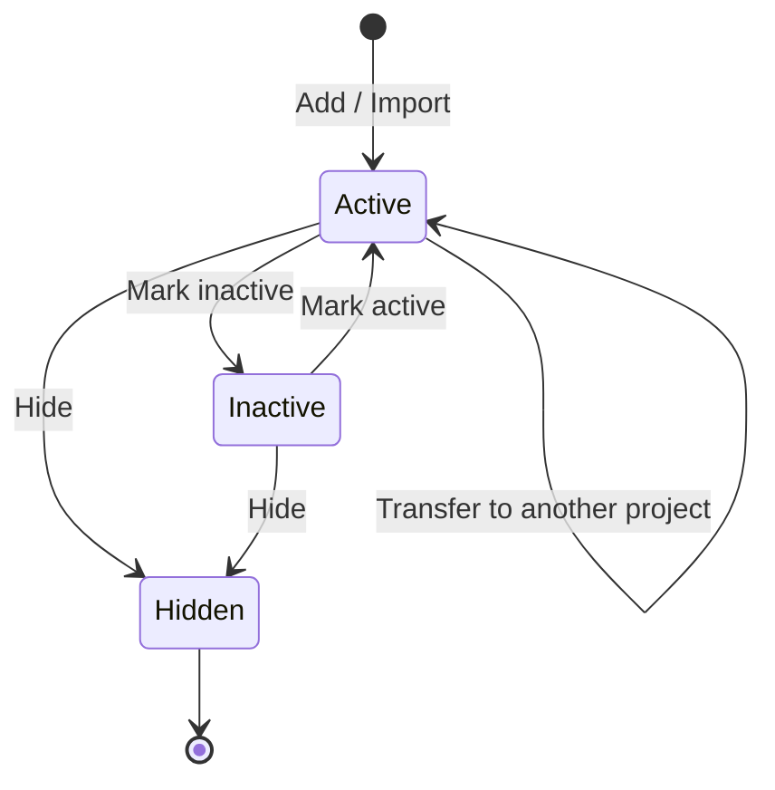
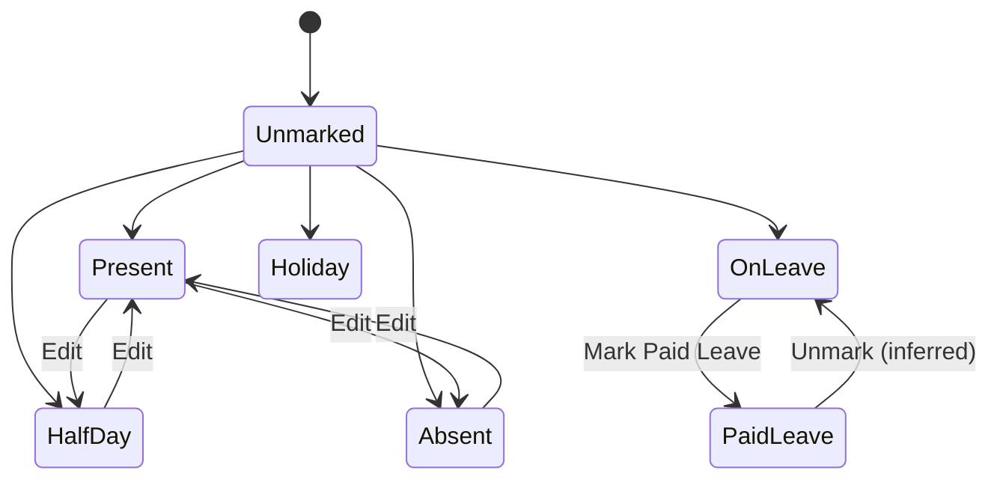
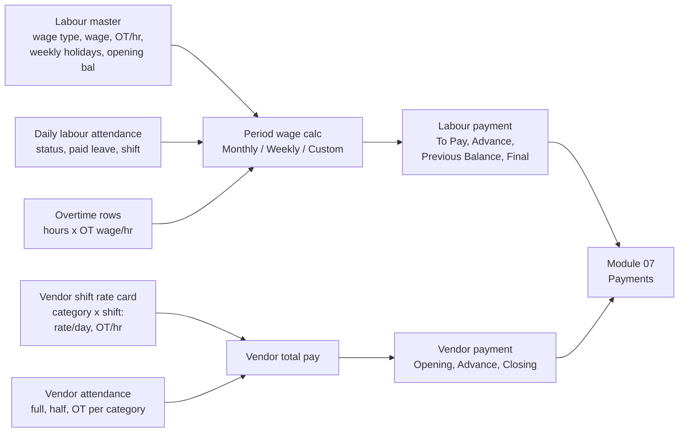

# 08 — Labour & Vendor Attendance

This module covers the workers on site who are not team members: **Labour** (individual daily- or monthly-wage workers employed directly and assigned to a project) and **Vendor labour** (headcount supplied by a labour-supply vendor, a gang or piece-rate contractor, paid per category per shift). It records who turned up each day, overtime, shifts, and paid leave, and turns that into wages owed. The payments themselves are recorded in module 07 (Labour payments, Vendor payments).

It is separate from **HRMS attendance** (module 10), which is geo-fenced check-in/check-out for team members on the payroll. Labour are records, not app users; they never log in.

Who uses it:

- **Site supervisor** — marks daily attendance and overtime for the labour assigned to them; records vendor headcount per category.
- **Site engineer / project manager** — reviews labour availability, transfers labour between projects, checks month-wise attendance.
- **Accountant** — uses attendance-derived wages to pay labour and vendors (module 07), reads labour payment and vendor payment status.
- **Owner** — sees labour present at site and payment status on the project dashboard and central vendor attendance report.

---

## Legacy behaviour

### Navigation

- **Master tab → Labours** (`#/addLabour`, menu #69) — the labour register.
- **Master tab → Labour Categories** (`#/labourCategoryAdd`, menu #70) — name-only list.
- **Master tab → Vendors** (`#/addVendor`, menu #60) — vendor with shift/category rate card.
- **Project home → Attendance tile** (menu #57 "Attendance") with two children in the project menu: **Labour** (#58) and **Vendor** (#59).
- **Project home → Dashboard** (`#/chartsDashboard`) — "Attendance" section; "Daily Work" section has labour availability from worksheets.
- **Labour transfer history** — `#/labourTransferHistory`; bulk transfer `multipleLabourTransfer`.
- **Workspace → Central Reports** (#77) — Central Vendor Attendance Report.

### Labour master (`#/addLabour`)

- **Basic**: Labour Name\*, Labour Id, Joining Date\*.
- **Wage**: Wage Type\* (`Daily wages` | `Monthly Wages`); Wage per month\* (when monthly) / Wage per day\* (when daily); Overtime Wage per Hour\*; Weekly Holidays (Sun, Mon, Tue, Wed, Thu, Fri, Sat toggles); Opening Balance (editable).
- **Statutory**: UAN Number, ESIC Number, Aadhaar Number.
- **Category & Contact**: Labour Category (seed: Carpenter, Electrician, Helper, Labour, Mason, Plumber, Skilled, Unskilled, Welder), Supervisor (a team member), Contact Number, Gender.
- **Uploads**: Labour Photo, Other Documents.
- **Project**: Select Project — the labour's current project assignment.
- **List actions**: Import (`labour/import`) with Sample Export (`labour/sample-export`), Export labour list, Hide (`labour/hide`), Active/Inactive toggle, Add/Edit Supervisor, Transfer, Transfer Multiple Labour; Combo (`labour/combo`).
- **Transfer history** (`#/labourTransferHistory`) — trail of project moves.

### Labour Categories (`#/labourCategoryAdd`)

- Name only. `LabourCategory/Combo` feeds labour master, overtime entry, vendor shift rows, and vendor attendance.

### Vendor master (`#/addVendor`)

- Vendor Name\*, Joining Date\*, Contact Number, Address.
- **Shifts**: Shift 1 with Start Time, End Time, and one or more category rows (Labour Category\*, Rate/day, Overtime/hr); "+ Add Category" adds rows to a shift; "+ Add New Shift" adds Shift 2, 3, ….
- Upload Vendor Photo, Other Documents.
- Add Projects (vendor is assigned to projects; also assignable from Project → Resources step).

### Labour attendance (project → Attendance → Labour)

- **Mark Attendance** screen:
  - Attendance Date.
  - Supervisor filter (show only labour under a supervisor; `Supervisor/Combo`).
  - Select Labours (multi-select).
  - Status per labour: **Present** | **Half Day** | **Absent** | **On Leave** | **Holiday**.
  - **Overtime** — "Add Overtime": Labour Category, Wages/hr (OT Wages/hr), Labour, OT hrs (≤ 24); "Add Different OT Hour Labour" adds another row with a different hour count.
  - **Shift**.
- **Multiple Labour Attendance** — mark several labour in one go.
- **Mark Paid Leave** — mark a leave day as paid (affects wages in Labour payments, module 07).
- **Transfer Multiple Labour** between projects.
- **Add/Edit Supervisor** for labour.
- **Active/Inactive Labour** toggle — inactive labour drop off the attendance list (inferred).
- **Reports**: All Labour Attendance Report, All Labour Payment Report, Month-wise labour report.
- **Import/Export labour list**.

### Vendor attendance (project → Attendance → Vendor)

- Per **vendor** per **date** per **labour category**:
  - Full Day count.
  - Half Day count.
  - OT Hours.
  - Shift Worked.
  - Total Pay — computed from the vendor's rate/day and OT/hr for that shift and category.
- Running money per vendor: Opening Balance, Advance Paid, Closing Balance.
- **Vendor OT attendance** view.
- **Month-wise vendor attendance** view.
- **Central Vendor Attendance Report** (filters Vendor, Labour Category, dates).

### Dashboard — Attendance section (`#/chartsDashboard`)

- **Labour Attendance** — present / absent.
- **Labours Present At Site** — day-wise.
- **Labour Payment Status** — balance per labour.
- **Vendor's Labour Attendance** — present / half / OT.
- **Vendor-wise Labour Allocation**.
- **Vendor Payment Status**.
- Related "Daily Work" section (from worksheets, module 04): Total Labours Availability trend; Contractor-wise Labour (contractor, department, skilled, unskilled) — this is the "contractor-wise labour" view; worksheet labour are counts, not named labour.

### Screen inventory

| Screen                    | Route / identifier            | Entry point              | Main actions                                                                                       |
| ------------------------- | ----------------------------- | ------------------------ | -------------------------------------------------------------------------------------------------- |
| Labour list (master)      | Master → Labours              | Master tab               | Add, edit, delete, import, sample export, export, hide, active/inactive                            |
| Add / edit labour         | `#/addLabour`                 | Labour list FAB          | Save                                                                                               |
| Labour transfer history   | `#/labourTransferHistory`     | Labour row               | Read-only trail                                                                                    |
| Multiple labour transfer  | `multipleLabourTransfer`      | Labour list / attendance | Select labour, destination project, transfer                                                       |
| Labour categories         | `#/labourCategoryAdd`         | Master tab               | Add, edit, delete                                                                                  |
| Vendor list / add         | `#/addVendor`                 | Master tab               | Add shifts and category rates, photo, documents, projects                                          |
| Labour attendance         | Project → Attendance → Labour | Project tile             | Mark attendance, multiple attendance, overtime, paid leave, supervisor add/edit, transfer, reports |
| Vendor attendance         | Project → Attendance → Vendor | Project tile             | Per vendor/date/category entry, OT view, month-wise view                                           |
| Central vendor attendance | Workspace → Central Reports   | Workspace tab            | Filter vendor, category, dates; export                                                             |
| Attendance dashboard      | `#/chartsDashboard`           | Project tile             | Duration filter, Manage Dashboard                                                                  |

### Legacy API surface (from endpoint inventory)

| Endpoint                                | Purpose                                            |
| --------------------------------------- | -------------------------------------------------- |
| `labour/combo`                          | Labour picker (attendance, overtime, payments)     |
| `labour/hide`                           | Hide a labour                                      |
| `labour/import`, `labour/sample-export` | Excel import and template                          |
| `LabourCategory/Combo`                  | Category picker                                    |
| `Supervisor/Combo`                      | Supervisor filter and assignment                   |
| `Store/Project`, `projects/combo`       | Destination project picker for transfer (inferred) |

Attendance and vendor-attendance save endpoints were not captured (concatenated paths missing from the bundle).

### List filters

- Labour attendance: Attendance Date, Supervisor; labour multi-select search (inferred).
- Vendor reports: Vendor, Labour Category, date range.
- Labour payment (module 07): period Monthly / Weekly / Custom.
- Dashboard: duration (default last 1 year).

---

## Entities & fields

### LabourCategory

| Field     | Type         | Required | Notes                                                                                    |
| --------- | ------------ | -------- | ---------------------------------------------------------------------------------------- |
| id        | uuid         | yes      |                                                                                          |
| companyId | FK → Company | no       | Null for seeded rows (inferred)                                                          |
| name      | string       | yes      | Seed: Carpenter, Electrician, Helper, Labour, Mason, Plumber, Skilled, Unskilled, Welder |

### Labour

| Field               | Type                                | Required      | Notes                                                             |
| ------------------- | ----------------------------------- | ------------- | ----------------------------------------------------------------- |
| id                  | uuid                                | yes           |                                                                   |
| companyId           | FK → Company                        | yes           |                                                                   |
| name                | string                              | yes           | "Labour Name\*"                                                   |
| labourCode          | string                              | no            | "Labour Id"; uniqueness not captured                              |
| joiningDate         | date                                | yes           |                                                                   |
| wageType            | enum{DAILY, MONTHLY}                | yes           |                                                                   |
| wagePerDay          | decimal(14,2)                       | if DAILY      |                                                                   |
| wagePerMonth        | decimal(14,2)                       | if MONTHLY    |                                                                   |
| overtimeWagePerHour | decimal(14,2)                       | yes           | "Overtime Wage per Hour\*"                                        |
| weeklyHolidays      | enum{SUN,MON,TUE,WED,THU,FRI,SAT}[] | no            | Toggles                                                           |
| openingBalance      | decimal(14,2)                       | no            | Editable; carry-in for Labour payments                            |
| uanNumber           | string                              | no            | EPFO UAN                                                          |
| esicNumber          | string                              | no            |                                                                   |
| aadhaarNumber       | string                              | no            | Sensitive; mask in UI (inferred, consistent with profile masking) |
| labourCategoryId    | FK → LabourCategory                 | no            |                                                                   |
| supervisorId        | FK → TeamMember                     | no            |                                                                   |
| contactNumber       | string                              | no            |                                                                   |
| gender              | enum{MALE, FEMALE, OTHER}           | no            | Values not captured (inferred)                                    |
| photo               | file                                | no            |                                                                   |
| documents           | file[]                              | no            |                                                                   |
| currentProjectId    | FK → Project                        | no (inferred) | "Select Project"                                                  |
| isActive            | bool                                | yes           | Active/Inactive                                                   |
| isHidden            | bool                                | yes           | `labour/hide` (difference from inactive is an open question)      |

### LabourProjectAssignment (transfer history)

| Field         | Type            | Required       | Notes                    |
| ------------- | --------------- | -------------- | ------------------------ |
| id            | uuid            | yes            |                          |
| labourId      | FK → Labour     | yes            |                          |
| fromProjectId | FK → Project    | no             | Null on first assignment |
| toProjectId   | FK → Project    | yes            |                          |
| transferDate  | date            | yes (inferred) |                          |
| transferredBy | FK → TeamMember | yes (inferred) |                          |
| remark        | text            | no (inferred)  |                          |

### LabourAttendance

| Field               | Type                                               | Required | Notes                                                  |
| ------------------- | -------------------------------------------------- | -------- | ------------------------------------------------------ |
| id                  | uuid                                               | yes      |                                                        |
| projectId           | FK → Project                                       | yes      |                                                        |
| labourId            | FK → Labour                                        | yes      |                                                        |
| attendanceDate      | date                                               | yes      | Back-dated entry control (Labour Attendance)           |
| status              | enum{PRESENT, HALF_DAY, ABSENT, ON_LEAVE, HOLIDAY} | yes      |                                                        |
| isPaidLeave         | bool                                               | no       | "Mark Paid Leave"; meaningful when ON_LEAVE (inferred) |
| shift               | string / FK → Shift                                | no       | "Shift"; source list for labour shifts not captured    |
| supervisorId        | FK → TeamMember                                    | no       | Snapshot of supervisor (inferred)                      |
| markedBy / markedAt | FK / datetime                                      | yes      | (inferred)                                             |

Unique (labourId, attendanceDate) — inferred; whether a labour can have two shifts on one date is open.

### LabourOvertime

| Field            | Type                  | Required       | Notes                                                              |
| ---------------- | --------------------- | -------------- | ------------------------------------------------------------------ |
| id               | uuid                  | yes            |                                                                    |
| attendanceId     | FK → LabourAttendance | yes (inferred) | Or (labourId, date)                                                |
| labourCategoryId | FK → LabourCategory   | yes (inferred) | "Labour Category" on Add Overtime                                  |
| labourId         | FK → Labour           | yes            |                                                                    |
| otWagePerHour    | decimal(14,2)         | yes            | Defaults from labour's Overtime Wage per Hour (inferred); editable |
| otHours          | decimal(4,2)          | yes            | 0 < hours ≤ 24                                                     |

### VendorShift

| Field     | Type        | Required      | Notes                  |
| --------- | ----------- | ------------- | ---------------------- |
| id        | uuid        | yes           |                        |
| vendorId  | FK → Vendor | yes           |                        |
| name      | string      | yes           | "Shift 1", "Shift 2" … |
| startTime | time        | no (inferred) |                        |
| endTime   | time        | no (inferred) |                        |

### VendorShiftRate

| Field            | Type                | Required       | Notes               |
| ---------------- | ------------------- | -------------- | ------------------- |
| id               | uuid                | yes            |                     |
| vendorShiftId    | FK → VendorShift    | yes            |                     |
| labourCategoryId | FK → LabourCategory | yes            | "Labour Category\*" |
| ratePerDay       | decimal(14,2)       | yes (inferred) | "Rate/day"          |
| overtimePerHour  | decimal(14,2)       | no             | "Overtime/hr"       |

### Vendor (summary; full master in module 02)

| Field          | Type           | Required | Notes                               |
| -------------- | -------------- | -------- | ----------------------------------- |
| id             | uuid           | yes      |                                     |
| name           | string         | yes      |                                     |
| joiningDate    | date           | yes      |                                     |
| contactNumber  | string         | no       |                                     |
| address        | text           | no       |                                     |
| photo          | file           | no       |                                     |
| documents      | file[]         | no       |                                     |
| projectIds     | FK → Project[] | no       |                                     |
| openingBalance | decimal(14,2)  | no       | Shown on vendor attendance/payments |

### VendorAttendance

| Field            | Type                | Required       | Notes                                                                   |
| ---------------- | ------------------- | -------------- | ----------------------------------------------------------------------- |
| id               | uuid                | yes            |                                                                         |
| projectId        | FK → Project        | yes            |                                                                         |
| vendorId         | FK → Vendor         | yes            |                                                                         |
| attendanceDate   | date                | yes            | Back-dated entry control (Vendor Attendance)                            |
| vendorShiftId    | FK → VendorShift    | yes (inferred) | "Shift Worked"                                                          |
| labourCategoryId | FK → LabourCategory | yes            |                                                                         |
| fullDayCount     | int                 | yes            | ≥ 0                                                                     |
| halfDayCount     | int                 | yes            | ≥ 0                                                                     |
| otHours          | decimal(6,2)        | no             | Total OT hours for the category row (inferred: aggregate, not per head) |
| ratePerDay       | decimal(14,2)       | snapshot       | From VendorShiftRate at entry time (inferred)                           |
| otRatePerHour    | decimal(14,2)       | snapshot       | (inferred)                                                              |
| totalPay         | decimal(14,2)       | derived        | See rules                                                               |

### Derived views

- **LabourMonthSummary** (Month-wise labour report): per labour per month — present, half days, absent, leave, paid leave, holidays, OT hours, wage earned (inferred columns).
- **VendorMonthSummary**: per vendor per category per month — full days, half days, OT hours, total pay.
- **LabourPaymentStatus**: per labour — to pay, advance, previous balance, final amount (module 07).
- **VendorPaymentStatus**: per vendor — total pay, opening, advance paid, closing (module 07).

---

## Workflows & states

### 1. Register labour

1. Supervisor or admin opens Master → Labours → Add (`#/addLabour`).
2. Enters name, wage type and wage, OT wage/hr, joining date, weekly holidays, opening balance, statutory ids, category, supervisor, contact, gender, photo, documents.
3. Selects the current project. A first assignment row is written (inferred).
4. Alternatively bulk-import from Excel using the sample export.

### 2. Transfer labour between projects

1. From the labour list, Transfer (single) or Transfer Multiple Labour.
2. Pick destination project (and date — inferred).
3. Labour's current project changes; a row is appended to transfer history (`#/labourTransferHistory`).
4. Attendance from the transfer date onward is marked in the new project (inferred).

### 3. Labour lifecycle

Hidden vs Inactive semantics are not settled (open question).

### 4. Mark daily labour attendance

1. Project → Attendance → Labour → Mark Attendance.
2. Choose Attendance Date (back-dated limits apply) and optional Supervisor filter.
3. Select labour (multi) and set status: Present / Half Day / Absent / On Leave / Holiday. Weekly holidays configured on the labour pre-fill Holiday (inferred).
4. Choose Shift.
5. Add Overtime rows: category, labour, OT wages/hr, OT hours (≤ 24); "Add Different OT Hour Labour" for labour with different hours.
6. Save. For On Leave days, Mark Paid Leave turns the day paid.

No approval workflow on labour attendance is evidenced (Attendance #57 has no `a` flag).

### 5. Record vendor attendance

1. Project → Attendance → Vendor; pick vendor and date.
2. For each labour category supplied that day: pick Shift Worked, enter Full Day count, Half Day count, OT Hours.
3. System looks up rate/day and OT/hr for (vendor, shift, category) and computes Total Pay.
4. Vendor balance: Opening Balance + Total Pay − Advance Paid → Closing Balance (payments in module 07).

### 6. Wage computation feeding payments

---

## Business rules & validations

**Labour master**

- Required: Labour Name, Wage Type, wage for the chosen type (per day or per month), Overtime Wage per Hour, Joining Date.
- Wage Type decides which wage field is required.
- Opening Balance is editable after creation (legacy says "editable"); edits change previous balance on Labour payments.
- Labour Category values come from the Labour Categories master.
- Supervisor must be a team member (`Supervisor/Combo`), presumably one on the project (inferred).

**Wage calculation (inferred where marked)**

- Daily wage: Present = 1 × wage/day; Half Day = 0.5 × wage/day; Absent = 0; On Leave = 0 unless paid leave; Holiday = paid for weekly holidays (inferred — not settled).
- Monthly wage: wage/month prorated over days in the period (inferred; whether by calendar days or working days is open).
- Overtime = OT hours × OT wage/hr; OT hours must be > 0 and ≤ 24.
- Paid leave pays the day at the normal rate (inferred).

**Vendor attendance**

- Full Day count and Half Day count are non-negative integers.
- Total Pay = (Full Day count × rate/day) + (Half Day count × rate/day × 0.5) + (OT Hours × OT/hr) — formula inferred from field names; half-day factor not stated.
- Rates come from the vendor's shift definition for that category; a category not configured on the vendor's shift cannot be recorded (inferred).
- A vendor must be assigned to the project to appear (inferred from "Add Projects").

**Attendance uniqueness**

- One labour attendance per labour per date per project (inferred).
- One vendor attendance row per vendor/date/shift/category (inferred).

**Back-dated entry (module 12)**

- Labour & Vendor group overrides: **Labour Attendance**, **Vendor Attendance** — create/edit windows in days with designation overrides; financial closing date applies.

**Transfers**

- Transfer requires a destination project different from the current one (inferred).
- Transfer is gated by the `transfer` flag on Labour (#58 `t`).

**Financial gate**

- Labour (#58), Vendor (#59), Labours master (#69), Vendors master (#60) carry the `financial` flag. Users without it should not see wages, rates, OT wage, Total Pay, opening/closing balances, or payment status (inferred meaning of the flag).

**Import**

- Labour import uses the sample Excel from `labour/sample-export`; validation rules on import (duplicates, missing wage) not captured.

**Edge cases the rebuild must decide (not settled by legacy notes)**

- Labour transferred mid-period: wages for the period split across projects by attendance date; the payment screen is per project, so previous balance must follow the labour or stay with the old project.
- Wage changed mid-period: without a rate snapshot, legacy would likely reprice past days (inferred risk).
- Overtime on an Absent or Holiday day: allow (weekend OT) or block — not stated.
- Attendance for an inactive or hidden labour on a back date: allowed only within the back-dated window (inferred).
- Attendance on a labour's weekly holiday marked Present: whether it pays a premium is not stated.
- Vendor rate card edited after attendance was recorded: Total Pay recomputation behaviour unknown.
- Deleting a labour with attendance or payments: block or soft-delete (inferred: soft-delete via hide).
- Two supervisors marking the same labour on the same date: last write wins or conflict (inferred: unique constraint).

**Field validation (inferred where not stated)**

- Wages, OT rates, opening balance: decimal ≥ 0 (opening balance may be negative for advances — open question).
- OT hours: decimal, 0 < h ≤ 24.
- Full/half-day counts: integer ≥ 0; at least one of full, half, OT > 0 to save a row (inferred).
- Contact number: Indian mobile format when company is Indian (inferred from `isNonIndianCompany`).
- UAN: 12 digits; ESIC: 10 or 17 digits; Aadhaar: 12 digits (inferred from statutory formats, not from the notes).

---

## Permissions

| Menu (id)               | Flags    | Decoded                                                          | Use                                               |
| ----------------------- | -------- | ---------------------------------------------------------------- | ------------------------------------------------- |
| Attendance (#57)        | CRUDPO   | create, read, update, delete, print, report                      | Tile container                                    |
| Labour (#58, project)   | CRUDPTOF | create, read, update, delete, print, transfer, report, financial | Mark attendance, transfer labour, labour payments |
| Vendor (#59, project)   | CRUDPOF  | create, read, update, delete, print, report, financial           | Vendor attendance and payment                     |
| Labours (#69, master)   | CRUDF    | create, read, update, delete, financial                          | Labour register; financial hides wages (inferred) |
| Labour Categories (#70) | CRUD     | create, read, update, delete                                     |                                                   |
| Vendors (#60, master)   | CRUDF    | create, read, update, delete, financial                          | Vendor and shift rates                            |
| Dashboard (#65)         | R        | read                                                             | Attendance widgets                                |
| Central Reports (#77)   | R        | read                                                             | Central vendor attendance report                  |

Flag legend (from `_working-notes.md`): C create, R read, U update, D delete, A approve, J reject, P print/download, N notification, V view all, T transfer, O report, F financial, E export, I import.

There is no `approve` or `reject` on attendance, no `viewAll` (so a supervisor filter is a UI filter, not a permission), no `notification`, and no `export`/`import` flag although labour import and export exist in the UI.

---

## Relationships

→ depends on

- **01 Organization/Identity/Access** — team members as supervisors and markers; permission matrix.
- **02 Master Records** — Labours, Labour Categories, Vendors (shifts and rate cards).
- **03 Projects** — labour current project, vendor project assignment (Project → Resources step).
- **12 Settings** — back-dated entry control for Labour Attendance and Vendor Attendance; financial closing date.

← used by

- **07 Payments & Accounting** — Labour payments (To Pay / Advance / Previous Balance / Final Amount; Mark Paid Leave) and Vendor payments (Full/Half/OT/Total Pay/Opening/Advance/Closing).
- **04 Daily Site Work** — worksheets record skilled/unskilled counts per contractor separately (not linked to named labour); dashboard "Contractor-wise Labour" comes from there. Progress Report shows Total Skilled/Unskilled labour.
- **11 Reports/Dashboards/Backup** — attendance widgets, labour/vendor reports, central vendor report, project backup.
- **10 HRMS** — no link; HRMS attendance is for team members only.

---

## Reports & exports

| Report                                   | Scope        | Contents (as noted)                                         |
| ---------------------------------------- | ------------ | ----------------------------------------------------------- |
| All Labour Attendance Report             | Project      | Attendance per labour over a date range                     |
| All Labour Payment Report                | Project      | Wages earned, advances, balances per labour                 |
| Month-wise labour report                 | Project      | Labour × day grid for a month (inferred layout)             |
| Labour transfer history                  | Labour       | From/to project trail                                       |
| Labour list export / import              | Company      | Excel; sample export doubles as template                    |
| Vendor OT attendance                     | Project      | OT hours per vendor/category                                |
| Month-wise vendor attendance             | Project      | Vendor × category × day                                     |
| Central Vendor Attendance Report         | All projects | Filters Vendor, Labour Category, dates                      |
| Dashboard: Labour Attendance             | Project      | Present vs absent                                           |
| Dashboard: Labours Present At Site       | Project      | Day-wise count                                              |
| Dashboard: Labour Payment Status         | Project      | Balance per labour                                          |
| Dashboard: Vendor's Labour Attendance    | Project      | Present / half / OT                                         |
| Dashboard: Vendor-wise Labour Allocation | Project      | Headcount share by vendor                                   |
| Dashboard: Vendor Payment Status         | Project      | Balance per vendor                                          |
| Dashboard: Contractor-wise Labour        | Project      | From worksheets: contractor, department, skilled, unskilled |

Reports render as PDF/Excel with the standard header (module 11).

### Dashboard widget definitions

| Widget                        | Measure                                                             | Source                    | Notes                        |
| ----------------------------- | ------------------------------------------------------------------- | ------------------------- | ---------------------------- |
| Labour Attendance             | Count of Present vs Absent (Half Day counted as present — inferred) | LabourAttendance          | Over dashboard duration      |
| Labours Present At Site       | Daily count of Present + Half Day                                   | LabourAttendance          | Day-wise series              |
| Labour Payment Status         | Final Amount per labour                                             | Module 07 labour payments | `financial` gated (inferred) |
| Vendor's Labour Attendance    | Sum of full days, half days, OT hours                               | VendorAttendance          | Per vendor                   |
| Vendor-wise Labour Allocation | Share of headcount by vendor                                        | VendorAttendance          | Pie/bar (inferred)           |
| Vendor Payment Status         | Closing Balance per vendor                                          | Module 07 vendor payments | `financial` gated (inferred) |
| Total Labours Availability    | Skilled + unskilled counts per day                                  | Worksheets (module 04)    | Daily Work section           |
| Contractor-wise Labour        | Contractor, department, skilled, unskilled                          | Worksheets (module 04)    | Daily Work section           |

---

## Rebuild recommendations

1. **Statutory registers from attendance.** Generate the combined attendance-register-cum-muster-roll (Form XVI) and wage register (Form XVII, or Form XVIII when wage period ≤ a fortnight) and wage slips (Form XIX) from labour attendance and payments. Labour Codes 2020 are in force (21 Nov 2025) and OSH rules expect electronic wage slips and records. (research §2 Labour)
2. **Minimum-wage rate cards.** Store state-notified minimum wages per skill category (unskilled / semi-skilled / skilled / highly skilled) as dated rate cards revised twice a year (VDA). Map Labour Category → skill level and warn when a labour's wage/day is below the card. (research §2 Labour)
3. **PF/ESI inputs.** Legacy already captures UAN and ESIC numbers; compute PF (12% + 12%, ₹15,000 ceiling) and ESI (0.75% / 3.25%, ₹21,000 ceiling) contribution inputs per wage period and export challan data. Store ceilings and rates as dated config. (research §2 Labour)
4. **BOCW.** Track building-worker headcount per project over 12 months to flag BOCW registration (≥10 workers) and record BOCW registration numbers on labour; cess (1% of construction cost) belongs in project costing. (research §2 Labour)
5. **Contractor labour compliance.** Party master for contractors/vendors needs CLRA licence, PF/ESI codes, BOCW registration; principal-employer liability on contractor default means vendor attendance should keep enough detail to reconstruct a muster roll. Consider optional named headcount for vendor labour. (research §2 Labour)
6. **Rate snapshot.** Snapshot wage/day, OT/hr, and vendor rates on each attendance row so later master edits don't rewrite past wages.
7. **Explicit wage rules.** Make half-day factor, weekly-off pay, holiday pay, and monthly proration (calendar vs working days) settings, not code assumptions.
8. **One-tap repeat entries and offline.** Pre-fill today's attendance from yesterday, mark-all-present, work offline in basements and sync later — the "too many steps" complaint is the main competitor weakness. (research §1, §4 item 2)
9. **WhatsApp attendance.** Let a supervisor submit attendance and vendor headcount via a WhatsApp Business bot. (research §4 item 1)
10. **Optional GPS/face check-in for labour.** Competitors sell GPS + face attendance as an add-on (Onsite ₹20,000/yr); HRMS already has geo-fences per project site (module 10) — reuse them for labour. (research §1)
11. **Reconcile with worksheets.** Daily worksheets carry skilled/unskilled counts per contractor; show the gap between attendance headcount and worksheet labour counts per day.
12. **Aadhaar handling.** Store masked, reveal with OTP as the profile screen already does for team members; restrict export.
13. **Advances register.** Labour advances should be a separate ledger with recovery schedule (CLRA Form XXII "advances") rather than a single figure on the payment screen. (research §2 Labour)

---

## Decisions for the build (M2, owner-approved 2026-10-08)

These settle the open questions below for M2. Where this section and the legacy notes above disagree, this section wins.

**Where things live**

- **Labour and Vendor registers live in the `labour` context** (`construction_labour`), with attendance, the ledger and wage payments. The opening balance must be written in the same transaction as the party (ADR CM-0004). Labour Categories, Departments and Supervisors are lookups in the `masters` context (`construction_masters`). The Project is in `projects` (`construction_projects`). Other contexts are referenced by id only; the labour context reads them through ports (`ProjectDirectory`, `LabourCategoryDirectory`, `SupervisorDirectory`) that its infrastructure implements with plain reads of those tables.
- **Menus.** Labour register: `masters.labours`. Vendor register: `masters.vendors`. Labour Categories: `masters.labour_categories`. Departments: `masters.departments`. Supervisors: `masters.labours` (there is no separate menu). Project-scoped work is under `labour.attendance` (mark labour and vendor attendance), `labour.labour` (labour transfer, labour payments, and labour reports; `transfer` and `financial` flags), and `labour.vendor` (vendor payments and vendor reports). Projects: `projects.project`. Without `financial`, every wage, rate, OT rate, earned amount, pay, balance and payment amount is `null` in Response models (`financialValue`).

**Money and wages** (ADR CM-0004)

- Every amount is integer paise. The API takes and returns paise. Screens show rupees.
- **Daily wage:** Present = 1 × wage per day; Half Day = 0.5; Absent = 0; On Leave = 0, or 1 when Paid Leave; **Holiday and weekly off are unpaid** unless the day is marked Paid Leave (owner decision).
- **Monthly wage: calendar-day proration** (owner decision). A day pays wage per month ÷ days in that month × units, where Present = 1, Half Day = 0.5, Holiday = 1, Paid Leave = 1, and Absent or unpaid leave = 0. Weekly offs are paid by marking them Holiday; the marking screen pre-fills Holiday on a labourer's weekly holidays. An unmarked day earns nothing.
- Rounding: every day and every overtime line rounds half up to the paisa, separately.
- **Overtime:** hours > 0 and ≤ 24 per line, with a rate per hour that defaults to the labourer's overtime wage and can be changed on the line. The line's Labour Category is optional, and when given it must be a live category. Overtime is refused on an Absent day (`OVERTIME_ON_ABSENT_DAY`); it is allowed on a Holiday (weekend overtime). The day's overtime lines may total at most 24 hours.
- **Snapshots:** an attendance row stores the wage type and rate it was priced at, and the amount earned. A vendor attendance line stores the rate per day, the overtime rate and the shift name. Changing the master changes future entries only.

**Labour**

- The **opening balance** is a ledger entry (`kind = opening`), dated the joining date. Positive means the Company owes the labourer; negative is an advance given before the app (open question 9). Changing it later reverses the old entry and posts the new one.
- **Labour Id** is optional, typed by the Company, and unique among live labourers (open question 14). There is no auto numbering in M2.
- **Hide = delete.** Delete is a soft delete (tombstone), allowed only while the labourer has no attendance and no payments; otherwise `LABOUR_HAS_RECORDS` (409). **Inactive** keeps the labourer and their history but drops them from attendance pickers and refuses new attendance (`LABOUR_INACTIVE`) (open question 6).
- Aadhaar is encrypted and masked like a Team Member's (shared-kernel `PrivateDataCipher`), and checked by its Verhoeff digit. UAN is 12 digits. ESIC is 10 or 17 digits. Contact numbers are E.164.
- `fatherName` is added for the muster roll (Form XVI and XVII need it).
- **Transfer** (open question 8): carries a transfer date (the first day in the new Project) and an optional remark. The destination must differ from the current Project. The labourer's balance belongs to the labourer, not the Project, and moves with them. Each ledger entry carries the Project it was earned in. A transfer dated before the latest attendance in the old Project is refused (`TRANSFER_BEFORE_ATTENDANCE`).

**Labour attendance**

- **One live row per labourer per date** (open question 7), in the Project the labourer was assigned to on that date (from the transfer history). Marking in another Project is refused (`LABOUR_NOT_ON_PROJECT`). Re-marking a day updates the row and reverses its ledger entries. Clearing a day tombstones the row and reverses its entries.
- **Shift** is an optional free label (open question 1); the screen offers Shift 1, 2, 3 and General.
- **Supervisor** is a filter on the marking screen and a snapshot on the row. It is not a permission (open question 13).
- **Mark Paid Leave** toggles `isPaidLeave` on an On Leave day and reposts its ledger entries.
- Back-dated guard: `module = labour_attendance`.
- Re-marking a day re-prices it from the labourer's **current** wages (the day changed, so it is priced again); days that are not re-marked keep their snapshot, and "Mark Paid Leave" alone keeps the snapshot wage (CM-210 build decision).

**Vendors**

- A vendor needs at least one shift with at least one category rate before attendance can be recorded. Rates are per head per full day, plus overtime per hour. Editing the rate card changes future lines only (snapshots).
- The vendor's **opening balance** is a ledger entry, as for labour.
- **Vendor attendance:** one live row per vendor per Project per date, with one line per (shift, category) and at most one line per pair. Full and half counts are integers ≥ 0, and overtime hours are a total for the line (open question 5). A line needs at least one of full, half or overtime > 0. Pay = full × rate + half × rate ÷ 2 + overtime hours × overtime rate (half factor 0.5, open question 4). The vendor must be assigned to the Project (`VENDOR_NOT_ON_PROJECT`), and the category must be on that shift's rate card (`CATEGORY_NOT_ON_SHIFT`). There is no approval or locking beyond the back-dated guard, `module = vendor_attendance` (open question 11). Editing a recorded day re-prices every line from the vendor's current rate card (CM-212 addendum); the snapshot protects recorded days from later rate changes until someone edits them.

**Payments** (CM-215)

- A wage payment is `payment` (against wages earned) or `advance` (ahead of wages). The mode is Cash or Bank. Reference, paid by (a Team Member), remarks and one receipt document are optional. The amount must be > 0. It posts one negative ledger entry. Cancelling tombstones the payment and posts the reversal.
- Back-dated guard: `module = labour_payment` / `vendor_payment` if the catalogue has them; otherwise the Labour & Vendor group default.
- Balance periods: monthly, weekly (Monday to Sunday) and custom.
  - **Previous Balance** = sum of entries before the period.
  - **To Pay** = earned + overtime in the period.
  - **Advance** = advances in the period.
  - **Paid** = payments in the period.
  - **Final Amount** = Previous + To Pay − Advance − Paid.

**Out of M2**

- Minimum-wage warnings, PF/ESI computation, BOCW tracking (M11).
- Named vendor headcount.
- GPS or face check-in.
- WhatsApp attendance.
- Offline marking (M12).

## Open questions

1. What is the shift list for labour attendance — HRMS shift templates, vendor shifts, or a fixed Shift 1/2/3 like worksheets?
2. Is a Holiday paid for daily-wage labour? Are weekly holidays automatically marked?
3. How is monthly wage prorated (calendar days, 26 days, working days)?
4. Is the half-day factor always 0.5 for labour and vendor headcount?
5. Is vendor OT Hours the total for the category row or per head?
6. What is the difference between "hide" (`labour/hide`) and Inactive?
7. Can a labour be marked in two projects on the same date (e.g. mid-day transfer)?
8. Does a transfer carry a date and remark? Does it move opening balance/advances with the labour?
9. Is labour opening balance positive = owed to labour, or advance given?
10. Is the "Labour Category" on the Add Overtime row a filter for choosing labour, or does it set the OT rate?
11. Does vendor attendance carry any approval or locking?
12. Does "Contractor-wise labour" refer only to worksheet counts, or can labour be linked to a contractor?
13. Can supervisors only see/mark labour assigned to them, or is the supervisor filter purely a convenience?
14. Is the Labour Id unique per company, and is it auto-generated?
