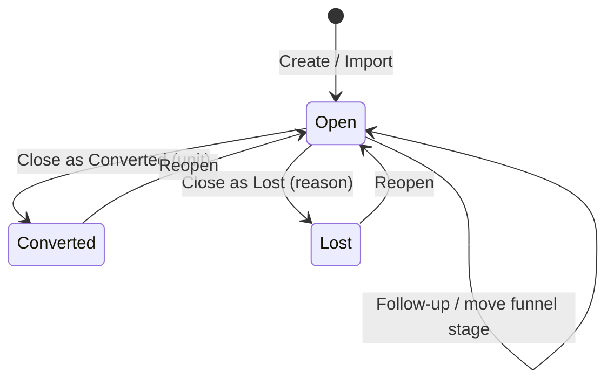
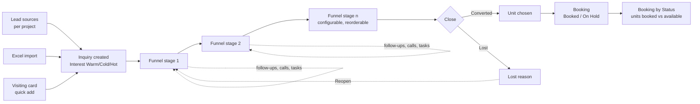
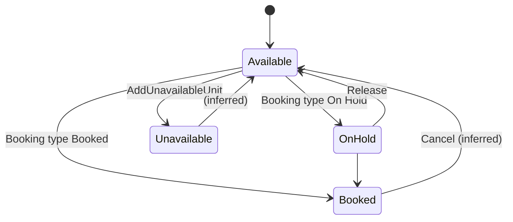

# 09 — Sales CRM (Inquiry & Booking)

This module is the developer's sales desk for a project: capture **Inquiries** (leads) from walk-ins, calls and other lead sources, follow them up through a configurable funnel until they convert to a unit or are lost, and record **Bookings** against the project's units (built in module 03 as Phases → Wings → Floors → Units). It gives the sales team a pipeline and the owner a view of units booked versus available.

It applies to projects that sell inventory — residential, commercial, plotting, bungalow schemes. Contractors building for a client have no use for it and can hide the tiles per project.

Who uses it:

- **Sales / marketing executive** (seeded designations Marketing Executive, Marketing Manager) — creates inquiries, logs follow-ups and calls, works inquiry tasks, records bookings.
- **Lead owner / assignee** — the team member responsible for an inquiry.
- **Owner / sales head** — configures funnel stages and lead sources, watches conversion, lead-source performance and sales-team performance, and booking status.

---

## Legacy behaviour

### Navigation

- **Project home → Inquiry** tile (menu #8) — list, add (`#/inquiryaddUpdate`), inquiry tasks (`#/inquiryTaskAddUpdate`), funnel settings (`#/funnelStatusSettings`), report.
- **Project home → Booking Details** tile (menu #41) — booking list, add (`#/bookingaddupdate`), unit areas, unavailable units, unit import, report, tutorial.
- **Project home → Create Wing** (`#/winglist`, `#/wingChartRoute`) — defines the units being sold (module 03).
- **Project home → Dashboard** (`#/chartsDashboard`) — "Booking" and "Inquiry" sections.
- **Master → Amenities / Common Development** — assigned to projects/wings "for booking brochure" (`DevelopmentType/AssignItem`).

### Inquiry list and form (`#/inquiryaddUpdate`, `Inquiry/GetAll`, `Inquiry2/*`)

- **Full form fields**: Inquiry Date, Name, Mobile, Email, Address, Occupation, Interest Type (`Warm` | `Cold` | `Hot`), Interested In (wing / unit type), Lead Source, Follow-up Date & Time, Remarks, Status / Inquiry Stage (funnel status), Closing Type (`Converted` → unit | `Lost` → Lost reason), Assignee, Lead Owner, images.
- **Quick add form**: Inquiry Date, Name\*, Mobile, Address, Occupation, Interested In, Remarks, Visiting Card photo; Inquiry Type (Warm/Cold/…).
- **Statuses**: Open | Converted | Lost; **Reopen** a closed inquiry.
- **Follow-ups** (`Inquiry2/FollowUp`) — add a follow-up with date & time; **follow-up history log** per inquiry. Back-dated entry control has a separate "Inquiry Follow-up" module key.
- **Inquiry Tasks** (`#/inquiryTaskAddUpdate`) — tasks attached to an inquiry (fields not captured).
- **Lead Sources** — per-project master managed inline: Add / Edit / Delete Lead Source.
- **Funnel stages** — `#/funnelStatusSettings`: configurable list, reorderable (`FunnelStatus/Reorder`).
- **Import / Sample Export** (`Inquiry2/Import`, `Inquiry2/SampleExport`) — bulk load leads from Excel.
- **Inquiry Report** — filters Interest Type, Lead Source, Status, Closing Type, Lost Reason.

### Inquiry dashboard

- KPIs: **Total**, **Open**, **Converted**, **Lost**, **Conv. Rate**, **Overdue** (follow-ups past due — inferred).
- **Lead source wise performance**.
- **Funnel stage breakdown**.
- **Sales team performance**.
- **Call Activity** — period selector Today / Yesterday / This Week / This Month / All Time.
- Project dashboard "Inquiry" section shows the funnel.

### Booking (`#/bookingaddupdate`)

- **Fields**: Booking Type\* (`Booked` | `On Hold` | `Available`), Booking Date, Name (customer), Wing, Unit, Referred By Name, Referred By Contact No, Remarks, Upload Booking Form, images.
- **Unit areas** — `Booking/AddArea` (area per unit; fields not captured).
- **Unavailable units** — `Booking/AddUnavailableUnit` (mark units not for sale — inferred meaning: landowner share, reserved, etc.).
- **Unit import** — `Booking/UnitImport` (Excel).
- **Tutorial** — `Booking/Tutorial` (in-app help video/content).
- **Booking Report** — Booking Date, Name, Wing, Unit No, Referred by, Remarks.
- **Dashboard** — Booking By Status (units booked vs available); Booking Report widget.

### Units (from module 03)

- Wing types: Commercial, Residential, Bungalow scheme, Residential & Commercial, Plotting scheme, Institutional, Individual Unit, Industrial.
- Wing config: floors count, start number, units per floor, basement parking floors → generated floors (Terrace, Commercial Floor n..1, Ground, Basement n..1) with editable unit chips.
- "Units are the sales inventory for Booking."

### Screen inventory

| Screen                 | Route / identifier               | Entry point                  | Main actions                                                             |
| ---------------------- | -------------------------------- | ---------------------------- | ------------------------------------------------------------------------ |
| Inquiry list           | Project → Inquiry                | Project tile                 | Search, filter, add, quick add, import, sample export, report, dashboard |
| Add / edit inquiry     | `#/inquiryaddUpdate`             | Inquiry list FAB             | Save; close as Converted/Lost; reopen                                    |
| Inquiry detail         | (route not captured)             | Inquiry row                  | Follow-up history, add follow-up, tasks, images                          |
| Inquiry task add/edit  | `#/inquiryTaskAddUpdate`         | Inquiry detail               | Save task                                                                |
| Funnel stage settings  | `#/funnelStatusSettings`         | Inquiry list menu (inferred) | Add, edit, delete, reorder stages                                        |
| Lead source management | inline                           | Inquiry form / settings      | Add / Edit / Delete Lead Source                                          |
| Inquiry report         | Project → Reports → Inquiries    | Reports tile / inquiry list  | Filter, PDF/Excel                                                        |
| Booking list           | Project → Booking Details        | Project tile                 | Add, unit import, areas, unavailable units, report, tutorial             |
| Add / edit booking     | `#/bookingaddupdate`             | Booking list FAB             | Save                                                                     |
| Wing list / chart      | `#/winglist`, `#/wingChartRoute` | Create Wing tile             | Unit grid per floor (module 03)                                          |
| Dashboard              | `#/chartsDashboard`              | Project tile                 | Inquiry and Booking sections                                             |

### Legacy API surface (from endpoint inventory)

| Endpoint                                                 | Purpose                                               |
| -------------------------------------------------------- | ----------------------------------------------------- |
| `Inquiry/GetAll`                                         | Inquiry list                                          |
| `Inquiry2/FollowUp`                                      | Add follow-up (v2 inquiry API)                        |
| `Inquiry2/Import`, `Inquiry2/SampleExport`               | Excel import and template                             |
| `FunnelStatus/Reorder`                                   | Persist funnel stage order                            |
| `Booking/AddArea`                                        | Unit areas                                            |
| `Booking/AddUnavailableUnit`                             | Mark units unavailable                                |
| `Booking/UnitImport`                                     | Import units from Excel                               |
| `Booking/Tutorial`                                       | Help content                                          |
| `Wings/GetAll`, `Phase/Combo`, `Phase/CreateWingByPhase` | Wing/unit pickers and structure                       |
| `DevelopmentType/AssignItem`, `/UnassignItem`            | Amenity/common development on project/wing (brochure) |

The existence of both `Inquiry` and `Inquiry2` suggests a v1 → v2 rewrite of the inquiry module in legacy (inferred).

### List filters and columns

- Inquiry filters (from the report): Interest Type, Lead Source, Status, Closing Type, Lost Reason; search by name/mobile (inferred).
- Inquiry list columns (inferred from form): Inquiry Date, Name, Mobile, Interest Type, Stage, Next follow-up, Assignee, Status.
- Booking list/report columns: Booking Date, Name, Wing, Unit No, Referred by, Remarks (booking type shown as status — inferred).
- Call Activity period: Today / Yesterday / This Week / This Month / All Time.

### Which wing types produce bookable units

All wing types generate units (module 03). For sales the unit means:

| Wing type                 | Unit meaning (inferred)                            |
| ------------------------- | -------------------------------------------------- |
| Residential               | Flat                                               |
| Commercial                | Shop / office                                      |
| Residential & Commercial  | Flat or shop by floor                              |
| Bungalow scheme           | Bungalow / villa                                   |
| Plotting scheme           | Plot                                               |
| Individual Unit           | Single house (usually not sold — contractor build) |
| Institutional, Industrial | Usually not sold unit-wise                         |

---

## Entities & fields

### LeadSource

| Field     | Type         | Required | Notes                                              |
| --------- | ------------ | -------- | -------------------------------------------------- |
| id        | uuid         | yes      |                                                    |
| projectId | FK → Project | yes      | Per-project master                                 |
| name      | string       | yes      | e.g. walk-in, referral, portal (examples inferred) |

### FunnelStatus (Inquiry Stage)

| Field                 | Type   | Required | Notes                                   |
| --------------------- | ------ | -------- | --------------------------------------- |
| id                    | uuid   | yes      |                                         |
| companyId / projectId | FK     | yes      | Scope (company or project) not captured |
| name                  | string | yes      | Seed values not captured                |
| sortOrder             | int    | yes      | `FunnelStatus/Reorder`                  |

### LostReason

| Field | Type   | Required | Notes                                                                   |
| ----- | ------ | -------- | ----------------------------------------------------------------------- |
| id    | uuid   | yes      | (inferred: list vs free text unknown — report filters by "Lost Reason") |
| name  | string | yes      |                                                                         |

### Inquiry

| Field                 | Type                            | Required       | Notes                                                  |
| --------------------- | ------------------------------- | -------------- | ------------------------------------------------------ |
| id                    | uuid                            | yes            |                                                        |
| projectId             | FK → Project                    | yes            |                                                        |
| inquiryDate           | date                            | yes (inferred) | Back-dated entry control (Inquiry)                     |
| name                  | string                          | yes            | "Name\*"                                               |
| mobile                | string                          | no             | Required-ness not marked                               |
| email                 | string                          | no             |                                                        |
| address               | text                            | no             |                                                        |
| occupation            | string                          | no             |                                                        |
| interestType          | enum{WARM, COLD, HOT}           | no             | Also labelled "Inquiry Type"                           |
| interestedIn          | string / FK → Wing or unit type | no             | "wing / unit type"; free text vs reference not settled |
| leadSourceId          | FK → LeadSource                 | no             |                                                        |
| funnelStatusId        | FK → FunnelStatus               | no             | "Status / Inquiry Stage"                               |
| status                | enum{OPEN, CONVERTED, LOST}     | yes            |                                                        |
| closingType           | enum{CONVERTED, LOST}           | when closed    |                                                        |
| convertedUnitId       | FK → Unit                       | if CONVERTED   | "Converted → unit"                                     |
| lostReasonId          | FK → LostReason / text          | if LOST        |                                                        |
| nextFollowUpAt        | datetime                        | no             | "Follow-up Date & Time"                                |
| assigneeId            | FK → TeamMember                 | no             |                                                        |
| leadOwnerId           | FK → TeamMember                 | no             |                                                        |
| remarks               | text                            | no             |                                                        |
| visitingCard          | file                            | no             | Quick add                                              |
| images                | file[]                          | no             |                                                        |
| createdBy / createdAt | FK / datetime                   | yes            |                                                        |
| closedAt / reopenedAt | datetime                        | no             | (inferred)                                             |

### InquiryFollowUp

| Field                 | Type                 | Required | Notes                                     |
| --------------------- | -------------------- | -------- | ----------------------------------------- |
| id                    | uuid                 | yes      |                                           |
| inquiryId             | FK → Inquiry         | yes      |                                           |
| followUpAt            | datetime             | yes      | Date & time                               |
| remarks               | text                 | no       | (inferred)                                |
| funnelStatusId        | FK → FunnelStatus    | no       | Stage at time of follow-up (inferred)     |
| nextFollowUpAt        | datetime             | no       | (inferred)                                |
| activityType          | enum{CALL, VISIT, …} | no       | (inferred from "Call Activity" dashboard) |
| createdBy / createdAt | FK / datetime        | yes      |                                           |

### InquiryTask

| Field      | Type             | Required       | Notes |
| ---------- | ---------------- | -------------- | ----- |
| id         | uuid             | yes            |       |
| inquiryId  | FK → Inquiry     | yes            |       |
| title      | string           | yes (inferred) |       |
| dueAt      | datetime         | no (inferred)  |       |
| assigneeId | FK → TeamMember  | no (inferred)  |       |
| status     | enum{OPEN, DONE} | no (inferred)  |       |

### Booking

| Field             | Type                             | Required       | Notes                                   |
| ----------------- | -------------------------------- | -------------- | --------------------------------------- |
| id                | uuid                             | yes            |                                         |
| projectId         | FK → Project                     | yes            |                                         |
| wingId            | FK → Wing                        | yes (inferred) |                                         |
| unitId            | FK → Unit                        | yes (inferred) |                                         |
| bookingType       | enum{BOOKED, ON_HOLD, AVAILABLE} | yes            | "Booking Type\*"                        |
| bookingDate       | date                             | no             | Back-dated entry control (Booking)      |
| customerName      | string                           | no             | "Name"                                  |
| referredByName    | string                           | no             |                                         |
| referredByContact | string                           | no             |                                         |
| remarks           | text                             | no             |                                         |
| bookingForm       | file                             | no             | "Upload Booking Form"                   |
| images            | file[]                           | no             |                                         |
| inquiryId         | FK → Inquiry                     | no             | (inferred link from "Converted → unit") |

### UnitArea (`Booking/AddArea`)

| Field    | Type               | Required       | Notes                                              |
| -------- | ------------------ | -------------- | -------------------------------------------------- |
| unitId   | FK → Unit          | yes            |                                                    |
| areaType | string             | no             | e.g. carpet / built-up / super built-up (inferred) |
| area     | decimal(10,2)      | yes (inferred) |                                                    |
| unit     | enum{SQFT, SQM, …} | no (inferred)  | UoM master has sqft, sqm, sqyd                     |

### UnavailableUnit (`Booking/AddUnavailableUnit`)

| Field  | Type      | Required      | Notes |
| ------ | --------- | ------------- | ----- |
| unitId | FK → Unit | yes           |       |
| reason | text      | no (inferred) |       |

### Unit (from module 03 — referenced)

| Field       | Type                                          | Required | Notes                                             |
| ----------- | --------------------------------------------- | -------- | ------------------------------------------------- |
| id          | uuid                                          | yes      |                                                   |
| wingId      | FK → Wing                                     | yes      |                                                   |
| floorId     | FK → Floor                                    | yes      |                                                   |
| name        | string                                        | yes      | Editable chip label                               |
| salesStatus | enum{AVAILABLE, ON_HOLD, BOOKED, UNAVAILABLE} | derived  | From latest booking / unavailable flag (inferred) |

---

## Workflows & states

### 1. Configure the sales desk

1. Admin defines wings, floors and units in Create Wing (module 03), or imports units (`Booking/UnitImport`).
2. Adds unit areas (`Booking/AddArea`) and marks unavailable units.
3. Adds project lead sources.
4. Sets up funnel stages and orders them (`#/funnelStatusSettings`).
5. Assigns amenities and common developments to the project/wing for the booking brochure (module 02).

### 2. Capture an inquiry

1. Sales executive adds an inquiry: full form, or quick add with a visiting-card photo.
2. Sets interest type, interested-in, lead source, assignee and lead owner, first follow-up date & time.
3. Status starts Open at the first funnel stage (inferred).
4. Bulk leads come in via Excel import using the sample export.

### 3. Follow up

1. Executive opens the inquiry, adds a follow-up (date & time, remarks), moves the funnel stage, schedules the next follow-up.
2. Each follow-up is kept in the history log.
3. Follow-ups past their time count as Overdue on the dashboard (inferred).
4. Inquiry Tasks capture other to-dos (site visit, send brochure — examples inferred).

### 4. Close or reopen

1. **Converted** — pick the unit; a booking is recorded for that unit (whether automatically is open).
2. **Lost** — pick/enter lost reason.
3. **Reopen** — returns the inquiry to Open.

### 5. Lead funnel

Stage names are user-defined; legacy seed values were not captured.

### 6. Record a booking

1. Booking Details → Add (`#/bookingaddupdate`).
2. Choose Booking Type (Booked / On Hold / Available), Booking Date, customer Name, Wing, Unit, Referred By name and contact, Remarks; upload booking form and images.
3. Unit's sales status follows the booking type; Booking By Status updates.
4. Setting type to Available releases the unit (inferred — this is why "Available" is a booking type).

---

## Business rules & validations

**Inquiry**

- Required: Name (quick add marks only Name\*). Inquiry Date presumably defaults to today (inferred).
- Interest Type limited to Warm / Cold / Hot.
- Lead Source must belong to the inquiry's project.
- Closing Type Converted requires a unit; Lost requires a lost reason (inferred required).
- A closed inquiry can be reopened.
- Funnel stages are ordered; reorder changes display order and funnel chart order.
- Follow-up entries are append-only history (inferred).
- Conversion rate = Converted ÷ Total (inferred; whether Total excludes open is not stated).

**Booking**

- Required: Booking Type.
- One active booking per unit (inferred); a unit marked unavailable cannot be booked (inferred).
- Wing and Unit must belong to the project.
- Units come only from the wing structure or unit import.

**Back-dated entry (module 12)**

- Sales group overrides: **Inquiry**, **Inquiry Follow-up**, **Booking** — create/edit windows with designation overrides.

**Numbering**

- No sequence for inquiries or bookings in the numbering module.

**Permission gates**

- Inquiry (#8) has `viewAll` — without it a user sees only inquiries they own/are assigned (inferred).
- Booking (#41) has no `viewAll` and no `financial` flag; no booking prices exist in legacy.

**Privacy**

- Inquiry stores personal data (mobile, email, address, occupation, visiting card). Export and import are bulk personal data movements.

**Import (inferred)**

- Sample export defines the columns; import rows map to Inquiry fields (Name required). Lead source and stage values in the file must match existing project lead sources and funnel stages, or be created — behaviour not captured.
- Unit import (`Booking/UnitImport`) loads units into wings; whether it creates wings/floors or only units is not captured.

**Edge cases the rebuild must decide**

- Deleting a funnel stage that inquiries are in: block or reassign.
- Deleting a lead source in use: block or keep as disabled.
- Converting two inquiries to the same unit: block (one active booking per unit) or allow a waitlist.
- Booking a unit whose wing structure is later edited (unit removed or renamed in Create Wing): bookings must keep a stable unit id, not the chip label.
- Reopening a Converted inquiry: release the unit's booking or leave it.
- On Hold with no expiry: units can be held forever (legacy has no hold expiry field).
- Reassigning an inquiry's assignee/lead owner: history of ownership not captured.
- Follow-up scheduled in the past (back-dated): allowed within the "Inquiry Follow-up" back-dated window.

**Field validation (inferred where not stated)**

- Mobile: country code + number; Indian 10-digit when company is Indian.
- Email: RFC format.
- Follow-up date & time: datetime in the user's login timezone (`Employees/UpdateLoginTimezone` exists).
- Booking Date ≤ today (inferred).
- Referred By Contact No: phone format.

---

## Permissions

| Menu (id)                                 | Flags    | Decoded                                                             | Use                                                                          |
| ----------------------------------------- | -------- | ------------------------------------------------------------------- | ---------------------------------------------------------------------------- |
| Inquiry (#8)                              | CRUDPNVO | create, read, update, delete, print, notification, view all, report | Inquiries, follow-ups, tasks; notifications (follow-up reminders — inferred) |
| Booking Details (#41)                     | CRUDPNO  | create, read, update, delete, print, notification, report           | Bookings, unit areas, unavailable units, unit import                         |
| Create Wing (#6)                          | CRUD     | create, read, update, delete                                        | Units being sold                                                             |
| Dashboard (#65)                           | R        | read                                                                | Inquiry and Booking widgets                                                  |
| Amenities (#42), Common Development (#45) | CRUD     | create, read, update, delete                                        | Brochure items                                                               |

Flag legend (from `_working-notes.md`): C create, R read, U update, D delete, A approve, J reject, P print/download, N notification, V view all, T transfer, O report, F financial, E export, I import. No approve, reject, financial, export or import flags in this module, although inquiry import/sample export and unit import exist in the UI.

---

## Relationships

→ depends on

- **01 Organization/Identity/Access** — team members as assignee and lead owner; permissions.
- **02 Master Records** — Amenities, Common Development (brochure); designations (Marketing Executive/Manager).
- **03 Projects/Structure** — Phases → Wings → Floors → Units are the sales inventory; wing types; wing chart view.
- **12 Settings** — back-dated entry control (Inquiry, Inquiry Follow-up, Booking).

← used by

- **11 Reports/Dashboards/Backup** — Inquiry and Booking dashboard sections, Inquiries and Bookings reports in the project report set, project backup.
- **13 Chat/Notifications** — inquiry and booking notifications.
- **07 Payments & Accounting** — no legacy link; allottee collections would arrive as Payment In in the rebuild.

### Relationship to Wings and Units (module 03) in detail

- **Structure**: Project → Phase (Phase 1..n) → Wing (typed) → Floor (Terrace, upper floors, Ground, Basements) → Unit (editable chip name). Booking references Wing and Unit; Inquiry "Interested In" references a wing or unit type; a Converted inquiry references a Unit.
- **Generation**: units are generated from wing config (floors count, start number, units per floor, basement parking floors) and then edited (rename, remove, + Add). `Booking/UnitImport` is an alternative bulk path.
- **Sales attributes on the unit**: areas (`Booking/AddArea`), unavailable flag (`Booking/AddUnavailableUnit`), and current booking type. Pricing is absent in legacy.
- **Shared use**: the same Unit is the location target for worksheets, issues and inspections (modules 04, 05). Sales status and construction progress therefore hang off the same record, which is what RERA quarterly reporting needs (sold/unsold inventory with % complete per wing — research §2 RERA).
- **Wing chart** (`#/wingChartRoute`): grid view of floors × units; in the rebuild it should colour units by sales status (Available / On Hold / Booked / Unavailable) — legacy colouring not captured (inferred).
- **Non-building projects** use Create Location instead of wings; they have no units and therefore no bookings.
- **Integrity rules for the rebuild**:
  - A unit with an active booking cannot be deleted from Create Wing; renaming keeps the booking.
  - Moving a unit between floors (if allowed) keeps its id.
  - Phase/wing deletion is blocked while any unit in it is booked or on hold.
  - Units marked unavailable are excluded from "Available" counts in Booking By Status.
- **Amenities and Common Developments** (module 02) attached to a project or wing feed the booking brochure; they are not units and cannot be booked.

---

## Reports & exports

| Report                         | Scope     | Contents                                                                                                                                                                            |
| ------------------------------ | --------- | ----------------------------------------------------------------------------------------------------------------------------------------------------------------------------------- |
| Inquiry Report                 | Project   | Filters Interest Type, Lead Source, Status, Closing Type, Lost Reason                                                                                                               |
| Inquiry Sample Export / Import | Project   | Excel template and bulk import                                                                                                                                                      |
| Inquiry dashboard              | Project   | Total, Open, Converted, Lost, Conv. Rate, Overdue; lead-source performance; funnel breakdown; sales team performance; call activity (Today/Yesterday/This Week/This Month/All Time) |
| Booking Report                 | Project   | Booking Date, Name, Wing, Unit No, Referred by, Remarks                                                                                                                             |
| Unit Import                    | Project   | Excel import of units                                                                                                                                                               |
| Booking By Status              | Dashboard | Units booked vs available                                                                                                                                                           |

Reports render PDF/Excel with the standard header (module 11).

### Dashboard KPI definitions

| KPI / widget                 | Definition                                                                          | Notes                             |
| ---------------------------- | ----------------------------------------------------------------------------------- | --------------------------------- |
| Total                        | Count of inquiries in duration                                                      | By Inquiry Date (inferred)        |
| Open                         | Status = Open                                                                       |                                   |
| Converted                    | Closing Type = Converted                                                            |                                   |
| Lost                         | Closing Type = Lost                                                                 |                                   |
| Conv. Rate                   | Converted ÷ Total × 100                                                             | Denominator inferred              |
| Overdue                      | Open inquiries whose next follow-up time < now                                      | Inferred                          |
| Lead source wise performance | Per lead source: total, converted, conversion %                                     | Columns inferred                  |
| Funnel stage breakdown       | Count of open inquiries per stage, in stage order                                   | Order from `FunnelStatus/Reorder` |
| Sales team performance       | Per assignee/lead owner: inquiries, follow-ups, conversions                         | Columns inferred                  |
| Call Activity                | Follow-up/call count per period (Today, Yesterday, This Week, This Month, All Time) | Source of "call" not captured     |
| Booking By Status            | Units Booked vs Available (and On Hold — inferred)                                  | Per project                       |
| Booking Report widget        | Recent bookings table                                                               |                                   |

---

## Rebuild recommendations

1. **Link inquiry → booking → customer.** Converting an inquiry should create the booking for the chosen unit and a customer (allottee) record; legacy keeps only a name on the booking.
2. **Unit inventory as the source of truth.** Derive unit status (Available / On Hold / Booked / Unavailable) from bookings with a hold expiry, and prevent double-booking with a unique active booking per unit.
3. **Unit pricing and areas.** Add carpet area (the RERA basis), rate, and charges on the unit; legacy `AddArea` hints at areas but there is no price, so the booking report has no value column.
4. **RERA.** Record project RERA registration (required before marketing projects > 500 sq m or > 8 units) and block bookings until present; expose sold/unsold inventory per wing for the quarterly progress report; store the RERA designated bank account (70% rule). (research §2 RERA)
5. **Demand letters, UPI collection, receipts.** Payment schedule per booking (construction-linked stages tied to wing progress), demand letter → UPI link → auto-receipt → RERA 70% ledger in module 07. Payment aggregators settle UPI at 0% MDR. (research §4 item 6)
6. **GST on unit sales.** Residential: 1% affordable / 5% other without ITC (projects from 1 Apr 2019); commercial differs. Keep rates effective-dated. (research §2 GST)
7. **Allottee portal.** Documents, payment schedule, receipts, construction photos — Sell.Do offers this; it is a listed differentiator. (research §1, §4 item 6)
8. **Lead capture integrations.** Import from portals/telephony and WhatsApp click-to-chat; Sell.Do integrates portals, telephony and e-sign. (research §1)
9. **Follow-up reminders.** Push and WhatsApp reminders at the follow-up time; Overdue as a first-class list, not only a KPI.
10. **Structured lost reasons and call logging.** Make Lost Reason a managed list and log calls as follow-up activities so "Call Activity" is computed, not inferred.
11. **Consent and data retention for leads.** Record consent source on import/quick add; honour deletion requests (legacy already has Privacy & Consent and data retention screens for users — module 01).
12. **Duplicate-lead detection.** Match on mobile (and email) within the company when creating or importing inquiries; merge or link instead of creating a second record, so lead-source performance is not double-counted.
13. **Booking audit trail.** Keep each booking-type change (Available → On Hold → Booked → cancelled) as history with date, user and reason, rather than overwriting one row; this is the evidence trail for allottee disputes under RERA. (research §2 RERA)
14. **Default funnel.** Seed a sensible default funnel (e.g. New → Contacted → Site Visit → Negotiation) that owners can edit, since legacy seeds were not captured (inferred).

---

## Open questions

1. What funnel stages are seeded, and are they company-wide or per project?
2. Is "Interested In" free text, a wing, or a unit type (e.g. 2BHK)?
3. Is Lost Reason a master list or free text?
4. Does converting an inquiry automatically create a booking?
5. Can a unit have more than one booking row (history) and how is "current" status chosen?
6. What does "Available" as a booking type mean on a booking record — release of a hold?
7. What fields does `Booking/AddArea` capture (carpet/built-up/super built-up, UoM)?
8. What is an "unavailable unit" used for (landowner share, reserved), and can it be reverted?
9. How is "Call Activity" counted — follow-ups of a call type, or a separate call log?
10. Is Overdue = inquiries whose next follow-up time has passed?
11. Do Assignee and Lead Owner differ in permissions (e.g. viewAll scoping)?
12. What fields do Inquiry Tasks have, and do they appear in the main Task module (05)?
13. What content does `Booking/Tutorial` serve?
14. Is Mobile required/unique per project (duplicate-lead detection)?
15. What does the `print` flag on Inquiry (#8) and Booking (#41) print — a single inquiry/booking sheet, or only the reports?
16. What events raise notifications (`n` flag) — follow-up due, inquiry assigned, booking created?
17. Is a booking cancellation recorded (date, reason, refund) or is the row simply edited back to Available?
18. Can an inquiry be moved between projects of the same company (buyer interested in another project)?
19. Are bookings and inquiries visible on a company-wide (cross-project) sales view, or only per project?
