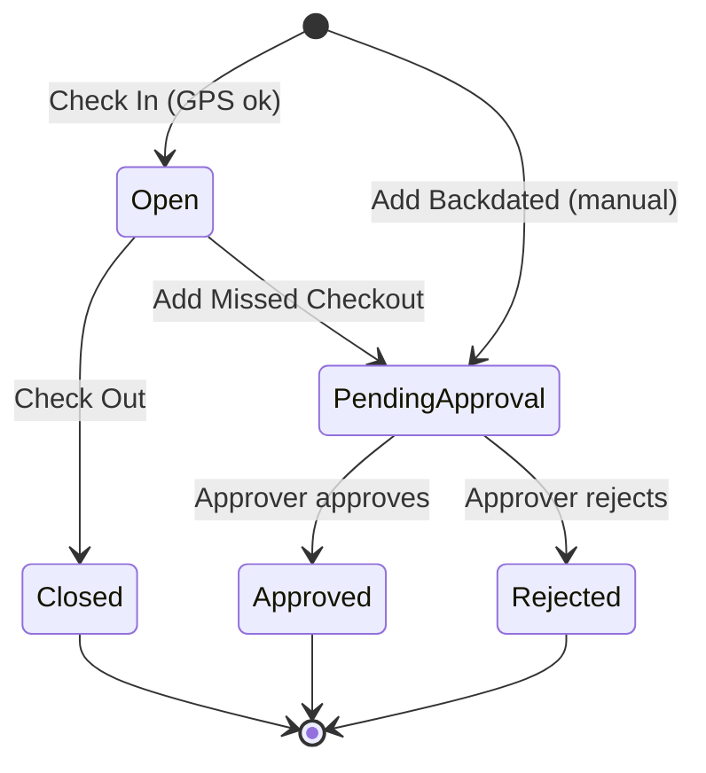
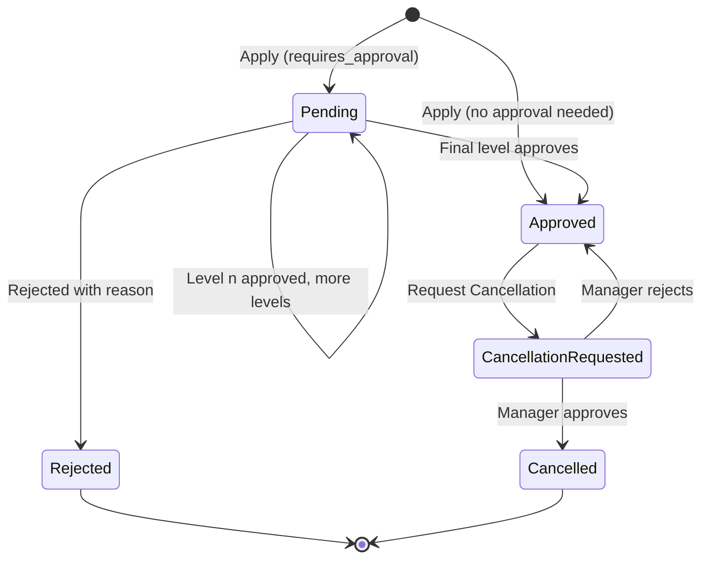
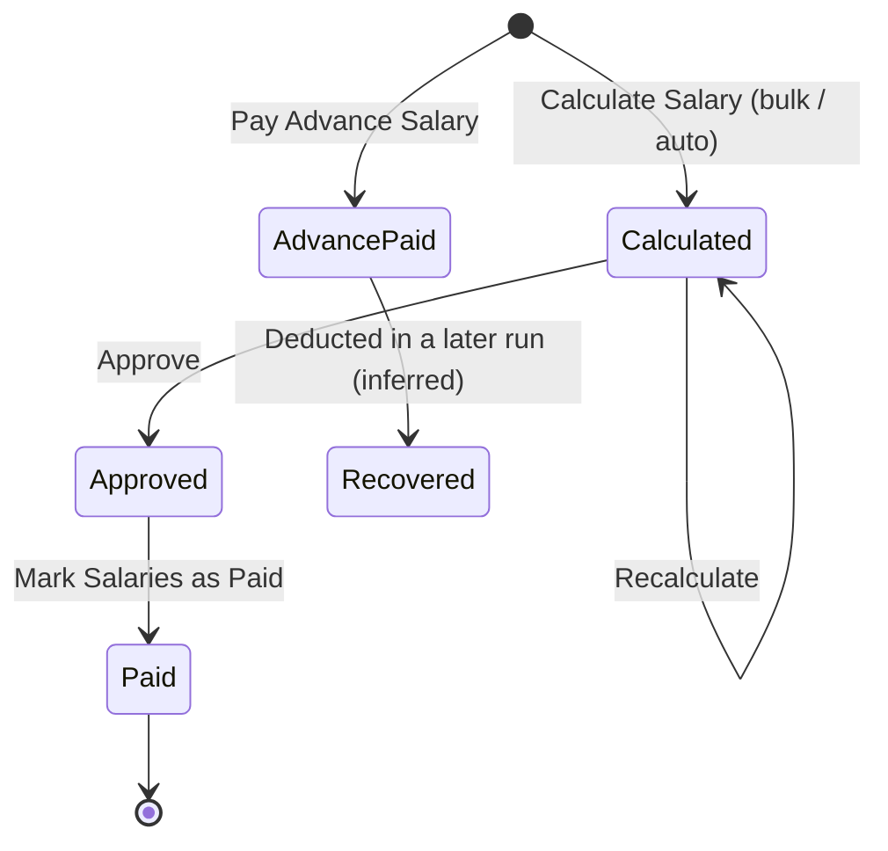

# 10 — HRMS (office and staff employees)

HRMS manages the company's own salaried staff: office employees, engineers, supervisors, store keepers and other Team Members. It covers GPS / geo-fenced attendance, shifts and rotations, holidays, leave types, leave structures and balances, leave requests with approvals, salary structures, and monthly salary runs with payslips.

HRMS is **separate from site labour** (module 08, Labour & Vendor Attendance). Labours and vendor gangs are master records attached to projects and paid daily or monthly wages through Labour/Vendor payments. HRMS employees are **Team Members** (module 01) who log in to the app, check in on their own phones, apply for leave and see their own payslips.

Who uses it:

| Actor                                                                    | What they do                                                                                                                                  |
| ------------------------------------------------------------------------ | --------------------------------------------------------------------------------------------------------------------------------------------- |
| Company owner / Admin                                                    | Configures HRMS Settings, branches and geo-fences, leave types and structures, salary structures, shift and rotation templates; runs salaries |
| Manager / approver (any Team Member holding `approve` on the HRMS menus) | Approves attendance entries, leave requests and cancellation requests; sees Team Attendance, Team Leaves, Team Salary                         |
| Employee (Normal or HRMS Team Member)                                    | Checks in and out, adds missed checkout or backdated attendance, applies for leave, requests cancellation, views own salary slips             |
| **HRMS Team Member** (member type)                                       | An employee who uses **only** HRMS: no projects, permissions come from the HRMS default permission set                                        |

Workspace placement: HRMS lives in the **Workspace** bottom tab (Workspace → HRMS, labelled "beta" in the legacy app). The home Projects tab also shows a **"Not checked in / Check In"** banner driven by HRMS attendance state (see module 11).

---

## Legacy behaviour

### Navigation

The legacy app is Flutter web with hash routes. HRMS endpoints are under the lowercase v2-style API `v2/hrms/*` (Laravel). Exact screen routes for HRMS were not captured in the notes except via the menu; screen names below are the menu labels. The route `#/hrmsHome` is used in this document as the reference name for the HRMS landing screen (inferred — the route string was not captured).

HRMS menu (Workspace → HRMS):

1. **Dashboard**
   - Today's Snapshot: Present Today / On Leave / Employees
   - Present/Absent Breakdown
   - Day-Wise Trend
   - Pending Approvals
   - Team Leaves
2. **Attendance**
   - My Attendance: Check In / Check Out with geo-fence, Open Attendance, Add Missed Checkout, Add Backdated Attendance
   - Team Attendance
   - Attendance Approvals
3. **Leave**
   - My Leaves: Apply Leave, Leave Details, credit history, Request Cancellation
   - Leave Approvals: tabs Pending / Approved / Rejected / Cancel Requests
4. **Salary**
   - My Salary
   - Team Salary: Calculate Salary (all team members, month), Pay Advance Salary (employee), Mark Salaries as Paid, approve
   - Salary slip view
5. **Configuration**
   - Holiday Management
   - Leave Structure (leave types and assignment)
   - Salary Structure (templates)
   - Shift Template and Rotation templates
   - Shift Management (assign shifts)
   - Employee Management (per-employee salary configuration)
   - HRMS Settings
   - Branches / geo-fences

### API surface (from `main.dart.js`)

| Area              | Endpoints                                                                                                                                                                                                                                                                                                     |
| ----------------- | ------------------------------------------------------------------------------------------------------------------------------------------------------------------------------------------------------------------------------------------------------------------------------------------------------------- |
| Settings          | `hrms/settings`                                                                                                                                                                                                                                                                                               |
| Branches / fences | `hrms/branches`, `hrms/branches/my-fences`, `hrms/branches/project-sites`                                                                                                                                                                                                                                     |
| Attendance        | `hrms/attendance/today`, `hrms/attendance/check-in`, `hrms/attendance/check-out`, `hrms/attendance/manual`, `hrms/attendance/missed-checkout`, `hrms/attendance/approvals`, `hrms/attendance/team-members`, `hrms/attendance/team-today`, `hrms/attendance/monthly-summary`, `hrms/attendance/report/monthly` |
| Dashboard         | `hrms/dashboard`                                                                                                                                                                                                                                                                                              |
| Holidays          | `hrms/holidays`, `hrms/holidays/import`, `hrms/holidays/sample`                                                                                                                                                                                                                                               |
| Leave types       | `hrms/leave-types`, `hrms/leave-types/accrual-options`                                                                                                                                                                                                                                                        |
| Leave structures  | `hrms/leave-structures`, `hrms/leave-structures/assignments`                                                                                                                                                                                                                                                  |
| Leave balances    | `hrms/leave-balances`, `hrms/leave-balances/accruals`, `hrms/leave-balances/accrue`, `hrms/leave-balances/initialize`, `hrms/leave-balances/initialize-by-structure`, `hrms/leave-balances/team`                                                                                                              |
| Leaves            | `hrms/leaves`, `hrms/leaves/approvals`, `hrms/leaves/team`, `hrms/leaves/report/team`                                                                                                                                                                                                                         |
| Shifts            | `hrms/shift-templates`, `hrms/shift-templates/active`, `hrms/rotation-templates`, `hrms/rotation-templates/active`, `hrms/employees/shift-assignments`                                                                                                                                                        |
| Salary            | `hrms/salary-structures`, `hrms/employees/salary`, `hrms/salaries`, `hrms/salaries/calculate-bulk`, `hrms/salaries/calculate-advance`, `hrms/salaries/report/team`                                                                                                                                            |
| Members           | `v2/hrms/team-members/default-permissions`                                                                                                                                                                                                                                                                    |

The home endpoint `home/projects` (v2) returns an attendance-state block (check-in banner with `geo_fence_required`), consumed by the Projects home tab.

### Screens

#### HRMS Settings

Single settings form backed by `hrms/settings`. See the HrmsSettings entity below for all fields. Values seen: `gps_requirement` 0 = Disabled; `attendance_grace_period` 15 minutes; `working_hours_per_day` 8; `half_day_hours` 4; `working_days` [1..5] (Mon–Fri).

#### Branches & Project Sites (geo-fences)

- List of fences: office branches and project-site fences.
- **New Office Branch**: Branch Name, Set Branch Location (map pin), Set Geo-Fence radius.
- **Project site geo-fence**: Site label, radius (attached to a project from module 03 — inferred from `hrms/branches/project-sites`).
- Actions: Edit Geo-fence, Remove Fence.
- `hrms/branches/my-fences` returns the fences applicable to the logged-in employee (inferred: their branch plus sites of projects they are assigned to).

#### My Attendance

- Shows today's state from `hrms/attendance/today`: `entries[]`, `total_hours`, `is_holiday`, `has_active_entry`, status (e.g. Absent = 3).
- **Check In** / **Check Out** buttons. GPS captured when `gps_requirement` is enabled.
- Guards and messages:
  - "Outside Fence" — blocks check-in when the device location is outside every applicable fence.
  - "Office location is not configured" — shown when GPS is required but no branch/fence exists.
  - Active check-in guard — cannot check in again while an entry is open (`has_active_entry`).
- **Open Attendance** — the currently open (checked-in, not checked-out) entry.
- **Add Missed Checkout** — supply a checkout time for an earlier entry that was never closed (`hrms/attendance/missed-checkout`).
- **Add Backdated Attendance** — manual entry for a past date (`hrms/attendance/manual`), subject to Back Dated Entry Control for module "HRMS → Attendance" (module 12).

#### Team Attendance

- `hrms/attendance/team-today`: today's status for each team member.
- `hrms/attendance/team-members`: list of members the viewer can see (inferred: driven by `viewAll`).
- Monthly summary (`hrms/attendance/monthly-summary`) and monthly report (`hrms/attendance/report/monthly`).

#### Attendance Approvals

- `hrms/attendance/approvals`: list of manual / missed-checkout / backdated entries awaiting approval (inferred: geo check-ins inside a fence do not need approval).
- Approve / Reject.

#### Holiday Management

- List of holidays for the year.
- **Add Holiday**: Holiday Name, Date, Holiday Type (National / Festival / Company), Optional Holiday flag, Description.
- **Import Holidays** via `.xlsx`; download sample from `hrms/holidays/sample`; upload to `hrms/holidays/import`.

#### Leave Structure

- **Leave types** tab: list and add/edit leave types (fields below). `hrms/leave-types/accrual-options` supplies the accrual mode/frequency choices.
- **Leave structures**: named bundles of leave types with entitlements (inferred structure — see entity).
- **Assignments**: assign a structure to employees (`hrms/leave-structures/assignments`).

#### Leave Balances

- Per employee, per leave type, per year: allocated, entitlement, used, remaining, carried forward, last accrual period.
- Actions: **Initialize** (create balance rows for the year), **Initialize by structure** (create balances from the employee's assigned leave structure), **Accrue** (post the next accrual period's credit).
- Credit history: `hrms/leave-balances/accruals` (list of accrual credits).
- Team balances: `hrms/leave-balances/team`.

#### My Leaves / Apply Leave

- Apply Leave form: Employee (only for managers applying on behalf), Leave Type*, From Date, To Date, Day Breakdown (per day: Full / Morning / Afternoon), Total leave (computed), Reason (minimum 10 characters), live leave balance.
- Leave Details screen; credit history.
- **Request Cancellation** — sends a cancellation request to the manager; message: balance updated after request approved.

#### Leave Approvals

- Tabs: Pending / Approved / Rejected / Cancel Requests.
- Approve with **Approval Remarks**; Reject with **Rejection Reason**; Cancel requests show **Cancellation Reason**.
- Team leave list `hrms/leaves/team`; team report `hrms/leaves/report/team`.

#### Shift Template

- Fields: Shift Name*, Start Time, End Time, Working Days, Working Hours, Half Day Hours, Grace Period (minutes), Overtime Allowed, Active.
- `hrms/shift-templates/active` lists active ones for pickers.

#### Rotation Template

- Rotation Name*, Rotation Type: Week | Month | Custom Cycle (Days per cycle 2–12), Cycle Shifts (select a shift per cycle slot), Active.
- `hrms/rotation-templates/active` for pickers.

#### Shift Management

- Assign a shift template or rotation template to employees (`hrms/employees/shift-assignments`). Assignment runs **"Until changed"**.

#### Salary Structure (templates)

- Template Name, Description, Salary Components (e.g. Basic, Special Allowance; Add/Edit Component).
- PF Applicable + PF %, "cap at statutory wage ceiling" + PF Wage Ceiling.
- ESI Applicable + ESI %.
- Professional Tax Applicable + PT Amount per month.
- Deduct for Absent Days; Deduct for Unpaid Leave.
- Other Deductions.

#### Employee Management (salary configuration)

- List of employees with status **Configured / Not Set**.
- Per employee: pick salary structure and amounts (`hrms/employees/salary`).
- **Save All** to save the whole grid.

#### Salary — My Salary / Team Salary

- **Calculate Salary**: for all team members, for a month (`hrms/salaries/calculate-bulk`).
- **Pay Advance Salary**: for one employee (`hrms/salaries/calculate-advance`).
- **Mark Salaries as Paid**.
- Approve salaries.
- Team salary report `hrms/salaries/report/team`.
- Salary slip (payslip) with Attendance Details, Earnings, Gross, Statutory Deductions, Absent Deduction, Other Deductions, Net Payable (see SalarySlip entity).

#### HRMS Dashboard

See module 11 for widget detail; summary here: Today's Snapshot (Present Today / On Leave / Employees), Present/Absent Breakdown, Day-Wise Trend, Pending Approvals, Team Leaves (`hrms/dashboard`).

### Member types (link to module 01)

The Team Member form (`#/employeeAddUpdate`) has a **Type**:

- **Normal Team Member** — works on projects; step 2 Select Projects, step 3 Role Permissions (`#/employeeRolePermission`). Also an HRMS employee (can check in, apply leave) if granted HRMS permissions.
- **HRMS Team Member** — HRMS only (attendance, leave, salary); no projects; permissions come from `v2/hrms/team-members/default-permissions`.

Record flags: `isHrmsMember`, `memberType`. Subscription counts **HRMS Team Member** as its own grant with an add-on at ₹30/month per unit (module 01 subscription).

---

## Entities & fields

Type notation: `string`, `text`, `int`, `decimal(p,s)`, `bool`, `date`, `time`, `datetime`, `enum{...}`, `FK → Entity`, `json`, `file[]`. "Legacy field" is the API field name observed in the notes; "—" means not observed (field name proposed for the rebuild).

### HrmsSettings (one per company)

| Field                   | Legacy field              | Type                | Required   | Notes                                                                                             |
| ----------------------- | ------------------------- | ------------------- | ---------- | ------------------------------------------------------------------------------------------------- |
| Company                 | —                         | FK → Company        | yes        | One row per company (inferred)                                                                    |
| GPS requirement         | `gps_requirement`         | enum{0 Disabled, …} | yes        | Only 0 = Disabled observed; other values not captured (likely "Required" / "Optional" — inferred) |
| Attendance grace period | `attendance_grace_period` | int (minutes)       | yes        | Seen 15                                                                                           |
| Leave approval levels   | `leave_approval_levels`   | int                 | yes        | Number of approval steps for leave (default level; leave type can override via `approval_levels`) |
| Auto salary calculation | `auto_salary_calculation` | bool                | yes        | When true, salary run is calculated automatically on `salary_calculation_day`                     |
| Salary calculation day  | `salary_calculation_day`  | int (1–31)          | if auto    | Day of month for auto run                                                                         |
| Working hours per day   | `working_hours_per_day`   | decimal(4,2)        | yes        | Seen 8                                                                                            |
| Half-day hours          | `half_day_hours`          | decimal(4,2)        | yes        | Seen 4                                                                                            |
| Carry forward enabled   | `carry_forward_enabled`   | bool                | yes        | Company-level switch                                                                              |
| Carry forward max days  | `carry_forward_max_days`  | decimal(5,2)        | if enabled | Company-level cap                                                                                 |
| Leave accrual enabled   | `leave_accrual_enabled`   | bool                | yes        | Company-level switch for periodic credit                                                          |
| Working days            | `working_days`            | int[]               | yes        | ISO weekday numbers; seen [1,2,3,4,5]                                                             |

### Branch (office geo-fence)

| Field      | Legacy field | Type                            | Required       | Notes                                          |
| ---------- | ------------ | ------------------------------- | -------------- | ---------------------------------------------- |
| Name       | —            | string                          | yes            | "Branch Name"                                  |
| Latitude   | —            | decimal(9,6)                    | yes            | "Set Branch Location"                          |
| Longitude  | —            | decimal(9,6)                    | yes            |                                                |
| Radius (m) | —            | int                             | yes            | "Set Geo-Fence radius"; unit metres (inferred) |
| Kind       | —            | enum{OfficeBranch, ProjectSite} | yes            | Two flavours in the UI (inferred single table) |
| Project    | —            | FK → Project (module 03)        | if ProjectSite | `hrms/branches/project-sites`                  |
| Site label | —            | string                          | if ProjectSite | "Site label"                                   |

### EmployeeBranch (inferred)

| Field    | Legacy field | Type            | Required | Notes                                                                                              |
| -------- | ------------ | --------------- | -------- | -------------------------------------------------------------------------------------------------- |
| Employee | —            | FK → TeamMember | yes      | Which fences apply to whom; mechanism not captured — `my-fences` implies a per-employee resolution |
| Branch   | —            | FK → Branch     | yes      |                                                                                                    |

### AttendanceEntry

One row per check-in/check-out pair. A day can have several entries (`entries[]`, `total_hours`).

| Field                          | Legacy field | Type                                  | Required        | Notes                                                                      |
| ------------------------------ | ------------ | ------------------------------------- | --------------- | -------------------------------------------------------------------------- |
| Employee                       | —            | FK → TeamMember                       | yes             |                                                                            |
| Date                           | —            | date                                  | yes             | Attendance day                                                             |
| Check-in at                    | —            | datetime                              | yes             |                                                                            |
| Check-in latitude / longitude  | —            | decimal(9,6) ×2                       | if GPS required |                                                                            |
| Check-in fence                 | —            | FK → Branch                           | no              | Fence matched at check-in (inferred)                                       |
| Check-out at                   | —            | datetime                              | no              | Null while open (`has_active_entry`)                                       |
| Check-out latitude / longitude | —            | decimal(9,6) ×2                       | no              |                                                                            |
| Source                         | —            | enum{CheckIn, Manual, MissedCheckout} | yes             | Manual = backdated; MissedCheckout = checkout filled later (inferred enum) |
| Hours                          | —            | decimal(5,2)                          | derived         | Sum feeds `total_hours`                                                    |
| Approval status                | —            | enum{Pending, Approved, Rejected}     | yes             | For manual/missed entries (inferred)                                       |
| Approved/Rejected by           | —            | FK → TeamMember                       | no              |                                                                            |
| Remarks / reason               | —            | text                                  | no              | (inferred)                                                                 |

### AttendanceDay (derived view of `hrms/attendance/today`)

| Field            | Legacy field       | Type                 | Required | Notes                                                                                                                                                   |
| ---------------- | ------------------ | -------------------- | -------- | ------------------------------------------------------------------------------------------------------------------------------------------------------- |
| Entries          | `entries`          | AttendanceEntry[]    | —        |                                                                                                                                                         |
| Total hours      | `total_hours`      | decimal(5,2)         | —        |                                                                                                                                                         |
| Is holiday       | `is_holiday`       | bool                 | —        | From Holiday + working days                                                                                                                             |
| Has active entry | `has_active_entry` | bool                 | —        | Open check-in exists                                                                                                                                    |
| Status           | `status`           | enum{…, 3 Absent, …} | —        | Only Absent = 3 observed; full list not captured. Payslip terms imply Present, Absent, Half Day, Paid Leave, Unpaid Leave, Week Off, Holiday (inferred) |

### Holiday

| Field       | Legacy field | Type                              | Required | Notes                   |
| ----------- | ------------ | --------------------------------- | -------- | ----------------------- |
| Name        | —            | string                            | yes      | "Holiday Name"          |
| Date        | —            | date                              | yes      |                         |
| Type        | —            | enum{National, Festival, Company} | yes      |                         |
| Optional    | —            | bool                              | yes      | "Optional Holiday flag" |
| Description | —            | text                              | no       |                         |

### LeaveType

| Field                | Legacy field           | Type                          | Required         | Notes                                                      |
| -------------------- | ---------------------- | ----------------------------- | ---------------- | ---------------------------------------------------------- |
| Name                 | —                      | string                        | yes              |                                                            |
| Yearly limit         | `yearly_limit`         | decimal(6,2)                  | yes              | Days per year                                              |
| Is paid              | `is_paid`              | bool                          | yes              |                                                            |
| Requires approval    | `requires_approval`    | bool                          | yes              |                                                            |
| Approval levels      | `approval_levels`      | int                           | if approval      |                                                            |
| Max consecutive days | `max_consecutive_days` | int                           | no               |                                                            |
| Carry forward        | `carry_forward`        | bool                          | yes              |                                                            |
| Max carry forward    | `max_carry_forward`    | decimal(6,2)                  | if carry forward |                                                            |
| Accrual mode         | `accrual_mode`         | enum (from `accrual-options`) | yes              | Values not captured; likely upfront vs periodic (inferred) |
| Accrual frequency    | `accrual_frequency`    | enum{monthly, …}              | if accrual       | Only `monthly` observed                                    |
| Accrual day          | `accrual_day`          | int                           | if accrual       | Day of period credit is posted                             |
| Allow advance use    | `allow_advance_use`    | bool                          | yes              | Use leave not yet accrued                                  |
| Credit per period    | `credit_per_period`    | decimal(6,2)                  | if accrual       | e.g. 1.25                                                  |
| Is active            | `is_active`            | bool                          | yes              |                                                            |

**Seeded leave types (verbatim from notes):**

| Name             | Yearly limit | Paid   | Credit per period | Carry forward |
| ---------------- | ------------ | ------ | ----------------- | ------------- |
| Casual Leave     | 12           | paid   | —                 | —             |
| Compensatory Off | 0            | paid   | —                 | —             |
| Loss of Pay      | 0            | unpaid | —                 | —             |
| Maternity        | 182          | paid   | 15.17 / month     | —             |
| Privilege Leave  | 15           | paid   | 1.25 / month      | yes           |
| Sick             | 7            | paid   | 0.58 / month      | —             |

"—" = not stated in the notes.

### LeaveStructure (inferred shape)

| Field | Legacy field | Type                 | Required | Notes                           |
| ----- | ------------ | -------------------- | -------- | ------------------------------- |
| Name  | —            | string               | yes      |                                 |
| Lines | —            | LeaveStructureLine[] | yes      | Leave types included (inferred) |

### LeaveStructureLine (inferred)

| Field       | Legacy field | Type                | Required | Notes                                 |
| ----------- | ------------ | ------------------- | -------- | ------------------------------------- |
| Structure   | —            | FK → LeaveStructure | yes      |                                       |
| Leave type  | —            | FK → LeaveType      | yes      |                                       |
| Entitlement | —            | decimal(6,2)        | no       | Override of `yearly_limit` (inferred) |

### LeaveStructureAssignment

| Field          | Legacy field | Type                | Required | Notes      |
| -------------- | ------------ | ------------------- | -------- | ---------- |
| Employee       | —            | FK → TeamMember     | yes      |            |
| Structure      | —            | FK → LeaveStructure | yes      |            |
| Effective from | —            | date                | no       | (inferred) |

### LeaveBalance

| Field               | Legacy field          | Type            | Required | Notes                                 |
| ------------------- | --------------------- | --------------- | -------- | ------------------------------------- |
| Employee            | —                     | FK → TeamMember | yes      |                                       |
| Leave type          | —                     | FK → LeaveType  | yes      |                                       |
| Year                | —                     | int             | yes      | Calendar or leave year (not captured) |
| Total allocated     | `total_allocated`     | decimal(6,2)    | yes      |                                       |
| Annual entitlement  | `annual_entitlement`  | decimal(6,2)    | yes      |                                       |
| Used                | `used`                | decimal(6,2)    | yes      |                                       |
| Remaining           | `remaining`           | decimal(6,2)    | derived  | allocated − used (inferred)           |
| Carried forward     | `carried_forward`     | decimal(6,2)    | yes      | From previous year                    |
| Last accrual period | `last_accrual_period` | string/date     | no       | e.g. month key                        |

### LeaveAccrual (credit history, `leave-balances/accruals`)

| Field     | Legacy field | Type                                             | Required | Notes                      |
| --------- | ------------ | ------------------------------------------------ | -------- | -------------------------- |
| Balance   | —            | FK → LeaveBalance                                | yes      |                            |
| Period    | —            | string/date                                      | yes      |                            |
| Credit    | —            | decimal(6,2)                                     | yes      | `credit_per_period` posted |
| Kind      | —            | enum{Accrual, Initial, CarryForward, Adjustment} | yes      | (inferred)                 |
| Posted at | —            | datetime                                         | yes      |                            |

### LeaveRequest

| Field                  | Legacy field | Type                                                                | Required                  | Notes                                                                     |
| ---------------------- | ------------ | ------------------------------------------------------------------- | ------------------------- | ------------------------------------------------------------------------- |
| Employee               | —            | FK → TeamMember                                                     | yes                       | Manager may pick another employee                                         |
| Leave type             | —            | FK → LeaveType                                                      | yes                       |                                                                           |
| From date              | —            | date                                                                | yes                       |                                                                           |
| To date                | —            | date                                                                | yes                       |                                                                           |
| Total leave            | —            | decimal(5,1)                                                        | derived                   | Sum of day breakdown                                                      |
| Reason                 | —            | text                                                                | yes                       | Min 10 characters                                                         |
| Status                 | —            | enum{Pending, Approved, Rejected, CancellationRequested, Cancelled} | yes                       | Tabs show Pending/Approved/Rejected/Cancel Requests (exact enum inferred) |
| Current approval level | —            | int                                                                 | no                        | For multi-level (inferred)                                                |
| Approval remarks       | —            | text                                                                | no                        |                                                                           |
| Rejection reason       | —            | text                                                                | if rejected               |                                                                           |
| Cancellation reason    | —            | text                                                                | if cancellation requested |                                                                           |
| Applied by             | —            | FK → TeamMember                                                     | yes                       | Differs from employee when manager applies                                |

### LeaveRequestDay

| Field   | Legacy field | Type                           | Required | Notes                                          |
| ------- | ------------ | ------------------------------ | -------- | ---------------------------------------------- |
| Request | —            | FK → LeaveRequest              | yes      |                                                |
| Date    | —            | date                           | yes      |                                                |
| Session | —            | enum{Full, Morning, Afternoon} | yes      | Full = 1.0, Morning/Afternoon = 0.5 (inferred) |

### LeaveApproval (inferred)

| Field      | Legacy field | Type                     | Required | Notes |
| ---------- | ------------ | ------------------------ | -------- | ----- |
| Request    | —            | FK → LeaveRequest        | yes      |       |
| Level      | —            | int                      | yes      |       |
| Approver   | —            | FK → TeamMember          | yes      |       |
| Decision   | —            | enum{Approved, Rejected} | yes      |       |
| Remarks    | —            | text                     | no       |       |
| Decided at | —            | datetime                 | yes      |       |

### ShiftTemplate

| Field              | Legacy field | Type         | Required | Notes                                          |
| ------------------ | ------------ | ------------ | -------- | ---------------------------------------------- |
| Shift name         | —            | string       | yes      |                                                |
| Start time         | —            | time         | yes      |                                                |
| End time           | —            | time         | yes      | Can cross midnight (inferred)                  |
| Working days       | —            | int[]        | yes      |                                                |
| Working hours      | —            | decimal(4,2) | yes      |                                                |
| Half day hours     | —            | decimal(4,2) | yes      |                                                |
| Grace period (min) | —            | int          | yes      | Overrides `attendance_grace_period` (inferred) |
| Overtime allowed   | —            | bool         | yes      |                                                |
| Active             | —            | bool         | yes      |                                                |

### RotationTemplate

| Field          | Legacy field | Type                           | Required       | Notes                    |
| -------------- | ------------ | ------------------------------ | -------------- | ------------------------ |
| Rotation name  | —            | string                         | yes            |                          |
| Rotation type  | —            | enum{Week, Month, CustomCycle} | yes            |                          |
| Days per cycle | —            | int (2–12)                     | if CustomCycle |                          |
| Cycle shifts   | —            | FK → ShiftTemplate[] (ordered) | yes            | One shift per cycle slot |
| Active         | —            | bool                           | yes            |                          |

### ShiftAssignment

| Field             | Legacy field | Type                  | Required | Notes                  |
| ----------------- | ------------ | --------------------- | -------- | ---------------------- |
| Employee          | —            | FK → TeamMember       | yes      |                        |
| Shift template    | —            | FK → ShiftTemplate    | one of   |                        |
| Rotation template | —            | FK → RotationTemplate | one of   |                        |
| Effective from    | —            | date                  | yes      | (inferred)             |
| Effective to      | —            | date                  | no       | Null = "Until changed" |

### SalaryStructure (template)

| Field                         | Legacy field | Type              | Required  | Notes                              |
| ----------------------------- | ------------ | ----------------- | --------- | ---------------------------------- |
| Template name                 | —            | string            | yes       |                                    |
| Description                   | —            | text              | no        |                                    |
| Components                    | —            | SalaryComponent[] | yes       | e.g. Basic, Special Allowance      |
| PF applicable                 | —            | bool              | yes       |                                    |
| PF %                          | —            | decimal(5,2)      | if PF     |                                    |
| Cap at statutory wage ceiling | —            | bool              | if PF     |                                    |
| PF wage ceiling               | —            | decimal(14,2)     | if capped | Statutory ₹15,000 (research §2)    |
| ESI applicable                | —            | bool              | yes       |                                    |
| ESI %                         | —            | decimal(5,2)      | if ESI    | Employee share 0.75% (research §2) |
| Professional Tax applicable   | —            | bool              | yes       |                                    |
| PT amount per month           | —            | decimal(14,2)     | if PT     |                                    |
| Deduct for absent days        | —            | bool              | yes       |                                    |
| Deduct for unpaid leave       | —            | bool              | yes       |                                    |
| Other deductions              | —            | SalaryDeduction[] | no        |                                    |

### SalaryComponent

| Field              | Legacy field | Type                 | Required | Notes                                       |
| ------------------ | ------------ | -------------------- | -------- | ------------------------------------------- |
| Structure          | —            | FK → SalaryStructure | yes      |                                             |
| Name               | —            | string               | yes      | Basic, Special Allowance, …                 |
| Amount / basis     | —            | decimal(14,2)        | yes      | Fixed vs % of gross not captured (inferred) |
| Counts for PF wage | —            | bool                 | no       | (inferred; needed to compute PF)            |

### SalaryDeduction (other deductions)

| Field                 | Legacy field | Type          | Required | Notes |
| --------------------- | ------------ | ------------- | -------- | ----- |
| Structure or employee | —            | FK            | yes      |       |
| Name                  | —            | string        | yes      |       |
| Amount                | —            | decimal(14,2) | yes      |       |

### EmployeeSalaryConfig (`hrms/employees/salary`)

| Field             | Legacy field | Type                     | Required | Notes                             |
| ----------------- | ------------ | ------------------------ | -------- | --------------------------------- |
| Employee          | —            | FK → TeamMember          | yes      |                                   |
| Salary structure  | —            | FK → SalaryStructure     | yes      |                                   |
| Base / CTC amount | —            | decimal(14,2)            | yes      | "Base Salary" on the slip         |
| Component amounts | —            | json                     | no       | Per-employee overrides (inferred) |
| Status            | —            | enum{Configured, NotSet} | derived  |                                   |

### SalaryRun / SalarySlip (`hrms/salaries`)

The legacy app shows one salary row per employee per month; a "run" groups them (inferred).

| Field             | Legacy field | Type                             | Required | Notes                                               |
| ----------------- | ------------ | -------------------------------- | -------- | --------------------------------------------------- |
| Employee          | —            | FK → TeamMember                  | yes      |                                                     |
| Month             | —            | date (yyyy-mm)                   | yes      |                                                     |
| Kind              | —            | enum{Regular, Advance}           | yes      | Advance via `calculate-advance`                     |
| Status            | —            | enum{Calculated, Approved, Paid} | yes      | Draft/approve/paid inferred from actions            |
| Working Days      | —            | decimal(5,2)                     | yes      |                                                     |
| Present           | —            | decimal(5,2)                     | yes      |                                                     |
| Absent            | —            | decimal(5,2)                     | yes      |                                                     |
| Paid Leave        | —            | decimal(5,2)                     | yes      |                                                     |
| Unpaid            | —            | decimal(5,2)                     | yes      |                                                     |
| Half Days         | —            | decimal(5,2)                     | yes      |                                                     |
| Payable Days      | —            | decimal(5,2)                     | yes      |                                                     |
| Week Off          | —            | decimal(5,2)                     | yes      |                                                     |
| Holidays          | —            | decimal(5,2)                     | yes      |                                                     |
| Overtime Hrs      | —            | decimal(6,2)                     | yes      |                                                     |
| Total Hrs         | —            | decimal(6,2)                     | yes      |                                                     |
| Base Salary       | —            | decimal(14,2)                    | yes      | Earnings                                            |
| Components        | —            | json                             | yes      | Earnings lines                                      |
| Gross Salary      | —            | decimal(14,2)                    | yes      |                                                     |
| PF                | —            | decimal(14,2)                    | yes      | Statutory deduction                                 |
| ESI               | —            | decimal(14,2)                    | yes      |                                                     |
| Professional Tax  | —            | decimal(14,2)                    | yes      |                                                     |
| Absent Deduction  | —            | decimal(14,2)                    | yes      |                                                     |
| Other Deductions  | —            | decimal(14,2)                    | yes      |                                                     |
| Advance recovered | —            | decimal(14,2)                    | no       | (inferred — an advance must be recovered somewhere) |
| Net Payable       | —            | decimal(14,2)                    | yes      |                                                     |
| Approved by / at  | —            | FK / datetime                    | no       |                                                     |
| Paid at           | —            | datetime                         | no       |                                                     |

### HrmsDefaultPermissionSet (`v2/hrms/team-members/default-permissions`)

| Menu                      | Flags                      |
| ------------------------- | -------------------------- |
| HRMS #78                  | read                       |
| Holiday Management #79    | read                       |
| Attendance Management #80 | create, read, notification |
| Leave Management #81      | create, read, notification |
| Salary Management #82     | read                       |

---

## Workflows & states

### 1. Configure HRMS (admin, one time)

1. Open HRMS Settings; set GPS requirement, grace period, working hours, half-day hours, working days, leave approval levels, carry forward, accrual, auto salary calculation and day.
2. Add office Branch(es) with location and radius; add Project-site fences for projects where staff check in.
3. Add Holidays (or import `.xlsx` from the sample).
4. Review seeded Leave Types; add or edit.
5. Create Leave Structures; assign to employees.
6. Initialize leave balances (per employee, or by structure).
7. Create Shift Templates and Rotation Templates; assign through Shift Management.
8. Create Salary Structures; configure each employee in Employee Management (Save All).

### 2. Daily check-in / check-out

1. Employee opens app; Projects home shows "Not checked in / Check In" banner (`geo_fence_required` flag).
2. Taps Check In. If GPS required: device location sent; server resolves `my-fences`.
   - No fence configured → "Office location is not configured".
   - Outside every fence → "Outside Fence", blocked.
   - Already open entry → blocked by active check-in guard.
3. Entry created with check-in time; `has_active_entry` = true.
4. Employee taps Check Out → entry closed; hours added to `total_hours`.
5. Multiple pairs per day allowed (entries[]).
6. Day status derived (Present / Half Day / Absent etc.) from total hours vs `working_hours_per_day` / `half_day_hours` and shift, with grace period applied to late check-in (inferred).

### 3. Missed checkout

1. Employee opens the open entry from a previous day (Open Attendance).
2. Add Missed Checkout with time (and reason — inferred).
3. Entry goes to Attendance Approvals; on approve, hours count.

### 4. Backdated attendance

1. Employee taps Add Backdated Attendance; picks date, check-in and check-out times.
2. Back Dated Entry Control (module 12, HRMS → Attendance) checks the day limit.
3. Entry goes to approvals.

### 5. Leave request

1. Employee (or manager on behalf) opens Apply Leave; picks Leave Type; live balance shown.
2. Picks From/To; Day Breakdown lists each date with Full / Morning / Afternoon; total computed.
3. Enters reason (≥10 chars); submits.
4. If leave type `requires_approval` = false → Approved immediately (inferred). Otherwise Pending at level 1.
5. Approver sees it under Pending; Approve with remarks → next level or Approved; Reject with reason → Rejected.
6. Balance `used` increases on approval (inferred; the cancellation copy states balance is updated after approval).
7. Employee may Request Cancellation with reason → appears under Cancel Requests; manager approves → Cancelled and balance restored; rejects → stays Approved.

Whether a Pending request can be withdrawn by the employee was not captured (open question).

### 6. Leave balance lifecycle

1. **Initialize**: create LeaveBalance rows for employee × leave type × year with entitlement.
2. **Initialize by structure**: same, using the employee's assigned structure.
3. **Accrue**: for accrual-mode leave types, post `credit_per_period` for the period (monthly on `accrual_day`); update `last_accrual_period`; log to accruals.
4. **Carry forward** at year end: unused balance up to `max_carry_forward` (leave type) and `carry_forward_max_days` (company) moves to next year's `carried_forward`.
5. **Advance use**: when `allow_advance_use`, employee may apply beyond the accrued balance up to the yearly limit (inferred).

### 7. Shift assignment

1. Admin creates Shift Templates (times, hours, grace, OT).
2. Optionally builds a Rotation Template: Week / Month / Custom Cycle (2–12 days), choosing a shift per slot.
3. Shift Management: assign shift or rotation to employees, effective "Until changed".
4. Attendance evaluation uses the assigned shift for late, half day and OT (inferred).

### 8. Salary run

1. Employee Management: each employee must be Configured (structure + amounts).
2. Team Salary → Calculate Salary for a month (all team members), or automatically on `salary_calculation_day` if `auto_salary_calculation`.
3. For each employee: count working days, present, absent, paid/unpaid leave, half days, week off, holidays, OT and total hours → payable days; compute earnings, gross, PF (capped at wage ceiling if set), ESI, PT, absent deduction (if enabled), unpaid-leave deduction (if enabled), other deductions → net payable.
4. Approver approves.
5. Mark Salaries as Paid.
6. Pay Advance Salary: separate advance row for one employee (recovery in a later run — inferred).
7. Employee sees slip in My Salary.

---

## Business rules & validations

- Check-in is blocked when GPS is required and the location is outside every applicable fence ("Outside Fence").
- Check-in is blocked when GPS is required and no office location / fence is configured ("Office location is not configured").
- An employee cannot hold two open attendance entries (active check-in guard).
- Late arrival is tolerated within `attendance_grace_period` (15 min default) or the shift's Grace Period.
- Half day = worked hours ≥ `half_day_hours` but < `working_hours_per_day` (inferred threshold rule).
- Working days default Mon–Fri ([1..5]); non-working days are Week Off on the slip.
- Holidays: Type ∈ {National, Festival, Company}; Optional holidays do not apply to everyone (inferred: employee opts in).
- Holiday import accepts only `.xlsx` in the sample layout.
- Backdated attendance and leave are subject to Back Dated Entry Control (module 12: HRMS group → Attendance, Leave, Holiday).
- Leave reason must be at least 10 characters.
- Leave Day Breakdown: each date is Full, Morning or Afternoon; total = sum.
- Leave cannot exceed `max_consecutive_days` for the type.
- Leave cannot exceed remaining balance unless `allow_advance_use`.
- Loss of Pay and Compensatory Off are seeded with yearly limit 0 (LOP unlimited unpaid; Comp Off credited by adjustment — inferred).
- Multi-level leave approval: number of levels from `leave_approval_levels` (company) or `approval_levels` (type).
- Rejection requires a Rejection Reason; cancellation requires a Cancellation Reason; approval remarks optional (inferred).
- Leave balance is updated only after the cancellation request is approved.
- Carry forward only if company `carry_forward_enabled` and type `carry_forward`; capped by both maxima.
- Accrual only if company `leave_accrual_enabled`; credit = `credit_per_period` each `accrual_frequency` on `accrual_day`.
- Rotation Custom Cycle length must be 2–12 days.
- Shift assignment stays in force until changed.
- Salary Calculate requires the employee's salary configuration to be "Configured".
- PF computed on PF wage capped at PF Wage Ceiling when "cap at statutory wage ceiling" is on.
- PT applied as a flat PT amount per month when applicable.
- Absent days deducted only when "Deduct for Absent Days"; unpaid leave deducted only when "Deduct for Unpaid Leave".
- Salary can be marked Paid only after approval (inferred from order of actions).
- HRMS Team Members have no project access; their permissions are the HRMS default set.
- Subscription: HRMS Team Members count against the "HRMS Team Member" grant; add-on ₹30/month per unit.

---

## Permissions

Menu flags from `RolePermissions/DefaultMenuPermission/GetAllV3` (legend: C=create R=read U=update D=delete A=approve J=reject P=print/download N=notification V=viewAll T=transfer O=report F=financial E=export I=import).

| Menu (id)                  | Raw flags   | Decoded                                                                                         | Used for                                                                 |
| -------------------------- | ----------- | ----------------------------------------------------------------------------------------------- | ------------------------------------------------------------------------ |
| HRMS (78)                  | R           | read                                                                                            | See HRMS in Workspace                                                    |
| Holiday Management (79)    | CRUDN       | create, read, update, delete, notification                                                      | Holidays, import                                                         |
| Attendance Management (80) | CRUDAJENVO  | create, read, update, delete, approve, reject, export, notification, viewAll, report            | Check in, manual, approvals, team, monthly summary / report              |
| Leave Structure (87)       | CRUD        | create, read, update, delete                                                                    | Leave types, structures, assignments                                     |
| Leave Management (81)      | CRUDAJNVO   | create, read, update, delete, approve, reject, notification, viewAll, report                    | Apply, approve / reject, cancellation requests, team leaves, team report |
| Salary Management (82)     | CRUDAJENVOF | create, read, update, delete, approve, reject, export, notification, viewAll, report, financial | Calculate, advance, approve, mark paid, team report, view amounts        |
| Salary Structure (83)      | CRUD        | create, read, update, delete                                                                    | Templates                                                                |
| Employee Management (84)   | CRUF        | create, read, update, financial                                                                 | Per-employee salary config (no delete)                                   |
| HRMS Settings (85)         | CRUD        | create, read, update, delete                                                                    | Settings, branches (inferred: branches sit here)                         |
| Shift Management (95)      | CRUDAEINV   | create, read, update, delete, approve, export, import, notification, viewAll                    | Shift/rotation templates, assignments (no reject flag)                   |

UI matrix columns (Role Permissions step): ADD, VIEW, EDIT, DELETE, APPROVE, REJECT, DOWNLOAD, REPORT, VIEW ALL, NOTIFICATION, TRANSFER, FINANCIAL. The HRMS category has 57 cells.

Behaviour implied:

- **viewAll** separates "My" views from "Team" views (Team Attendance, Team Leaves, Team Salary).
- **approve / reject** gate Attendance Approvals, Leave Approvals (including cancellation requests) and salary approval.
- **export** on Attendance Management and Salary Management gates the monthly report / team salary exports (inferred mapping); **import** and **export** on Shift Management gate bulk shift assignment import/export (inferred — no import screen captured).
- **report** on Attendance, Leave and Salary Management gates the monthly attendance, team leave and team salary reports.
- Shift Management has **approve** but no **reject**; what is approved there is not captured.
- **financial** on Salary Management / Employee Management gates seeing amounts (inferred).
- **notification** decides who receives push notifications for new requests (see module 13).

HRMS default set for HRMS-only members: HRMS read; Holiday read; Attendance create/read/notification; Leave create/read/notification; Salary read.

---

## Relationships

- → depends on **01 Organization/Identity/Access**: Team Members (employees), member type Normal/HRMS, designations, role permissions, subscription grant for HRMS Team Members, login timezone.
- → depends on **03 Projects/Structure**: project-site geo-fences reference projects; `my-fences` uses the employee's project assignments (inferred).
- → depends on **12 Settings**: Back Dated Entry Control (HRMS group: Attendance, Leave, Holiday), timezone, currency.
- ← used by **11 Reports/Dashboards**: HRMS dashboard, Projects home check-in banner, monthly attendance report, team leave report, team salary report.
- ← used by **13 Chat/Notifications**: push notifications for leave/attendance approvals (per-module notification flag).
- ↔ distinct from **08 Labour & Vendor Attendance**: site labour attendance (Present/Half Day/Absent/On Leave/Holiday + OT) and wages are not HRMS; do not merge the tables.
- ↔ **07 Payments & Accounting**: legacy salary "Mark as Paid" does not appear to post a Transaction (not captured); see open questions.

---

## Reports & exports

| Report                     | Source                            | Notes                                                                  |
| -------------------------- | --------------------------------- | ---------------------------------------------------------------------- |
| Attendance monthly summary | `hrms/attendance/monthly-summary` | Per employee per month counts                                          |
| Monthly attendance report  | `hrms/attendance/report/monthly`  | Team, month                                                            |
| Team today                 | `hrms/attendance/team-today`      | Live status                                                            |
| Team leave report          | `hrms/leaves/report/team`         |                                                                        |
| Leave balances (team)      | `hrms/leave-balances/team`        |                                                                        |
| Leave credit history       | `hrms/leave-balances/accruals`    |                                                                        |
| Team salary report         | `hrms/salaries/report/team`       |                                                                        |
| Salary slip                | `hrms/salaries`                   | Per employee per month (PDF — inferred, follows module 11 conventions) |
| Holiday sample / import    | `hrms/holidays/sample`, `/import` | `.xlsx`                                                                |
| HRMS dashboard             | `hrms/dashboard`                  | See module 11                                                          |

---

## Rebuild recommendations

1. **Statutory rates as dated configuration, not template literals.** PF wage ceiling (₹15,000; ₹21,000 proposed, not notified), PF 12% + 12%, ESI wage ceiling ₹21,000 (₹25,000 PwD) and 0.75% / 3.25% shares should be effective-dated company-level rates that templates reference, not numbers typed into each salary template ([research §2, Labour and welfare](../research/market-and-compliance.md)). Keep the legacy per-template override for non-standard cases.
2. **Applicability thresholds.** ESI applies at 10+ employees (20 in some states) and PF at 20+ (extended by the Social Security Code); warn when headcount crosses the threshold and the structure has PF/ESI off (research §2).
3. **ESI eligibility per employee per contribution period**: an employee whose gross exceeds the ESI ceiling should not have ESI deducted; compute it rather than relying on the template's "ESI Applicable" switch (research §2).
4. **Employer contributions on the slip and in the register** (PF 12% employer, ESI 3.25%) so the run produces challan inputs; legacy only shows employee deductions.
5. **Professional Tax by state slab** instead of a flat "PT amount per month": PT varies by state and salary slab (inferred from the research's general guidance to model state-notified values as dated configuration).
6. **Electronic wage slips and records**: Labour Codes require electronic wage slips and records (OSH rules, research §2). Generate an immutable PDF payslip per run and keep it.
7. **Attendance register cum muster roll**: emit the combined register (Ease of Compliance Rules 2017) for HRMS staff as well as site labour (research §2, Registers).
8. **Audit trail** on every attendance edit, missed checkout, backdated entry, leave approval, balance adjustment and salary recalculation: who, when, before/after, reason. Legacy captured approver remarks only.
9. **Lock months after salary approval**: an approved run freezes attendance and leave for that month; corrections go through an adjustment in the next run.
10. **Explicit state machines** for AttendanceEntry, LeaveRequest and SalaryRun (diagrams above) with optimistic concurrency so two approvers cannot double-approve.
11. **Salary payout → accounting**: "Mark Salaries as Paid" should create payment-out Transactions against a company bank/cash account (module 07) so salary shows in the ledger.
12. **Advance salary recovery schedule**: record advance, then recover in N instalments in future runs, visible on the slip.
13. **Fences**: store fence as point + radius in metres; record raw GPS accuracy with each check-in; allow a "selfie"/face option later (Onsite sells GPS + face attendance as an add-on — research §1).
14. **Offline check-in queue** with device timestamp + GPS, synced later and flagged for approval when out-of-fence (research §4 item 2, offline-first).
15. **Leave year**: make the leave year configurable (calendar vs financial year April–March) and label balances "26-27" style when FY is used.
16. **Holidays per branch/state**: national vs state festival holidays differ; allow holiday lists per branch (inferred need for multi-state companies).
17. **Keep HRMS separate from site labour** in the schema, but share the muster/register export code.

---

## Open questions

1. Full enum for `gps_requirement` (only 0 = Disabled observed). Is there an "optional / record only" mode?
2. Full attendance day status enum (only Absent = 3 observed).
3. Does a normal on-fence check-in ever need approval, or only manual / missed checkout entries?
4. How does `my-fences` resolve: branch assignment per employee, projects assigned, or all fences?
5. Leave year: calendar or financial year? When does carry forward run?
6. `accrual_mode` values (from `leave-types/accrual-options`)?
7. Do multi-level leave approvals have named approvers per level (reporting manager chain) or any holder of `approve`?
8. Can a Pending leave be withdrawn by the employee without manager action?
9. How are Compensatory Off credits earned (worked on holiday → credit)?
10. Is an advance salary recovered automatically in the next run?
11. Does "Mark Salaries as Paid" create accounting entries?
12. Are salary components fixed amounts or percentages of CTC/Basic?
13. Is overtime paid in HRMS salary, and at what rate (shift "Overtime Allowed" exists; payslip shows Overtime Hrs)?
14. Does the Optional Holiday require employee selection, and is there a cap?
15. Are HRMS employees ever also site labour (e.g. supervisors counted on worksheets)?
