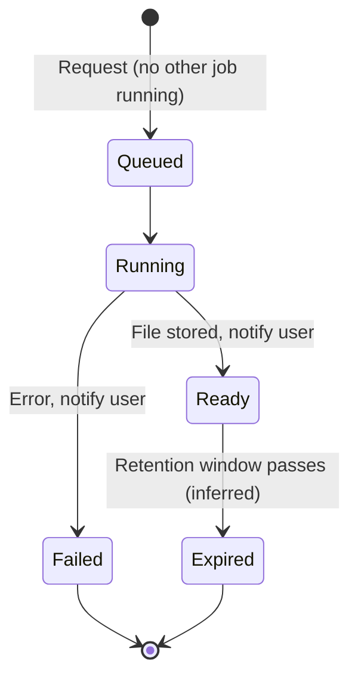
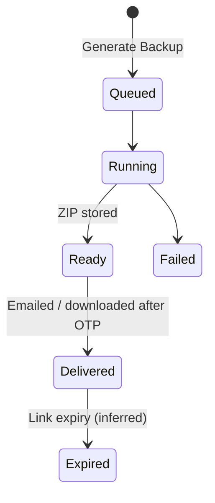

# 11 — Reports, Dashboards & Backup

This module covers every read-only, aggregate surface of BuildControl:

- **Dashboards**: the Projects home (project cards, status counts, HRMS check-in banner), the per-project **Dashboard** ("Charts & Performance Overview"), the **Inquiry dashboard** (sales CRM) and the **HRMS dashboard**.
- **Reports**: the per-project **Reports** tile with its fixed report list, the module-specific reports reachable from each module's screens, and the cross-project **Central Reports** workspace.
- **Report rendering conventions**: PDF/Excel, page header, async generation with a notification popup.
- **Backup**: Data Backup and Media Backup per module and per project, master-records backup and daily-work backup.

Who uses it: company owner and admins (all projects, financial figures), project managers (their projects), accountants (payment and ledger reports), store keepers (stock register, delivery notes), HR (HRMS dashboard), sales (inquiry dashboard). What each person sees is gated by the `read`, `report`, `print`, `viewAll` and `financial` flags of the underlying menu (module 01).

Reports do not own data; every number here comes from modules 03–10.

---

## Legacy behaviour

### App shell

- Three bottom tabs: **Projects** (home), **Workspace** (HRMS [beta], Central payment, Central store, Central Reports, Central Inventory), **Master**.
- Top bar: organisation switcher (multi-company), support chat, notifications. Free-trial banner (module 13).

### Projects home (Projects tab)

Data source: `home/projects` (v2) returns an **organization** block, a **permissions summary**, the **attendance state** (check-in banner with `geo_fence_required`) and **status_counts**. Pinned projects come from `home/projects/pinned`.

- **Status filter** chips with counts: All / Ongoing / Completed / Not started / On hold (project status 1..4; counts from `status_counts`).
- **Search** by project name.
- **Pinned projects** first (pin from the card kebab).
- **Project card**: initials avatar (or logo), name, address, start/end dates, progress %, kebab menu (Pin, Edit, Hide modules).
- **Check-in banner**: "Not checked in / Check In" — HRMS attendance shortcut (module 10). Shown when the user is an HRMS employee; `geo_fence_required` tells the client to fetch GPS before calling check-in.
- Project options menu: View project details, **Backup** (project data export), **Hide/Show Modules**.

### Project home tiles

17 tiles: Dashboard, Create Wing, Project Drawings, Testing Reports, Equipment Usage, Daily Worksheet, Manage Materials, Issues and snags, **Reports**, Payments, Inquiry, Booking Details, Progress Report, Task, Inspection Request, Gallery, Attendance. Tile order is per user (`projectMenuOrderIds` in localStorage); visibility via Hide/Show Modules (module 12).

### Project Dashboard (`#/chartsDashboard`) — "Charts & Performance Overview"

- **Filter duration**: default last 1 year.
- **KPI tiles** (top): Material Approvals, Payment Approvals, Pending Issues & Snags, Pending Inspections.
- **Manage Dashboard**: toggle and reorder sections — Task, Payments, Daily Work, Equipment Usage, Materials, Issue And Snag, Attendance, Inspection Request, Booking, Inquiry.

Section widgets:

| Section            | Widgets                                                                                                                                                                                                                                        |
| ------------------ | ---------------------------------------------------------------------------------------------------------------------------------------------------------------------------------------------------------------------------------------------- |
| Task               | **Project Progress %** gauge (with project start/end date); **Value Earned By Task** (task value vs earned value); **Filtered By Status** (Not Started / In Progress / Delayed / Completed counts)                                             |
| Payments           | **Payment In & Out & Balance** + trend chart; **Due Payments** table (party, total invoice, paid, due; export); **Module Wise Payment** pie (Contractor / Vendor / Supplier / Labour / Other Expenses)                                         |
| Daily Work         | **Total Labours Availability** trend; **Contractor-wise Labour** (contractor, department, skilled, unskilled)                                                                                                                                  |
| Equipment Usage    | **Top Equipment by Work Hours**; **Category-wise** (Owned vs Rented)                                                                                                                                                                           |
| Materials          | **Material Summary** (total materials, in stock, low stock, out of stock, total PO, total PO value); **Month-wise PO Value**; **Stock Register Report** (movement and balance per material)                                                    |
| Issue And Snag     | Status charts; Assignee-wise issue chart (from Issues notes)                                                                                                                                                                                   |
| Attendance         | **Labour Attendance** present/absent; **Labours Present At Site** day-wise; **Labour Payment Status** (balance per labour); **Vendor's Labour Attendance** (present / half / OT); **Vendor-wise Labour Allocation**; **Vendor Payment Status** |
| Inspection Request | Total / Approved / Pending / Rejected + **Success Rate** gauge                                                                                                                                                                                 |
| Booking            | **Booking by Status** (units booked vs available); **Booking Report**                                                                                                                                                                          |
| Inquiry            | Funnel                                                                                                                                                                                                                                         |

Permission: Dashboard #65 [R]. Endpoint `Dashboard/PermissionsList` (inferred: which sections the user may see).

### Inquiry dashboard (module 09)

KPIs: Total / Open / Converted / Lost / Conv. Rate / Overdue. Widgets: **Lead source wise performance**, **Funnel stage breakdown**, **Sales team performance**, **Call Activity** (Today / Yesterday / This Week / This Month / All Time).

### HRMS dashboard (module 10, `hrms/dashboard`)

- **Today's Snapshot**: Present Today / On Leave / Employees.
- **Present/Absent Breakdown**.
- **Day-Wise Trend**.
- **Pending Approvals** (attendance and leave).
- **Team Leaves**.

### Equipment dashboard

Equipment usage has its own dashboard and reports (usage, maintenance, transfer) — route names not captured beyond `#/EquipmentSheetList`.

### Project Reports tile

Fixed report list (in legacy order):

1. Daily Work
2. Purchase Order
3. Material received
4. Contractor payment
5. Supplier payment
6. Rented Equipment Usage
7. Company Owned Equipment Usage
8. Inquiries
9. Bookings
10. Issue & Snag
11. Task Report
12. Petty Cash
13. Inspection Request
14. Material Transfer
15. Other Expense
16. Transaction
17. Drawings Data
18. Testing Report Data
19. Project All Media

Each opens a filter sheet (date range at minimum) and renders PDF or Excel. Permission: Reports #20 [RP] (read, print).

### Module-level reports (reachable from module screens)

| Report                                                            | Module               | Content (from notes)                                                                                                                                                                         |
| ----------------------------------------------------------------- | -------------------- | -------------------------------------------------------------------------------------------------------------------------------------------------------------------------------------------- |
| Daily worksheet report                                            | 04                   | Date, Department, Contractor, Skilled Workers, UnSkilled Workers, LocationType, Location, App. Work Done, TaskName, Shift, Work Images, Consumed Material, Labour Details                    |
| Approx WorkDone Report                                            | 04                   | Approximate work done (value + unit) by location/department (inferred columns)                                                                                                               |
| Department Wise Work Report                                       | 04                   | Work grouped by department (inferred columns)                                                                                                                                                |
| Daily Progress Report (DPR)                                       | 04 / Progress Report | Organisation, Project, Address, Report Filled By, Date, Total Skilled / Unskilled / Total Labour, Equipment Details, worksheets; "Include images in report"; async                           |
| Task Report / Task Progress Report                                | 05                   | Duration, location, task, progress %; by location, percent                                                                                                                                   |
| Issue & Snag report; Assignee-wise issue chart                    | 05                   |                                                                                                                                                                                              |
| Inspection Request Report                                         | 05                   |                                                                                                                                                                                              |
| Purchase Request report                                           | 06                   | Filters Date (This Week / Last Week / Last 15 Days / This Month / Last Month / Custom), Status, Material Category, Material, Created By, Location Type                                       |
| Purchase Order report / PO PDF                                    | 06                   | List filters Date / Status / Supplier                                                                                                                                                        |
| GRN PDF / Material received report                                | 06                   |                                                                                                                                                                                              |
| Stock Register                                                    | 06                   | Per material: Opening Balance, Received, Transfer In, Transfer Out, Consumed, Missing, Closing Balance; ledger types Consumed / TransferredOut / Missing / Received / TransferredIn / Issued |
| Material Transfer report                                          | 06                   | Transfer Number, Transfer Date, Transfer Type, Store, Project, Status, Sent By, Received By, Remark                                                                                          |
| Deliveries Report / Delivery Note Report                          | 06 (Central store)   |                                                                                                                                                                                              |
| Material Request export (PDF)                                     | 06                   | Per MR                                                                                                                                                                                       |
| Ledger Report                                                     | 07                   | Opening Balance, Total Credit, Total Debit, Closing Balance; filters Paid To, Bank Account, Category, Type, Mode, Module, Status                                                             |
| Transaction Report                                                | 07                   |                                                                                                                                                                                              |
| Petty Cash Report                                                 | 07                   | Voucher-wise: Date, Voucher No, Category, Account, Paid To / Received from, Credit, Debit, Status, Description, View Voucher, Total; Closing Balance                                         |
| Export Receipts (petty cash)                                      | 07                   | ZIP delivered via notification                                                                                                                                                               |
| Petty cash vouchers export                                        | 07                   | `v2/petty-cash/vouchers/export`                                                                                                                                                              |
| Contractor payment report / Contractor Centralized Payment Report | 07                   | Invoices: Created Date, Invoice Date, Contractor, Department, Invoice Number, Invoice Amount, TDS Amount, Paid Amount, Balance, Remarks                                                      |
| Supplier payment report / Centralized Supplier Payment Report     | 07                   | Supplier Name, Invoice Date, Invoice Number, Invoice Amount, Paid Amount, Balance, Due Date, GR/DC No, Store/Project                                                                         |
| All Labour Attendance Report                                      | 08                   |                                                                                                                                                                                              |
| All Labour Payment Report                                         | 08                   |                                                                                                                                                                                              |
| Month-wise labour report                                          | 08                   |                                                                                                                                                                                              |
| Contractor-wise labour                                            | 04 / dashboard       | Contractor, department, skilled, unskilled                                                                                                                                                   |
| Month-wise vendor attendance; Vendor OT attendance                | 08                   |                                                                                                                                                                                              |
| Central Vendor Attendance Report                                  | 08 / Central Reports | Filters Vendor, Labour Category, dates                                                                                                                                                       |
| Equipment Usage report                                            | 04 equipment         | Equipment No, Operator, Supervisor, Utilisation, Idle, Breakdown, Fuel, Meter, Hire Cost, …                                                                                                  |
| Equipment Maintenance report                                      | equipment            | Maintenance log                                                                                                                                                                              |
| Equipment Transfer Report                                         | equipment            | Equipment Name, Number, Purchase Year, Transfer Date, Location Before, Transfer To Project, Latest Location, Remarks, Entry By                                                               |
| Inquiry Report                                                    | 09                   | Filters Interest Type, Lead Source, Status, Closing Type, Lost Reason                                                                                                                        |
| Booking Report                                                    | 09                   | Booking Date, Name, Wing, Unit No, Referred by, Remarks                                                                                                                                      |
| Contractor / Supplier master report                               | 02                   | `Contractor/Report`, `Supplier/Report`                                                                                                                                                       |
| Team Members report                                               | 01                   | `Employees/Report`                                                                                                                                                                           |
| HRMS reports                                                      | 10                   | Monthly attendance, team leave, team salary                                                                                                                                                  |

### Central Reports (Workspace → Central Reports, menu #77 [R])

Cross-project reports (names from notes):

- **Central labour attendance** (all projects).
- **Central Vendor Attendance Report** (filters Vendor, Labour Category, dates).
- **Contractor Centralized Payment Report**.
- **Centralized Supplier Payment Report**.
- **Central purchase request report**.
- **Central inventory stock ledger** — generated via `reports/central_inventory_stock_ledger/generate` (async).

Central Inventory (#96 [RP]) and Central payment (#75 [R]) are adjacent Workspace tiles with their own lists (modules 06, 07).

### Report rendering conventions

- Output: **Download as PDF / Excel**.
- PDF page header: **Organisation**, **Project**, **Address**, **Duration** (date range); footer **Page x of y**.
- Project logo in report when `useProjectLogoInReport` is true on the project (module 03).
- **"Include images"** option (e.g. "Include images in report" on DPR).
- **"Only Current Project Report"** option (Backup / reports — scope limiter).
- Heavy reports are **async**: "You will receive a popup once the report is ready"; delivery is a push notification and an in-app popup with the download (module 13).
- Concurrency guard: **"Please wait while another report is generating"** — one async report at a time per user (inferred scope: per user).
- Progress Report screen has "Create new" and "View Reports" (list of previously generated files).

### Backup

- Project options → **Backup** (project data export).
- Backup screen: **Data Backup** / **Media Backup**; choose module(s) (per module); **date range**; **Generate Backup** (async).
- Delivered by email and/or protected by OTP ("emailed/OTP-protected" in notes).
- **"Only Current Project Report"** scope toggle.
- **Daily work backup** route `#/dailyWorkBackupRoute`.
- **Master records backup** (exports of masters; mechanism per master: Export Team Members, Contractor/Supplier exports, items/exports, labour sample-export).
- **Project All Media** report (all photos/files of a project).
- Profile: **Download My Data** (export request) — personal data export (module 01).

---

## Entities & fields

Reports and dashboards are computed; the rebuild only needs entities for user preferences, generated files and backup jobs.

### DashboardLayout (per user per project — inferred scope)

| Field            | Type                                                                                                                                                               | Required | Notes                                  |
| ---------------- | ------------------------------------------------------------------------------------------------------------------------------------------------------------------ | -------- | -------------------------------------- |
| User             | FK → TeamMember                                                                                                                                                    | yes      |                                        |
| Project          | FK → Project                                                                                                                                                       | yes      | Legacy may be per user only (inferred) |
| Sections         | json [{key: enum{Task, Payments, DailyWork, EquipmentUsage, Materials, IssueAndSnag, Attendance, InspectionRequest, Booking, Inquiry}, visible: bool, order: int}] | yes      | "Manage Dashboard"                     |
| Default duration | enum{Last1Year, …}                                                                                                                                                 | yes      | Default last 1 year                    |

### ProjectTileOrder

| Field    | Type            | Required | Notes                                                           |
| -------- | --------------- | -------- | --------------------------------------------------------------- |
| User     | FK → TeamMember | yes      | Legacy kept `projectMenuOrderIds` in localStorage (device only) |
| Tile ids | int[]           | yes      | Order of the 17 tiles                                           |

### PinnedProject

| Field     | Type            | Required | Notes                  |
| --------- | --------------- | -------- | ---------------------- |
| User      | FK → TeamMember | yes      |                        |
| Project   | FK → Project    | yes      | `home/projects/pinned` |
| Pinned at | datetime        | yes      | (inferred)             |

### HomeProjectsResponse (read model, `home/projects`)

| Field         | Type                                                 | Notes                                                                |
| ------------- | ---------------------------------------------------- | -------------------------------------------------------------------- |
| organization  | object                                               | Company name, logo, etc.                                             |
| permissions   | object                                               | Summary of the user's menu flags                                     |
| attendance    | object                                               | Check-in state; `geo_fence_required` bool                            |
| status_counts | {all, ongoing, completed, not_started, on_hold: int} | Status filter chips                                                  |
| projects      | ProjectCard[]                                        | name, address, startDate, endDate, progress %, logo/initials, pinned |

### KPI tiles (read model)

| Field                  | Type | Notes                                                                    |
| ---------------------- | ---- | ------------------------------------------------------------------------ |
| Material Approvals     | int  | Pending PR/PO/MR/transfers awaiting approval (inferred definition)       |
| Payment Approvals      | int  | Pending transactions / petty cash / other expenses / invoice settlements |
| Pending Issues & Snags | int  | Status Pending or Delayed                                                |
| Pending Inspections    | int  | Pending for approval                                                     |

### ReportDefinition (catalogue)

| Field           | Type                            | Required | Notes                                                 |
| --------------- | ------------------------------- | -------- | ----------------------------------------------------- |
| Key             | string                          | yes      | e.g. `daily_work`, `purchase_order`, `stock_register` |
| Title           | string                          | yes      |                                                       |
| Scope           | enum{Project, Central, Company} | yes      |                                                       |
| Menu            | FK → Menu                       | yes      | Permission source                                     |
| Formats         | enum{Pdf, Excel}[]              | yes      |                                                       |
| Async           | bool                            | yes      |                                                       |
| Supports images | bool                            | yes      | "Include images"                                      |
| Filters         | json                            | yes      | Filter schema                                         |

### ReportJob (generated report)

| Field                       | Type                                          | Required | Notes                      |
| --------------------------- | --------------------------------------------- | -------- | -------------------------- |
| Report                      | FK → ReportDefinition                         | yes      |                            |
| Requested by                | FK → TeamMember                               | yes      |                            |
| Project                     | FK → Project                                  | no       | Null for central           |
| Filters                     | json                                          | yes      | Duration from/to, etc.     |
| Format                      | enum{Pdf, Excel, Zip}                         | yes      |                            |
| Include images              | bool                                          | no       |                            |
| Status                      | enum{Queued, Running, Ready, Failed, Expired} | yes      | (inferred states)          |
| File                        | file                                          | no       | When Ready                 |
| Requested at / completed at | datetime                                      | yes / no |                            |
| Notification                | FK → Notification                             | no       | Popup on ready (module 13) |

### BackupJob

| Field           | Type                                             | Required         | Notes                             |
| --------------- | ------------------------------------------------ | ---------------- | --------------------------------- |
| Kind            | enum{Data, Media}                                | yes              |                                   |
| Scope           | enum{Project, MasterRecords, DailyWork, Company} | yes              |                                   |
| Project         | FK → Project                                     | if project scope | "Only Current Project Report"     |
| Modules         | string[]                                         | yes              | Per-module selection              |
| Date from / to  | date                                             | yes              |                                   |
| Requested by    | FK → TeamMember                                  | yes              |                                   |
| Delivery        | enum{Email, Download}                            | yes              | Email and/or OTP                  |
| OTP verified at | datetime                                         | no               | OTP-protected download (inferred) |
| Status          | enum{Queued, Running, Ready, Failed, Expired}    | yes              | (inferred)                        |
| File(s)         | file[]                                           | no               | ZIP                               |

---

## Workflows & states

### 1. Open the Projects home

1. App calls `home/projects`; renders org block, status chips with counts, pinned then remaining projects.
2. If HRMS attendance applies and the user has no active entry: show "Not checked in / Check In".
3. Tap a status chip → filter; type in search → filter by name.
4. Kebab → Pin / Edit / Hide modules.

### 2. View a project dashboard

1. Open Dashboard tile → `#/chartsDashboard`.
2. Default duration last 1 year; change filter.
3. KPI tiles render; sections render in the user's saved order, hidden ones skipped.
4. Manage Dashboard → toggle/reorder sections → save.
5. Tables with export (Due Payments) download Excel.

### 3. Generate a report

1. Reports tile → pick a report → filter sheet (duration, module-specific filters, Include images).
2. Choose PDF or Excel.
3. Small reports render immediately; heavy reports become a job: "You will receive a popup once the report is ready".
4. If another report of the user is still generating → "Please wait while another report is generating".
5. On completion: push notification + popup with download link (module 13).

### 4. Backup

1. Project options → Backup (or Daily work backup / masters).
2. Choose Data Backup or Media Backup; modules; date range; "Only Current Project Report".
3. Generate Backup → async job.
4. Delivered via email and/or OTP-protected download.

### 5. Central report

1. Workspace → Central Reports.
2. Pick report (e.g. central inventory stock ledger) → filters across projects/stores.
3. `reports/central_inventory_stock_ledger/generate` → async, notification on ready.

---

## Business rules & validations

- A user sees a dashboard section only if they have `read` on the underlying menu (Task #53, Payments #47 etc.) — `Dashboard/PermissionsList` (inferred mapping).
- Financial widgets (Payments section, Due Payments, PO value, Labour/Vendor Payment Status, Value Earned) require the `financial` flag on the relevant menu (inferred from the presence of F on Project, Task, Labour, Vendor, Materials, Material Received, Equipment Usage, Equipments, Progress Report, Salary).
- Reports tile requires Reports #20 `read` (R); downloading requires `print` (P).
- Module reports require the module's `report` flag O (e.g. Daily Worksheet #19, Purchase Order #18); PDF/Excel download requires `print` P.
- `viewAll` limits rows: without it a user sees only entries they created/are assigned (inferred).
- Central Reports require Central Reports #77 `read` (R); Central Inventory #96 `read`/`print` (RP).
- Duration filter defaults to last 1 year on the dashboard.
- PR report date presets: This Week, Last Week, Last 15 Days, This Month, Last Month, Custom.
- Every PDF carries Organisation, Project, Address, Duration header and Page x of y.
- Images included only when "Include images" is ticked.
- One async report per user at a time.
- Backups are OTP/email protected.
- Project status values: Ongoing = 1, Completed = 2, Not started = 3, On hold = 4 (order of 1..4 as listed; inferred mapping).
- Hidden modules (module 12) are hidden from tiles, dashboard sections and Reports list for that project (inferred).

---

## Permissions

Legend (`RolePermissions/DefaultMenuPermission/GetAllV3`): C=create R=read U=update D=delete A=approve J=reject P=print/download N=notification V=viewAll T=transfer O=report F=financial E=export I=import. Flags relevant to this module: R (see), O (report), P (download PDF/Excel), V (all rows, not only own), F (amounts), E (export), N (report-ready notification).

| Menu (id)                  | Flags       | Report-relevant flags | Used here                                                             |
| -------------------------- | ----------- | --------------------- | --------------------------------------------------------------------- |
| Dashboard (65)             | R           | R                     | Project dashboard                                                     |
| Reports (20)               | RP          | R, P                  | Project Reports tile; download                                        |
| Central Reports (77)       | R           | R                     | Central Reports workspace                                             |
| Central Inventory (96)     | RP          | R, P                  | Central inventory stock ledger                                        |
| Central payment (75)       | R           | R                     | Centralized contractor / supplier payment reports                     |
| Payments (47)              | R           | R                     | Payments tile (contractor / supplier / labour / vendor payment lists) |
| Progress Report (73)       | CRDNF       | C, R, N, F            | DPR generation (create), view, delete, ready notification, financial  |
| Daily Worksheet (19)       | CRUDAPNO    | P, O                  | Daily work / Approx WorkDone / Department-wise reports                |
| Task (53)                  | CRUDAJPNVOF | P, V, O, F            | Task / Task Progress report; Value Earned (F)                         |
| Issues and snags (51)      | CRUDAJPNVO  | P, V, O               | Issue & Snag report, assignee chart                                   |
| Inspection Request (54)    | CRUDAJPNO   | P, O                  | Inspection Request report                                             |
| Testing Reports (44)       | CRUD        | R                     | Testing Report Data (no O/P flag — inferred: covered by Reports #20)  |
| Project Drawings (21)      | CRUDN       | R                     | Drawings Data (inferred: covered by Reports #20)                      |
| Purchase Request (17)      | CRUDAJPNO   | P, O                  | Purchase Request report                                               |
| Purchase Order (18)        | CRUDAJPNO   | P, O                  | Purchase Order report, PO PDF                                         |
| Material Received (30)     | CRUDPNVOF   | P, V, O, F            | Material received report, GRN PDF, amounts                            |
| Material Transfer (50)     | CRUDAJPNO   | P, O                  | Material Transfer report                                              |
| Current Inventory (16)     | CRUDPNO     | P, O                  | Stock Register                                                        |
| Central Store (MR) (67)    | CRUDAPNO    | P, O                  | MR export (PDF)                                                       |
| Delivery Note (68)         | CRUDAPNO    | P, O                  | Delivery Note / Deliveries report                                     |
| Transactions (63)          | CRUDAJPNO   | P, O                  | Transaction report, Ledger report                                     |
| Company's Bank A/C (61)    | CRUDPO      | P, O                  | Ledger report per account (inferred)                                  |
| Petty Cash (52)            | CRUDAJPNVO  | P, V, O               | Petty Cash report, Export Receipts ZIP                                |
| Parties (76)               | CRUDAJEPNO  | E, P, O               | Party / Other Expense reports; export                                 |
| Attendance (57)            | CRUDPO      | P, O                  | All Labour Attendance, month-wise reports                             |
| Labour (58)                | CRUDPTOF    | P, O, F               | All Labour Payment report, Labour Payment Status (F)                  |
| Vendor (59)                | CRUDPOF     | P, O, F               | Vendor attendance / payment reports, Vendor Payment Status (F)        |
| Equipment Usage (56)       | CRUDAPNOF   | P, O, F               | Rented / Company Owned Equipment Usage reports, hire cost (F)         |
| Equipments (22)            | CRUDPNTOF   | P, O, F               | Equipment maintenance / transfer reports                              |
| Inquiry (8)                | CRUDPNVO    | P, V, O               | Inquiry report, inquiry dashboard                                     |
| Booking Details (41)       | CRUDPNO     | P, O                  | Booking report                                                        |
| Gallery (55)               | R           | R                     | Project All Media                                                     |
| HRMS (78)                  | R           | R                     | HRMS dashboard                                                        |
| Attendance Management (80) | CRUDAJENVO  | E, V, O               | Monthly attendance summary / report                                   |
| Leave Management (81)      | CRUDAJNVO   | V, O                  | Team leave report                                                     |
| Salary Management (82)     | CRUDAJENVOF | E, V, O, F            | Team salary report, salary slips                                      |
| Project (4)                | CRUDF       | F                     | Backup from project options (inferred: owner/admin); budget value     |

---

## Relationships

- → depends on **01 Organization/Identity/Access**: permissions (`read`, `print`, `report`, `viewAll`, `financial`), organisation block for report headers.
- → depends on **03 Projects/Structure/Drawings/Gallery**: project status, dates, logo (`useProjectLogoInReport`), drawings, gallery media.
- → depends on **04 Daily Site Work**: worksheets, DPR, equipment usage.
- → depends on **05 Tasks/Issues/Inspections**: task progress, earned value, issues, inspections, testing reports.
- → depends on **06 Procurement & Inventory**: PR, PO, GRN, stock register, transfers, central store MR and delivery notes.
- → depends on **07 Payments & Accounting**: transactions, ledger, petty cash, contractor/supplier/labour/vendor payments, other expenses.
- → depends on **08 Labour & Vendor Attendance**: attendance and payment status.
- → depends on **09 Sales CRM**: inquiries, funnel, bookings.
- → depends on **10 HRMS**: HRMS dashboard, check-in banner.
- → depends on **12 Settings**: hidden modules, tile order, currency format, timezone.
- ← used by **13 Chat/Notifications**: async report and backup completion notifications.

---

## Reports & exports

Summary of all report outputs in one list (detail above):

- **Project Reports tile (19)**: Daily Work, Purchase Order, Material received, Contractor payment, Supplier payment, Rented Equipment Usage, Company Owned Equipment Usage, Inquiries, Bookings, Issue & Snag, Task Report, Petty Cash, Inspection Request, Material Transfer, Other Expense, Transaction, Drawings Data, Testing Report Data, Project All Media.
- **Site**: Daily Progress Report, Approx WorkDone Report, Department Wise Work Report, Contractor-wise labour, Task Progress Report, Equipment Usage / Maintenance / Transfer reports.
- **Materials**: Purchase Request report, Purchase Order report, GRN PDF, Stock Register, Material Transfer report, Delivery Note Report / Deliveries Report, MR PDF.
- **Accounts**: Ledger Report, Transaction Report, Petty Cash Report, Export Receipts (ZIP), Contractor / Supplier payment reports (project and centralized), Due Payments export.
- **Labour & vendor**: All Labour Attendance, All Labour Payment, Month-wise labour, Month-wise vendor attendance, Vendor OT attendance, Central labour attendance, Central Vendor Attendance.
- **Sales**: Inquiry Report, Booking Report.
- **Central**: central labour attendance, central vendor attendance, centralized contractor / supplier payment, central purchase request, central inventory stock ledger.
- **Masters**: Team Members, Contractor, Supplier reports/exports; items exports; labour sample export.
- **HRMS**: monthly attendance, team leave, team salary, salary slips.
- **Backups**: Data / Media per module, project backup, master records backup, daily work backup, Project All Media.

---

## Rebuild recommendations

1. **One report engine, one job table.** Every report is a `ReportDefinition` with a filter schema, permission menu and renderer (PDF, Excel). Async generation, notification on ready, and "one running job per user" become shared behaviour rather than per-screen code.
2. **Allow more than one queued job** but cap concurrency per user; show a jobs list ("My downloads") instead of blocking with "Please wait while another report is generating".
3. **Statutory registers as first-class reports**: combined attendance register cum muster roll and wage register (Form XVI / XVII or the combined form under the Ease of Compliance Rules 2017), wage slips (Form XIX), PF/ESI challan inputs per contractor, BOCW cess computation per project (1% of cost of construction) ([research §2 Labour and welfare](../research/market-and-compliance.md)).
4. **TDS reports**: TDS ledger per party per FY with 194C/194J/194Q/194I sections and threshold tracking; 26Q export (research §2 TDS). The legacy Contractor payment report already carries a TDS Amount column.
5. **RERA outputs**: quarterly physical % complete per wing, cost incurred, allottee receipts vs 70% account, sold/unsold inventory — inputs for Forms 1–3 and the QPR (research §2 RERA). The Booking by Status and Task Progress widgets are the starting point.
6. **GST reports**: 80/20 registered-supplier test per project per FY for promoters; ITC-eligible purchase register (research §2 GST).
7. **Financial-year aware filters**: add "This FY" / "Last FY" presets (April–March) next to the legacy presets; label FY as "26-27" to match numbering prefixes (module 12).
8. **Server-side tile order and dashboard layout**: legacy stored `projectMenuOrderIds` in localStorage, so it was lost per device; persist per user.
9. **Audit-friendly exports**: every generated PDF records who generated it, when, with which filters, and includes "Generated on" in the footer.
10. **Backup = full data export without lock-in**: CSV/JSON per entity + media ZIP, available to the owner at any time, including after plan expiry. Pricing lock-in and "pay or we delete your data" are the top complaints about competitors (research §1, §4 item 9).
11. **Tally/Zoho export** of vouchers from the Transaction and Ledger reports (research §4 item 3).
12. **Signed, expiring download links** for reports and backups instead of OTP prompts on every download; OTP only for full company backups.
13. **Dashboard numbers from the same queries as reports** so a KPI tile and its report never disagree.
14. **Offline-friendly DPR**: generate DPR from cached data and share as PDF/WhatsApp (research §4 items 1–2).

---

## Open questions

1. Exact definitions of KPI tiles "Material Approvals" and "Payment Approvals" — which modules' pending items are counted?
2. Is the dashboard layout stored per user, per project, or company-wide?
3. Which reports are async and which are synchronous in legacy?
4. Is "Please wait while another report is generating" scoped per user, per company or per device?
5. Backup delivery: email only, OTP-protected download, or both? Who receives the email?
6. What does "Media Backup" contain — all uploaded files (worksheet photos, drawings, receipts) or a subset?
7. Is there a scheduled (automatic) backup?
8. Columns of Approx WorkDone Report and Department Wise Work Report.
9. Does Central Reports include anything beyond the six reports named here?
10. How long are generated files retained?
11. Does `Dashboard/PermissionsList` return section visibility, or the user's menu permissions generally?
12. Excel output: one sheet per report, or include images as links?
