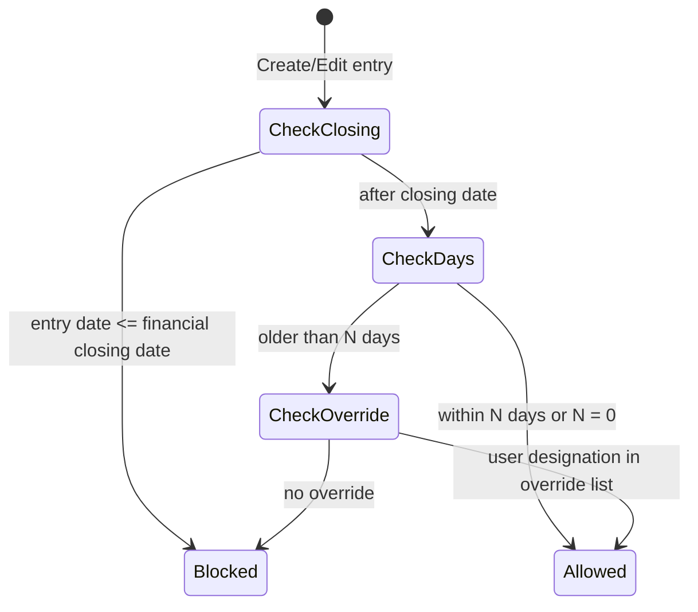

# 12 — Settings & Configuration

Company-wide and per-project configuration that changes how other modules behave without changing their data:

- **Manage Sequence IDs** — numbering rules for document numbers (PR, PO, GRN, Material Transfer, Petty Cash, Central Store MR, Delivery Note, Inspection Request, Other Party Sales Invoice).
- **Back Dated Entry Control** — how far back users may create or edit entries, globally and per module, with designation overrides and a financial closing date.
- **Currency settings** — company currency (INR default), number format, non-Indian company flag.
- **Form configuration** — worksheet section toggles and ordering, worksheet approval setting, equipment usage field toggles, material received hide/show fields.
- **Per-project Hide/Show Modules** and project tile ordering.
- **Timezone** setting.
- **Approval settings** per module.
- **Menu permission assignment** (`MenuPermission/AssignMenu`).

Who uses it: company owner and admins (Setting #86 [CRUD]); project managers for per-project module visibility and form settings (inferred); each user for their own timezone and tile order.

---

## Legacy behaviour

### Navigation

- Master tab → **Setting** (`#/settingsList`). Menu Setting #86 [CRUD] under Master records.
- Setting list sections (from `ModulePrefix/GetModuleList` and screens):
  - **Sequence IDs** → **Manage Sequence IDs** (`#/numberingScreen`).
  - **Company config** → **Back Dated Entry Control** (`#/backdatedEntryControl`).
  - **Other** → **Currency settings**.
- Form settings live inside each module:
  - Daily Worksheet: gear icon "Setting for the work item form" (`WorkItem/GetSettings`, `WorkItem/ColumnSettings`, `WorkItem/SaveSettings`, `WorkItem/SaveFormConfig`), Worksheet Approval Settings (`WorkItem/ApprovalSetting`).
  - Equipment Usage: settings (`v2/equipment-usage/settings`).
  - Material Received (GRN): `#/materialReceivedHideShowFieldScreen`.
  - Inquiry: Funnel status settings (`#/funnelStatusSettings`, `FunnelStatus/Reorder`) — owned by module 09, referenced here.
- Per project: project card kebab / project options → **Hide/Show Modules**. Tile order: `projectMenuOrderIds` (localStorage).
- Profile (`v2/home/profile`) → timezone, currency; `Employees/UpdateLoginTimezone`, `Employees/UpdateCompanyCurrency`.
- Menu permissions: `MenuPermission/GetAll`, `MenuPermission/MenuList`, `MenuPermission/AssignMenu`; role defaults `RolePermissions/DefaultMenuPermission/GetAll{,V2,V3}`; per-user `EmployeeUserPermissions/EmployeeUserPermissionUpdate`; designation templates `#/designationRolePermission`.

### Manage Sequence IDs (`#/numberingScreen`)

- Module picker / tabs: PR (PurchaseRequest), PO (PurchaseOrder), GRN (GoodsReceipt — Material Received), Material Transfer (MaterialTransfer), Petty Cash (PettyCash), Central Store MR (MaterialRequest), Delivery Note (DeliveryNote), Inspection Request (InspectionRequest), Other Party Sales Invoice (OtherPartySalesInvoice).
- For each module, **rule rows**:
  - **Project**: All/Default or a specific project.
  - **Prefix**: e.g. `PR/26-27`.
  - **Project Id**: token e.g. `PX`.
  - **Start Number**: e.g. 1.
  - **Preview**: `PR/26-27/PX/00001`.
- Multiple rules per module; one is the **default**; FAB **add** rule.
- Delivery Note sample number seen elsewhere: `MDN00001`.

### Back Dated Entry Control (`#/backdatedEntryControl`)

API: `settings/backdated-entry`, `settings/backdated-entry/global`, `settings/backdated-entry/financial-closing`.

- **Default limits**
  - "Restrict creating entries older than N days" (0 = none).
  - Override mode: **No override** (hard block for all) | **allow designations to override** (pick designations).
  - "Restrict editing entries older than N days" + same override choice.
- **Module Overrides**, grouped:

| Group           | Modules                                                                                       |
| --------------- | --------------------------------------------------------------------------------------------- |
| Procurement     | PR, PO, GRN, Material Transfer, Central Store MR, Delivery Note                               |
| Site            | Daily Worksheet, Equipment Usage, Issues & Snags, Inspection Request, Material Testing Report |
| Inventory       | Current Inventory, Material Consumed, Missing Material                                        |
| Accounts        | Petty Cash, Transactions                                                                      |
| Labour & Vendor | Labour Attendance, Vendor Attendance                                                          |
| Sales           | Inquiry, Inquiry Follow-up, Booking                                                           |
| HRMS            | Attendance, Leave, Holiday                                                                    |

- Each module row shows its effective setting, e.g. "Global, Create 0d · Edit 0d", with **+** to override (mode custom).
- **Advanced**: financial closing date.
- Per-user permission row also carries `backdatedCreateDays`, `backdatedEditDays`, `financialClosingDate` (resolved values sent to the client).

### Currency settings

- Company currency (INR default), symbol, format `₹1,00,000.00` (Indian grouping).
- Picker lists world currencies (`Countries/Combo` — inferred source).
- `isNonIndianCompany` flag (also in localStorage) — switches off India-specific behaviour (inferred: GST/PAN fields, Indian grouping).
- Update via `Employees/UpdateCompanyCurrency`.

### Form configuration

#### Daily Worksheet form settings

- Toggle sections: **Location Type**, **Work Type**, **Approx Work Done**, **Labour Details**, **Material consumption**, **Remark**, **Work Images**.
- Reorder sections: **Location**, **Basic**, **Material Consumption**, **Other**.
- **Worksheet Approval Settings**: approve worksheet on/off (`approvalStatus` bool). When on, worksheets go through Pending | Partially Approved | Approved (module 04).

#### Equipment Usage settings (`v2/equipment-usage/settings`)

Field toggles: **Operator**, **Supervisor**, **Location Type**, **Approx Work Done**, **Rented hour**, **Add Fuel Consumption**, **Remarks**, **Upload File**, **Material consumption**, **Meter Readings**, **Breakdown Hours**, **Approval**.

#### Material Received hide/show fields (`#/materialReceivedHideShowFieldScreen`)

Toggles on GRN fields. Candidate fields from the GRN form: Delivery Challan No, GRN/DC No, Invoice No, Invoice Date, Invoice Amount, Unit rate, Amount, Remark, Store/Project, Suppliers details, Delivery details (exact toggle list not captured — inferred from GRN fields).

### Per-project Hide/Show Modules

- From project options. Lists the project modules (tiles): Dashboard, Create Wing, Project Drawings, Testing Reports, Equipment Usage, Daily Worksheet, Manage Materials, Issues and snags, Reports, Payments, Inquiry, Booking Details, Progress Report, Task, Inspection Request, Gallery, Attendance (and Create Location for non-building projects).
- Toggling hides the tile for the project (for all users — inferred).
- Tile ordering: `projectMenuOrderIds` (per device in legacy).

### Timezone

- `Employees/UpdateLoginTimezone` — per user login timezone; Profile shows timezone.
- Used for attendance times, "today" boundaries, report durations (inferred).

### Approval settings per module

Approval exists in these modules (flags A = approve / J = reject in the permission map, plus explicit endpoints):

| Module                                                | Approval mechanism                                                                                        |
| ----------------------------------------------------- | --------------------------------------------------------------------------------------------------------- |
| Daily Worksheet                                       | `WorkItem/ApprovalSetting` on/off; `WorkItem/SetStatus`; statuses Pending / Partially Approved / Approved |
| Equipment Usage                                       | "Approval" field toggle in settings                                                                       |
| Purchase Request                                      | `PurchaseRequest/SetApprovalStatus`, `BulkSetApprovalStatus`, `Remark`                                    |
| Purchase Order                                        | `PurchaseOrder/SetApprovalStatus`; `v2/purchase-orders/bulk-approval`; Save & Approve                     |
| Material Transfer                                     | A, J flags                                                                                                |
| Central Store MR, Delivery Note                       | A flag (no J — reject is not a separate permission)                                                       |
| Inspection Request                                    | `SetApprovalStatus`, `BulkSetApprovalStatus`, `Remark`                                                    |
| Petty Cash                                            | `SetApprovalStatus`, `BulkSetApprovalStatus`, `Remark`; Save & Approve                                    |
| Transactions                                          | `SetApprovalStatus`, `BulkSetApprovalStatus`, `Remark`                                                    |
| Other Expenses                                        | `SetApprovalStatus`, `BulkSetApprovalStatus`, `Remark`                                                    |
| Parties invoice settled                               | `Party/InvoiceSettled/{SetApprovalStatus, BulkSetApprovalStatus, Reject, Remark}`                         |
| Task, Issues and snags                                | A, J flags                                                                                                |
| HRMS attendance, leave, salary (A, J), shift (A only) | module 10 (`leave_approval_levels`, leave type `approval_levels`)                                         |

Only Worksheet (and the Equipment Usage "Approval" toggle) has an explicit on/off setting in the notes; other modules always have approval when the user lacks approve rights (inferred: "Save" creates Pending, "Save & Approve" requires `approve`).

### Menu permission assignment

- Menu tree (`MenuPermission/MenuList`): categories Project Management, Payment & Accounting, Materials, Master records, Central store, HRMS, Others; project-level menu (parent Project #4).
- Assign per user: Team Member step 3 Role Permissions matrix (columns ADD, VIEW, EDIT, DELETE, APPROVE, REJECT, DOWNLOAD, REPORT, VIEW ALL, NOTIFICATION, TRANSFER, FINANCIAL; column select-all; search).
- Designation templates: designations with `hasPermission` carry a default permission set (Accountant, Admin, Project Manager, Site Engineer, Site Supervisor, Store Keeper).
- `MenuPermission/AssignMenu` (inferred: bulk assign menus to a user or designation).
- HRMS default permission set (module 10).

---

## Entities & fields

### SequenceRule

| Field            | Type                                                                                                                                                      | Required | Notes                                                        |
| ---------------- | --------------------------------------------------------------------------------------------------------------------------------------------------------- | -------- | ------------------------------------------------------------ |
| Company          | FK → Company                                                                                                                                              | yes      |                                                              |
| Module           | enum{PurchaseRequest, PurchaseOrder, GoodsReceipt, MaterialTransfer, PettyCash, MaterialRequest, DeliveryNote, InspectionRequest, OtherPartySalesInvoice} | yes      | Legacy module keys                                           |
| Project          | FK → Project                                                                                                                                              | no       | Null = All/Default                                           |
| Is default       | bool                                                                                                                                                      | yes      | One default per module                                       |
| Prefix           | string                                                                                                                                                    | no       | e.g. `PR/26-27`                                              |
| Project id token | string                                                                                                                                                    | no       | e.g. `PX`                                                    |
| Start number     | int                                                                                                                                                       | yes      | e.g. 1                                                       |
| Padding          | int                                                                                                                                                       | yes      | 5 digits seen (`00001`) — fixed or configurable not captured |
| Separator        | string                                                                                                                                                    | yes      | `/` seen (inferred configurable)                             |
| Next number      | int                                                                                                                                                       | yes      | Current counter (inferred)                                   |

Preview = `{prefix}/{projectIdToken}/{zeroPad(number)}` → `PR/26-27/PX/00001`.

### BackdatedEntryGlobal

| Field                        | Legacy field                             | Type               | Required | Notes                            |
| ---------------------------- | ---------------------------------------- | ------------------ | -------- | -------------------------------- |
| Create days                  | `global.create.days`                     | int                | yes      | 0 = no restriction               |
| Create override designations | `global.create.override_designation_ids` | FK → Designation[] | no       | Empty = No override (hard block) |
| Edit days                    | `global.edit.days`                       | int                | yes      |                                  |
| Edit override designations   | `global.edit.override_designation_ids`   | FK → Designation[] | no       |                                  |
| Financial closing date       | (financial-closing)                      | date               | no       | "Advanced"                       |

### BackdatedEntryModule

| Field            | Legacy field       | Type                                                                    | Required  | Notes                                                      |
| ---------------- | ------------------ | ----------------------------------------------------------------------- | --------- | ---------------------------------------------------------- |
| Module key       | `module_key`       | string                                                                  | yes       |                                                            |
| Group            | `group`            | enum{Procurement, Site, Inventory, Accounts, LabourVendor, Sales, HRMS} | yes       |                                                            |
| Menu             | `menu_id`          | FK → Menu                                                               | yes       |                                                            |
| Entry date field | `entry_date_field` | string                                                                  | yes       | e.g. `PurchaseRequestDate`, `PurchaseOrderDate`, `GRNDate` |
| Mode             | `mode`             | enum{global, custom}                                                    | yes       |                                                            |
| Create           | `create`           | {days: int, override_designation_ids: int[]}                            | if custom |                                                            |
| Edit             | `edit`             | {days: int, override_designation_ids: int[]}                            | if custom |                                                            |

Module rows (24): PR, PO, GRN, Material Transfer, Central Store MR, Delivery Note (Procurement 6); Daily Worksheet, Equipment Usage, Issues & Snags, Inspection Request, Material Testing Report (Site 5); Current Inventory, Material Consumed, Missing Material (Inventory 3); Petty Cash, Transactions (Accounts 2); Labour Attendance, Vendor Attendance (Labour & Vendor 2); Inquiry, Inquiry Follow-up, Booking (Sales 3); Attendance, Leave, Holiday (HRMS 3).

### UserBackdatedLimits (resolved per user)

| Field                  | Legacy field           | Type | Notes                 |
| ---------------------- | ---------------------- | ---- | --------------------- |
| Backdated create days  | `backdatedCreateDays`  | int  | Resolved for the user |
| Backdated edit days    | `backdatedEditDays`    | int  |                       |
| Financial closing date | `financialClosingDate` | date |                       |

### CompanyCurrency

| Field              | Legacy field         | Type                        | Required | Notes                        |
| ------------------ | -------------------- | --------------------------- | -------- | ---------------------------- |
| Currency code      | —                    | string(3)                   | yes      | INR default                  |
| Symbol             | —                    | string                      | yes      | ₹                            |
| Format             | —                    | enum{Indian, International} | yes      | ₹1,00,000.00 (inferred enum) |
| Decimal places     | —                    | int                         | yes      | 2 seen                       |
| Non-Indian company | `isNonIndianCompany` | bool                        | yes      |                              |

### WorksheetFormSettings

| Field                        | Type                                                | Required | Notes                                      |
| ---------------------------- | --------------------------------------------------- | -------- | ------------------------------------------ |
| Project or company           | FK                                                  | yes      | Scope not captured (inferred: per project) |
| Location Type visible        | bool                                                | yes      |                                            |
| Work Type visible            | bool                                                | yes      |                                            |
| Approx Work Done visible     | bool                                                | yes      |                                            |
| Labour Details visible       | bool                                                | yes      |                                            |
| Material consumption visible | bool                                                | yes      |                                            |
| Remark visible               | bool                                                | yes      |                                            |
| Work Images visible          | bool                                                | yes      |                                            |
| Section order                | enum{Location, Basic, MaterialConsumption, Other}[] | yes      |                                            |
| Approval required            | bool                                                | yes      | `approvalStatus`                           |

### EquipmentUsageSettings

| Field                | Type                   | Required | Notes      |
| -------------------- | ---------------------- | -------- | ---------- |
| Scope                | FK → Project / Company | yes      | (inferred) |
| Operator             | bool                   | yes      |            |
| Supervisor           | bool                   | yes      |            |
| Location Type        | bool                   | yes      |            |
| Approx Work Done     | bool                   | yes      |            |
| Rented hour          | bool                   | yes      |            |
| Add Fuel Consumption | bool                   | yes      |            |
| Remarks              | bool                   | yes      |            |
| Upload File          | bool                   | yes      |            |
| Material consumption | bool                   | yes      |            |
| Meter Readings       | bool                   | yes      |            |
| Breakdown Hours      | bool                   | yes      |            |
| Approval             | bool                   | yes      |            |

### MaterialReceivedFieldSettings

| Field  | Type                          | Required | Notes                   |
| ------ | ----------------------------- | -------- | ----------------------- |
| Scope  | FK                            | yes      | (inferred)              |
| Fields | json {fieldKey: visible bool} | yes      | Exact keys not captured |

### ProjectModuleVisibility

| Field   | Type         | Required | Notes              |
| ------- | ------------ | -------- | ------------------ |
| Project | FK → Project | yes      |                    |
| Menu    | FK → Menu    | yes      | Project-level menu |
| Visible | bool         | yes      |                    |

### UserProjectTileOrder

| Field    | Type            | Required | Notes                 |
| -------- | --------------- | -------- | --------------------- |
| User     | FK → TeamMember | yes      |                       |
| Menu ids | int[]           | yes      | `projectMenuOrderIds` |

### UserPreferences

| Field    | Type            | Required | Notes                 |
| -------- | --------------- | -------- | --------------------- |
| User     | FK → TeamMember | yes      |                       |
| Timezone | string (IANA)   | yes      | `UpdateLoginTimezone` |

### MenuPermission (user × menu)

| Field                                                                                                                    | Type      | Required | Notes                                                                   |
| ------------------------------------------------------------------------------------------------------------------------ | --------- | -------- | ----------------------------------------------------------------------- |
| User or Designation                                                                                                      | FK        | yes      |                                                                         |
| Menu                                                                                                                     | FK → Menu | yes      |                                                                         |
| create, read, update, delete, approve, reject, print, notification, viewAll, transfer, report, financial, export, import | bool ×14  | yes      | Only flags allowed by the menu definition (C R U D A J P N V T O F E I) |

### Menu (catalogue)

| Field         | Type                                                                                             | Required | Notes                                |
| ------------- | ------------------------------------------------------------------------------------------------ | -------- | ------------------------------------ |
| Id            | int                                                                                              | yes      | e.g. Project 4, Daily Worksheet 19   |
| Name          | string                                                                                           | yes      |                                      |
| Category      | enum{ProjectManagement, PaymentAccounting, Materials, MasterRecords, CentralStore, HRMS, Others} | yes      |                                      |
| Parent        | FK → Menu                                                                                        | no       | Project-level children of Project #4 |
| Allowed flags | string                                                                                           | yes      | e.g. `CRUDAPNO` (Daily Worksheet)    |

---

## Workflows & states

### 1. Configure a numbering rule

1. Setting → Manage Sequence IDs → pick module.
2. FAB add → choose Project (All/Default or specific), Prefix, Project Id token, Start Number.
3. Preview updates live (`PR/26-27/PX/00001`).
4. Save; mark one rule default.
5. When a document is created, the system picks the project-specific rule, else the default, and assigns the next number.

### 2. Configure back-dated control

1. Setting → Back Dated Entry Control.
2. Set Default create days and override mode; set edit days and override mode.
3. For a module, tap + → mode custom → set create/edit days and override designations.
4. Advanced → set financial closing date.
5. On every create/edit, server compares the module's `entry_date_field` with today and the closing date.

Whether override designations may also bypass the financial closing date is an open question.

### 3. Change currency

1. Setting → Currency settings → pick currency → save (`UpdateCompanyCurrency`).
2. All amounts render with the new symbol/format (no conversion).

### 4. Configure worksheet form

1. Daily Worksheet → gear → toggle sections, reorder, save (`SaveSettings`/`SaveFormConfig`).
2. Worksheet Approval Settings → on/off.

### 5. Hide modules for a project

1. Project card kebab → Hide/Show Modules → toggle → save.
2. Hidden tiles disappear from Project home.

### 6. Assign menu permissions

1. Team Member → step 3 Role Permissions or Designation → Role Permission.
2. Tick cells; column select-all; search.
3. Save (`EmployeeUserPermissionUpdate` / `AssignMenu`).

---

## Business rules & validations

- Exactly one default numbering rule per module; at most one rule per (module, project) (inferred).
- Numbers are unique per company + module (inferred); generated on save, not on form open.
- Start number ≥ 1; changing start number must not create duplicates (inferred).
- Back-dated days: 0 = no restriction.
- "No override" = hard block for all users including admins (as labelled).
- Module override mode `global` inherits default; `custom` uses its own days and designations.
- Entry date checked is the module's `entry_date_field` (e.g. PurchaseRequestDate), not created_at.
- Financial closing date blocks create/edit on or before it (inferred: inclusive).
- Currency default INR, format `₹1,00,000.00`.
- `isNonIndianCompany` hides India-specific fields (inferred).
- Worksheet approval on → new worksheets start Pending.
- Hidden project modules are not reachable from the project (inferred also hidden from Reports and Dashboard).
- Permission cells can only be ticked if the menu supports that flag (e.g. Gallery #55 only `read`).
- Settings require Setting #86 permissions (C/R/U/D).

---

## Permissions

Legend: C=create R=read U=update D=delete A=approve J=reject P=print/download N=notification V=viewAll T=transfer O=report F=financial E=export I=import.

| Menu (id)              | Flags     | Used here                                                                                              |
| ---------------------- | --------- | ------------------------------------------------------------------------------------------------------ |
| Setting (86)           | CRUD      | Numbering, back-dated control, currency                                                                |
| Designations (26)      | CRUD      | Designation permission templates, override designations                                                |
| Team Members (12)      | CRUD      | Assign per-user permissions                                                                            |
| Project (4)            | CRUDF     | Hide/Show Modules (update)                                                                             |
| Daily Worksheet (19)   | CRUDAPNO  | Worksheet form settings and approval setting (update, inferred); approve (A) — no separate reject flag |
| Equipment Usage (56)   | CRUDAPNOF | Equipment usage settings; approve (A) when the Approval toggle is on                                   |
| Material Received (30) | CRUDPNVOF | Hide/show fields                                                                                       |
| HRMS Settings (85)     | CRUD      | HRMS settings (module 10)                                                                              |

Company owner (`isCompanyOwner`) has all permissions (inferred).

---

## Relationships

- → depends on **01 Organization/Identity/Access**: company, designations, users, menu catalogue.
- → depends on **03 Projects**: per-project numbering and module visibility.
- ← used by **04 Daily Site Work**: worksheet form settings, approval setting, equipment usage settings, back-dated control.
- ← used by **05 Tasks/Issues/Inspections**: Inspection Request numbering, back-dated control.
- ← used by **06 Procurement & Inventory**: PR, PO, GRN, Material Transfer, MR, Delivery Note numbering; GRN hide/show fields; back-dated control.
- ← used by **07 Payments & Accounting**: Petty Cash and Other Party Sales Invoice numbering; financial closing date; currency.
- ← used by **08 Labour & Vendor Attendance**: back-dated control.
- ← used by **09 Sales CRM**: back-dated control for Inquiry, Follow-up, Booking.
- ← used by **10 HRMS**: back-dated control for Attendance, Leave, Holiday; timezone.
- ← used by **11 Reports/Dashboards**: tile order, hidden modules, currency formatting, timezone.

---

## Reports & exports

- No reports owned by Settings.
- Numbering preview only.
- Recommended: settings change log (see below).

---

## Rebuild recommendations

1. **Financial-year aware numbering**: support a `{FY}` token rendering `26-27` that rolls over on 1 April, with counter reset per FY. Legacy users type `PR/26-27` by hand into the prefix and must edit it every April. GST invoices need unique, sequential numbering per FY (research §2 GST — e-invoicing applies to other-party sales invoices).
2. **Tokens** `{FY}`, `{PROJECT}`, `{SEQ:5}` instead of fixed prefix + project id + number; preview stays.
3. **Gap-free counters** under concurrency: allocate numbers in the same transaction as the insert (row lock on the counter).
4. **Numbering for more modules**: Transactions, Contractor/Supplier invoices and payments, Purchase invoices, Booking, Task No. (Task already has "Task No.") — and RA bills / work orders if added (research §3).
5. **Financial closing date as a period lock** with an audit log of who moved it; optionally lock per module.
6. **Back-dated control on server only**; client only reflects resolved limits (`backdatedCreateDays` etc.).
7. **Audit trail** for every settings change (who, when, before/after), especially back-dated control, numbering and permissions.
8. **Approval settings unified**: one "approval policy" per module (off / single / multi-level, approver designations, amount thresholds) instead of per-module special cases.
9. **Persist tile order server-side** (legacy localStorage).
10. **Effective-dated statutory configuration** (GST HSN rates, TDS thresholds, PF/ESI ceilings, minimum wages per state) lives in Settings as dated tables, not constants (research intro and §2).
11. **State selection on company and project** so state-specific rules (PT, minimum wages, RERA QPR deadlines) can be applied (research §2).
12. **Currency**: store amounts in the company currency with fixed 2-decimal precision; `isNonIndianCompany` should be a company setting, not a localStorage value.
13. **Timezone at company level with user override** — today boundaries for attendance and reports should use the company/branch timezone.
14. **Form configuration as data**: a generic "form field visibility" table keyed by module + field rather than three bespoke screens.

---

## Open questions

1. Is numbering padding fixed at 5 digits?
2. Does the counter reset when the prefix changes (e.g. new FY)?
3. Can a numbering rule be deleted once used?
4. Are worksheet form settings per project or company-wide?
5. Exact list of hideable Material Received fields.
6. Does "Hide/Show Modules" apply to all users of the project or only the current user?
7. Can override designations bypass the financial closing date?
8. What does `MenuPermission/AssignMenu` do exactly — assign a menu set to a user, a designation, or a project?
9. Do approval-capable modules have a per-module "approval required" switch besides Worksheet and Equipment Usage?
10. Does changing currency affect existing documents/PDFs?
11. What does `isNonIndianCompany` hide?
12. Is the financial closing date inclusive?
