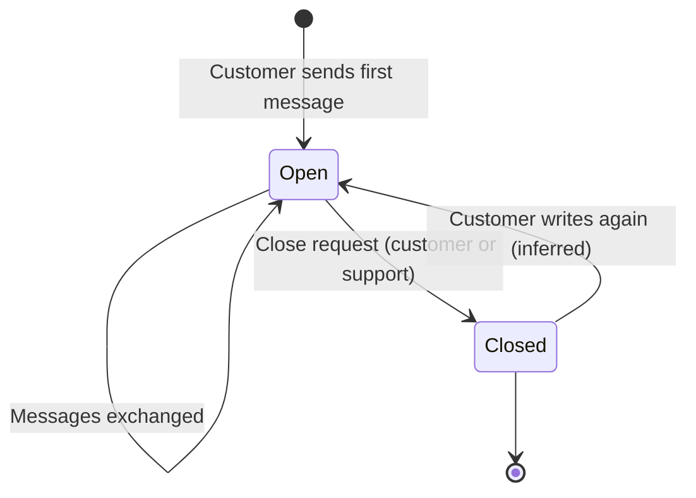
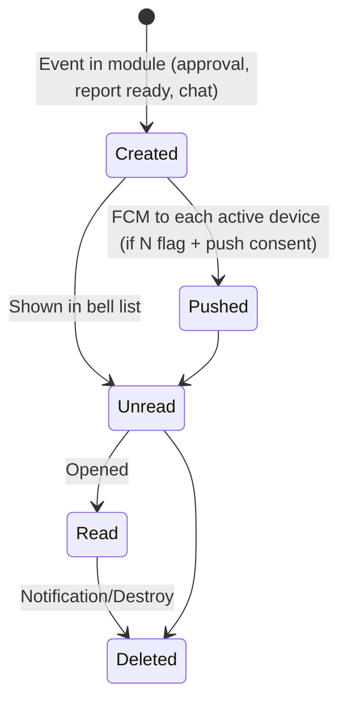

# 13 — Chat, Notifications & Support

Communication surfaces in BuildControl:

- **Member Chat** — 1:1 chat between Team Members of the same company.
- **Group Chat** — user-created groups (My Groups, Start New Group Chat) with readers / read receipts.
- **Project chat** — a group chat per project, opened from the chat icon on the Project home.
- **Support Chat / Support Tickets** — conversations with the BuildControl team; close ticket.
- **Push notifications** — FCM device tokens, per-module notification permission, notification list, delete; also the delivery channel for async reports and ZIP exports.
- **In-app announcements** — free-trial banner, app version / iOS review version check, maintenance screen.
- **Help & support contacts** — WhatsApp / Call / Email / Website / Help Center.

Who uses it: every Team Member (chat, notifications); company owner (trial/subscription banners); BuildControl support staff (support tickets, outside the customer app).

---

## Legacy behaviour

### Navigation

- Top bar (all tabs): **support chat** icon, **notifications** bell, organisation switcher.
- Project home: **project chat** icon top-right.
- Chat home tabs: **Member Chat**, **Group Chat**, **Support Chat / Support Tickets**.
- Route names for chat screens were not captured.

### Member Chat (1:1)

- Contact list from `Chat/EmployeeList` (Team Members of the company).
- Conversation thread; messages stored in Firebase RTDB (legacy tech note below).
- Chat push via `Chat/Notification` (inferred: server sends FCM to the recipient).

### Group Chat

- **My Groups** list (`GroupChat/GroupList`).
- **Start New Group Chat**: name, pick members (inferred fields).
- **Readers**: per message, who has read it (read receipts).

### Project chat

- One group chat per project ("group chat per project; Firebase RTDB").
- Members = project's assigned Team Members (inferred).

### Support Chat & Support Tickets

- API `v2/support-chat/conversations`, `v2/support-chat/unread-count`.
- Conversations with the **BuildControl team**.
- **Close request / close ticket**.
- Unread badge on the top-bar icon.

### Push notifications

- FCM device token registered via `Employees/UpdateDeviceToken`; device management `Employees/AssignDevice`, `Employees/RemoveDevice`, `Users/LoggedInDevices`, `home/profile/devices`; tokens refreshed via `Employees/RefreshTokens` (inferred meaning).
- **Per-module notification permission**: the `N` flag on a menu decides whether a user is notified for that module (e.g. Daily Worksheet #19 [CRUDAPNO], Purchase Request #17 [CRUDAJPNO], Leave Management #81 [CRUDAJNVO]).
- Module-specific notification endpoints: `Inventory/Notification` (min-stock alerts — inferred), `Chat/Notification`.
- **Notification list** (bell) and **delete** (`Notification/Destroy`).
- Notifications deliver **async reports and ZIPs**: "You will receive a popup once the report is ready"; Export Receipts (petty cash ZIP via notification); central inventory stock ledger; backups (module 11).
- **Privacy & Consent** screen has a **Push Notifications** preference.

### Notification event catalogue (inferred)

The notes give the per-module `N` flag and a few named deliveries, but not the event list. The table below lists events that follow from flows recorded in the notes for the other modules. Every row is **(inferred)** except the ones marked "observed".

| Module (menu id)                              | Event                                                                | Recipients                    | Evidence in notes                                                                               |
| --------------------------------------------- | -------------------------------------------------------------------- | ----------------------------- | ----------------------------------------------------------------------------------------------- |
| Daily Worksheet (19)                          | Worksheet submitted for approval                                     | Holders of `approve` + `N`    | Worksheet approval flow (Pending / Partially Approved / Approved)                               |
| Daily Worksheet (19)                          | Worksheet approved / rejected                                        | Creator                       | `WorkItem/SetStatus`, remarks                                                                   |
| Project Drawings (21)                         | New drawing uploaded to album                                        | Project members with `N`      | `N` flag on Project Drawings                                                                    |
| Task (53)                                     | Task assigned / progress updated / completed                         | Assignees, creator            | Assign To (multi), Update Task Progress, Mark As Completed                                      |
| Issues and snags (51)                         | Issue assigned; update added; marked solved                          | Assignee, creator             | Issue Assign To, Add Update, Mark As Solved                                                     |
| Inspection Request (54)                       | Request assigned; approved / rejected                                | Inspector; creator            | Request Assign To, SetApprovalStatus, Reject Reason                                             |
| Inquiry (8)                                   | Follow-up due                                                        | Assignee / lead owner         | Follow-up Date & Time, Overdue KPI                                                              |
| Booking Details (41)                          | Unit booked / put on hold                                            | Members with `N`              | Booking Type Booked / On Hold                                                                   |
| Progress Report (73)                          | DPR ready                                                            | Requester                     | "You will receive a popup once the report is ready" (observed)                                  |
| Equipment Usage (56)                          | Sheet awaiting approval; fuel efficiency exceeded                    | Approvers; project managers   | Approval toggle; "alerts when burn rate exceeds" (observed wording on Expected Fuel Efficiency) |
| Equipments (22)                               | Equipment transferred                                                | Members with `N`              | Transfer between projects                                                                       |
| Current Inventory (16)                        | Stock below minimum                                                  | Members with `N`              | "Start/Stop minimum stock to maintain Alert"; `Inventory/Notification` (observed endpoint)      |
| Purchase Request (17)                         | PR raised; approved / rejected / ordered                             | Approvers; creator            | SetApprovalStatus, MarkAsOrdered                                                                |
| Purchase Order (18)                           | PO awaiting approval; approved; marked ordered                       | Approvers; creator            | SetApprovalStatus, bulk-approval, mark-as-ordered                                               |
| Material Received (30)                        | GRN recorded                                                         | Members with `N`              | GRN feeds inventory and payables                                                                |
| Material Transfer (50)                        | Transfer sent; delivered                                             | Receiver; sender              | Pending → Delivered (MarkAsDelivered); comments                                                 |
| Central Store (MR) (67)                       | MR raised; partially delivered; delivered                            | Store team; requester         | Requested / Partially Delivered / Delivered; comments                                           |
| Delivery Note (68)                            | Delivery note created; delivered                                     | Requester                     | Mark As Delivered; comments                                                                     |
| Transactions (63)                             | Transaction awaiting approval; approved / rejected                   | Approvers; creator            | SetApprovalStatus, Reject Reason                                                                |
| Parties (76)                                  | Invoice settlement awaiting approval                                 | Approvers                     | `Party/InvoiceSettled/*`                                                                        |
| Petty Cash (52)                               | Voucher awaiting approval; approved / rejected; receipts ZIP ready   | Approvers; creator; requester | SetApprovalStatus; "Export Receipts (ZIP via notification)" (observed)                          |
| Holiday Management (79)                       | Holiday added                                                        | All HRMS employees with `N`   | `N` on Holiday Management                                                                       |
| Attendance Management (80)                    | Missed checkout / backdated entry awaiting approval; decision        | Approvers; employee           | Attendance Approvals                                                                            |
| Leave Management (81)                         | Leave applied; approved / rejected; cancellation requested / decided | Approvers; employee           | Leave Approvals tabs                                                                            |
| Salary Management (82)                        | Salary calculated / approved / paid                                  | Employee; approvers           | Calculate, approve, Mark Salaries as Paid                                                       |
| Shift Management (95)                         | Shift assignment changed                                             | Employee                      | Shift assignment "Until changed"                                                                |
| Central Reports (77) / Central Inventory (96) | Central inventory stock ledger ready                                 | Requester                     | `reports/central_inventory_stock_ledger/generate` (async)                                       |
| Backup (project options)                      | Backup ready                                                         | Requester (email / OTP)       | Generate Backup (async, emailed/OTP-protected) (observed)                                       |
| Chat                                          | New message                                                          | Conversation participants     | `Chat/Notification` (observed endpoint)                                                         |
| Support                                       | Support replied                                                      | Ticket opener                 | `v2/support-chat/unread-count` (observed endpoint)                                              |

### Device and session management (shared with module 01)

- **Linked Devices** (Profile): list of logged-in devices (`Users/LoggedInDevices`, `home/profile/devices`); remove a device (`Employees/RemoveDevice`).
- **Web login by QR** (`webLoginScan`, `Employees/ResponseQrCode`): the mobile app scans a QR on the web login page; the web session then receives its own token (inferred). The web session registers its own FCM token for browser push (inferred).
- **Logout** (`Users/Logout`) should remove the device token so that the device stops receiving pushes (inferred).
- **Organisation switch**: notifications and chats are per company; switching company changes the list (inferred from `companiesList`, `selectedCompanyModel`).

### Privacy & Legal (Profile)

- **Privacy & Consent**: App Improvement, Push Notifications, Data Preferences.
- **Legal**: Privacy Policy, Terms of Service, Data Retention Policy.
- **Download My Data** (export request) — delivered asynchronously (inferred: by notification/email, like reports).
- **Delete My Account** (reason; type DELETE to confirm).
- **Organisation delete** uses OTP (`home/organization/delete-otp`).

### In-app announcements

- **Free-trial banner** on the home shell.
- **Plan Expired** state (subscription).
- Subscription surfaces that drive banners (module 01): "Choose Your Plan" is **Company owner only**; "Your Subscription" shows Auto renew, Upgrade Plan ("new plan should be same or higher"), Extend current plan, Only Add-Ons. Usage limits per grant (Project, Team Member, Storage GB, HRMS Team Member) are tracked and enforced — the UI needs a limit-reached message when a grant is exhausted (inferred).
- **App version check** `CompanyLogo/GetAppVersion` (forces/suggests update; iOS review version check — the app hides features while an iOS build is in App Store review, inferred from "iOS review version").
- **"MAINTENANCE IN PROGRESS"** screen.
- Team Member invite **joinLinkMessage** with Play/App Store links (module 01).

### Help & support contacts

- Help & support: **WhatsApp**, **Call**, **Email**, **Website**, **Help Center**.
- Contact values not captured.

### Legacy tech note

- Firebase **Realtime Database** for chat messages and presence; Firebase **Cloud Messaging** for push; Firebase **Auth** (seen in localStorage keys) — likely a custom-token sign-in tied to the Laravel JWT (inferred).
- API auth: JWT issued by OTP login (`iss otp-login`).
- localStorage keys: `token`, `companyId`, `employeeId`, `companiesList`, `selectedCompanyModel`, `projectMenuOrderIds`, `isNonIndianCompany`, plus Firebase keys.
- Support chat moved to the v2 Laravel API (`v2/support-chat/*`), not RTDB (inferred from the endpoint).

---

## Entities & fields

### ChatConversation

| Field           | Type                         | Required   | Notes   |
| --------------- | ---------------------------- | ---------- | ------- |
| Company         | FK → Company                 | yes        | Tenant  |
| Kind            | enum{Direct, Group, Project} | yes        |         |
| Name            | string                       | if Group   |         |
| Project         | FK → Project                 | if Project |         |
| Created by      | FK → TeamMember              | yes        |         |
| Created at      | datetime                     | yes        |         |
| Last message at | datetime                     | no         | Sorting |

### ChatParticipant

| Field             | Type                  | Required | Notes                  |
| ----------------- | --------------------- | -------- | ---------------------- |
| Conversation      | FK → ChatConversation | yes      |                        |
| Member            | FK → TeamMember       | yes      |                        |
| Role              | enum{Admin, Member}   | no       | Group admin (inferred) |
| Joined at         | datetime              | yes      |                        |
| Last read message | FK → ChatMessage      | no       | Read receipts          |
| Muted             | bool                  | no       | (inferred)             |

### ChatMessage

| Field               | Type                  | Required         | Notes                       |
| ------------------- | --------------------- | ---------------- | --------------------------- |
| Conversation        | FK → ChatConversation | yes              |                             |
| Sender              | FK → TeamMember       | yes              |                             |
| Body                | text                  | if no attachment |                             |
| Attachments         | file[]                | no               | Images/documents (inferred) |
| Sent at             | datetime              | yes              |                             |
| Edited / deleted at | datetime              | no               | (inferred)                  |

### ChatReadReceipt ("readers")

| Field   | Type             | Required | Notes |
| ------- | ---------------- | -------- | ----- |
| Message | FK → ChatMessage | yes      |       |
| Reader  | FK → TeamMember  | yes      |       |
| Read at | datetime         | yes      |       |

### SupportConversation (ticket)

| Field               | Type               | Required | Notes          |
| ------------------- | ------------------ | -------- | -------------- |
| Company             | FK → Company       | yes      |                |
| Opened by           | FK → TeamMember    | yes      |                |
| Subject             | string             | no       | (inferred)     |
| Status              | enum{Open, Closed} | yes      | Close request  |
| Unread count        | int                | derived  | `unread-count` |
| Created / closed at | datetime           | yes / no |                |

### SupportMessage

| Field        | Type                            | Required | Notes      |
| ------------ | ------------------------------- | -------- | ---------- |
| Conversation | FK → SupportConversation        | yes      |            |
| Author kind  | enum{Customer, Support}         | yes      |            |
| Author       | FK → TeamMember / support agent | yes      |            |
| Body         | text                            | yes      |            |
| Attachments  | file[]                          | no       | (inferred) |
| Sent at      | datetime                        | yes      |            |
| Read at      | datetime                        | no       |            |

### Device

| Field        | Type                    | Required | Notes               |
| ------------ | ----------------------- | -------- | ------------------- |
| User         | FK → User               | yes      |                     |
| FCM token    | string                  | yes      | `UpdateDeviceToken` |
| Platform     | enum{Android, iOS, Web} | yes      | (inferred)          |
| Device name  | string                  | no       | Linked Devices list |
| Last seen at | datetime                | yes      |                     |
| Revoked at   | datetime                | no       | `RemoveDevice`      |

### Notification

| Field         | Type                  | Required | Notes                                            |
| ------------- | --------------------- | -------- | ------------------------------------------------ |
| Recipient     | FK → TeamMember       | yes      |                                                  |
| Company       | FK → Company          | yes      |                                                  |
| Module / menu | FK → Menu             | no       | Drives the `N` permission                        |
| Type          | string                | yes      | e.g. approval_requested, report_ready (inferred) |
| Title         | string                | yes      |                                                  |
| Body          | text                  | no       |                                                  |
| Link          | json {route, ids}     | no       | Deep link to record                              |
| Attachment    | FK → ReportJob / file | no       | Async report / ZIP                               |
| Read at       | datetime              | no       |                                                  |
| Created at    | datetime              | yes      |                                                  |
| Deleted       | bool                  | —        | `Notification/Destroy`                           |

### NotificationPreference

| Field            | Type      | Required | Notes                                  |
| ---------------- | --------- | -------- | -------------------------------------- |
| User             | FK → User | yes      |                                        |
| Push enabled     | bool      | yes      | Privacy & Consent "Push Notifications" |
| App improvement  | bool      | yes      | Privacy & Consent                      |
| Data preferences | json      | no       |                                        |

### AppVersionPolicy

| Field               | Type                    | Required | Notes                        |
| ------------------- | ----------------------- | -------- | ---------------------------- |
| Platform            | enum{Android, iOS, Web} | yes      |                              |
| Latest version      | string                  | yes      | `GetAppVersion`              |
| Minimum supported   | string                  | yes      | Force update (inferred)      |
| iOS review version  | string                  | no       | Build under App Store review |
| Maintenance mode    | bool                    | yes      | "MAINTENANCE IN PROGRESS"    |
| Maintenance message | text                    | no       |                              |

### Announcement (inferred)

Legacy derives the trial banner and Plan Expired state from the subscription, and maintenance from the version check. A single table is proposed for the rebuild.

| Field            | Type                                                                                  | Required | Notes                                 |
| ---------------- | ------------------------------------------------------------------------------------- | -------- | ------------------------------------- |
| Kind             | enum{PlanEndingSoon, PlanExpired, LimitReached, Maintenance, UpdateAvailable, Custom} | yes      |                                       |
| Audience         | enum{All, CompanyOwner, Company}                                                      | yes      | Plan purchase is "Company owner only" |
| Company          | FK → Company                                                                          | no       | Null = platform-wide                  |
| Message          | text                                                                                  | yes      |                                       |
| Action           | json {label, route}                                                                   | no       | e.g. "Upgrade Plan"                   |
| Starts / ends at | datetime                                                                              | yes / no |                                       |
| Dismissible      | bool                                                                                  | yes      | Maintenance is not                    |

### SupportContact

| Field       | Type         | Required | Notes |
| ----------- | ------------ | -------- | ----- |
| WhatsApp    | string       | no       |       |
| Phone       | string       | no       |       |
| Email       | string       | no       |       |
| Website     | string (URL) | no       |       |
| Help Center | string (URL) | no       |       |

---

## Workflows & states

### 1. 1:1 chat

1. Chat → Member Chat → pick a colleague (`Chat/EmployeeList`).
2. Conversation opened (created if absent); send message.
3. Recipient gets push (`Chat/Notification`) and unread badge.

### 2. Group chat

1. Group Chat → Start New Group Chat → name + members.
2. Messages show readers.

### 3. Project chat

1. Project home → chat icon → project group.

### 4. Support ticket

### 5. Notification lifecycle

### 6. Async report delivery

1. User requests report → job (module 11).
2. On ready → Notification with file link + in-app popup.
3. User taps → download.

### 7. App start checks

1. Call `GetAppVersion`; if below minimum → update screen; if maintenance → "MAINTENANCE IN PROGRESS".
2. Load subscription → free-trial banner or Plan Expired state.
3. Register FCM token (`UpdateDeviceToken`).

---

## Business rules & validations

- Chat is limited to Team Members of the same company (inferred; `EmployeeList` is company scoped).
- Project chat participants = project members (inferred).
- A user receives module notifications only if they hold the `N` flag on that menu.
- Push only to registered, non-revoked devices; removing a device stops its push.
- Push respects Privacy & Consent "Push Notifications".
- Deleted notifications are removed from the list (`Notification/Destroy`).
- Report-ready notifications carry the download.
- Maintenance mode blocks the app.
- Version below minimum forces update (inferred).
- Free-trial banner shows only during trial; "Company owner only" may purchase.
- Support tickets can be closed; unread count drives a badge.

---

## Permissions

Legend: C=create R=read U=update D=delete A=approve J=reject P=print/download N=notification V=viewAll T=transfer O=report F=financial E=export I=import. The N (notification) flag is on these 25 menus:

| Menu (id)                  | Flags       |
| -------------------------- | ----------- |
| Inquiry (8)                | CRUDPNVO    |
| Current Inventory (16)     | CRUDPNO     |
| Purchase Request (17)      | CRUDAJPNO   |
| Purchase Order (18)        | CRUDAJPNO   |
| Daily Worksheet (19)       | CRUDAPNO    |
| Project Drawings (21)      | CRUDN       |
| Equipments (22)            | CRUDPNTOF   |
| Material Received (30)     | CRUDPNVOF   |
| Booking Details (41)       | CRUDPNO     |
| Material Transfer (50)     | CRUDAJPNO   |
| Issues and snags (51)      | CRUDAJPNVO  |
| Petty Cash (52)            | CRUDAJPNVO  |
| Task (53)                  | CRUDAJPNVOF |
| Inspection Request (54)    | CRUDAJPNO   |
| Equipment Usage (56)       | CRUDAPNOF   |
| Transactions (63)          | CRUDAJPNO   |
| Central Store (MR) (67)    | CRUDAPNO    |
| Delivery Note (68)         | CRUDAPNO    |
| Progress Report (73)       | CRDNF       |
| Parties (76)               | CRUDAJEPNO  |
| Holiday Management (79)    | CRUDN       |
| Attendance Management (80) | CRUDAJENVO  |
| Leave Management (81)      | CRUDAJNVO   |
| Salary Management (82)     | CRUDAJENVOF |
| Shift Management (95)      | CRUDAEINV   |

HRMS-only members get N on Attendance Management and Leave Management through the HRMS default permission set (module 10).

Chat and support have no menu flag in the permission matrix (available to all members — inferred).

---

## Relationships

- → depends on **01 Organization/Identity/Access**: users, companies, devices, subscription (trial, expired), privacy consent.
- → depends on **03 Projects**: project chat membership.
- ← used by **04–10**: every module emits notifications (approvals, assignments, min-stock, leave).
- ← used by **11 Reports/Dashboards/Backup**: async report, ZIP and backup delivery.
- → depends on **12 Settings**: timezone for timestamps.

---

## Reports & exports

- None in legacy.
- Recommended: notification delivery log (admin) and support ticket history.

---

## Rebuild recommendations

1. **Drop Firebase RTDB and Firebase Auth**; keep FCM for push only. Store chat in Postgres with the same tenant isolation as all other data; deliver via WebSocket/SSE. One identity system (module 01).
2. **Notification outbox**: modules write domain events; a worker fans out to in-app, push, email and (later) WhatsApp. Respect `N` flag and consent at fan-out.
3. **WhatsApp channel**: WhatsApp Business notifications and later a bot for attendance, DPR photos, MR and approvals — the highest-leverage differentiator in the research ([research §4 item 1](../research/market-and-compliance.md)).
4. **Approval notifications with actions** (approve/reject from the notification) for PR, PO, petty cash, leave.
5. **Context-linked chat**: let a chat message link to a record (PO, issue, worksheet) — reduces "WhatsApp for site coordination" (research §4).
6. **Notification retention and audit**: keep a log of what was sent to whom; users may delete from their list, but the log remains for audit.
7. **Support tickets with SLA/status** visible to customer; publish response times. Support quality is a recurring complaint (research §1 takeaways).
8. **Transparent plan messaging**; never threaten data deletion — export always available (research §1, §4 item 9).
9. **Version check without iOS review hacks**: feature flags server-side instead of hiding features per review version.
10. **Offline**: queue outbound chat messages offline (research §4 item 2).

---

## Open questions

1. Can chat messages carry attachments, voice notes, or record links?
2. Who can create groups, and can members leave/be removed?
3. Is project chat auto-membership synced with project assignment?
4. What triggers each notification type per module?
5. How long are notifications kept?
6. What does the iOS review version check change in the UI?
7. Support contact values and Help Center URL.
8. Can a closed support ticket be reopened?
9. Is Firebase Auth used for anything beyond RTDB access?
