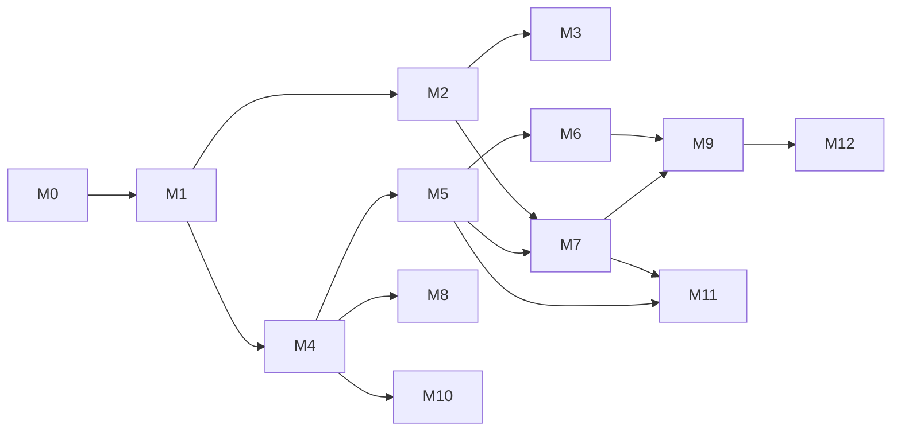

# Construction Management — milestones and tasks

Delivery plan for the rebuild described in [`../README.md`](../README.md). Same rules as the Whiteboard board: work **top to bottom inside a milestone**, do not start a ticket until every `Blocked by` ticket is `done`, update **Status** when you pick up or finish work, leave **Issue** blank until a tracker id exists.

Priority 1 is **M0 → M3** (project setup, SaaS login/signup and company onboarding, site-worker management, staff HRMS). Priority 2 is **M4 → M12**. Milestones after M3 are boards only; their tickets get "Done when" sections when the milestone before them is `done`.

## Legend

| Status        | Meaning                                                            |
| ------------- | ------------------------------------------------------------------ |
| `todo`        | Not started                                                        |
| `in_progress` | Someone is implementing it                                         |
| `blocked`     | Cannot proceed; note why in the ticket                             |
| `done`        | Merged and verified (tests + Storybook/UI where the ticket has UI) |

| Area   | Meaning                                                               |
| ------ | --------------------------------------------------------------------- |
| Docs   | ADR, CONTEXT.md, spec amendments                                      |
| Infra  | Repo wiring, CI, Docker, AWS                                          |
| Auth   | `@repo/auth` plugins and the identity bridge                          |
| Data   | Prisma schema files under `packages/db/prisma/schema/construction-*`  |
| Domain | `apps/construction-management/src/<context>/{domain,application}`     |
| HTTP   | Route Handlers + Zod models + OpenAPI under `/api/construction/<ctx>` |
| UI     | Screens in `apps/construction-management/app` + Storybook             |
| Kernel | `src/shared-kernel` (LocationRef, Money, SequenceRule, Approval…)     |

Ticket ids are `CM-<milestone><nn>`: `CM-105` is milestone 1, ticket 5.

---

## Milestones at a glance

| Milestone | Name                               | Spec                                                                                                                | Outcome the owner can see                                                                                       | Priority |
| --------- | ---------------------------------- | ------------------------------------------------------------------------------------------------------------------- | --------------------------------------------------------------------------------------------------------------- | -------- |
| **M0**    | Project setup                      | [03-target-architecture](../03-target-architecture.md)                                                              | App boots on :3002 against Postgres, CI green, `/api/docs` serves, first `construction_*` schema migrates       | 1        |
| **M1**    | SaaS onboarding & access           | [modules/01](../modules/01-organization-identity-access.md), [modules/12](../modules/12-settings-configuration.md)  | Sign up by mobile OTP or email, create a Company, invite team members, set the permission matrix, start a trial | 1        |
| **M2**    | Site workforce (labour & vendor)   | [modules/08](../modules/08-labour-vendor-attendance.md), [modules/02](../modules/02-master-records.md)              | Register labour and vendor gangs, mark daily attendance with OT, see running balances, pay wages                | 1        |
| **M3**    | Staff HRMS                         | [modules/10](../modules/10-hrms.md)                                                                                 | Office staff check in within a geo-fence, apply for leave, HR runs shifts, holidays and monthly salary          | 1        |
| **M4**    | Projects & structure               | [modules/03](../modules/03-projects-structure-drawings-gallery.md)                                                  | Full project wizard, phases → wings → floors → units, drawings, gallery, testing reports                        | 2        |
| **M5**    | Procurement & inventory            | [modules/06](../modules/06-procurement-inventory.md)                                                                | PR → PO (GST) → GRN → stock → consume/transfer; central store                                                   | 2        |
| **M6**    | Daily site work                    | [modules/04](../modules/04-daily-site-work.md)                                                                      | Daily worksheet with material consumption, equipment usage, progress reports                                    | 2        |
| **M7**    | Finance                            | [modules/07](../modules/07-payments-accounting.md)                                                                  | Bank/cash ledgers, petty cash, party invoices & payments with TDS, ledger report                                | 2        |
| **M8**    | Tasks, issues, inspections         | [modules/05](../modules/05-tasks-issues-inspections.md)                                                             | Gantt tasks with earned value, snag list, inspection approvals                                                  | 2        |
| **M9**    | Dashboards, reports, notifications | [modules/11](../modules/11-reports-dashboards-backup.md), [modules/13](../modules/13-chat-notifications-support.md) | Project & company dashboards, report jobs, push, chat                                                           | 2        |
| **M10**   | Sales CRM                          | [modules/09](../modules/09-sales-crm-inquiry-booking.md)                                                            | Inquiries, funnel, follow-ups, unit bookings                                                                    | 2        |
| **M11**   | India compliance                   | [04-gaps-and-roadmap §Phase 3](../04-gaps-and-roadmap.md)                                                           | BOQ/RA bills, GST engine, TDS ledger, muster rolls, RERA ledger, IS 456 registers                               | 2        |
| **M12**   | Differentiators                    | [04-gaps-and-roadmap §Phase 4](../04-gaps-and-roadmap.md)                                                           | WhatsApp bot, offline outbox, Tally sync, allottee & vendor portals                                             | 2        |

Dependency between milestones:

M2 needs a **minimal Project** (name, status, address) because labour and attendance are project-scoped; that slim aggregate ships in M2 (`CM-204`) and M4 grows it. M3 needs nothing from M2 except team members from M1.

---

## M0 — Project setup

Goal: the construction app is a real app in the monorepo with the same guarantees as Whiteboard — Postgres per context schema, `@repo/auth`, OpenAPI, tests on Postgres, CI, deploy path.

| ID     | Seq | Title                                                                                             | Status | Blocked by     | Area   | Issue |
| ------ | --: | ------------------------------------------------------------------------------------------------- | ------ | -------------- | ------ | ----- |
| CM-001 |   1 | ADR CM-0001: Construction Management app and `construction_*` schemas in the shared repo          | done   | —              | Docs   |       |
| CM-002 |   2 | CONTEXT.md for the construction app (vocabulary from `00-overview.md` glossary)                   | done   | CM-001         | Docs   |       |
| CM-003 |   3 | App wiring: `@repo/auth`, `@repo/ui`, `@repo/db`, Tailwind tokens, env, `docker compose`          | done   | CM-001         | Infra  |       |
| CM-004 |   4 | Prisma multi-file: `construction-organization.prisma` with a placeholder model + migration        | done   | CM-003         | Data   |       |
| CM-005 |   5 | HTTP skeleton: `/api/construction/*` error envelope, session guard, `/api/docs` OpenAPI           | done   | CM-003         | HTTP   |       |
| CM-006 |   6 | Test harness: domain unit tests + HTTP tests on `construction_test` Postgres                      | done   | CM-004, CM-005 | Infra  |       |
| CM-007 |   7 | CI: lint, typecheck, format, tests for the new app; Vercel/ECS preview per PR                     | done   | CM-006         | Infra  |       |
| CM-008 |   8 | Shared kernel v0: `Money`, `Quantity`, ids, `AuditEvent` writer, soft-delete helper               | done   | CM-004         | Kernel |       |
| CM-009 |   9 | App shell: public layout (auth pages) and authenticated shell with Projects/Workspace/Masters nav | done   | CM-003         | UI     |       |

### CM-001 — ADR CM-0001

**Done when:** `apps/construction-management/docs/adr/CM-0001-app-and-schemas.md` records: own app on :3002, own `construction_<context>` Postgres schemas in the app's own `construction` database (shared Prisma schema and migration history in `packages/db`), reuse of `@repo/auth`/`@repo/ui`/`packages/db`, Company = Workspace, no cross-import with Whiteboard contexts (ESLint rule). Lists the 12 contexts from `03-target-architecture.md §2`.

### CM-002 — CONTEXT.md

**Done when:** `apps/construction-management/CONTEXT.md` fixes the words: Company, Team Member, Designation, Department, Contractor, Supplier, Vendor, Labour, Other Party, Project, Phase/Wing/Floor/Unit, Amenity/Common Development, Worksheet, PR/PO/GRN/MT/MR/DN, Petty Cash, Transaction, Inquiry/Booking, Sequence ID, Back-dated entry. Includes the "say / do not say" table (e.g. say **Labour**, not worker; say **Team Member**, not user/employee in UI copy; say **Company**, not organization/tenant).

### CM-003 — App wiring

**Done when:** `bun run dev --filter=construction-management` serves :3002 with the `@repo/ui` theme; `.env.example` lists DB, auth, file storage (Vercel Blob; a local folder in development) and OTP provider keys; `docker compose` has the `construction` database alongside Whiteboard's; `bun run check-types` and `lint` pass.

### CM-004 — First Prisma schema file

**Done when:** `packages/db/prisma/schema/construction-organization.prisma` exists with `@@schema("construction_organization")`, a `ConstructionOrganizationCompanyProfile` model (workspaceId, gstin, pan, address, currency, isIndian, timezone) and a hand-written migration creating the schema. `base.prisma` lists the schema. Migration applies on a fresh database.

### CM-005 — HTTP skeleton

**Done when:** a `GET /api/construction/organization/company-profile` route returns the profile for the Active Workspace (404 if none), with Zod Request/Response models beside it, `{code,message,details?}` errors, 401/403 behaviour per root ADR-0013/0014, and the route appears on `/api/docs` with `ConstructionOrganization…` component names.

### CM-006 — Test harness

**Done when:** `bun run test --filter=construction-management` runs domain tests; `bun run test:http --filter=construction-management` runs the company-profile route against `construction_test` Postgres (migrated in `globalSetup`). One passing test of each kind.

### CM-007 — CI and previews

**Done when:** the GitHub workflow runs lint/typecheck/format/tests for the app on PRs touching it; a preview deployment URL is posted per PR (Vercel for now; ECS later per architecture §1 — record which in the ADR). The Vercel project itself (Root Directory `apps/construction-management`, build command `bash scripts/vercel-build.sh`) is created by the owner in the Vercel dashboard; its GitHub integration then posts the URL.

### CM-008 — Shared kernel v0

**Done when:** `src/shared-kernel` exports `Money` (integer paise + currency, add/sub/multiply, INR formatting `₹1,00,000.00`), `Quantity` (decimal + UoM id), uuid v7 ids, `recordAudit(event)` writing `construction_organization.audit_events`, and a `withTombstone` query helper. Unit tests for Money rounding and Indian grouping.

### CM-009 — App shell

**Done when:** `/sign-in`, `/sign-up` use the public layout (their forms arrive with CM-103); `/app/*` uses `AppShell` from `@repo/ui` with the three top-level areas (Projects, Workspace, Masters) and a company switcher placeholder; Storybook renders the shell with empty states.

---

## M1 — SaaS onboarding & access

Goal: a builder can sign up, create a Company, invite staff, decide what each one may do, and start a trial — the "01 Organization, Identity & Access" spec minus devices and data-export, which move to M9.

| ID     | Seq | Title                                                                                                        | Status      | Blocked by             | Area      | Issue |
| ------ | --: | ------------------------------------------------------------------------------------------------------------ | ----------- | ---------------------- | --------- | ----- |
| CM-101 |   1 | ADR CM-0002: Company = Workspace; mobile-OTP login plugin in `@repo/auth`; roles `owner`/`member`            | done        | CM-001                 | Docs      |       |
| CM-102 |   2 | `@repo/auth`: mobile OTP sign-in/sign-up plugin (SMS provider adapter, rate limit, test bypass)              | done        | CM-101                 | Auth      |       |
| CM-103 |   3 | Sign-up / sign-in screens: mobile OTP first, email+password second, "Choose Organization" after login        | done        | CM-009, CM-102         | UI        |       |
| CM-104 |   4 | Company creation: name, mobile, email, country, currency, GSTIN/PAN (optional) → Workspace + profile         | done        | CM-005, CM-102         | Domain    |       |
| CM-105 |   5 | Company HTTP + Create Company screen (first-run wizard) + company switcher                                   | done        | CM-103, CM-104         | HTTP+UI   |       |
| CM-106 |   6 | Designation aggregate + seed set (38 names, 6 with templates) copied into each new Company                   | done        | CM-104                 | Domain    |       |
| CM-107 |   7 | Permission matrix: `menu` + `flag` enums, `MemberMenuPermission`, `can()` guard, designation templates       | done        | CM-106                 | Domain    |       |
| CM-108 |   8 | Team Member aggregate: Normal vs HRMS member, profile fields, project assignment stub, invite link           | done        | CM-107                 | Domain    |       |
| CM-109 |   9 | Invitation & join flow: invite by mobile/email, join request pending → accepted/rejected, multi-company      | done        | CM-102, CM-108         | Auth      |       |
| CM-110 |  10 | Team Members HTTP + OpenAPI (list, create, update, invite, resend, remove, permissions)                      | done        | CM-108, CM-109         | HTTP      |       |
| CM-111 |  11 | Team Member screens: list with status chips, add wizard (details → projects → permission matrix), edit       | done        | CM-105, CM-110         | UI        |       |
| CM-112 |  12 | Designations HTTP + screens (list, add, duplicate, edit template) and the shared Permission Matrix component | done        | CM-105, CM-106         | HTTP+UI   |       |
| CM-113 |  13 | Back-dated entry policy (global days, override designations, financial closing date) + guard                 | done        | CM-107                 | Kernel    |       |
| CM-114 |  14 | Sequence rules (`SequenceRule`, fiscal-year token, per-project scope, counters) + Settings screen            | done        | CM-107                 | Kernel+UI |       |
| CM-115 |  15 | Company profile & my-profile screens (logo, GSTIN/PAN masked, address, currency, timezone)                   | done        | CM-105                 | UI        |       |
| CM-116 |  16 | Plans & trial: `Plan`, `Subscription`, usage counters (projects, members, HRMS seats, storage), 14-day trial | todo        | CM-104                 | Domain    |       |
| CM-117 |  17 | Razorpay checkout (order → webhook → activate), billing address, invoices list                               | todo        | CM-116                 | HTTP+UI   |       |
| CM-118 |  18 | Plan enforcement: block create when usage exceeded; read-only on expiry; export always allowed               | todo        | CM-116                 | Domain    |       |
| CM-119 |  19 | M1 polish: empty states, Storybook for every form, OTP/invite React Email templates                          | in_progress | CM-111, CM-115, CM-117 | UI        |       |

### CM-101 — ADR CM-0002

**Done when:** the ADR records: Company is a Better Auth Workspace; roles inside a Company are `owner` and `member` (fine-grained rights come from the matrix, not roles); login is mobile OTP (primary, as site staff know it) with email+password as secondary; a User may hold many memberships and switches the Active Workspace; HRMS-only members are ordinary members whose permissions start from the HRMS default set.

### CM-102 — Mobile OTP plugin

**Done when:** `@repo/auth` exposes `sendOtp(mobile)` / `verifyOtp(mobile, code)` as a Better Auth plugin with an SMS adapter interface (MSG91 or SNS implementation + console adapter for dev), 6-digit code, 5-minute expiry, 5 attempts, per-mobile rate limit, and a test bypass code in `whiteboard_test`/`construction_test`. HTTP tests for happy path, expiry, lockout.

### CM-103 — Auth screens

**Done when:** `/sign-up` and `/sign-in` accept +91 mobile → OTP → session; email+password as a secondary tab; after login a user with 0 companies lands on Create Company, with 1 goes straight in, with >1 sees "Choose Organization". Storybook play functions for each state.

### CM-104 — Company creation

**Done when:** `createCompany` command creates the Workspace via `@repo/auth`, makes the caller `owner`, writes `CompanyProfile`, copies the seed sets (designations now; departments/UoMs/categories arrive in M2/M4), starts a trial (CM-116 fills the plan; until then a `trialEndsAt`), and emits `CompanyCreated`. Domain tests for invariants (name required, one owner).

### CM-105 — Company HTTP + screens

**Done when:** `POST /api/construction/organization/companies`, `GET …/companies/me`, `POST …/companies/{id}/switch`; the first-run wizard (Company name → contact → country/currency → done) and the company switcher in the shell header.

### CM-106 — Designations

**Done when:** `Designation` aggregate with `name`, `isSeed`, `permissionTemplate?`; seed JSON in `src/organization/infrastructure/seeds/designations.json` holding the 38 default names (the `modules/01` list expands to 38, not 37) and starter templates for Accountant, Admin, Project Manager, Site Engineer, Site Supervisor, Store Keeper (our own defaults per role; Admin has every cell); `duplicate` command.

### CM-107 — Permission matrix

**Done when:** ADR CM-0003; `Menu` enum lists every menu in `modules/01` by context (`organization.team_members`, `labour.attendance`, `hrms.leave_management` …); `Flag` enum `create read update delete approve reject print report view_all notification transfer financial export import`; `MemberMenuPermission(workspaceId, memberId, menu, flags bitmask)` (keyed by Team Member, so a Joining Pending member's matrix exists before they have a User; ADR CM-0003); `can(member, menu, flag, {projectId?})` used by every command/query; `applyTemplate(designation)`; `view_all=false` filters lists to own entries; `financial=false` nulls amounts in Response models. Unit tests for bitmask and both filters.

### CM-108 — Team Member aggregate

**Done when:** fields from `modules/01` (name, designation, mobile, email, address, Aadhaar, PAN, emergency contact, `memberType` normal|hrms, `isOwner`) — name and Designation required, plus a mobile **or** an email (site staff often have no email; ADR CM-0002), Aadhaar checked by its Verhoeff digit, PAN by format; the Owner gets their own record (Designation "Owner") when the Company is created; `assignToProjects(ids)` stored as ids (projects exist from CM-204); invite link token; Aadhaar/PAN stored encrypted and returned masked unless `reveal` is called (OTP-gated in M9).

### CM-109 — Invitation & join

**Done when:** invite by mobile or email → a Joining Pending Team Member is the invitation (ADR CM-0002; not a Better Auth invitation, which is email-only), sent by email and SMS with a `/join/<token>` link; invitee signs up/in with that mobile or email → sees the Join Request → accepts → `member` membership through `@repo/auth`; owner can resend/cancel; a user in several companies switches; `JoiningPending` chip until accepted. HTTP tests for invite → accept and for a rejected invite.

### CM-110 / CM-111 / CM-112 — Team Members & Designations HTTP and screens

**Done when:** routes on `/api/docs`; Team Member list (search, status chips, kebab: Share invite link, Edit, Delete), add wizard with the three steps from the legacy (`details → select projects → permission matrix` with column select-all, category expand, search); Designations list/add/duplicate with template editor using the same matrix component.

CM-112 detail: Designation routes are `GET/POST /designations`, `GET /designations/{id}`, `POST /designations/{id}/update|duplicate|delete`, each checked against the `organization.designations` menu. The list returns every live Designation by name with `total` and no cursor (a Company has a few dozen). Templates travel as `{ menuKey: Flag[] }`; unknown menus or flags are 400, unsupported cells are dropped. Deleting a Designation a live Team Member holds is 409 `DESIGNATION_IN_USE`. The matrix component is `components/permissions/permission-matrix.tsx`.

### CM-113 — Back-dated policy

**Done when:** `BackdatedPolicy` per workspace: `create.days`, `edit.days`, `overrideDesignationIds`, `financialClosingDate`, per-module overrides keyed by `module` + `entryDateField`; `assertCanCreate/Edit(module, entryDate, member)` in the kernel; Settings screen mirrors the legacy groups (Procurement, Site, Inventory, Accounts, Labour & Vendor, Sales, HRMS). Unit tests for global, override, closing date.

**Delivered:** `src/shared-kernel/backdated-policy.ts` (24-module catalogue, `assertCanCreate/Edit(policy, module, entryDate, { designationId, isOwner }, today)` with `today` a `YYYY-MM-DD` in the Company time zone) and `backdated-policy-reader.ts` (`loadBackdatedPolicy`, `loadBackdatedActor`) for commands in any context. The Owner passes day limits; the inclusive closing date blocks everyone (`modules/12` open questions 7 and 12). One row per Company in `construction_organization.backdated_entry_policies`, written on first save (no row = no limits). `GET …/settings/backdated-entry`, `POST …/settings/backdated-entry/update` (menu `organization.settings`), audited with before/after.

### CM-114 — Sequence rules

**Done when:** `SequenceRule(module, scope workspace|project, prefix, projectToken, startNumber, fiscalYearToken)`; `next(module, projectId, date)` → `PR/26-27/P1/00001` with row-locked counters per rule per fiscal year (April–March); "Manage Sequence IDs" screen with preview; unit test that 1 April rolls the FY.

**Delivered:** `src/shared-kernel/sequence/` (`SEQUENCE_MODULES` with snake_case keys and default prefixes PR, PO, GRN, MT, PC, MR, DN, IR, INV; `fiscalYearOf`; `formatSequenceNumber` — order prefix / FY / project token / number; `nextSequenceNumber(tx, { workspaceId, module, projectId, date, by })` for callers to run inside their own insert transaction). Counters are `construction_organization.sequence_counters (rule_id, fiscal_year)` incremented by an upsert that holds the row lock until the caller commits; fiscal_year is 0 for rules without the FY token (never restart). Partial unique indexes: one live default per module, one live rule per (module, project). HTTP under `organization.settings`: list, create, `{id}/update` (optimistic `expectedUpdatedAt`), `{id}/delete` (409 once a number was issued). The screen offers only "All projects (default)" until Projects exist (M2).

### CM-115 — Profiles

**Done when:** Company profile (name, logo to Vercel Blob, mobile, email, GSTIN with checksum validation, PAN format validation, address, currency, timezone) and My Profile (photo, contact, masked ids) screens; Storybook states.

Decided while building it:

- The Company's own GSTIN and PAN print on its documents, so they are shown in full to anyone with `organization.settings` read; only Team Members' personal Aadhaar and PAN are masked. Changing the profile or the logo needs `organization.settings` update; the logo image itself streams to every Team Member of the Company.
- The country is fixed when the Company is created (it decides GST, PAN, TDS and which plans are offered); the profile changes name (which also renames the Company in the switcher), mobile, email, GSTIN, PAN, address, currency and time zone. Saves carry the `updatedAt` the form loaded and are refused with `COMPANY_PROFILE_CHANGED` (409) when someone saved since.
- Files go through our routes (raw body with its `content-type`; no presigned browser upload) to private Vercel Blob storage (files on disk in development and tests) under `companies/<workspaceId>/...`, are checked by content (PNG, JPEG, WebP; logo ≤ 2 MB, photo ≤ 10 MB; `FILE_TOO_LARGE`, `FILE_TYPE_NOT_ALLOWED`), and are served only through routes that stream them to the Company's own Team Members. Every stored file is a row in `construction_organization.stored_files` (bytes, kind, deleted_at) for storage usage (CM-116).
- My Profile is the signed-in User's own Team Member record in the Active Company: photo, name, email, address, emergency contact, Aadhaar and PAN. The mobile is how they sign in and is read-only there. Email here is the Team Member's contact email; changing the User's sign-in email (with verification) is not part of M1. A member may always reveal their own Aadhaar and PAN; each reveal is audited, and the OTP step arrives with M9.

### CM-116 — Plans & trial

**Done when:** `Plan` (includes: projects, team members, HRMS seats, storage GB; prices per duration), `AddOn` (per unit per month), `Subscription(workspaceId, planId, startsAt, endsAt, autoRenew, addOns[])`, `UsageSnapshot` computed from counts; `startTrial` on company creation (14 days, Basic limits); `Your Subscription` read model (plan, expiry, usage bars).

### CM-117 — Razorpay checkout

**Done when:** Choose plan → duration → add-ons → buyer details (billing address, GSTIN) → Razorpay order → webhook verifies signature → subscription activated/extended/upgraded ("new plan must be same or higher"); invoices list with PDF; test-mode keys in `.env.example`.

### CM-118 — Enforcement

**Done when:** creating a project/member/HRMS member beyond the plan returns `plan_limit_exceeded` with the limit in `details`; expired plan → all commands except export return `plan_expired`; owner-only checkout; banner in the shell. HTTP tests for each.

---

## M2 — Site workforce (labour & vendor)

Goal: the daily reality of a site — who came, for how long, what they are owed — for both the company's own labour and vendor gangs, per project. Spec: `modules/08` plus the Labour/Vendor/Category/Supervisor masters from `modules/02`. Payments stay minimal (record a wage payment against the balance; full ledgers arrive in M7).

| ID     | Seq | Title                                                                                                                                                                        | Status | Blocked by     | Area           | Issue |
| ------ | --: | ---------------------------------------------------------------------------------------------------------------------------------------------------------------------------- | ------ | -------------- | -------------- | ----- |
| CM-201 |   1 | ADR CM-0004 (ledger-first balances): labour and vendor balances are derived from immutable entries                                                                           | todo   | CM-001         | Docs           |       |
| CM-202 |   2 | Prisma: `construction-labour.prisma` and `construction-masters.prisma` (labour subset) + migration                                                                           | todo   | CM-004, CM-201 | Data           |       |
| CM-203 |   3 | Masters: Labour Category (seed 9), Supervisor, Department (seed 54) aggregates + HTTP + screens                                                                              | todo   | CM-107, CM-202 | Domain+HTTP+UI |       |
| CM-204 |   4 | Minimal Project aggregate (name, status, address, start/end) + HTTP + list/create screen                                                                                     | todo   | CM-107, CM-202 | Domain+HTTP+UI |       |
| CM-205 |   5 | Labour aggregate: wage type daily/monthly, weekly holidays, wage, OT/hr, opening balance → ledger, statutory ids, photo/docs, current project                                | todo   | CM-203, CM-204 | Domain         |       |
| CM-206 |   6 | Labour transfer between projects with history; active/inactive; Excel import/sample export                                                                                   | todo   | CM-205         | Domain+HTTP    |       |
| CM-207 |   7 | Labour HTTP + OpenAPI; Labour screens (list by project, add/edit, transfer, import)                                                                                          | todo   | CM-205, CM-206 | HTTP+UI        |       |
| CM-208 |   8 | Vendor aggregate: shifts with per-category rate (rate/day, OT/hr), joining date, docs, project assignment                                                                    | todo   | CM-203, CM-204 | Domain         |       |
| CM-209 |   9 | Vendor HTTP + screens (list, add with shift/category rate card, edit)                                                                                                        | todo   | CM-208         | HTTP+UI        |       |
| CM-210 |  10 | Labour attendance: per date per project; Present/Half/Absent/On Leave/Holiday/Paid Leave; shift; supervisor; OT lines (category, wages/hr, hours ≤ 24); multi-select marking | todo   | CM-205, CM-113 | Domain         |       |
| CM-211 |  11 | Labour attendance HTTP + screens (mark day for many, recorded list, edit, filters)                                                                                           | todo   | CM-210         | HTTP+UI        |       |
| CM-212 |  12 | Vendor attendance: per date per vendor per category/shift: full-day count, half-day count, OT hours → pay from rate card                                                     | todo   | CM-208, CM-113 | Domain         |       |
| CM-213 |  13 | Vendor attendance HTTP + screens (grid by category, OT attendance, month view)                                                                                               | todo   | CM-212         | HTTP+UI        |       |
| CM-214 |  14 | Balances: `LabourLedger`/`VendorLedger` entries (opening, earned per day, OT, advance, payment); To Pay / Advance / Previous / Final for monthly, weekly, custom periods     | todo   | CM-210, CM-212 | Domain         |       |
| CM-215 |  15 | Wage payment command (date, mode Cash/Bank, reference, amount, paid by, remarks, document) posting to the ledger; "Mark Paid Leave"                                          | todo   | CM-214         | Domain+HTTP    |       |
| CM-216 |  16 | Payment screens: labour & vendor payment lists, pay dialog, balance view                                                                                                     | todo   | CM-215         | UI             |       |
| CM-217 |  17 | Reports: All Labour Attendance, All Labour Payment, Month-wise Labour, Vendor Attendance (Excel/PDF jobs)                                                                    | todo   | CM-214         | HTTP+UI        |       |
| CM-218 |  18 | Muster roll export (Form XVI/XVII combined register) per contractor/project per month                                                                                        | todo   | CM-217         | HTTP           |       |
| CM-219 |  19 | M2 polish: dashboard widgets (labours present, labour/vendor payment status), empty states, Storybook                                                                        | todo   | CM-216, CM-217 | UI             |       |

### CM-201 — ADR CM-0004

**Done when:** the ADR records: every balance (labour, vendor, later petty cash/bank/stock) is the sum of immutable ledger entries; "Opening Balance" is an entry; edits create reversing entries; reports read closing balances from entries.

### CM-203 — Masters subset

**Done when:** Labour Categories (seed: Carpenter, Electrician, Helper, Labour, Mason, Plumber, Skilled, Unskilled, Welder), Supervisors (name), Departments (seed list from `modules/02`) with list/add/edit/disable screens under Masters; seeds copied per company at creation (hook into CM-104).

### CM-204 — Minimal Project

**Done when:** `Project(name*, status Ongoing|Completed|NotStarted|OnHold, address, startDate, endDate)` with plan-limit check (CM-118), member assignment check in `can()`, Projects home with status filter chips and cards; everything else about projects waits for M4.

### CM-205 — Labour

**Done when:** all fields from `modules/08` Labour table; wage type drives which wage field is required; opening balance becomes the first ledger entry; Aadhaar/UAN/ESIC validated by format; `currentProjectId` required; domain tests for wage/OT invariants.

### CM-210 — Labour attendance

**Done when:** one row per labour per date per project (unique); statuses as listed; OT lines validate hours ≤ 24 and category ∈ labour categories; back-dated guard applies with `module = labour_attendance`; marking for many labours in one command; `AttendanceMarked` event carries the day's earned amount (wage per day or monthly/working-days, half = 50%, OT = hours × wages/hr) for the ledger.

### CM-212 — Vendor attendance

**Done when:** one row per vendor per date per project with lines per (shift, category): full-day count, half-day count, OT hours; pay = full × rate + half × rate/2 + OT × OT rate from the vendor's rate card as of that date; event feeds the vendor ledger.

### CM-214 — Balances

**Done when:** ledgers are append-only; period summaries (monthly/weekly/custom) return opening, earned, OT, advances, payments, closing; "Previous Balance", "To Pay", "Advance", "Final Amount" match the legacy labour payment screen; unit tests with a 31-day month including half days and OT.

### CM-217 / CM-218 — Reports and muster roll

**Done when:** report requests enqueue a job (M0's harness runs it inline until M9 adds the queue), produce Excel + PDF to Vercel Blob, and return a download link; the combined muster-roll/wage register has the columns required by the CLRA Ease-of-Compliance combined register (name, father's name, category, days worked, wage rate, OT, gross, deductions, net, signature column) — see research doc §2 Labour.

---

## M3 — Staff HRMS

Goal: office and supervisory staff (Team Members) get geo-fenced attendance, leave, shifts, holidays and monthly salary. Spec: `modules/10`.

| ID     | Seq | Title                                                                                                                                                                                                           | Status | Blocked by             | Area           | Issue |
| ------ | --: | --------------------------------------------------------------------------------------------------------------------------------------------------------------------------------------------------------------- | ------ | ---------------------- | -------------- | ----- |
| CM-301 |   1 | ADR CM-0008: statutory figures (PF/ESI ceilings and rates, PT slabs, minimum wages) are effective-dated tables                                                                                                  | todo   | CM-001                 | Docs           |       |
| CM-302 |   2 | Prisma: `construction-hrms.prisma` + migration                                                                                                                                                                  | todo   | CM-004                 | Data           |       |
| CM-303 |   3 | HRMS settings aggregate (gps requirement, grace, approval levels, working hours/half day, working days, carry-forward, accrual, salary day) + screen                                                            | todo   | CM-107, CM-302         | Domain+HTTP+UI |       |
| CM-304 |   4 | Branches with geo-fence (lat/lng/radius) and project-site fences; map picker screen                                                                                                                             | todo   | CM-303, CM-204         | Domain+HTTP+UI |       |
| CM-305 |   5 | Holidays: types National/Festival/Company, optional flag, xlsx import/sample; calendar screen                                                                                                                   | todo   | CM-303                 | Domain+HTTP+UI |       |
| CM-306 |   6 | Shift templates (times, working days, hours, half-day hours, grace, OT allowed) and rotation templates (week/month/custom 2–12 cycle)                                                                           | todo   | CM-303                 | Domain+HTTP+UI |       |
| CM-307 |   7 | Shift assignment per member "until changed"; effective shift resolver for a date                                                                                                                                | todo   | CM-306                 | Domain         |       |
| CM-308 |   8 | Attendance entries: check-in/out with GPS, fence check ("Outside Fence"), open entry guard, missed checkout, backdated manual entry, auto status (Present/Half/Absent/Leave/Holiday) from shift + settings      | todo   | CM-304, CM-307         | Domain         |       |
| CM-309 |   9 | Attendance HTTP + screens: My Attendance (check-in card), Team Today, Approvals, monthly summary                                                                                                                | todo   | CM-308                 | HTTP+UI        |       |
| CM-310 |  10 | Leave types (seed 6: Casual 12, Comp Off, LOP, Maternity 182, Privilege 15 cf, Sick 7) with accrual config                                                                                                      | todo   | CM-303                 | Domain+HTTP+UI |       |
| CM-311 |  11 | Leave structures (bundle of types) and member assignment; balances: initialise (by structure), monthly accrual job, carry-forward at year end                                                                   | todo   | CM-310                 | Domain         |       |
| CM-312 |  12 | Leave requests: apply with day breakdown Full/Morning/Afternoon, reason ≥ 10 chars, balance check, approve/reject with remarks, cancellation request flow                                                       | todo   | CM-311, CM-113         | Domain         |       |
| CM-313 |  13 | Leave HTTP + screens: My Leaves (apply, credit history), Leave Approvals tabs, Team Leaves                                                                                                                      | todo   | CM-312                 | HTTP+UI        |       |
| CM-314 |  14 | Salary structures: components (Basic, Special Allowance…), PF % + wage-ceiling cap, ESI %, PT per month, deduct absent/unpaid, other deductions                                                                 | todo   | CM-301, CM-303         | Domain+HTTP+UI |       |
| CM-315 |  15 | Employee salary configuration (base + structure per member; "Configured / Not Set" list; Save All)                                                                                                              | todo   | CM-314                 | Domain+HTTP+UI |       |
| CM-316 |  16 | Salary run: calculate for all members for a month from attendance (payable days, week offs, holidays, paid/unpaid leave, OT), statutory deductions from dated tables, advance, net; approve; mark paid; payslip | todo   | CM-308, CM-312, CM-315 | Domain         |       |
| CM-317 |  17 | Salary HTTP + screens: Team Salary (calculate, pay advance, mark paid), My Salary, payslip PDF                                                                                                                  | todo   | CM-316                 | HTTP+UI        |       |
| CM-318 |  18 | HRMS member onboarding: `memberType=hrms` applies the HRMS default permission set; HRMS seat counted in plan usage                                                                                              | todo   | CM-108, CM-118, CM-303 | Domain         |       |
| CM-319 |  19 | HRMS dashboard (today's snapshot, present/absent breakdown, day-wise trend, pending approvals) + Workspace tile                                                                                                 | todo   | CM-309, CM-313         | UI             |       |
| CM-320 |  20 | M3 polish: PF/ESI challan input export, Storybook, empty states                                                                                                                                                 | todo   | CM-317, CM-319         | UI             |       |

### CM-301 — ADR CM-0008

**Done when:** the ADR records that PF (ceiling ₹15,000, 12%/12%), ESI (ceiling ₹21,000, 3.25%/0.75%), professional tax slabs per state, minimum wages per state/skill, GST rates and TDS sections live in effective-dated tables seeded from JSON, never as constants; and names the owner of updating them. Figures and sources: research doc §2.

### CM-308 — Attendance entries

**Done when:** `checkIn(member, lat, lng, at)` resolves the member's fence (branch or assigned project site) and the `gps_requirement` setting, rejects outside the fence with `outside_fence`, rejects when an open entry exists; `checkOut` closes it and computes hours; `addMissedCheckout` and `addBackdated` (back-dated guard, `module = hrms_attendance`, approval required) exist; day status derives from the effective shift (working hours, half-day hours, grace). Domain tests for each rule.

### CM-312 — Leave requests

**Done when:** state machine `pending → approved | rejected`, `approved → cancel_requested → cancelled | approved`; balance is reserved on apply and consumed on approve; LOP allowed beyond balance only for the unpaid type; `approval_levels` from settings (1 now; 2 later); rejection/cancellation reasons stored; events update the leave balance ledger.

### CM-316 — Salary run

**Done when:** for a month and member: working days from shift calendar minus holidays; present/half/absent/paid-leave/unpaid-leave from attendance + approved leaves; payable days; gross = base + components (pro-rated by payable days where configured); PF on PF wage (capped), ESI if gross ≤ ceiling, PT by state slab, absent/unpaid deductions, other deductions, advances; net payable; run states `calculated → approved → paid`; payslip shows the legacy "Attendance Details / Earnings / Statutory Deductions / Net Payable" blocks. Golden tests with a 30-day and a 31-day month.

---

## M4 — Projects & structure (board only)

| ID     | Seq | Title                                                                                                                                                 | Status | Blocked by | Area        |
| ------ | --: | ----------------------------------------------------------------------------------------------------------------------------------------------------- | ------ | ---------- | ----------- |
| CM-401 |   1 | Prisma `construction-projects.prisma`; grow Project (type, budget, logo, resources)                                                                   | todo   | CM-204     | Data+Domain |
| CM-402 |   2 | Phases, Wings (8 types), floor generation, Units; wing/unit editor screens                                                                            | todo   | CM-401     | Domain+UI   |
| CM-403 |   3 | `LocationRef` value object in the kernel + picker component (Wing/Floor/Unit, Amenity, Common Dev)                                                    | todo   | CM-402     | Kernel+UI   |
| CM-404 |   4 | Amenities & Common Developments masters + project assignment                                                                                          | todo   | CM-402     | Domain+UI   |
| CM-405 |   5 | Locations for non-building projects                                                                                                                   | todo   | CM-402     | Domain+UI   |
| CM-406 |   6 | Project resources: assign team members, contractors, suppliers, vendors (needs CM-5xx masters for parties — or ship contractor/supplier masters here) | todo   | CM-401     | Domain+UI   |
| CM-407 |   7 | Attachments service (Vercel Blob private uploads through our routes, quota, thumbnails) in the kernel                                                 | todo   | CM-008     | Kernel      |
| CM-408 |   8 | Drawings: albums (seed 4) + files + viewer                                                                                                            | todo   | CM-407     | Domain+UI   |
| CM-409 |   9 | Testing Reports: items (seed 4) + dated report files                                                                                                  | todo   | CM-407     | Domain+UI   |
| CM-410 |  10 | Gallery (all project media, search, uploaded-by)                                                                                                      | todo   | CM-407     | HTTP+UI     |
| CM-411 |  11 | Project home tiles, hide/show modules, tile ordering, pin project                                                                                     | todo   | CM-402     | UI          |
| CM-412 |  12 | Project dashboard shell with Task/Payments/Materials sections stubbed for later milestones                                                            | todo   | CM-411     | UI          |

## M5 — Procurement & inventory (board only)

| ID     | Seq | Title                                                                                                                                                                                | Status | Blocked by             | Area           |
| ------ | --: | ------------------------------------------------------------------------------------------------------------------------------------------------------------------------------------ | ------ | ---------------------- | -------------- |
| CM-501 |   1 | Masters: Suppliers, Contractors (with departments, GST/PAN, quotations), Materials (UoM, category, HSN, GST, min stock), Material Categories, UoMs (seed 41), T&C, billing addresses | todo   | CM-203, CM-407         | Domain+HTTP+UI |
| CM-502 |   2 | Prisma `construction-procurement.prisma`; Approval behaviour in the kernel (status, remarks, bulk)                                                                                   | todo   | CM-004, CM-114         | Data+Kernel    |
| CM-503 |   3 | Purchase Request: 3-step wizard, both creation modes, statuses incl. Ordered/Partially/Excess, bulk approval, PR PDF                                                                 | todo   | CM-501, CM-502, CM-403 | Domain+HTTP+UI |
| CM-504 |   4 | Purchase Order: line editor (rate, discount ₹/%, GST split CGST/SGST/IGST, HSN), charges, billing address, POCs, terms, PDF; generate from PR; mark ordered                          | todo   | CM-503                 | Domain+HTTP+UI |
| CM-505 |   5 | GRN: against PO or standalone, ordered vs received, challan/invoice, hide/show fields; `GoodsReceiptPosted` event                                                                    | todo   | CM-504                 | Domain+HTTP+UI |
| CM-506 |   6 | Inventory: stock ledger (received/consumed/missing/transfer in/out/issued), per-project stock, estimation qty, min-stock alert, import/export, stock register                        | todo   | CM-505                 | Domain+HTTP+UI |
| CM-507 |   7 | Material Transfer project↔project/store with comments, approval, mark delivered                                                                                                      | todo   | CM-506                 | Domain+HTTP+UI |
| CM-508 |   8 | Central Store: stores (projects/keepers/suppliers), store stock, Material Request, Delivery Note                                                                                     | todo   | CM-506                 | Domain+HTTP+UI |
| CM-509 |   9 | Central Inventory view + stock ledger report job                                                                                                                                     | todo   | CM-508                 | HTTP+UI        |
| CM-510 |  10 | Materials dashboard section (summary, month-wise PO value, stock register)                                                                                                           | todo   | CM-506                 | UI             |

## M6 — Daily site work (board only)

| ID     | Seq | Title                                                                                                                                                                                                                         | Status | Blocked by             | Area           |
| ------ | --: | ----------------------------------------------------------------------------------------------------------------------------------------------------------------------------------------------------------------------------- | ------ | ---------------------- | -------------- |
| CM-601 |   1 | Prisma `construction-site-work.prisma`; Work Types master                                                                                                                                                                     | todo   | CM-203                 | Data+Domain    |
| CM-602 |   2 | Daily Worksheet: form with configurable sections/order, location, shift, labour counts (prefilled from CM-210 attendance), approx work done, materials (→ `MaterialConsumed`), photos, approval setting & statuses, duplicate | todo   | CM-601, CM-506, CM-403 | Domain+HTTP+UI |
| CM-603 |   3 | Equipment master (owned/rented, fuel, utilisation basis, targets) + Fuel types/units                                                                                                                                          | todo   | CM-501                 | Domain+HTTP+UI |
| CM-604 |   4 | Equipment usage sheets (time shifts / meter readings, fuel & borne-by, breakdown/idle, hire details → vendor payable event, materials, approval, settings toggles)                                                            | todo   | CM-603                 | Domain+HTTP+UI |
| CM-605 |   5 | Equipment lifecycle: transfer (project/warehouse), maintenance log, availability toggle, reports                                                                                                                              | todo   | CM-604                 | Domain+HTTP+UI |
| CM-606 |   6 | Progress reports: Daily Progress Report & Task Progress Report jobs (PDF, include images)                                                                                                                                     | todo   | CM-602                 | HTTP+UI        |

## M7 — Finance (board only)

| ID     | Seq | Title                                                                                                         | Status | Blocked by     | Area           |
| ------ | --: | ------------------------------------------------------------------------------------------------------------- | ------ | -------------- | -------------- |
| CM-701 |   1 | Prisma `construction-finance.prisma`; Company bank/cash accounts (seed 2) with opening ledger entries         | todo   | CM-201         | Data+Domain    |
| CM-702 |   2 | Transactions: Payment In/Out, modes with reference, module/party, approval, transfer between accounts, import | todo   | CM-701, CM-502 | Domain+HTTP+UI |
| CM-703 |   3 | Petty cash accounts per custodian; Payment/Receipt/Transfer vouchers; approval; export receipts ZIP           | todo   | CM-702         | Domain+HTTP+UI |
| CM-704 |   4 | Payment categories, Other Parties, Other Expenses with approval                                               | todo   | CM-702         | Domain+HTTP+UI |
| CM-705 |   5 | Supplier invoices from GRN (`GoodsReceiptPosted`) and payments; due dates                                     | todo   | CM-505, CM-702 | Domain+HTTP+UI |
| CM-706 |   6 | Contractor invoices & payments with TDS section/threshold tracking (194C) and TDS ledger                      | todo   | CM-702, CM-301 | Domain+HTTP+UI |
| CM-707 |   7 | Labour & vendor payments move onto the finance ledgers (replaces CM-215's minimal posting)                    | todo   | CM-215, CM-702 | Domain         |
| CM-708 |   8 | Other-party purchase/sales invoices, settlement approval, sales invoice numbering                             | todo   | CM-704         | Domain+HTTP+UI |
| CM-709 |   9 | Ledger report, petty cash report, due payments, module-wise payment widgets, Central payment view             | todo   | CM-705, CM-706 | HTTP+UI        |

## M8 — Tasks, issues, inspections (board only)

| ID     | Seq | Title                                                                                                               | Status | Blocked by     | Area           |
| ------ | --: | ------------------------------------------------------------------------------------------------------------------- | ------ | -------------- | -------------- |
| CM-801 |   1 | Prisma `construction-tracking.prisma`; Tags, Issue Categories (seed 14)                                             | todo   | CM-403         | Data+Domain    |
| CM-802 |   2 | Tasks: fields, sub-tasks, work quantity/price → earned value, baseline/actual, statuses, Gantt, import, bulk delete | todo   | CM-801         | Domain+HTTP+UI |
| CM-803 |   3 | Issues & snags: priority, category, assignee, updates with images, Pending/Delayed/Solved, bulk resolve             | todo   | CM-801         | Domain+HTTP+UI |
| CM-804 |   4 | Inspection requests: numbering, observations, approve/reject with reason, bulk, success-rate KPI                    | todo   | CM-801, CM-114 | Domain+HTTP+UI |
| CM-805 |   5 | Task/issue/inspection dashboard sections and reports                                                                | todo   | CM-802–804     | UI             |

## M9 — Dashboards, reports, notifications, chat (board only)

| ID     | Seq | Title                                                                                    | Status | Blocked by | Area           |
| ------ | --: | ---------------------------------------------------------------------------------------- | ------ | ---------- | -------------- |
| CM-901 |   1 | Job queue (SQS + worker entrypoint), `jobs` table, report catalogue, Excel/PDF renderers | todo   | CM-007     | Infra+Kernel   |
| CM-902 |   2 | `construction_reporting` views; project dashboard complete with Manage Dashboard reorder | todo   | CM-901     | Data+UI        |
| CM-903 |   3 | Central Reports workspace                                                                | todo   | CM-902     | HTTP+UI        |
| CM-904 |   4 | Notifications: web push, in-app list, per-menu notification flag, job-complete delivery  | todo   | CM-901     | Domain+HTTP+UI |
| CM-905 |   5 | Chat: member, group, project; support tickets                                            | todo   | CM-904     | Domain+HTTP+UI |
| CM-906 |   6 | Backups (data/media per module, date range), devices list, data export, account deletion | todo   | CM-901     | HTTP+UI        |

## M10 — Sales CRM (board only)

| ID      | Seq | Title                                                                            | Status | Blocked by | Area           |
| ------- | --: | -------------------------------------------------------------------------------- | ------ | ---------- | -------------- |
| CM-1001 |   1 | Prisma `construction-sales.prisma`; lead sources and funnel statuses per project | todo   | CM-402     | Data+Domain    |
| CM-1002 |   2 | Inquiries, follow-ups, inquiry tasks, converted/lost, reopen, import             | todo   | CM-1001    | Domain+HTTP+UI |
| CM-1003 |   3 | Bookings on units, unit areas, unavailable units, unit import, booking report    | todo   | CM-1002    | Domain+HTTP+UI |
| CM-1004 |   4 | Inquiry dashboard (funnel, source performance, team performance, call activity)  | todo   | CM-1002    | UI             |

## M11 — India compliance and M12 — Differentiators

Boards are written when M7 is `done`; scope is fixed in [`04-gaps-and-roadmap.md`](../04-gaps-and-roadmap.md) Phases 3 and 4.

---

## Working agreements

- **One milestone = one PR**, titled `<Mn>: <name>`; commits carry ticket ids. Kickoff for each milestone is [`milestone-kickoff-prompt.md`](./milestone-kickoff-prompt.md); each milestone ends with `handoff/<Mn>.md`. A ticket with UI is not `done` without Storybook and an HTTP test.
- **Specs are the source of truth.** If implementation discovers the spec is wrong, fix the spec in the same PR and say so in the PR description.
- **Decisions get ADRs** under `apps/construction-management/docs/adr/` (`CM-0001…`). The eight listed in `03-target-architecture.md §5` map to CM-001, CM-101, CM-107 (CM-0003), CM-201 (CM-0004), CM-502 (CM-0005), CM-9xx (CM-0006 PWA, CM-0007 jobs), CM-301 (CM-0008).
- **Seeds** are versioned JSON per context; a company gets a copy at creation and may edit it.
- **No cross-context imports.** Reactions between contexts are domain events; the first ones are `CompanyCreated`, `AttendanceMarked`, `GoodsReceiptPosted`, `MaterialConsumed`, `DocumentApproved`.
