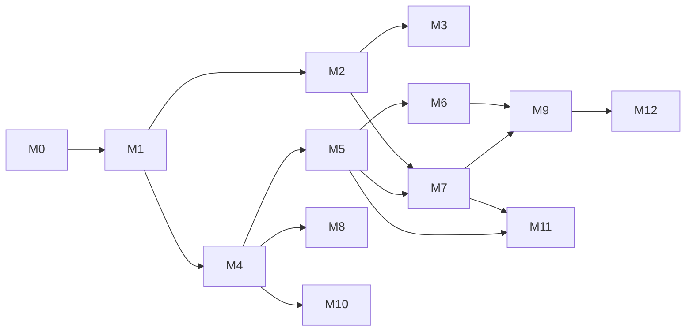

# Construction Management — milestones and tasks

Delivery plan for the rebuild described in [`../README.md`](../README.md). Same rules as the Whiteboard board: work **top to bottom inside a milestone**, do not start a ticket until every `Blocked by` ticket is `done`, update **Status** when you pick up or finish work, leave **Issue** blank until a tracker id exists.

Priority 1 is **M0 → M3** (project setup, SaaS login/signup and company onboarding, site-worker management, staff HRMS). Priority 2 is **M4 → M12**. Milestones after M3 are boards only; their tickets get "Done when" sections when the milestone before them is `done`.

## Legend

| Status        | Meaning                                                            |
| ------------- | ------------------------------------------------------------------ |
| `todo`        | Not started                                                        |
| `in_progress` | Someone is implementing it                                         |
| `blocked`     | Cannot proceed; note why in the ticket                             |
| `done`        | Merged and verified (tests + Storybook/UI where the ticket has UI) |

| Area   | Meaning                                                               |
| ------ | --------------------------------------------------------------------- |
| Docs   | ADR, CONTEXT.md, spec amendments                                      |
| Infra  | Repo wiring, CI, Docker, AWS                                          |
| Auth   | `@repo/auth` plugins and the identity bridge                          |
| Data   | Prisma schema files under `packages/db/construction/prisma/schema/*`  |
| Domain | `apps/construction-management/src/<context>/{domain,application}`     |
| HTTP   | Route Handlers + Zod models + OpenAPI under `/api/construction/<ctx>` |
| UI     | Screens in `apps/construction-management/app` + Storybook             |
| Kernel | `src/shared-kernel` (LocationRef, Money, SequenceRule, Approval…)     |

Ticket ids are `CM-<milestone><nn>`: `CM-105` is milestone 1, ticket 5.

---

## Milestones at a glance

| Milestone | Name                               | Spec                                                                                                                | Outcome the owner can see                                                                                       | Priority |
| --------- | ---------------------------------- | ------------------------------------------------------------------------------------------------------------------- | --------------------------------------------------------------------------------------------------------------- | -------- |
| **M0**    | Project setup                      | [03-target-architecture](../03-target-architecture.md)                                                              | App boots on :3002 against Postgres, CI green, `/api/docs` serves, first `construction_*` schema migrates       | 1        |
| **M1**    | SaaS onboarding & access           | [modules/01](../modules/01-organization-identity-access.md), [modules/12](../modules/12-settings-configuration.md)  | Sign up by mobile OTP or email, create a Company, invite team members, set the permission matrix, choose a plan | 1        |
| **M2**    | Site workforce (labour & vendor)   | [modules/08](../modules/08-labour-vendor-attendance.md), [modules/02](../modules/02-master-records.md)              | Register labour and vendor gangs, mark daily attendance with OT, see running balances, pay wages                | 1        |
| **M3**    | Staff HRMS                         | [modules/10](../modules/10-hrms.md)                                                                                 | Office staff check in within a geo-fence, apply for leave, HR runs shifts, holidays and monthly salary          | 1        |
| **M4**    | Projects & structure               | [modules/03](../modules/03-projects-structure-drawings-gallery.md)                                                  | Full project wizard, phases → wings → floors → units, drawings, gallery, testing reports                        | 2        |
| **M5**    | Procurement & inventory            | [modules/06](../modules/06-procurement-inventory.md)                                                                | PR → PO (GST) → GRN → stock → consume/transfer; central store                                                   | 2        |
| **M6**    | Daily site work                    | [modules/04](../modules/04-daily-site-work.md)                                                                      | Daily worksheet with material consumption, equipment usage, progress reports                                    | 2        |
| **M7**    | Finance                            | [modules/07](../modules/07-payments-accounting.md)                                                                  | Bank/cash ledgers, petty cash, party invoices & payments with TDS, ledger report                                | 2        |
| **M8**    | Tasks, issues, inspections         | [modules/05](../modules/05-tasks-issues-inspections.md)                                                             | Gantt tasks with earned value, snag list, inspection approvals                                                  | 2        |
| **M9**    | Dashboards, reports, notifications | [modules/11](../modules/11-reports-dashboards-backup.md), [modules/13](../modules/13-chat-notifications-support.md) | Project & company dashboards, report jobs, push, chat                                                           | 2        |
| **M10**   | Sales CRM                          | [modules/09](../modules/09-sales-crm-inquiry-booking.md)                                                            | Inquiries, funnel, follow-ups, unit bookings                                                                    | 2        |
| **M11**   | India compliance                   | [04-gaps-and-roadmap §Phase 3](../04-gaps-and-roadmap.md)                                                           | BOQ/RA bills, GST engine, TDS ledger, muster rolls, RERA ledger, IS 456 registers                               | 2        |
| **M12**   | Differentiators                    | [04-gaps-and-roadmap §Phase 4](../04-gaps-and-roadmap.md)                                                           | WhatsApp bot, offline outbox, Tally sync, allottee & vendor portals                                             | 2        |

Dependency between milestones:

M2 needs a **minimal Project** (name, status, address) because labour and attendance are project-scoped; that slim aggregate ships in M2 (`CM-204`) and M4 grows it. M3 needs nothing from M2 except team members from M1.

---

## M0 — Project setup

Goal: the construction app is a real app in the monorepo with the same guarantees as Whiteboard — Postgres per context schema, `@repo/auth`, OpenAPI, tests on Postgres, CI, deploy path.

| ID     | Seq | Title                                                                                             | Status | Blocked by     | Area   | Issue |
| ------ | --: | ------------------------------------------------------------------------------------------------- | ------ | -------------- | ------ | ----- |
| CM-001 |   1 | ADR CM-0001: Construction Management app and `construction_*` schemas in the shared repo          | done   | —              | Docs   |       |
| CM-002 |   2 | CONTEXT.md for the construction app (vocabulary from `00-overview.md` glossary)                   | done   | CM-001         | Docs   |       |
| CM-003 |   3 | App wiring: `@repo/auth`, `@repo/ui`, `@repo/db`, Tailwind tokens, env, `docker compose`          | done   | CM-001         | Infra  |       |
| CM-004 |   4 | Prisma multi-file: `construction-organization.prisma` with a placeholder model + migration        | done   | CM-003         | Data   |       |
| CM-005 |   5 | HTTP skeleton: `/api/construction/*` error envelope, session guard, `/api/docs` OpenAPI           | done   | CM-003         | HTTP   |       |
| CM-006 |   6 | Test harness: domain unit tests + HTTP tests on `construction_test` Postgres                      | done   | CM-004, CM-005 | Infra  |       |
| CM-007 |   7 | CI: lint, typecheck, format, tests for the new app; Vercel/ECS preview per PR                     | done   | CM-006         | Infra  |       |
| CM-008 |   8 | Shared kernel v0: `Money`, `Quantity`, ids, `AuditEvent` writer, soft-delete helper               | done   | CM-004         | Kernel |       |
| CM-009 |   9 | App shell: public layout (auth pages) and authenticated shell with Projects/Workspace/Masters nav | done   | CM-003         | UI     |       |

### CM-001 — ADR CM-0001

**Done when:** `apps/construction-management/docs/adr/CM-0001-app-and-schemas.md` records: own app on :3002, own `construction_<context>` Postgres schemas in the app's own `construction` database (shared Prisma schema and migration history in `packages/db`), reuse of `@repo/auth`/`@repo/ui`/`packages/db`, Company = Workspace, no cross-import with Whiteboard contexts (ESLint rule). Lists the 12 contexts from `03-target-architecture.md §2`.

### CM-002 — CONTEXT.md

**Done when:** `apps/construction-management/CONTEXT.md` fixes the words: Company, Team Member, Designation, Department, Contractor, Supplier, Vendor, Labour, Other Party, Project, Phase/Wing/Floor/Unit, Amenity/Common Development, Worksheet, PR/PO/GRN/MT/MR/DN, Petty Cash, Transaction, Inquiry/Booking, Sequence ID, Back-dated entry. Includes the "say / do not say" table (e.g. say **Labour**, not worker; say **Team Member**, not user/employee in UI copy; say **Company**, not organization/tenant).

### CM-003 — App wiring

**Done when:** `bun run dev --filter=construction-management` serves :3002 with the `@repo/ui` theme; `.env.example` lists DB, auth, file storage (Vercel Blob; a local folder in development) and OTP provider keys; `docker compose` has the `construction` database alongside Whiteboard's; `bun run check-types` and `lint` pass.

### CM-004 — First Prisma schema file

**Done when:** `packages/db/prisma/schema/construction-organization.prisma` exists with `@@schema("construction_organization")`, a `ConstructionOrganizationCompanyProfile` model (workspaceId, gstin, pan, address, currency, isIndian, timezone) and a hand-written migration creating the schema. `base.prisma` lists the schema. Migration applies on a fresh database.

### CM-005 — HTTP skeleton

**Done when:** a `GET /api/construction/organization/company-profile` route returns the profile for the Active Workspace (404 if none), with Zod Request/Response models beside it, `{code,message,details?}` errors, 401/403 behaviour per root ADR-0013/0014, and the route appears on `/api/docs` with `ConstructionOrganization…` component names.

### CM-006 — Test harness

**Done when:** `bun run test --filter=construction-management` runs domain tests; `bun run test:http --filter=construction-management` runs the company-profile route against `construction_test` Postgres (migrated in `globalSetup`). One passing test of each kind.

### CM-007 — CI and previews

**Done when:** the GitHub workflow runs lint/typecheck/format/tests for the app on PRs touching it; a preview deployment URL is posted per PR (Vercel for now; ECS later per architecture §1 — record which in the ADR). The Vercel project itself (Root Directory `apps/construction-management`, build command `bash scripts/vercel-build.sh`) is created by the owner in the Vercel dashboard; its GitHub integration then posts the URL.

### CM-008 — Shared kernel v0

**Done when:** `src/shared-kernel` exports `Money` (integer paise + currency, add/sub/multiply, INR formatting `₹1,00,000.00`), `Quantity` (decimal + UoM id), uuid v7 ids, `recordAudit(event)` writing `construction_organization.audit_events`, and a `withTombstone` query helper. Unit tests for Money rounding and Indian grouping.

### CM-009 — App shell

**Done when:** `/sign-in`, `/sign-up` use the public layout (their forms arrive with CM-103); `/app/*` uses `AppShell` from `@repo/ui` with the three top-level areas (Projects, Workspace, Masters) and a company switcher placeholder; Storybook renders the shell with empty states.

---

## M1 — SaaS onboarding & access

Goal: a builder can sign up, create a Company, invite staff, decide what each one may do, and buy a plan — the "01 Organization, Identity & Access" spec minus devices and data-export, which move to M9.

> **Trial removed on 2026-10-09 at the owner's request; it will be designed later.** A new Company has no subscription: no plan, no limits and never expired until its Owner buys a plan. CM-104 and CM-116–118 below are amended.

> **Amended at the start of M2 (2026-10-08, [ADR CM-0009](../adr/CM-0009-email-sign-in-while-sms-is-off.md)):** SMS is off until the business can send DLT-registered texts. Sign-in is email and password, with a Forgot password flow. The mobile OTP routes (CM-102, CM-103) stay built behind `CONSTRUCTION_SMS=on`. Invitations (CM-109) go by email and share link only, and a Team Member with only a mobile is a record until an email is added.

| ID     | Seq | Title                                                                                                        | Status | Blocked by             | Area      | Issue |
| ------ | --: | ------------------------------------------------------------------------------------------------------------ | ------ | ---------------------- | --------- | ----- |
| CM-101 |   1 | ADR CM-0002: Company = Workspace; mobile-OTP login plugin in `@repo/auth`; roles `owner`/`member`            | done   | CM-001                 | Docs      |       |
| CM-102 |   2 | `@repo/auth`: mobile OTP sign-in/sign-up plugin (SMS provider adapter, rate limit, test bypass)              | done   | CM-101                 | Auth      |       |
| CM-103 |   3 | Sign-up / sign-in screens: mobile OTP first, email+password second, "Choose Organization" after login        | done   | CM-009, CM-102         | UI        |       |
| CM-104 |   4 | Company creation: name, mobile, email, country, currency, GSTIN/PAN (optional) → Workspace + profile         | done   | CM-005, CM-102         | Domain    |       |
| CM-105 |   5 | Company HTTP + Create Company screen (first-run wizard) + company switcher                                   | done   | CM-103, CM-104         | HTTP+UI   |       |
| CM-106 |   6 | Designation aggregate + seed set (38 names, 6 with templates) copied into each new Company                   | done   | CM-104                 | Domain    |       |
| CM-107 |   7 | Permission matrix: `menu` + `flag` enums, `MemberMenuPermission`, `can()` guard, designation templates       | done   | CM-106                 | Domain    |       |
| CM-108 |   8 | Team Member aggregate: Normal vs HRMS member, profile fields, project assignment stub, invite link           | done   | CM-107                 | Domain    |       |
| CM-109 |   9 | Invitation & join flow: invite by mobile/email, join request pending → accepted/rejected, multi-company      | done   | CM-102, CM-108         | Auth      |       |
| CM-110 |  10 | Team Members HTTP + OpenAPI (list, create, update, invite, resend, remove, permissions)                      | done   | CM-108, CM-109         | HTTP      |       |
| CM-111 |  11 | Team Member screens: list with status chips, add wizard (details → projects → permission matrix), edit       | done   | CM-105, CM-110         | UI        |       |
| CM-112 |  12 | Designations HTTP + screens (list, add, duplicate, edit template) and the shared Permission Matrix component | done   | CM-105, CM-106         | HTTP+UI   |       |
| CM-113 |  13 | Back-dated entry policy (global days, override designations, financial closing date) + guard                 | done   | CM-107                 | Kernel    |       |
| CM-114 |  14 | Sequence rules (`SequenceRule`, fiscal-year token, per-project scope, counters) + Settings screen            | done   | CM-107                 | Kernel+UI |       |
| CM-115 |  15 | Company profile & my-profile screens (logo, GSTIN/PAN masked, address, currency, timezone)                   | done   | CM-105                 | UI        |       |
| CM-116 |  16 | Plans & subscription: `Plan`, `Subscription`, usage counters (projects, members, HRMS seats, storage)        | done   | CM-104                 | Domain    |       |
| CM-117 |  17 | Razorpay checkout (order → webhook → activate), billing address, invoices list                               | done   | CM-116                 | HTTP+UI   |       |
| CM-118 |  18 | Plan enforcement: block create when usage exceeded; read-only on expiry; export always allowed               | done   | CM-116                 | Domain    |       |
| CM-119 |  19 | M1 polish: empty states, Storybook for every form, OTP/invite React Email templates                          | done   | CM-111, CM-115, CM-117 | UI        |       |

### CM-101 — ADR CM-0002

**Done when:** the ADR records: Company is a Better Auth Workspace; roles inside a Company are `owner` and `member` (fine-grained rights come from the matrix, not roles); login is mobile OTP (primary, as site staff know it) with email+password as secondary; a User may hold many memberships and switches the Active Workspace; HRMS-only members are ordinary members whose permissions start from the HRMS default set.

### CM-102 — Mobile OTP plugin

**Done when:** `@repo/auth` exposes `sendOtp(mobile)` / `verifyOtp(mobile, code)` as a Better Auth plugin with an SMS adapter interface (MSG91 or SNS implementation + console adapter for dev), 6-digit code, 5-minute expiry, 5 attempts, per-mobile rate limit, and a test bypass code in `whiteboard_test`/`construction_test`. HTTP tests for happy path, expiry, lockout.

### CM-103 — Auth screens

**Done when:** `/sign-up` and `/sign-in` accept +91 mobile → OTP → session; email+password as a secondary tab; after login a user with 0 companies lands on Create Company, with 1 goes straight in, with >1 sees "Choose Organization". Storybook play functions for each state.

### CM-104 — Company creation

**Done when:** `createCompany` command creates the Workspace via `@repo/auth`, makes the caller `owner`, writes `CompanyProfile`, copies the seed sets (designations now; departments/UoMs/categories arrive in M2/M4), and emits `CompanyCreated`. It creates no subscription: a Company has none until its Owner buys a plan (CM-117). Domain tests for invariants (name required, one owner).

### CM-105 — Company HTTP + screens

**Done when:** `POST /api/construction/organization/companies`, `GET …/companies/me`, `POST …/companies/{id}/switch`; the first-run wizard (Company name → contact → country/currency → done) and the company switcher in the shell header.

### CM-106 — Designations

**Done when:** `Designation` aggregate with `name`, `isSeed`, `permissionTemplate?`; seed JSON in `src/organization/infrastructure/seeds/designations.json` holding the 38 default names (the `modules/01` list expands to 38, not 37) and starter templates for Accountant, Admin, Project Manager, Site Engineer, Site Supervisor, Store Keeper (our own defaults per role; Admin has every cell); `duplicate` command.

### CM-107 — Permission matrix

**Done when:** ADR CM-0003; `Menu` enum lists every menu in `modules/01` by context (`organization.team_members`, `labour.attendance`, `hrms.leave_management` …); `Flag` enum `create read update delete approve reject print report view_all notification transfer financial export import`; `MemberMenuPermission(workspaceId, memberId, menu, flags bitmask)` (keyed by Team Member, so a Joining Pending member's matrix exists before they have a User; ADR CM-0003); `can(member, menu, flag, {projectId?})` used by every command/query; `applyTemplate(designation)`; `view_all=false` filters lists to own entries; `financial=false` nulls amounts in Response models. Unit tests for bitmask and both filters.

### CM-108 — Team Member aggregate

**Done when:** fields from `modules/01` (name, designation, mobile, email, address, Aadhaar, PAN, emergency contact, `memberType` normal|hrms, `isOwner`) — name and Designation required, plus a mobile **or** an email (site staff often have no email; ADR CM-0002), Aadhaar checked by its Verhoeff digit, PAN by format; the Owner gets their own record (Designation "Owner") when the Company is created; `assignToProjects(ids)` stored as ids (projects exist from CM-204); invite link token; Aadhaar/PAN stored encrypted and returned masked unless `reveal` is called (OTP-gated in M9).

### CM-109 — Invitation & join

**Done when:** invite by mobile or email → a Joining Pending Team Member is the invitation (ADR CM-0002; not a Better Auth invitation, which is email-only), sent by email and SMS with a `/join/<token>` link; invitee signs up/in with that mobile or email → sees the Join Request → accepts → `member` membership through `@repo/auth`; owner can resend/cancel; a user in several companies switches; `JoiningPending` chip until accepted. HTTP tests for invite → accept and for a rejected invite.

### CM-110 / CM-111 / CM-112 — Team Members & Designations HTTP and screens

**Done when:** routes on `/api/docs`; Team Member list (search, status chips, kebab: Share invite link, Edit, Delete), add wizard with the three steps from the legacy (`details → select projects → permission matrix` with column select-all, category expand, search); Designations list/add/duplicate with template editor using the same matrix component.

CM-112 detail: Designation routes are `GET/POST /designations`, `GET /designations/{id}`, `POST /designations/{id}/update|duplicate|delete`, each checked against the `organization.designations` menu. The list returns every live Designation by name with `total` and no cursor (a Company has a few dozen). Templates travel as `{ menuKey: Flag[] }`; unknown menus or flags are 400, unsupported cells are dropped. Deleting a Designation a live Team Member holds is 409 `DESIGNATION_IN_USE`. The matrix component is `components/permissions/permission-matrix.tsx`.

### CM-113 — Back-dated policy

**Done when:** `BackdatedPolicy` per workspace: `create.days`, `edit.days`, `overrideDesignationIds`, `financialClosingDate`, per-module overrides keyed by `module` + `entryDateField`; `assertCanCreate/Edit(module, entryDate, member)` in the kernel; Settings screen mirrors the legacy groups (Procurement, Site, Inventory, Accounts, Labour & Vendor, Sales, HRMS). Unit tests for global, override, closing date.

**Delivered:** `src/shared-kernel/backdated-policy.ts` (24-module catalogue, `assertCanCreate/Edit(policy, module, entryDate, { designationId, isOwner }, today)` with `today` a `YYYY-MM-DD` in the Company time zone) and `backdated-policy-reader.ts` (`loadBackdatedPolicy`, `loadBackdatedActor`) for commands in any context. The Owner passes day limits; the inclusive closing date blocks everyone (`modules/12` open questions 7 and 12). One row per Company in `construction_organization.backdated_entry_policies`, written on first save (no row = no limits). `GET …/settings/backdated-entry`, `POST …/settings/backdated-entry/update` (menu `organization.settings`), audited with before/after.

### CM-114 — Sequence rules

**Done when:** `SequenceRule(module, scope workspace|project, prefix, projectToken, startNumber, fiscalYearToken)`; `next(module, projectId, date)` → `PR/26-27/P1/00001` with row-locked counters per rule per fiscal year (April–March); "Manage Sequence IDs" screen with preview; unit test that 1 April rolls the FY.

**Delivered:** `src/shared-kernel/sequence/` (`SEQUENCE_MODULES` with snake_case keys and default prefixes PR, PO, GRN, MT, PC, MR, DN, IR, INV; `fiscalYearOf`; `formatSequenceNumber` — order prefix / FY / project token / number; `nextSequenceNumber(tx, { workspaceId, module, projectId, date, by })` for callers to run inside their own insert transaction). Counters are `construction_organization.sequence_counters (rule_id, fiscal_year)` incremented by an upsert that holds the row lock until the caller commits; fiscal_year is 0 for rules without the FY token (never restart). Partial unique indexes: one live default per module, one live rule per (module, project). HTTP under `organization.settings`: list, create, `{id}/update` (optimistic `expectedUpdatedAt`), `{id}/delete` (409 once a number was issued). The screen offers only "All projects (default)" until Projects exist (M2).

### CM-115 — Profiles

**Done when:** Company profile (name, logo to Vercel Blob, mobile, email, GSTIN with checksum validation, PAN format validation, address, currency, timezone) and My Profile (photo, contact, masked ids) screens; Storybook states.

Decided while building it:

- The Company's own GSTIN and PAN print on its documents, so they are shown in full to anyone with `organization.settings` read; only Team Members' personal Aadhaar and PAN are masked. Changing the profile or the logo needs `organization.settings` update; the logo image itself streams to every Team Member of the Company.
- The country is fixed when the Company is created (it decides GST, PAN, TDS and which plans are offered); the profile changes name (which also renames the Company in the switcher), mobile, email, GSTIN, PAN, address, currency and time zone. Saves carry the `updatedAt` the form loaded and are refused with `COMPANY_PROFILE_CHANGED` (409) when someone saved since.
- Files go through our routes (raw body with its `content-type`; no presigned browser upload) to private Vercel Blob storage (files on disk in development and tests) under `companies/<workspaceId>/...`, are checked by content (PNG, JPEG, WebP; logo ≤ 2 MB, photo ≤ 10 MB; `FILE_TOO_LARGE`, `FILE_TYPE_NOT_ALLOWED`), and are served only through routes that stream them to the Company's own Team Members. Every stored file is a row in `construction_organization.stored_files` (bytes, kind, deleted_at) for storage usage (CM-116).
- My Profile is the signed-in User's own Team Member record in the Active Company: photo, name, email, address, emergency contact, Aadhaar and PAN. The mobile is how they sign in and is read-only there. Email here is the Team Member's contact email; changing the User's sign-in email (with verification) is not part of M1. A member may always reveal their own Aadhaar and PAN; each reveal is audited, and the OTP step arrives with M9.

### CM-116 — Plans & subscription

**Done when:** `Plan` (includes: projects, team members, HRMS seats, storage GB; prices per duration), `AddOn` (per unit per month), `Subscription(workspaceId, planId, startsAt, endsAt, autoRenew, addOns[])`, `UsageSnapshot` computed from counts; `Your Subscription` read model (plan, expiry, usage bars).

Decisions (CM-116):

- The catalogue is versioned JSON, `src/organization/infrastructure/seeds/plans.json`; orders store `catalogueVersion`. Only **Basic** is known: 6 months ₹14,000, 12 months ₹21,000 (paise in the file), 10 Projects, 5 Team Members, **10 HRMS Team Members** (our number; open question), 20 GB. `rank` orders Plans for "same or higher".
- Prices are **before GST**; GST 18% is added and shown separately (CGST 9% + SGST 9% when the buyer's state is the seller's, IGST 18% otherwise).
- Add-ons per unit per month: Extra Team Member, Extra Project, 30 GB storage at ₹299 (minimum 1 each), HRMS Team Member ₹30 (minimum 5). At most 500 units per add-on per order.
- Status is derived from dates: `active`, or `expired` (now ≥ `endsAt`). A Company with no subscription row is `none`: the read model's `plan` is null and usage has no limits (`limit: null`). Days left count a part day as a day.
- Usage: Team Members are live Normal members including the Owner and Joining Pending invites; HRMS seats count HRMS members only; Projects count 0 until CM-204; storage sums `construction_organization.stored_files.bytes` once that table exists (0 before).
- `GET /api/construction/organization/subscription` is open to every Team Member of the Company; amounts and billing (`owner`) are null for a Member.

### CM-117 — Razorpay checkout

**Done when:** Choose plan → duration → add-ons → buyer details (billing address, GSTIN) → Razorpay order → webhook verifies signature → subscription activated/extended/upgraded ("new plan must be same or higher"); invoices list with PDF; test-mode keys in `.env.example`.

Decisions (CM-117):

- Order kinds: `new` (no running plan — none yet, or the last one ended; starts on payment; the Company's first paid order creates its subscription row), `extend` (same plan; months added to the current end; running add-ons renewed for the same months), `upgrade` (rank ≥ current; starts on payment; add-ons chosen again), `add_ons` (running plan only; charged per unit per day as 1/30 of the monthly price for the days left). Without a running plan only `new` can be bought; a running plan cannot buy `new`.
- **Last Plan Discount** = the pre-GST value paid for the running period (plan and add-ons) × days left ÷ days in the period, capped at the Sub Total. Coupons are not built.
- Orders are immutable rows (`created → paid | failed`) with the full price snapshot, buyer details (name, address, GST state, optional GSTIN that must match the state) and the seller block. A `failed` order can still be paid by a later attempt on the same Razorpay order.
- Payment is settled by the webhook (`payment.captured` / `order.paid`, `X-Razorpay-Signature` HMAC-SHA256 of the raw body) **and** by `checkout/verify` (HMAC of `order_id|payment_id` with the key secret), whichever arrives first; both lock the order row, so replays never extend twice.
- A paid order is the tax invoice, numbered `CM/<FY>/<00001>` per Indian fiscal year (16 characters at most). Seller name, address, GSTIN, state (default 27 Maharashtra) and SAC (default 997331) come from `CONSTRUCTION_SELLER_*`. The buyer's billing address is kept on the order; a reusable list of Company GST registrations (rebuild recommendation 8) waits for Procurement.
- Without `RAZORPAY_KEY_ID`/`RAZORPAY_KEY_SECRET` the checkout shows "Payments are not configured" and `POST …/checkout` returns 503 `PAYMENTS_NOT_CONFIGURED`.

### CM-118 — Enforcement

**Done when:** creating a project/member/HRMS member beyond the plan returns `PLAN_LIMIT_EXCEEDED` (402) with `{ grant, limit, used }` in `details`; expired plan → all commands except export return `PLAN_EXPIRED` (402); owner-only checkout; banner in the shell. HTTP tests for each.

Decisions (CM-118):

- The `PlanGate` port lives in the shared kernel (`src/shared-kernel/plan.ts`) so every context's create commands can ask it; the organization context implements it (`SubscriptionPlanGate`, composed by `createPlanGate()`).
- Expiry is checked centrally in `requireAccess` for the write flags `create update delete approve reject transfer import`; `read print report view_all notification financial export` stay open. Owner-only command routes that use `requireOwnerSession` call `requirePlanActive(session)`. The subscription, checkout and webhook routes, sign-out and Company switching are never blocked.
- A Company with no subscription row (no plan bought yet) is neither limited nor expired.

---

## M2 — Site workforce (labour & vendor)

Goal: the daily reality of a site — who came, for how long, what they are owed — for both the company's own labour and vendor gangs, per project. Spec: `modules/08` plus the Labour/Vendor/Category/Supervisor masters from `modules/02`. Payments stay minimal (record a wage payment against the balance; full ledgers arrive in M7).

| ID     | Seq | Title                                                                                                                                                                        | Status | Blocked by     | Area           | Issue |
| ------ | --: | ---------------------------------------------------------------------------------------------------------------------------------------------------------------------------- | ------ | -------------- | -------------- | ----- |
| CM-201 |   1 | ADR CM-0004 (ledger-first balances): labour and vendor balances are derived from immutable entries                                                                           | done   | CM-001         | Docs           |       |
| CM-202 |   2 | Prisma: `construction-labour.prisma` and `construction-masters.prisma` (labour subset) + migration                                                                           | done   | CM-004, CM-201 | Data           |       |
| CM-203 |   3 | Masters: Labour Category (seed 9), Supervisor, Department (seed 54) aggregates + HTTP + screens                                                                              | done   | CM-107, CM-202 | Domain+HTTP+UI |       |
| CM-204 |   4 | Minimal Project aggregate (name, status, address, start/end) + HTTP + list/create screen                                                                                     | done   | CM-107, CM-202 | Domain+HTTP+UI |       |
| CM-205 |   5 | Labour aggregate: wage type daily/monthly, weekly holidays, wage, OT/hr, opening balance → ledger, statutory ids, photo/docs, current project                                | done   | CM-203, CM-204 | Domain         |       |
| CM-206 |   6 | Labour transfer between projects with history; active/inactive; Excel import/sample export                                                                                   | done   | CM-205         | Domain+HTTP    |       |
| CM-207 |   7 | Labour HTTP + OpenAPI; Labour screens (list by project, add/edit, transfer, import)                                                                                          | done   | CM-205, CM-206 | HTTP+UI        |       |
| CM-208 |   8 | Vendor aggregate: shifts with per-category rate (rate/day, OT/hr), joining date, docs, project assignment                                                                    | done   | CM-203, CM-204 | Domain         |       |
| CM-209 |   9 | Vendor HTTP + screens (list, add with shift/category rate card, edit)                                                                                                        | done   | CM-208         | HTTP+UI        |       |
| CM-210 |  10 | Labour attendance: per date per project; Present/Half/Absent/On Leave/Holiday/Paid Leave; shift; supervisor; OT lines (category, wages/hr, hours ≤ 24); multi-select marking | done   | CM-205, CM-113 | Domain         |       |
| CM-211 |  11 | Labour attendance HTTP + screens (mark day for many, recorded list, edit, filters)                                                                                           | done   | CM-210         | HTTP+UI        |       |
| CM-212 |  12 | Vendor attendance: per date per vendor per category/shift: full-day count, half-day count, OT hours → pay from rate card                                                     | done   | CM-208, CM-113 | Domain         |       |
| CM-213 |  13 | Vendor attendance HTTP + screens (grid by category, OT attendance, month view)                                                                                               | done   | CM-212         | HTTP+UI        |       |
| CM-214 |  14 | Balances: `LabourLedger`/`VendorLedger` entries (opening, earned per day, OT, advance, payment); To Pay / Advance / Previous / Final for monthly, weekly, custom periods     | done   | CM-210, CM-212 | Domain         |       |
| CM-215 |  15 | Wage payment command (date, mode Cash/Bank, reference, amount, paid by, remarks, document) posting to the ledger; "Mark Paid Leave"                                          | done   | CM-214         | Domain+HTTP    |       |
| CM-216 |  16 | Payment screens: labour & vendor payment lists, pay dialog, balance view                                                                                                     | done   | CM-215         | UI             |       |
| CM-217 |  17 | Reports: All Labour Attendance, All Labour Payment, Month-wise Labour, Vendor Attendance (Excel/PDF jobs)                                                                    | done   | CM-214         | HTTP+UI        |       |
| CM-218 |  18 | Muster roll export (Form XVI/XVII combined register) per contractor/project per month                                                                                        | done   | CM-217         | HTTP           |       |
| CM-219 |  19 | M2 polish: dashboard widgets (labours present, labour/vendor payment status), empty states, Storybook                                                                        | done   | CM-216, CM-217 | UI             |       |
| CM-220 |  20 | Labour attendance check-in / check-out, break, working hours per Labour (default 8), overtime from times (ADR CM-0011)                                                       | done   | CM-210, CM-211 | Domain+HTTP+UI |       |

### CM-201 — ADR CM-0004

**Done when:** the ADR records: every balance (labour, vendor, later petty cash/bank/stock) is the sum of immutable ledger entries; "Opening Balance" is an entry; edits create reversing entries; reports read closing balances from entries.

### CM-203 — Masters subset

**Done when:** Labour Categories (seed: Carpenter, Electrician, Helper, Labour, Mason, Plumber, Skilled, Unskilled, Welder), Supervisors (name), Departments (seed list from `modules/02`) with list/add/edit/disable screens under Masters; seeds copied per company at creation (hook into CM-104).

**Delivered:** the `masters` context (`src/masters/`): `LookupEntry` (Labour Category and Department share one aggregate and one set of handlers, each with its own table) and `Supervisor` (name, optional E.164 mobile, optional `teamMemberId` checked against live Team Members through a `TeamMemberDirectory` port read of `construction_organization.team_members`). Names are trimmed, required, at most 100 characters and unique per Company among live rows, any case (`<ENTITY>_NAME_IN_USE`). Seed rows can be disabled and enabled, never renamed or deleted (`SEED_IS_READ_ONLY`). Every write compares-and-sets `updatedAt` (update carries `expectedUpdatedAt` → `<ENTITY>_CHANGED`; disable, enable and delete use the `updatedAt` they loaded) and writes its audit event in the same transaction; delete is a tombstone with `deletedBy`, refused with `LABOUR_CATEGORY_IN_USE` / `SUPERVISOR_IN_USE` while live labourers, vendor rate cards or attendance point at the row (a `MasterUsage` port over the `construction_labour` tables). HTTP under `/api/construction/masters/{labour-categories,departments,supervisors}`: `GET` list (all live rows by name with `disabled`, plus `total`, no cursor; `?status=enabled` for pickers), `POST` create, `GET {id}`, `POST {id}/update|disable|enable|delete`; menus `masters.labour_categories`, `masters.departments`, and `masters.labours` for Supervisors; OpenAPI tag "Construction · Masters". Seeds: `CompanyCreated` reaches `SeedCompanyMastersListener` through `src/composition/company-created-listeners.ts`; the copy skips names the Company already has, so it is idempotent (Companies created before M2 got theirs from the migration). Screens: Masters → Labour & Vendors → Labour Categories, Supervisors; Masters → Work → Departments (one list pattern with an Add/Rename dialog, a "Default" badge for seed rows like Designations, muted disabled rows, and a confirm before delete).

### CM-204 — Minimal Project

**Done when:** `Project(name*, status Ongoing|Completed|NotStarted|OnHold, address, startDate, endDate)` with plan-limit check (CM-118), member assignment check in `can()`, Projects home with status filter chips and cards; everything else about projects waits for M4.

**Delivered:** the `projects` context (`src/projects/`): `Project` (name ≤ 120 tidied, status default Ongoing, address ≤ 500, start/end calendar dates, end ≥ start → `PROJECT_DATES_INVALID`), live names unique per Company (`PROJECT_NAME_IN_USE`), edits with `expectedUpdatedAt` (409 `PROJECT_CHANGED`), tombstone deletes refused while labours, assigned vendors, attendance or wage payments point at the Project (`PROJECT_IN_USE`), every write audited in its transaction. Create asks the kernel `PlanGate` for `project` (402 `PLAN_LIMIT_EXCEEDED`); usage counts live rows of `construction_projects.projects`. HTTP under `/api/construction/projects/projects` (menu `projects.project`): list with `?status=` and counts per status, create, `{id}`, `{id}/update`, `{id}/delete`, and `options` (id, name, status) for pickers, open to every Team Member. The Owner sees every Project; a Member only the ones assigned to them, and any other is 404. A Member who adds a Project is not assigned to it. Screens: Projects home (status chips with counts, cards, empty state), New Project page, project shell (header with Edit; Overview, Attendance, Payments, Reports tabs, the last three placeholders for CM-211/216/217), Edit with Delete. Team Member project ids and project-scoped Sequence ID rules must be live Projects of the Company (400 `PROJECT_NOT_FOUND`); the Select Projects step is a checklist and Sequence IDs offers real Projects.

### CM-205 / CM-206 / CM-207 — Labour

**Done when:** all fields from `modules/08` Labour table; wage type drives which wage field is required; opening balance becomes the first ledger entry; Aadhaar/UAN/ESIC validated by format; `currentProjectId` required; domain tests for wage/OT invariants.

**Delivered:** `src/labour/domain/labour.ts` (`Labour` aggregate and `checkLabourDetails`: name ≤ 100, optional Labour Id ≤ 30 and father's name, joining date, wage type with the wage of that type > 0 (`WAGE_REQUIRED`) and the other wage cleared, OT wage ≥ 0, weekly holidays 0–6 unique, UAN 12 digits, ESIC 10 or 17, Aadhaar by Verhoeff (stored encrypted, returned masked), E.164 contact, gender). `PrismaLabourRepository` writes the labourer, the first history row (`from_project_id` null, dated the joining date), the opening ledger entry (`kind=opening`, `source_type=labour`, project null) and the audit event in one transaction; an edit with a changed opening balance or joining date reverses the live opening entries and posts the new one (a new joining date also moves the first history row, and may not pass the first transfer or attendance day); `expectedUpdatedAt` → 409 `LABOUR_CHANGED`; Labour Id unique among live labourers, case-insensitive (409 `LABOUR_CODE_TAKEN`). Transfer (one or many, all or none): destination ≠ current (`TRANSFER_SAME_PROJECT`), date on or after the last transfer (`TRANSFER_BEFORE_LAST_TRANSFER`) and after the latest attendance day (`TRANSFER_BEFORE_ATTENDANCE`; a transfer dated on an attendance day is refused, since that day belongs to the old Project); `projectOn`/`projectsOn` in `src/labour/infrastructure/labour-project-on.ts` give the Project on a date for CM-210. Delete = tombstone + opening reversal, refused 409 `LABOUR_HAS_RECORDS` once attendance or wage payments exist; Inactive leaves the pickers. Photos and documents are a generic `PartyFiles` module (`src/labour/application/party-files.ts`, owner `labour` or `vendor`; PDF/PNG/JPEG/WebP ≤ 10 MB sniffed by content, `stored_files` kinds `labour_photo|labour_document|vendor_photo|vendor_document`). HTTP under `/api/construction/labour/labours` (Menu `masters.labours`; Without Financial wages, OT wage, opening balance and balance are null and an edit that omits them keeps them): list (`projectId`, `active`, `q`, `supervisorId`, `categoryId`, cursors + total), create, `{id}`, `{id}/update|activate|deactivate|delete`, `{id}/transfers`, `transfer` (`labour.labour` transfer on the destination and every source Project), `options?projectId=&date=` (`labour.attendance` read on the Project; rates need `labour.labour` Financial), `import-template`, `import?dryRun=` (raw .xlsx body, ≤ 1000 rows, names matched case-insensitively, all or nothing; 400 `IMPORT_HAS_ERRORS` with the preview), `export`, photo and documents. `masters.labours` has no import/export flags, so import needs `create` and template/export need `read`. Screens: Masters → Labours (filters, multi-select transfer, transfer history sheet, import dialog with row preview, export), Add/Edit Labour with Photo & documents on Edit.

### CM-208 / CM-209 — Vendors

**Delivered:** `src/labour/domain/vendor.ts` (`Vendor` aggregate and `buildRateCard`: name ≤ 120, joining date, E.164 contact, Projects, rate card of shifts with optional `HH:MM` times, unique shift names, ≥ 1 category rate per shift, `DUPLICATE_SHIFT_CATEGORY`, paise ≥ 0; a `null` amount keeps the current rate; `rateFor(shiftId, categoryId)` refuses `VENDOR_INACTIVE`, `VENDOR_NO_RATE_CARD`, `CATEGORY_NOT_ON_SHIFT` for CM-212). A vendor may be saved without shifts; the list shows "No rate card". `PrismaVendorStore` writes the vendor, Projects, rate card, opening ledger entry (`kind=opening`, `source_type=vendor`, dated the joining date) and audit event in one transaction; an edit replaces rates in place, soft-deletes removed shifts, and reverses + reposts the opening entry when the amount or joining date changes; `expectedUpdatedAt` → 409 `VENDOR_CHANGED`; delete is a tombstone that reverses the opening entry, refused 409 `VENDOR_HAS_RECORDS` once vendor attendance or wage payments exist. HTTP under `/api/construction/labour/vendors` (Menu `masters.vendors`): list (`q`, `projectId`, `active`, cursors + total), create, get, `{id}/update|activate|deactivate|delete`, photo and documents (party files, owner `vendor`), and `options?projectId=` (active assigned vendors with live shifts; needs `labour.attendance` read on the Project; rates need `labour.vendor` Financial). Without Financial, rates, opening balance and balance are null in responses; amounts may still be entered (the same rule as labourers), and a `null` amount keeps the stored one. New categories must be live and enabled (`LABOUR_CATEGORY_NOT_FOUND`, `LABOUR_CATEGORY_DISABLED`); Projects must exist (`PROJECT_NOT_FOUND`). Screens: Masters → Vendors (list, Add, Edit with the rate card editor); `components/money/money-input.tsx` (rupees on screen, paise in the API).

### CM-210 — Labour attendance

**Done when:** one row per labour per date per project (unique); statuses as listed; OT lines validate hours ≤ 24 and category ∈ labour categories; back-dated guard applies with `module = labour_attendance`; marking for many labours in one command; `AttendanceMarked` event carries the day's earned amount (wage per day or monthly/working-days, half = 50%, OT = hours × wages/hr) for the ledger.

### CM-210 / CM-211 — Labour attendance delivered

**Delivered:** `LabourAttendanceHandlers` (`src/labour/application/labour-attendance-handlers.ts`, store port `LabourAttendanceStore`, Prisma `src/labour/infrastructure/labour-attendance-store.ts`) marks many labourers' day on a Project in one transaction: `assertDistinctLabourers`; every labourer live (404 `LABOUR_NOT_FOUND`), active (`LABOUR_INACTIVE`) and on that Project on that date by transfer history (`LABOUR_NOT_ON_PROJECT`, `details.projectId` = where they were); no future dates (`ATTENDANCE_DATE_IN_FUTURE`); overtime categories and explicit Supervisors live (`LABOUR_CATEGORY_NOT_FOUND`, `SUPERVISOR_NOT_FOUND`); the Supervisor snapshot defaults to the labourer's own. A labourer already marked that day needs their row's `updatedAt` in `expected` (missing or stale → 409 `ATTENDANCE_CHANGED`); new rows need Attendance create and the back-dated create limit, re-marks need Attendance update and the edit limit (`module = labour_attendance`); every per-row error carries `details.labourId`. Each row is priced with `priceDay` from the labourer's current wages (also on a re-mark), its overtime lines replaced, its ledger entries reversed (`reverseSource("labour_attendance", id)`) and `dayLedgerEntries` posted, with an audit event, all in one transaction; the ledger entries in the same transaction are the `AttendanceMarked` feed (no separate event bus). `clearDay` tombstones rows and reverses their entries (all or none, `expected` per row); `setPaidLeave` ("Mark Paid Leave") applies `withPaidLeave` to the stored snapshot and reposts. Queries: the marking sheet (active labourers on the Project that day with category, Supervisor, weekly holidays, wages, the day's row, `suggestedStatus` = Holiday on a weekly holiday else yesterday's status, `yesterday` for "Copy yesterday", read-only rows for labourers marked here who since left or went inactive, live categories for the OT picker, Supervisors for the filter, day totals), the recorded list (dates, labourer, Supervisor snapshot, status incl. `paid_leave`; newest date first; bidirectional cursors on (date, id) + total) and the month grid (labourer × day codes P/H/A/L/PL/HO + OT hours; totals present, half, absent, leave, paid leave, holidays, OT hours, earned, overtime, total; per-day headcount; roster labourers with no marks listed too). HTTP under `/api/construction/labour/attendance/labour` (menu `labour.attendance` on the Project): `GET sheet?projectId=&date=`, `POST mark` (200 `{ items }`), `POST clear` (204), `POST {id}/paid-leave`, `GET ?projectId=&from=&to=&labourId=&supervisorId=&status=&limit=&after|before=`, `GET month?projectId=&month=YYYY-MM`; wages, earned, OT rates and amounts are null without `labour.labour` Financial. Screens: Project → Attendance → Labour with Mark / Recorded / Month tabs (`components/attendance/labour/`): date picker, Supervisor filter, search, a row per labourer with P / ½ / A / Leave / Holiday buttons, Paid Leave switch on Leave, shift select (General, Shift 1–3), expandable OT lines (category, hours, rate defaulting to the OT wage), multi-select with "Mark selected Present / Absent / Holiday" and "Clear day", "Mark all present" (skips weekly holidays) and "Copy yesterday", weekly holidays pre-filled Holiday, dirty-row marker, Save sends only dirty rows with their loaded `updatedAt`, server errors shown on the row by `details.labourId`; Recorded has filters, cursors and "Mark Paid Leave" on leave days; phone-first stacked rows, a table row layout on desktop.

### CM-212 — Vendor attendance

**Done when:** one row per vendor per date per project with lines per (shift, category): full-day count, half-day count, OT hours; pay = full × rate + half × rate/2 + OT × OT rate from the vendor's rate card as of that date; event feeds the vendor ledger.

### CM-212 / CM-213 — Vendor attendance delivered

**Delivered:** `VendorAttendanceHandlers` (`src/labour/application/vendor-attendance-handlers.ts`) prices a day with the domain's `priceVendorDay` from the vendor's live rate card. It refuses a future date (`ATTENDANCE_DATE_IN_FUTURE`), a missing Project or vendor (404), a vendor not assigned to the Project (`VENDOR_NOT_ON_PROJECT`, **400**, the same as `CATEGORY_NOT_ON_SHIFT`), an inactive vendor (`VENDOR_INACTIVE`) and a vendor without a rate card (`VENDOR_NO_RATE_CARD`). Line errors carry `details.lineIndex`, `shiftId` and `labourCategoryId`. A new day passes the back-dated create limit. A recorded day changes only with `expectedUpdatedAt` (a missing or stale one is 409 `VENDOR_ATTENDANCE_CHANGED`), Attendance update and the edit limit. **An edit re-prices every line from the current rate card.** Clearing a day uses the edit limit. `PrismaVendorAttendanceStore` writes the row, its lines, `reverseSource` + the new `earned` entry and the audit event (`vendor_attendance.recorded|updated|cleared`) in one transaction. The partial unique index turns a racing create into a 409. A cleared row is a tombstone with its entry reversed, so the day can be recorded again. HTTP under `/api/construction/labour/attendance/vendors` (Menu `labour.attendance` on the Project; amounts need `labour.vendor` Financial and are null without it):

- `GET day?projectId&date`: the grid of active assigned vendors with their rate cards and recorded lines, plus read-only rows for vendors recorded that day who have since left the Project.
- `POST record`: 201 for a new day (create), 200 for an edit (update).
- `POST {id}/clear`: 204; needs delete.
- `GET ?projectId&from&to&vendorId&categoryId&page&pageSize`: a simple page plus total, newest first.
- `GET month?projectId&month=YYYY-MM`: the vendor × day matrix with totals per vendor, Labour Category and day.
- `GET overtime?projectId&from&to`: at most 366 days.

Screens: the project's Attendance tab is a layout with Labour / Vendor sub-tabs. `/attendance` redirects to `labour`, which is a placeholder until CM-211. `/attendance/vendors` has three views:

- **Day:** date picker defaulting to today, previous/next. Each vendor gets a card with, per shift, a row per category: Full day / Half day / OT hours with numeric keypads, a pay preview per line and a day total using the server's formula, Save, Clear day, and Copy yesterday.
- **Month:** the matrix and category totals.
- **Overtime:** overtime lines for a date range.

Empty states: no vendors on the Project (links to Masters → Vendors), and a vendor without a rate card (links to the vendor).

### CM-214 — Balances

**Done when:** ledgers are append-only; period summaries (monthly/weekly/custom) return opening, earned, OT, advances, payments, closing; "Previous Balance", "To Pay", "Advance", "Final Amount" match the legacy labour payment screen; unit tests with a 31-day month including half days and OT.

**Delivered:** `src/labour/application/balance-handlers.ts` (`BalanceHandlers.balances` and `.statement`, pure `statementOf` / `totalOf`) over `PrismaBalanceStore` (`src/labour/infrastructure/balance-store.ts`); the period figures are the domain `summarize()` (the 31-day month, half-day and OT unit tests are in `domain/ledger.test.ts` and `wages.test.ts`). **A balance belongs to the party, not the Project** (`modules/08`): every figure (Previous Balance, To Pay, Advance, Paid, Final Amount) sums all of the party's entries across Projects; the Project only decides who is listed — labourers whose current Project it is and vendors assigned to it (joined by the period's end), plus any party with an entry in this Project during the period (`onProject` false, badge "Other Project"). HTTP `GET /api/construction/labour/balances?projectId=&partyType=labour|vendor&kind=monthly|weekly|custom&anchor=&to=` (anchor defaults to the Company's today; rows by name plus a totals row) and `GET …/balances/statement?projectId=&partyType=&partyId=&from=&to=` (≤ 3660 days; opening before `from`, every entry with its Project, source, running balance, `isReversal`/`isReversed`, and the payment behind it; the party must be on the Project or have entries in it, else 404). Menus: labour → `labour.labour`, vendor → `labour.vendor`, read on the Project; without Financial every amount is null (names and counts stay).

### CM-215 — Wage payments

**Delivered:** `WagePaymentHandlers` (`src/labour/application/wage-payment-handlers.ts`) over `PrismaWagePaymentStore` (`src/labour/infrastructure/wage-payment-store.ts`, factory `wage-payment-factory.ts`). `record`: the domain `wagePayment()` checks (amount > 0, reference ≤ 100, remarks ≤ 500), the Project live (404 `PROJECT_NOT_FOUND`), the party live in the Company (404 `LABOUR_NOT_FOUND` / `VENDOR_NOT_FOUND`; inactive parties can still be paid, to settle someone who left), a vendor assigned to the Project (400 `VENDOR_NOT_ON_PROJECT`; a labourer may be paid on any live Project), "Paid by" a live Team Member (400 `TEAM_MEMBER_NOT_FOUND`), the date not after today (400 `PAYMENT_DATE_IN_FUTURE`), then the back-dated guard; the row, its one negative ledger entry (`paymentLedgerEntries`) and the audit event in one transaction. **No edit:** `cancel` (with `expectedUpdatedAt`, 409 `PAYMENT_CHANGED`; already cancelled = 404) tombstones the row and `reverseSource("wage_payment", id)`; correct a payment by cancelling and recording it again. Back-dated guard: the catalogue has no `labour_payment` / `vendor_payment` module and no per-group setting, so payments use the Company's default create/edit limits (what Labour & Vendor modules use in global mode) and the Financial Closing Date, with the kernel's codes (`BACKDATED_CREATE_BLOCKED`, `BACKDATED_EDIT_BLOCKED` on cancel, `FINANCIAL_PERIOD_CLOSED`). Bank without a reference is accepted by the API and required by the screen. One receipt per payment (`document_key`; PDF/PNG/JPEG/WebP ≤ 10 MB sniffed by content; `stored_files` kind `wage_payment_receipt`; compare-and-set, 409 `RECEIPT_CHANGED`; a replaced or removed file is marked deleted). HTTP under `/api/construction/labour/payments` (menu by party type, on the payment's Project): `GET` list (`projectId`, `partyType?` — without it the types the caller may read —, `partyId`, `kind`, `from`, `to`, cursors, `total`, `totalAmount`), `POST` record (create), `GET {id}`, `POST {id}/cancel` (delete), `GET|POST {id}/receipt` (read / create), `POST {id}/receipt/remove` (delete), `GET payers?projectId=&partyType=` (active Team Members and the caller's own, the "Paid by" default; create). Amounts are null without Financial. OpenAPI: `payments/payment-openapi.ts` merged in `openapi-document.ts`. "Mark Paid Leave" is CM-210/211's (attendance owns it).

### CM-216 — Payment screens

**Delivered:** Project → Payments (`app/app/projects/[id]/payments/page.tsx`, `components/payments/`): tabs Labour, Vendor and Payments. Labour and Vendor share a period switcher (Monthly with previous/next month, Weekly Monday–Sunday with previous/next week, Custom with a date range) and a balances table — Previous Balance, To Pay, Advance, Paid, Final Amount and a totals row; cards on phones. Pay opens the pay dialog (react-hook-form + zod: date default today, Payment/Advance, Cash/Bank with a required reference for Bank, amount defaulting to the Final Amount when > 0, Paid by defaulting to the signed-in Team Member, remarks, optional receipt uploaded after the payment is recorded; rupees on screen, paise to the API). A row opens the statement sheet (entries with Project and running balance, cancelled and reversal entries muted, receipt link, Cancel payment with a confirm). The Payments tab lists recorded payments with type, kind and date filters, cursors, the total, receipts and Cancel. Reads are `queryOptions` + `useSuspenseQuery` in `src/queries/{balances,payments}.ts`; recording or cancelling invalidates payments and balances. Storybook play stories: period switch, pay from a row, pay dialog defaults/validation/paise/server refusal, statement with cancel, and the empty states.

### CM-217 / CM-218 — Reports and muster roll

**Done when:** report requests enqueue a job (M0's harness runs it inline until M9 adds the queue), produce Excel + PDF to Vercel Blob, and return a download link; the combined muster-roll/wage register has the columns required by the CLRA Ease-of-Compliance combined register (name, father's name, category, days worked, wage rate, OT, gross, deductions, net, signature column) — see research doc §2 Labour.

**Delivered:** a new `reporting` context (`src/reporting/`, Postgres schema `construction_reporting`, one table `report_jobs`: kind, Project (null = central), params, status `queued|running|done|failed`, `includes_money`, Excel and PDF storage keys, download name, error, requester, created/started/finished). **Job harness:** `ReportHandlers.request` validates the period (≤ 366 days, real month; 400 `REPORT_PERIOD_INVALID|REPORT_PERIOD_TOO_LONG`) and the Project (404), inserts the job `queued` and hands it to a `ReportRunner` port. M2's `inlineReportRunner` calls the `ReportExecutor` in the same request: running → reads (a read model over the labour, masters, projects and organization tables; no labour code imported) → pure builders lay out a `ReportDocument` (header, notes, tables with totals rows) → `exceljs` and `pdf-lib` render it → both files go to private storage under `companies/<id>/reports/` and are recorded as `stored_files` kind `report` in the same transaction that marks the job done. A failure marks it `failed` with a screen-safe message (a domain refusal keeps its words; anything else gets a generic message, logged with its stack) and deletes any file already written. **M9 swaps the runner for one that sends the job id to SQS; the worker calls the same executor**, and the screen already polls while a job is queued or running. Reports, each an .xlsx (one sheet per table: Company, report, Project, address, period, generated at in the Company time zone, notes, frozen header row, totals) and a landscape PDF (A4; A3 for the muster roll; header on every page, repeated table header, totals, Page x of y; standard fonts, so `₹` prints as `Rs.`): **All Labour Attendance** (summary per Labour: present, half day, absent, leave, paid leave, holiday, OT hours; plus day by day), **All Labour Payment** (Previous Balance, Earned, Overtime, To Pay, Advance, Paid, Final Amount by ADR CM-0004's mapping, opening entries up to the period's end in Previous Balance, reversals netting by kind; Labours on the Project now or with ledger entries for it in the period; figures are the Labour's whole ledger because a balance moves with them), **Month-wise Labour** (Labour × day P/½/A/L/PL/H, counts, OT hours; Earned / OT amount / Total only with Financial), **Vendor Attendance** (per day, shift and Labour Category: full, half, OT hours; rates and pay only with Vendor Financial; optional vendor and category filters; `projectId: null` is the Central Vendor Attendance Report over the Projects the requester is on, or every Project for the Owner, openable only by its requester and the Owner), and the **muster roll and wage register** (CM-218: Sl. No., name, father's name, category, sex, a column per day with OT as `P+2`, days worked = present + ½ × half days, paid days by the M2 wage rules, wage type and rate from the last marked day's snapshot, basic earned, OT hours and amount, gross, Advance, Deductions, net payable = gross − advance − deductions, paid in month, blank signature / thumb impression column). The register covers the Company's own Labours on the Project (marked in the month, or on it and joined by its end); vendor headcount is not named, so vendors are not on it. M2 has no deductions engine: Deductions is 0 and advances paid in the month (ledger entries for the Project) are shown and taken off Net payable; both are stated in the header notes. HTTP under `/api/construction/reporting/reports` (labour kinds: `labour.labour` Report on the Project; vendor: `labour.vendor` Report): `POST` (discriminated by `kind`; 201 with the job, usually `done` with download links; the payment report and the muster roll are refused 403 without Financial; other kinds print amounts only with it and record that on the job), `GET ?projectId=` (newest 50 of the kinds the member may report on; without `projectId`, their own central reports), `GET {id}` (another Company's job is 404), `GET {id}/download?format=xlsx|pdf` (re-checks Report on the menu and Project, and Financial when the file carries amounts; 409 `REPORT_NOT_READY`; streams with the file's content type). Screen: the Project's Reports tab has a card per report (what it contains, what it needs, From/To or Month, Generate with progress, then Excel / PDF downloads or the failure message) and Recent reports with Ready / Failed / Generating chips. Not built: one-running-job-per-user guard and file retention (not needed while jobs run inline), the logo in the header, vendor and category pickers on the vendor card (the API takes them), and a Central Reports screen (the API supports the central vendor report).

### CM-219 — M2 polish

**Delivered:** a Project's Overview opens with **Labour today**: Labours present of those on the Project (with unmarked, half day, absent), vendor heads and how many vendors were recorded, what is owed to Labours and to vendors (party-wide ledger balances, advances shown separately, null without Financial), and a 14-day bar chart of Labours present with a screen-reader table (`GET /api/construction/labour/summary`, menu `labour.attendance` read; `components/projects/project-labour-tiles.tsx`). Every M2 list and screen has an empty state and Storybook play stories (183 stories in the app). UI copy says Labour / Labours, never labourer (CONTEXT.md). Money inputs select their amount on focus. A re-mark by a member without Financial keeps a custom overtime rate.

### CM-220 — Check-in, check-out and working hours

**Delivered:** [ADR CM-0011](../adr/CM-0011-attendance-check-in-out-and-working-hours.md); migration `construction_labour_attendance_times` (`labours.working_hours_per_day` decimal(4,2) default 8; `labour_attendance.check_in`, `check_out` char(5), `break_minutes`, `working_hours` snapshot; `labour_overtime.from_times`; check constraints repeat the domain rules). **Labour:** `workingHoursPerDay` (0 < h ≤ 24, two places, default 8; `WORKING_HOURS_INVALID`) on create, update (left out or null keeps the stored value), the register read model, attendance options, and the Excel template, import (optional "Working Hours per Day" column, blank = 8) and export; it is not an amount, so it shows without Financial. **Domain** (`wages.ts`, `labour-attendance.ts`): `priceDay` validates the times (`TIME_INVALID`, `TIMES_NEED_PRESENT` on Absent / Leave / Holiday, `CHECK_IN_REQUIRED`, `CHECK_OUT_SAME_AS_CHECK_IN`, `BREAK_INVALID` 0–720, `BREAK_TOO_LONG`), defaults the break to 60 with a check-in, snapshots the working hours, and works out the `fromTimes` overtime line (worked = out − in − break, a check-out at or before the check-in is the next day; extra = worked − working hours in hundredths, rounded half up; hours sent with the line are ignored; the line drops out without a check-out or extra time; at most one, `OVERTIME_FROM_TIMES_TWICE`; the 24-hour daily cap still applies). Times never change the status or the day's pay, and a Half Day uses the full working hours as its threshold. **HTTP:** mark takes `checkIn`, `checkOut`, `breakMinutes` and overtime `{ fromTimes: true }` (errors carry `details.labourId` and `field`); a day returns `checkIn`, `checkOut`, `breakMinutes`, `workingHours`, `workedHours` and overtime `fromTimes`; the sheet adds each row's `workingHoursPerDay` and yesterday's times. A re-mark without a rate keeps the saved `fromTimes` line's rate. Mark Paid Leave carries the times through. **Report:** All Labour Attendance's day-by-day table adds In, Out (`06:15 (+1)` for the next day) and Worked hours; reporting works the hours out itself (no labour import); the month report and muster roll are unchanged. **Screens:** the marking sheet has In, Out and Break per row on Present / Half Day with the worked hours and a next-day hint; an automatic "from times" overtime line that becomes a manual line when its hours are edited; "Set times" for the selected rows; Copy yesterday copies the times; the Recorded list shows In, Out and Worked; Add / Edit Labour has Working hours. Not built: biometric or geo check-in, and times on vendor attendance (headcount names no one).

---

## M3 — Staff HRMS

Goal: office and supervisory staff (Team Members) get geo-fenced attendance, leave, shifts, holidays and monthly salary. Spec: `modules/10`.

| ID     | Seq | Title                                                                                                                                                                                                           | Status | Blocked by             | Area           | Issue |
| ------ | --: | --------------------------------------------------------------------------------------------------------------------------------------------------------------------------------------------------------------- | ------ | ---------------------- | -------------- | ----- |
| CM-301 |   1 | ADR CM-0008: statutory figures (PF/ESI ceilings and rates, PT slabs, minimum wages) are effective-dated tables                                                                                                  | done   | CM-001                 | Docs           |       |
| CM-302 |   2 | Prisma: `construction-hrms.prisma` + migration                                                                                                                                                                  | done   | CM-004                 | Data           |       |
| CM-303 |   3 | HRMS settings aggregate (gps requirement, grace, approval levels, working hours/half day, working days, carry-forward, accrual, salary day) + screen                                                            | done   | CM-107, CM-302         | Domain+HTTP+UI |       |
| CM-304 |   4 | Branches with geo-fence (lat/lng/radius) and project-site fences; map picker screen                                                                                                                             | done   | CM-303, CM-204         | Domain+HTTP+UI |       |
| CM-305 |   5 | Holidays: types National/Festival/Company, optional flag, xlsx import/sample; calendar screen                                                                                                                   | done   | CM-303                 | Domain+HTTP+UI |       |
| CM-306 |   6 | Shift templates (times, working days, hours, half-day hours, grace, OT allowed) and rotation templates (week/month/custom 2–12 cycle)                                                                           | done   | CM-303                 | Domain+HTTP+UI |       |
| CM-307 |   7 | Shift assignment per member "until changed"; effective shift resolver for a date                                                                                                                                | done   | CM-306                 | Domain         |       |
| CM-308 |   8 | Attendance entries: check-in/out with GPS, fence check ("Outside Fence"), open entry guard, missed checkout, backdated manual entry, auto status (Present/Half/Absent/Leave/Holiday) from shift + settings      | done   | CM-304, CM-307         | Domain         |       |
| CM-309 |   9 | Attendance HTTP + screens: My Attendance (check-in card), Team Today, Approvals, monthly summary                                                                                                                | done   | CM-308                 | HTTP+UI        |       |
| CM-310 |  10 | Leave types (seed 6: Casual 12, Comp Off, LOP, Maternity 182, Privilege 15 cf, Sick 7) with accrual config                                                                                                      | done   | CM-303                 | Domain+HTTP+UI |       |
| CM-311 |  11 | Leave structures (bundle of types) and member assignment; balances: initialise (by structure), monthly accrual job, carry-forward at year end                                                                   | done   | CM-310                 | Domain         |       |
| CM-312 |  12 | Leave requests: apply with day breakdown Full/Morning/Afternoon, reason ≥ 10 chars, balance check, approve/reject with remarks, cancellation request flow                                                       | done   | CM-311, CM-113         | Domain         |       |
| CM-313 |  13 | Leave HTTP + screens: My Leaves (apply, credit history), Leave Approvals tabs, Team Leaves                                                                                                                      | done   | CM-312                 | HTTP+UI        |       |
| CM-314 |  14 | Salary structures: components (Basic, Special Allowance…), PF % + wage-ceiling cap, ESI %, PT per month, deduct absent/unpaid, other deductions                                                                 | done   | CM-301, CM-303         | Domain+HTTP+UI |       |
| CM-315 |  15 | Employee salary configuration (base + structure per member; "Configured / Not Set" list; Save All)                                                                                                              | done   | CM-314                 | Domain+HTTP+UI |       |
| CM-316 |  16 | Salary run: calculate for all members for a month from attendance (payable days, week offs, holidays, paid/unpaid leave, OT), statutory deductions from dated tables, advance, net; approve; mark paid; payslip | done   | CM-308, CM-312, CM-315 | Domain         |       |
| CM-317 |  17 | Salary HTTP + screens: Team Salary (calculate, pay advance, mark paid), My Salary, payslip PDF                                                                                                                  | done   | CM-316                 | HTTP+UI        |       |
| CM-318 |  18 | HRMS member onboarding: `memberType=hrms` applies the HRMS default permission set; HRMS seat counted in plan usage                                                                                              | done   | CM-108, CM-118, CM-303 | Domain         |       |
| CM-319 |  19 | HRMS dashboard (today's snapshot, present/absent breakdown, day-wise trend, pending approvals) + Workspace tile                                                                                                 | done   | CM-309, CM-313         | UI             |       |
| CM-320 |  20 | M3 polish: PF/ESI challan input export, Storybook, empty states                                                                                                                                                 | done   | CM-317, CM-319         | UI             |       |

### CM-301 — ADR CM-0008

**Delivered:** [ADR CM-0008](../adr/CM-0008-statutory-figures-are-dated-tables.md); product answers to the `modules/10` open questions are in [ADR CM-0012](../adr/CM-0012-hrms-product-decisions.md). Tracked on the [M3 project board](https://github.com/users/arunselvakumar/projects/4).

**Done when:** the ADR records that PF (ceiling ₹15,000, 12%/12%), ESI (ceiling ₹21,000, 3.25%/0.75%), professional tax slabs per state, minimum wages per state/skill, GST rates and TDS sections live in effective-dated tables seeded from JSON, never as constants; and names the owner of updating them. Figures and sources: research doc §2.

### CM-308 — Attendance entries

**Done when:** `checkIn(member, lat, lng, at)` resolves the member's fence (branch or assigned project site) and the `gps_requirement` setting, rejects outside the fence with `outside_fence`, rejects when an open entry exists; `checkOut` closes it and computes hours; `addMissedCheckout` and `addBackdated` (back-dated guard, `module = hrms_attendance`, approval required) exist; day status derives from the effective shift (working hours, half-day hours, grace). Domain tests for each rule.

### CM-312 — Leave requests

**Done when:** state machine `pending → approved | rejected`, `approved → cancel_requested → cancelled | approved`; balance is reserved on apply and consumed on approve; LOP allowed beyond balance only for the unpaid type; `approval_levels` from settings (1 now; 2 later); rejection/cancellation reasons stored; events update the leave balance ledger.

### CM-316 — Salary run

**Done when:** for a month and member: working days from shift calendar minus holidays; present/half/absent/paid-leave/unpaid-leave from attendance + approved leaves; payable days; gross = base + components (pro-rated by payable days where configured); PF on PF wage (capped), ESI if gross ≤ ceiling, PT by state slab, absent/unpaid deductions, other deductions, advances; net payable; run states `calculated → approved → paid`; payslip shows the legacy "Attendance Details / Earnings / Statutory Deductions / Net Payable" blocks. Golden tests with a 30-day and a 31-day month.

---

## M4 — Projects & structure

| ID     | Seq | Title                                                                                                                                                 | Status | Blocked by | Area        |
| ------ | --: | ----------------------------------------------------------------------------------------------------------------------------------------------------- | ------ | ---------- | ----------- |
| CM-401 |   1 | Prisma `construction-projects.prisma`; grow Project (type, budget, logo, resources)                                                                   | done   | CM-204     | Data+Domain |
| CM-402 |   2 | Phases, Wings (8 types), floor generation, Units; wing/unit editor screens                                                                            | todo   | CM-401     | Domain+UI   |
| CM-403 |   3 | `LocationRef` value object in the kernel + picker component (Wing/Floor/Unit, Amenity, Common Dev)                                                    | todo   | CM-402     | Kernel+UI   |
| CM-404 |   4 | Amenities & Common Developments masters + project assignment                                                                                          | todo   | CM-402     | Domain+UI   |
| CM-405 |   5 | Locations for non-building projects                                                                                                                   | todo   | CM-402     | Domain+UI   |
| CM-406 |   6 | Project resources: assign team members, contractors, suppliers, vendors (needs CM-5xx masters for parties — or ship contractor/supplier masters here) | todo   | CM-401     | Domain+UI   |
| CM-407 |   7 | Attachments service (Vercel Blob private uploads through our routes, quota, thumbnails) in the kernel                                                 | todo   | CM-008     | Kernel      |
| CM-408 |   8 | Drawings: albums (seed 4) + files + viewer                                                                                                            | todo   | CM-407     | Domain+UI   |
| CM-409 |   9 | Testing Reports: items (seed 4) + dated report files                                                                                                  | todo   | CM-407     | Domain+UI   |
| CM-410 |  10 | Gallery (all project media, search, uploaded-by)                                                                                                      | todo   | CM-407     | HTTP+UI     |
| CM-411 |  11 | Project home tiles, hide/show modules, tile ordering, pin project                                                                                     | todo   | CM-402     | UI          |
| CM-412 |  12 | Project dashboard shell with Task/Payments/Materials sections stubbed for later milestones                                                            | todo   | CM-411     | UI          |
| CM-413 |  13 | Contract Details (Client, Tender/RFQ, Quotation, LOA, PO / WO, Agreement, Order Value) and Custom Fields on a Project                                 | done   | CM-204     | Domain+UI   |
| CM-414 |  14 | Project Documents: any file but programs, ≤ 25 MB, filed by paper; direct browser uploads to Blob                                                     | done   | CM-204     | Domain+UI   |

> CM-413 and CM-414 shipped ahead of M4 at the owner's request ([ADR CM-0010](../adr/CM-0010-project-contract-details-and-documents.md)). CM-414 also brings the direct browser upload that CM-407 can grow into the shared attachments service.

Product answers to the `modules/03` open questions: [ADR CM-0013](../adr/CM-0013-projects-structure-product-decisions.md). Attachments and the Gallery index: [ADR CM-0014](../adr/CM-0014-attachments-and-gallery-index.md).

### CM-401 — Project grows

**Done when:** `construction-projects.prisma` and `construction-masters.prisma` hold every M4 table in one migration per schema (structure, locations, albums, drawings and revisions, testing items and reports, media items, hidden modules, pins, member preferences; contractors, suppliers, development types and their Project links), with the seed and backfill rows of CM-0013. The Project aggregate gains Project Type (required on create, kept when an edit omits it), Budget in paise behind the Financial flag, a logo (PNG / JPEG / WebP ≤ 2 MB through our route) and `useLogoInReports`. The Project form shows them; the Projects home card shows the logo and type. Album and testing-item seeds are created with each new Project. Domain, HTTP and Storybook tests cover the new fields, the Financial hiding and the logo upload.

### CM-402 — Phases, Wings, Floors, Units

**Done when:** the pure generator in `src/projects/domain` produces the floors and units of all eight Wing Types per CM-0013 §3 (unit tests per type, including Residential & Commercial numbering and the plot / bungalow schemes); phases can be added, renamed and deleted when empty; a Wing is created from configuration plus the edited floors and units in one request, edited later with ids kept and a 409 `WING_CHANGED` on a stale `updatedAt`, and deleted when nothing uses it; unit names are unique in a Wing. Screens: Wings (by Phase, totals), Add Wing → Continue to Units → editor (rename floor, add / rename / remove unit, add a named floor) → Save, Edit Wing, and the wing chart (floors × units). HTTP tests for permissions (`projects.wings`), project visibility, validation and concurrency; stories for the editor and the empty state.

### CM-403 — LocationRef and the picker

**Done when:** `src/shared-kernel/location-ref.ts` holds the value object of CM-0013 §7 with shape validation and a `LocationResolver` port; the composition root implements the resolver from projects (wings, floors, units, locations) and masters (assigned amenities and common developments) and rejects ids from another Project; `GET …/projects/{id}/location-options` returns the tree the picker needs; `LocationPicker` (Location Type → Wing → Floors → Units, or Amenity / Common Development / Location) offers only the types the Project has rows for and formats a one-line label. Unit tests for the value object and resolver, HTTP tests for the options route, stories for each Location Type and the empty Project.

### CM-404 — Amenities and Common Developments

**Done when:** the masters context lists, adds, renames, disables and deletes Amenities and Common Developments (`masters.amenities`, `masters.common_developments`), names unique per kind, seeds copied to new Companies and backfilled for existing ones; a Project's Amenities and Common Developments are assigned from the Project (Structure → Amenities tab) and from the master (projects per row). HTTP tests for both menus and the assignment; screens under Masters with stories.

### CM-405 — Locations

**Done when:** Locations (name ≤ 80 unique in the Project, description ≤ 300, order) can be listed, added, edited, reordered and deleted (tombstone; refused through the usage port when used) under `projects.locations`; the Locations screen and its empty state exist; HTTP tests and stories.

### CM-406 — Project resources

**Done when:** minimal Contractor and Supplier masters (CM-0013 §6) exist with list / add / edit / active toggle / delete under `masters.contractors` and `masters.suppliers`; a Project's Resources tab shows and changes its Team Members, Contractors, Suppliers and Vendors through one route per party kind, each writing to the owning context; the Add Project flow offers Resources as its second step. HTTP tests per party kind (permissions, other tenant, unknown ids), stories for the tab and the masters.

### CM-407 — Attachments service

**Done when:** `src/shared-kernel/attachments` provides the upload policies, start, presign and complete steps and browser thumbnails of CM-0014, and `useDirectUpload` runs them; Project Documents use it with no change in behaviour (their HTTP tests still pass untouched); the media index (`media_items`) is written with each document and listed by a projects query; `ProjectMediaAttached` / `ProjectMediaRemoved` events and their listener exist. Unit tests for policies and sniffing, HTTP tests for a second purpose.

### CM-408 — Drawings

**Done when:** albums (four seeds, add, rename, delete when empty) and drawings with revisions (upload, new revision, history, rename, delete) work under `projects.drawings` with the 100 MB drawing policy; the viewer opens PDFs and images and downloads DWG / DXF; each revision is indexed in the Gallery. HTTP tests (permissions, policy, 409 `ALBUM_NOT_EMPTY`, other tenant), stories for albums, the album page and the viewer.

### CM-409 — Testing Reports

**Done when:** testing items (four seeds, add, rename, delete when empty) and reports (name, date under the `material_testing_report` back-dated policy, remark, one PDF or image ≤ 25 MB) work under `projects.testing_reports`, searchable by name; reports are indexed in the Gallery. HTTP tests (permissions, back-dated refusal, search), stories.

### CM-410 — Gallery

**Done when:** `GET …/projects/{id}/gallery` pages the media index with cursors and a total, filtered by type, source, uploader and date range and searched by file name, under `projects.gallery` Read, and links each item to its source's file route; the Gallery screen shows thumbnails, filters, uploader names and a viewer. HTTP tests for filters and visibility, stories for the grid, the filters and the empty state.

### CM-411 — Project home

**Done when:** the project home shows the tiles of CM-0013 §11 by permission, Hide / Show Modules (per Project, Project Update flag), tile order (per member, all Projects) and Pin (per member; pinned first on the Projects home) are stored server-side and work from the card menu and the project options. HTTP tests for each preference, stories for the home, the arrange dialog and the hidden-modules dialog.

### CM-412 — Project dashboard shell

**Done when:** the Project Dashboard (`reporting.project_dashboard` Read) shows the duration filter, KPI tiles, the Project summary and Attendance sections with data, and stubs naming the milestone for every other section; Manage Dashboard shows, hides and reorders sections per member. HTTP test for the layout preference, stories for the dashboard and Manage Dashboard.

## M5 — Procurement & inventory (board only)

| ID     | Seq | Title                                                                                                                                                                                | Status | Blocked by             | Area           |
| ------ | --: | ------------------------------------------------------------------------------------------------------------------------------------------------------------------------------------ | ------ | ---------------------- | -------------- |
| CM-501 |   1 | Masters: Suppliers, Contractors (with departments, GST/PAN, quotations), Materials (UoM, category, HSN, GST, min stock), Material Categories, UoMs (seed 41), T&C, billing addresses | todo   | CM-203, CM-407         | Domain+HTTP+UI |
| CM-502 |   2 | Prisma `construction-procurement.prisma`; Approval behaviour in the kernel (status, remarks, bulk)                                                                                   | todo   | CM-004, CM-114         | Data+Kernel    |
| CM-503 |   3 | Purchase Request: 3-step wizard, both creation modes, statuses incl. Ordered/Partially/Excess, bulk approval, PR PDF                                                                 | todo   | CM-501, CM-502, CM-403 | Domain+HTTP+UI |
| CM-504 |   4 | Purchase Order: line editor (rate, discount ₹/%, GST split CGST/SGST/IGST, HSN), charges, billing address, POCs, terms, PDF; generate from PR; mark ordered                          | todo   | CM-503                 | Domain+HTTP+UI |
| CM-505 |   5 | GRN: against PO or standalone, ordered vs received, challan/invoice, hide/show fields; `GoodsReceiptPosted` event                                                                    | todo   | CM-504                 | Domain+HTTP+UI |
| CM-506 |   6 | Inventory: stock ledger (received/consumed/missing/transfer in/out/issued), per-project stock, estimation qty, min-stock alert, import/export, stock register                        | todo   | CM-505                 | Domain+HTTP+UI |
| CM-507 |   7 | Material Transfer project↔project/store with comments, approval, mark delivered                                                                                                      | todo   | CM-506                 | Domain+HTTP+UI |
| CM-508 |   8 | Central Store: stores (projects/keepers/suppliers), store stock, Material Request, Delivery Note                                                                                     | todo   | CM-506                 | Domain+HTTP+UI |
| CM-509 |   9 | Central Inventory view + stock ledger report job                                                                                                                                     | todo   | CM-508                 | HTTP+UI        |
| CM-510 |  10 | Materials dashboard section (summary, month-wise PO value, stock register)                                                                                                           | todo   | CM-506                 | UI             |

## M6 — Daily site work (board only)

| ID     | Seq | Title                                                                                                                                                                                                                         | Status | Blocked by             | Area           |
| ------ | --: | ----------------------------------------------------------------------------------------------------------------------------------------------------------------------------------------------------------------------------- | ------ | ---------------------- | -------------- |
| CM-601 |   1 | Prisma `construction-site-work.prisma`; Work Types master                                                                                                                                                                     | todo   | CM-203                 | Data+Domain    |
| CM-602 |   2 | Daily Worksheet: form with configurable sections/order, location, shift, labour counts (prefilled from CM-210 attendance), approx work done, materials (→ `MaterialConsumed`), photos, approval setting & statuses, duplicate | todo   | CM-601, CM-506, CM-403 | Domain+HTTP+UI |
| CM-603 |   3 | Equipment master (owned/rented, fuel, utilisation basis, targets) + Fuel types/units                                                                                                                                          | todo   | CM-501                 | Domain+HTTP+UI |
| CM-604 |   4 | Equipment usage sheets (time shifts / meter readings, fuel & borne-by, breakdown/idle, hire details → vendor payable event, materials, approval, settings toggles)                                                            | todo   | CM-603                 | Domain+HTTP+UI |
| CM-605 |   5 | Equipment lifecycle: transfer (project/warehouse), maintenance log, availability toggle, reports                                                                                                                              | todo   | CM-604                 | Domain+HTTP+UI |
| CM-606 |   6 | Progress reports: Daily Progress Report & Task Progress Report jobs (PDF, include images)                                                                                                                                     | todo   | CM-602                 | HTTP+UI        |

## M7 — Finance (board only)

| ID     | Seq | Title                                                                                                         | Status | Blocked by     | Area           |
| ------ | --: | ------------------------------------------------------------------------------------------------------------- | ------ | -------------- | -------------- |
| CM-701 |   1 | Prisma `construction-finance.prisma`; Company bank/cash accounts (seed 2) with opening ledger entries         | todo   | CM-201         | Data+Domain    |
| CM-702 |   2 | Transactions: Payment In/Out, modes with reference, module/party, approval, transfer between accounts, import | todo   | CM-701, CM-502 | Domain+HTTP+UI |
| CM-703 |   3 | Petty cash accounts per custodian; Payment/Receipt/Transfer vouchers; approval; export receipts ZIP           | todo   | CM-702         | Domain+HTTP+UI |
| CM-704 |   4 | Payment categories, Other Parties, Other Expenses with approval                                               | todo   | CM-702         | Domain+HTTP+UI |
| CM-705 |   5 | Supplier invoices from GRN (`GoodsReceiptPosted`) and payments; due dates                                     | todo   | CM-505, CM-702 | Domain+HTTP+UI |
| CM-706 |   6 | Contractor invoices & payments with TDS section/threshold tracking (194C) and TDS ledger                      | todo   | CM-702, CM-301 | Domain+HTTP+UI |
| CM-707 |   7 | Labour & vendor payments move onto the finance ledgers (replaces CM-215's minimal posting)                    | todo   | CM-215, CM-702 | Domain         |
| CM-708 |   8 | Other-party purchase/sales invoices, settlement approval, sales invoice numbering                             | todo   | CM-704         | Domain+HTTP+UI |
| CM-709 |   9 | Ledger report, petty cash report, due payments, module-wise payment widgets, Central payment view             | todo   | CM-705, CM-706 | HTTP+UI        |

## M8 — Tasks, issues, inspections (board only)

| ID     | Seq | Title                                                                                                               | Status | Blocked by     | Area           |
| ------ | --: | ------------------------------------------------------------------------------------------------------------------- | ------ | -------------- | -------------- |
| CM-801 |   1 | Prisma `construction-tracking.prisma`; Tags, Issue Categories (seed 14)                                             | todo   | CM-403         | Data+Domain    |
| CM-802 |   2 | Tasks: fields, sub-tasks, work quantity/price → earned value, baseline/actual, statuses, Gantt, import, bulk delete | todo   | CM-801         | Domain+HTTP+UI |
| CM-803 |   3 | Issues & snags: priority, category, assignee, updates with images, Pending/Delayed/Solved, bulk resolve             | todo   | CM-801         | Domain+HTTP+UI |
| CM-804 |   4 | Inspection requests: numbering, observations, approve/reject with reason, bulk, success-rate KPI                    | todo   | CM-801, CM-114 | Domain+HTTP+UI |
| CM-805 |   5 | Task/issue/inspection dashboard sections and reports                                                                | todo   | CM-802–804     | UI             |

## M9 — Dashboards, reports, notifications, chat (board only)

| ID     | Seq | Title                                                                                    | Status | Blocked by | Area           |
| ------ | --: | ---------------------------------------------------------------------------------------- | ------ | ---------- | -------------- |
| CM-901 |   1 | Job queue (SQS + worker entrypoint), `jobs` table, report catalogue, Excel/PDF renderers | todo   | CM-007     | Infra+Kernel   |
| CM-902 |   2 | `construction_reporting` views; project dashboard complete with Manage Dashboard reorder | todo   | CM-901     | Data+UI        |
| CM-903 |   3 | Central Reports workspace                                                                | todo   | CM-902     | HTTP+UI        |
| CM-904 |   4 | Notifications: web push, in-app list, per-menu notification flag, job-complete delivery  | todo   | CM-901     | Domain+HTTP+UI |
| CM-905 |   5 | Chat: member, group, project; support tickets                                            | todo   | CM-904     | Domain+HTTP+UI |
| CM-906 |   6 | Backups (data/media per module, date range), devices list, data export, account deletion | todo   | CM-901     | HTTP+UI        |

## M10 — Sales CRM (board only)

| ID      | Seq | Title                                                                            | Status | Blocked by | Area           |
| ------- | --: | -------------------------------------------------------------------------------- | ------ | ---------- | -------------- |
| CM-1001 |   1 | Prisma `construction-sales.prisma`; lead sources and funnel statuses per project | todo   | CM-402     | Data+Domain    |
| CM-1002 |   2 | Inquiries, follow-ups, inquiry tasks, converted/lost, reopen, import             | todo   | CM-1001    | Domain+HTTP+UI |
| CM-1003 |   3 | Bookings on units, unit areas, unavailable units, unit import, booking report    | todo   | CM-1002    | Domain+HTTP+UI |
| CM-1004 |   4 | Inquiry dashboard (funnel, source performance, team performance, call activity)  | todo   | CM-1002    | UI             |

## M11 — India compliance and M12 — Differentiators

Boards are written when M7 is `done`; scope is fixed in [`04-gaps-and-roadmap.md`](../04-gaps-and-roadmap.md) Phases 3 and 4.

---

## Working agreements

- **One milestone = one PR**, titled `<Mn>: <name>`; commits carry ticket ids. Kickoff for each milestone is [`milestone-kickoff-prompt.md`](./milestone-kickoff-prompt.md); each milestone ends with `handoff/<Mn>.md`. A ticket with UI is not `done` without Storybook and an HTTP test.
- **Specs are the source of truth.** If implementation discovers the spec is wrong, fix the spec in the same PR and say so in the PR description.
- **Decisions get ADRs** under `apps/construction-management/docs/adr/` (`CM-0001…`). The eight listed in `03-target-architecture.md §5` map to CM-001, CM-101, CM-107 (CM-0003), CM-201 (CM-0004), CM-502 (CM-0005), CM-9xx (CM-0006 PWA, CM-0007 jobs), CM-301 (CM-0008).
- **Seeds** are versioned JSON per context; a company gets a copy at creation and may edit it.
- **No cross-context imports.** Reactions between contexts are domain events; the first ones are `CompanyCreated`, `AttendanceMarked`, `GoodsReceiptPosted`, `MaterialConsumed`, `DocumentApproved`.
